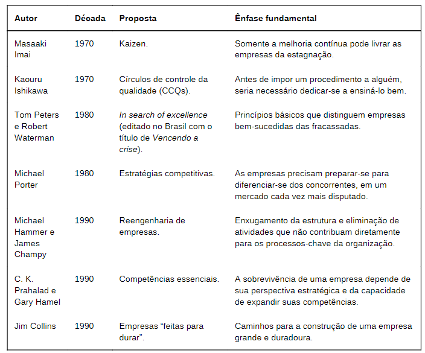

# Gestão de pessoas {#Gestao-de-pessoas}

## Condicionantes externos e mudanças organizacionais

```{r setup, include=FALSE, warning= F}
options(digits=2)
library(knitr)
```


### Características da sociedade do conhecimento

Atualmente o maior patrimônio é o conhecimento

Carbone  e colaboradores (2009):

* Dados: Conjuntos ordenados de palavras e números
* Informação: Compreensão dos dados
* Conhecimento: Rede de informações que um indivíduo possui eque  lhe  permite  interpretar  a  realidade


> Davenport e Prusak (1998): O conhecimento seria uma espécie  de  mistura  fluida  entre  experiências  descritas,  valores  mantidos, informações recebidas e insights obtidos por um indivíduo.

> Chris Argyris (1977): A aprendizagem  organizacional  consiste  em  um  processo  de  detecção  e correção  de  erros.

> Peter Senge (1999): Processo de aprendizagem organizacional

- Aquisição de conhecimento
- Geração  do  conhecimento
- Compartilhamento  do  conhecimento
- Retenção e registro do conhecimento
- Aplicação do conhecimento


Tipos de conhecimento:

* Tácito: Prática
* Explícito:  Modelagens e ferramentas


### As mudanças e os seus impactos:

- Principais impactos (Hitt, Millere Colella, 2013) 
  - Empregos  com  foco internacional
  - Designações para trabalhos no exterior
  - Relacionamento com estrangeiros como colegas de equipe

- Globalização e hipercompetição
    - Teletrabalho
    - Imigração e emigração
    - Culturas
    
- Escassez de recursos e pressões por competitividade
    - Clientes
    - Pessoas
    - Competências
    - Resultados
    - Produtos e serviços
    - Tecnologia
    
- Mudanças políticas, sociais e tecnológicas

### As mudanças e os reflexos para as organizações

- Pessoas mais conscientes
- Relacionamento com os stakeholders(visão sistêmica)
- Preocupação com recursos naturais
- Maior demanda (exigências) do setor público

### Paradoxos do mundo contemporâneo

* Aumento da disseminação da informação com redução do conhecimento
* Aumento da consciência da escassez de recursos e aumento do consumismo
* Queda de barreiras comerciais e amento de movimentações separatistas

Causas dos paradoxos: (Morin, 1999)

- Percepção polidisciplinar: Ampliação do conhecimento para além da área de atuação
- Conhecimento transversal: Análise dos fenômenos de forma supradisciplinar
- Visão multidisciplinar: Análise dos fenômenos sociais como complexos
- Transacionalidade: Organizações construidas e gerenciadas para além das barreiras nacionais
- Globalidade: Expansão  das  relações  pessoais  ecorporativas  para  o  mundo  como  um  todo

Galbraith e Lawler (1995): A análise dos desafios precisa passar pela compreensão da complexidade que caracteriza a sociedade contemporânea


### Desafios envolvidos em processos de mudança

> A sociedade do conhecimento, ao mesmo tempo em que nos abre portas para grandes conquistas, também nos alerta quanto à complexidade do contexto atual e dos seus desafios

 - Facilitadores no processo de mudança:
    - Contar com gestores apoiadores
    - Utilizar comunicação assertiva
    - Considerar aspectos culturais
    - Começar por itens de menor complexidade
    - Gerar, se possível, benefícios de curto prazo
    - Criar visão de longo prazo
    - Documentar e divulgar os progressos
    - Rever continuamente


## Tendências da gestão org contemporânea

### Valores do modelo industrial de gestão

  1. Manufatura padronizada
  2. Abastecimento
  3. Modelo operacional em escala
  
As linhas de montagem Fordista

> Ford, naquela época, já entendia que nenhuma empresa enriqueceria se o seu entorno empobrecesse.


### A gestão de pessoas na sociedade industrial

- Ajuste e controle
- Capacitação: Uns para mandar e outros para obedecer
- Ausência de trabalho colaborativo


### Cultura

Cultura Organizacional ⇔ Cultura de um país 

Cultura organizacional: Conjunto de crenças, símbolos e valores que são compartilhados por todos em um grupo.

Práticas tradicionais e a evolução da gestão organizacional:

segundo Pereira (1995:39) a evolução  dos modelos de produção e gestão possui três níveis conceituais:

1. Ondas  de  transformação:  A  evolução  da sociedade humana em três grandes momentos (Toffler, 1980:24)

  - Revolução agrícola (até 1750)
  - Revolução Industrial (1750 a 1970)
    - Revolução  Industrial  (1750-1870)
    - Segunda  Revolução  Industrial(1870-1950)
  - Terceira Revolução Industrial (1950-1970)
  - Revolução da informação (após 1970)
  
2. Eras empresariais: Estágios da evoluçãodo  ambiente  empresarial,  a  partir  da  Revolução  Industrial  (Maranaldo,1989:60)
3. Modelos  de  gestão: Conjunto  de concepções  filosóficas  e  administrativas  que  fundamentam  as  práticas gerenciais nas organizações (Pereira, 1995:39)


Principais períodos da gestão industrial (Pereira ,1995)
  
  - Produção em massa (1920-1949): Padronização dos processos e quantidade de produção
  - Eficiência (1950-1969): Burocratização da gestão, focando, especialmente, o controleinterno das operações
  - Qualidade (1970-1989): Satisfação do cliente (Edwards  Deming - TQM)
  - Competitividade (1990-2000): Excelência empresarial por meio do atendimento a stakeholders
  - Capital intelectual (2000+): Inovação, com base na informação e no conhecimento
  

### Valores do modelo pós industrial

A complexidade  social  aumenta  a  responsabilidade  individual  pelaidentificação, raciocínio e solução de problemas (Gilles Lipovetsky, Sébastien Charles, 2004:3)

 - Sistemas complexos (Burgierman, 2014)
    - Escala: Necessário uma estratégia para escala
    - Complexidade: E outra para complexidade

Paradigma holístico: Redes de gente com autonomia para identificar e resolver problemas

Novos Desafios: Produzir um milhão de vezes a mesma coisa -> Produzir um milhão de coisas uma única vez


E ainda é necessário superar a concorrência, que está fazendo as mesmas coisas.


### Diferenças entra a gestão industrial e a pós-industrial

| Avaliação                 | Valores da era industrial                 | Valores da era Pós-Industrial                         |
| :------------------------ | :---------------------------------------- | :---------------------------------------------------- |
|                           | pessoas como peças de uma engrenagem      | pessoas constituindo um sistema dinâmico e vivo       |
|                           | trabalho organizado em linhas de produção | trabalho organizado por meio de células independentes |
|                           | produção de itens padronizados            | produção do que o cliente quer                        |
|                           | valor da eficiência do processo produtivo | valor da flexibilidade das pessoas                    |
|                           | muitos níveis hierárquicos                | responsabilidades coletivas                           |
| Organização da produção:  | Impessoal e burocrata                     | baseada em pessoas                                    |
| Delegar:                  | perda de poder                            | ganho de poder                                        |
| chave de sucesso:         | competição                                | cooperação                                            |
| Decisões:                 | a cúpula pensa e planeja                  | Todo o pessoal-chave participa das decisões           |
| Visibilidade:             | sigilo acerca das estratégias             | transparência                                         |
| qualidade:                | responsabilidade do controle de qualidade | todos são responsáveis                                |
| abertura e transparência: | sem importância                           | ferramentas de sucesso                                |
| Meio ambiente:            | o lucro vale mais que o meio ambiente     | lucro e meio ambiente podem ser compatíveis           |
| mérito:                   | Indidual: vencerá o melhor                | Coletivo: vencerá a colaboração                       |
| fatores relevantes:       | idade e tempo de casa                     | competência e profissionalismo                        |


### Autores e propostas de gestão das últimas décadas




### As novas relações de trabalho

  - Rede:
      - Reduzindo hierarquias
      - Conectando pessoas
      - Compartilhando informações
      

  - Novos cenários
      - sites de colaboração criativa
      - sites de financiamento coletivo
      - e-commerce
      - ensino a distância
      - redes sociais
      - home office
      - terceirização
      - trabalho temporário 


> Para  Trope  (1999),  o  elemento repressor do poder deverá ser praticamente eliminado da organização virtual, o que implicará novas coalizões políticas e o conhecimento especializado como fonte desse poder


### Expatriação e repatriação de trabalhadores

Expatriação é o deslocamento de um profissional, patrocinado por uma empresa, para viver e trabalhar em um país estrangeiro, por período entre um e cinco anos. Repatriação é o processo de retorno dos profissionais expatriados para o país de origem

> Kogute  Zander  (2003)  afirmam  que  as  empresas  multinacionais  buscam  novas formas de transferir o conhecimento gerador de vantagem competitiva para além das fronteiras da matriz

Bartlet e Gohshal (2003) destacam como motivadores de expatriação:
  - A necessidade de incentivar o processo de integração entre subsidiárias
  - Entender  melhor  mercados  locais
  - Facilitar o intercâmbio de informação entre unidades da mesma empresa

Dame e colaboradores (2011) destacam quatro momentos básicos deste processo: 
  1. Seleção de candidatos
    - Características  essenciais  para  esse  perfil Cerdin  e  Brewster  (2014)  e  Muenjohn  e  Armstrong  (2015)
      - Sensibilidade, resiliência, flexibilidade para adaptação a mudanças, habilidade para lidar com situações em diferentes culturas
  2. Preparação
  3. Ajustamento
  3. Repatriação

Dame e colaboradores  (2011)  destacam  como  problemas  normalmente enfrentados na repatriação:

  1. Sofrer perda de status e redução do padrão devida
  2. Obter a recolocação do cônjuge no mercado de trabalho
  3. Sentir que possa ter sacrificado a carreira pelo bem da empresa
  4. Falta de apoio daempresa no processo de repatriação
  5. Incerteza/insatisfação em relação ao novo cargo assumido
  6. Não ter tido suporte da origem no planejamento decarreira enquanto fora
  7. Sensação de que as novas competências adquiridasnão sejam valorizadas pela empresa
  
### Aspectos críticos e novos desafios para os gestores 

Os desafios presentes nas novas relações de trabalho:

| Valores da era industrial          | Valores da era Pós-Industrial    |
| :--------------------------------- | :------------------------------- |
| abastecimento, produto e escala    | inovação, cliente e escopo       |
| produção intelectualmente estática | geração contínua de conhecimento |
| Orientada ao chefe                 | Orienatada a líderes             |


Questões críticas:

  - diversidade cultural
  - educação formal
  - governança corporativa
  


## Alinhamento dos interesses corporativos e individuais

Pensadores:
  - Taylor: racionalização dos  procedimentos  operacionais,  com  a  elevação  da  produtividade,  o  que geraria maior lucro para as empresas e a possibilidade de uma remuneraçã omais elevada para os trabalhadores. Na prática as empresas não repassavam o excedente para os trabalhadores e as condições de trabalho não eram adequadas, foi chamado inclusive de “inimigo número um do trabalhador americano”
  - Mary Parker Follett: A natureza nos revela o poder da biodiversidade, e ums istema ecológico só é equilibrado se contar com diferentes espécies
  - Davel e Vergara (2013): A gestão de pessoas pode ser compreendida a partir de três abordagens dominantes:
      - Funcionalista
      - Estratégica
      - Política

### Interesses Corporativos x Individuais

| Interesses Corporativos     | Interesses individuais       |
| :-------------------------- | :--------------------------- |
| Crescimento sustentável     | empregabilidade              |
| lucratividade               | oportunidades de crescimento |
| produtividade               | orgulho de pertencer         |
| competitividade             | qualidade de vida            |
| qualidade produtos/serviços | melhores salários/benefícios |
| participação no mercado     | liberdade pra trabalhar      |

> "Todo ponto de vista é a vista de um ponto" (Boff, 1997:2)


### Alinhamento de interesses

Elementos necessários ao alinhamento:

  * Comunicação (ouvir)
  * Alinhamento de competências
  * Liderança entusiasmada e legitimada
  * Planejamento de carreira 
  * Educação corporativa


### Competências

Classificações:

| Básicas                   | Essencias                        |
| :------------------------ | :------------------------------- |
| fator de qualificação     | fator de diferenciação           |
| indispensável             | garantia de vantagem competitiva |
| sem garantia de liderança | valor percebido pelo cliente     |

* Técnicas
* Comportamentais
* Cognitivas

Competências necessárias aos profissionais atuais:

* **Compreensão estratégica:** visão, missão, contexto social e econômico
* **liderança:** exemplo, facilitador motivacional
* **Orientação para resultados:** foco, entusiasmo, alinhamento
* **Adaptação à mudança:** lidar com resistências
* **Análise e resolução de problemas:** equilíbrio, pró-atividade, soluções
* **Negociação e persuasão:** influência; ouvinte
* **Networking:** sociabilidade
* **Comunicação:** assertividade, feedback
* **Diversidade cultural:** gestão de equipes, adaptação
* **Resiliência:** equilíbrio emocional
* **Autodesenvolvimento:** aprendizagem contínua
* **planejamento:** Organização, estabelecimento de prioridades
* **Compreensão interpessoal:** empatia
* **Autoconfiança:** Reconhecimento das competências pessoais
* **Disciplina:** Autoconhecimento pra autodesenvolvimento (forças e fraquezas)


### Diferenças intergeracionais

|geração baby boomers | geração X | geração Y |
| -----------------   | ----------|--------- |
| respeitam hierarquia| questionam autoridade| são mais informados |
| são competitivos e automotivados | querem passar mais tempo com a família | não gostam de pedir autorização, preferem agir |
| veem o trabalho como a sua razão de viver| são independentes e individualistas | |desejam trabalhos nos quais possam contribuir | 
| não se importam com o equilíbrio entre vida pessoal e profissional| | são colaborativos| 
| gostam de controle | |querem qualidade de vida |


### Gestão de pessoas

> A gestão de pessoas é, tradicionalmente, definida como a função organizacional responsável por captar, desenvolver, aculturar e manter as pessoas necessárias às estratégias organizacionais.


Evolução:

* Departamento Pessoal → Administração de Recursos Humanos → Administração de Recursos Humanos Estratégica

Gestão Estratégica de Pessoas:

 * Que competências existem atualmente dentro da empresa?
 * Quais são as necessidades para o sucesso futuro da empresa?
 * Como a área de Gestão de Pessoas poderá ajustar as competências às estratégias empresariais?

Responsabilidades do RH:

* Ajudar a organização a desenvolver competências para estar pronta para os desafios do mercado
* Contribuir na definição da estrutura organizacional, processos de trabalho, cultura interna e ajudando nas adequações
* Representar os trabalhadores perante a alta direção, oferecendo crescimento pessoal e profissional e os recursos necessários para a execução do trabalho
* Criar as condições para que a organização possa adaptar-se rapidamente aos ciclos de inovação do mercado

Dimensões externas a serem consideradas:

- Sociais
- Políticas
- Econômicas
- Culturais
- Tecnológicas

Agentes externos a serem considerados:

- Clientes
- Fornecedores
- Concorrentes
- Órgãos reguladores 
- Sindicatos

A consultoria interna: (Orlickas, 2001 e Costa Leite e colaboradores, 2005) 


* Conscientizar os integrantes da organização
* Definir claramente o papel do consultor interno
* Transferir responsabilidades para os gerentes de linha
* Tornar a área de RH uma unidade de negócios
* Possuir profissionais de RH generalistas
* Aplicar técnica de job rotation
* Outras funções

Características do Consultor Interno: (Orlickas, 2001 e Costa Leite e colaboradores, 2005) 

* pensar de forma estratégica
* ser comprometido
* ser multidisciplinar
* ser facilitador interno
* ser isento e racional
* assumir riscos
* ser negociador
* administrar as resistências
* Executar o benchmark
* Racionalizar e desburocratizar
* Definir claramente diretrizes de ação
* Possuir sustentação administrativa e funcional
* enfatizar pessoas

> Importante: saber interpretar a realidade para criar expectativas realistas.


### A educação corporativa

> Se produzir conhecimento passou a ser um ato contínuo e indispensável, torna-se natural que as organizações tragam para si o papel de desenvolver (em diversos aspectos) o seu corpo funcional.

> Fleury e Fleury (2001) observam que estão  ocorrendo  mudanças  na  gestão  de  pessoas  com  a  incorporação do conceito de competências.

>  Eboli  (2004)  destaca  que  a  universidade corporativa é o modelo de uso mais comum da aplicação do conceito de educação corporativa

As universidades corporativas trabalham com o conceito de aprendizagem sob demanda, e com o currículo em sintonia com o mapa de competências dos cargos das organizações:


A educação corporativa promove:

* Formação
* Aperfeiçoamento
* Encontro
* Compartilhamento
* Troca
* Motivação
* Alta performance


Mas o que o aprendizado de uma competência deve incluir? Senge (1999)

* O aprendizado mais importante ocorre no local de trabalho, e não na sala de aula
* O aprendizado mais importante é social e ativo, e não individual e passivo
* O aprendizado mais eficaz resulta de um ciclo contínuo de experiência no próprio local de trabalho
* Nesse esforço em educar os trabalhadores, as UCs se concentram no desenvolvimento de competências e o aprendizado só foca no desenvolvimento da capacidade analítica

> Se o ponto de partida para se tornar umaorganização  que  aprende  está  no  engajamento  de  todos  os  membros  daempresa,  o  passo  seguinte  é  incorporar  as  disciplinas  de  aprendizagemdestacadas  por  Senge  (1999)
>
  - Domínio  pessoal
  - Modelos  mentais
  - Visão compartilhada
  - Aprendizado em equipe
  - Pensamento sistêmico

Vantagem competitiva: Treinamento e desenvolvimento ⇆ estratégias organizacionais

> Privilegiando todos os integrantes da cadeia de valor da organização.

### Universidades corporativas

As UCs trabalham sob demanda, ou seja, ofertam programas de capacitação em sintonia com as competências demandadas pelas funções organizacionais.

* PDI: Plano de desenvolvimento individual (Fernandes, 2013)

- Auxilia  no  desenvolvimento individual  e  no  atendimento  das  necessidades  estratégicas  do  cargo  e da organização
  - Objetivos
  - Diagnósticos

> Abordagem contingencial: Castells (2003) destaca que o mundo vivencio uuma crise nos modelos de gestão tradicionais, marcados pela verticalização,padronização e rigidez de procedimentos, foi nessa ocasião que se iniciou a formação das redes empresariais que acabaram por se tornar uma marca da economia do século XXI. 


## Liderança: Tendências e desafios

### Conceitos e papéis do líder

#### Conceitos

Comportamento organizacional: Segundo Johann (2013), trata da interação humana no ambiente interno das organizações com o propósito de direcioná-la em torno de metas e desempenho.

Inteligência Emocional (Johann, 2013): Daniel Golemann conceituou em 1955 através de um estudo em que pessoas mais bem sucedidas não tinham necessariamente um QI maior, mas  sim  aqueles  que  conheciam e exerciam controle sobre suas emoções, bem como se relacionavam muito bem com os demais

Segundo Johann (2013), essa inteligência emocional pode ser categorizada em torno de cinco habilidades:

  - Autoconhecimento  emocional:  Reconhecer  as  próprias  emoções  e sentimentos quando ocorrem
  - Controle emocional: Lidar com os próprios sentimentos, adequando-os a cada situação que se apresente
  - Motivação: Dirigir as emoções em torno de um objetivo ou realização pessoal
  - Empatia: reconhecer emoções nos outros e colocar-se no seu lugar
  - Relacionamentos  interpessoais:  interação  com  outros  indivíduos, utilizando  competências  sociais

> Liderança é a arte de educar, orientar e estimular as pessoas a persistirem na busca de melhores resultados  num ambiente de desafios, riscos e incertezas (Macêdo  ecolaboradores, 2012:94)

> Para Covey (1996), gerenciar é uma visão dos métodos, a forma ideal de alcançar algo. Já a liderança trabalha com as pessoas que farão com que os objetivos sejam alcançados


#### Líder

Liderança ≠ Gerência

Segundo Macêdo e colaboradores (2012), não existe controvérsia sobre ofato de que o líder deve exercer algum tipo de poder sobre os liderados queformam sua equipe de trabalho, até porque é esse poder que dá suporte àcapacidade de influenciar pessoas a se comportarem como esperado

  - Poder de coação (punição)
  - Poder de recompensa (gratificação) 
  - Poder de referência (admiração)
  - Poder de conhecimento (especialista)
  - Poder legítimo (instituído)
  - Poder de informação (impessoal)
  
É comum que o líder exerça, simultaneamente, diferentes tipos de poderpara influenciar cada um dos membros de sua equipe

Guimarães (2012) afirma que uma das grandes façanhas do líder, além de obter  adesão  à  visão  de  futuro,  é  conseguir  trazer  os  antagônicos  para  a sinergia e motivá-los a ser cooperativos e produtivos

Macêdo  e  colaboradores  (2011)  destacam  que  o  cenário  onde  se desenvolve  o  processo  de  liderança  caracteriza-se  pela  necessidade  de enfrentamento de turbulências, incertezas e contradições. Desafios relacionados aos paradoxos:

  - Ao tempo em que é necessário acompanhar o avanço tecnológico, é precisotambém ser mais humanista
  - Embora seja preciso diversificar o foco de atenção, buscando capacitar-se em  diferentes  saberes,  o  líder  necessita  aprofundar  cada  vez  mais  oconhecimento de sua área específica
  - O aumento da competitividade do negócio precisa ser compatibilizado com ações direcionadas para a integração e a cooperação
  - A busca de qualidade tem de ser empreendida sem prejuízo da rapidez na condução do processo produtivo
  - O pensamento global tem de ser compatibilizado com a ação local
  - A crescente  virtualização  das  relações  sociais  e  profissionais  precisa ocorrer juntamente com a harmonização do uso da tecnologia

Competências do líder:

- Influenciar
    - Para que a missão e a visão da empresa se tornem realidade.
- Educar
- Orientar
- Estimular

Papéis do líder (Quinn, Faerman e Thompson, 2003): 


* Quadrante pessoas: ecomendando  o  emprego  de  mais  flexibilidade  e voltado para o ambiente interno da organização, pode exercer papéis de:
  - Mentor: Preocupação em compreender a si mesmo e aos outros,exercitar empatia e uma escuta ativa e buscar desenvolver os colaboradores
  - Facilitador: Estímulo à coesão da equipe em torno de propósitos comuns, envolvimento de todos nas decisões e busca de soluções negociadas para conflitos

* Quadrante processos: voltando seu olhar para o ambiente interno,mas focado em controles, pode exercer papéis de:
  - Monitor: Além da gestão dos processos e controles, deve ser capaz de usar diferentes fontes de dados, bem como ser ágil na escolha das informações mais relevantes para a tomada de decisão
  - Coordenador: Respondendo pelos fluxos de trabalho, busca planejar o que, quem, quando e como deve ser feito

* Quadrante metas: Formado por uma ênfase no controle de variáveis mais externas
  - Diretor: Mostra a direção a ser seguida, mesmo que não esteja no topo, sabendo como agir e como comunicá-la aos demais, estabelecendo metas e os meios para alcançá-la
  - Produtor: Habilidade em criar e manter ambiente propício para o trabalho produtivo de todos, cuidando da gestão de pessoas e do controle de prazos
 
* Quadrante mudanças: Formados pela exigência de crescente flexibilidade para lidar com o ambiente externo, torna-se crucial para a sobrevivência do negócio na sociedade do conhecimento
  - Inovador: Convivendo num ambiente em constante mutação, vencer resistências próprias e de terceiros, apresentar novas propostas esoluções, planejar as mudanças e obter adesão e comprometimento sãoas exigências desse papel
  - Negociador: Ser capaz de ouvir antes de falar, resolvendo divergências através da negociação de acordos, usa o poder de persuadir ao invés demandar, e apresentar seus pontos de vista de forma clara e convincente


Necessidade de equilíbrio dos papéis: **Necessário equilíbrio**

* Inovador (quadrante mudanças) x coordenador (quadrante processos)
* Diretor (quadrante metas) x mentor (quadrante pessoas)

> Segundo  Soto  (2002),  uma  liderança  de  sucesso  é  relacionada  a comportamentos,  habilidades  e  ações  adequadas


#### Líderes eficazes

Código da liderança, Ulrich, Smallwood e Sweetman (2009) concluíram que 60% a 70% das competências são:

  - Ser estrategistas: Planejar o futuro e o caminho que será seguido
  - Ser executores: Colocar ideias em prática
  - Ser gestores que sabem cativar, motivar e otimizar os talentos
  - Ser desenvolvedores de capital humano: Investir e construir as próximas gerações
  - Servir de exemplo: Saber se colocar e se expor de forma adequada


#### Poder e liderança

Chefe → Líder → Gestor-líder

> Todo líder exerce algum tipo de poder

* Poder de posição:
  - Legítimo
  - De recompensa e coercitivo
* Poder pessoal:
  - Conhecimento
  - Referência
* Poder impessoal:
  - Poder de informação

Delegação: repassar poder?

> A delegação permite o deslocamento da autoridade (não da responsabilidade) de tomada de decisões de um nível organizacional para outro. Portanto, a delegação implica empowerment.

Mitos e verdades:

| Verdades          | Mitos                   |
| :--------------------- | :------------------------------------ |
| um  decisor racional, com atribuições claras e informações imparciais | um decisor diante de tarefas imprevistas e informações parciais       |
| um planejador sistemático com visão de longo prazo e                  | um planejador pressionado por ações de curto prazo e                  |
| instrumentos de trabalho: metas, planos, resultados e prazos.         | instrumentos de trabalho: surpresas, sustos, contingências, problemas |


#### Estágio de maturidade versus estilo de liderança

O foco:

* Está no que o líder é
* Está no que o líder faz
* Não permanece apenas no líder

O líder deve:

* Determinar: quando a maturidade dos liderados é baixa
* Persuadir: quando a maturidade dos liderados está entre baixa e moderada
* Compartilhar: quando a maturidade dos liderados está entre moderada e alta
* Delegar: quando a maturidade dos liderados é alta

#### Liderança conectiva

> Própria do cenário atual, em que imperam as alianças, fusões e mudanças de toda ordem. São líderes que percebem a força que existe nas interconexões entre pessoas

Ações dos líderes conectivos:

* Associando as suas visões aos sonhos dos outros, conectando e combinando, jamais dividindo e conquistando
* Criando um sentido de comunidade, reunindo líderes e liderados em torno de objetivos comuns
* Incentivando os colaboradores a assumirem responsabilidades em todos os níveis
* Fortalecendo líderes em potencial, inclusive futuros sucessores
* Demonstrando autenticidade


### Modelos de liderança

A abordagem comportamental desenvolveu-se com base em diversosestudos sobre liderança buscando relacionar o sucesso alcançado por determinadas organizações com o sistema de liderança por elas adotado, sendo mapeado diferentes estilos de liderança:

- Estilo Participativo (Likert, 1971)
    - Eficiente fluxo de comunicação
    - Decisões de forma participativa
    - Melhores condições de trabalho


Kurt  Lewin  (1973)  foi  outro  pioneiro  dos  estudos  sobre  estilos  deliderança, propondo a existência de três formas de liderar uma equipe:

- Estilo autocrático: Adotado por líderes centralizadores, que tomam decisões sozinhos, definindo responsabilidades e mantendo rígido controle sobre todos os processos
- Estilo participativo: O líder dá espaço para que os integrantes da equipe participem da tomada de decisões, ouvindo opiniões e sugestões, bemc omo delegando tarefas e dando feedback como referência
- estilo laissez-faire (ou liberal): O líder deixa os integrantes decidirem sozinhos sobre metas e métodos.

A combinação dos estilos é chamada de *visão bidimensional da liderança*: (Cavalcanti  e  colaboradores, 2009)


### Teoria da liderança situacional, de Hersey e Blanchard

Segundo Cavalcanti e colaboradores (2009), o modelo situacional traz à tona a necessidade do líder compatibilizar seu estilo conforme o nível de maturidade de seus liderados quanto as maturidades:

  - Maturidade do trabalho dos liderados
  - Maturidade psicológica dos liderados

Os  autores  trabalham  com  dois  vetores  fundamentais  de  atenção  dos líderes no relacionamento com seus liderados:

  - A orientação para as tarefas
  - A orientação para os relacionamentos

Tendo como resultante, quatro modelos de liderança com base nos estagios de maturidade


  1. Determinar: E1 x M1 
  2. Persuadir: E2 x M2
  3. Compartilhar: E3 x M3
  4. Delegar: E4 x M4

Críticas:

  - Relativismo que seus autores tentam dar à avaliação do desempenho gerencial (Hersey e Blanchard, 1986)
  - A maturidade geral de um indivíduo ou de um grupo pode mudar em projetos ou tarefas diferentes (Guimarães, 2012)

Defesas:

 - Adaptabilidade (Hersey e Blanchard, 1986): Capacitação do líder em saber usar o estilo mais adequado a cada situação que se apresenta
  

### Competência gerenciais requeridas: o Pipeline da liderança

Charam, Drotter e Noel (2009) desenvolveram a proposta que denominaram “pipeline da liderança”.


> "O pipeline não é um cilindro reto, mas um cano que se curva em seis pontos. Cada uma dessas passagens representa uma mudança na posição organizacional"

* Passagem 1: De gerenciar a si mesmo para gerenciar equipes
  - Administração do tempo
  - Disciplina
  - Planejamento
* Passagem 2: De gerenciar equipes para gerenciar líderes
  - Conhecimento da equipe
  - Princípio de visão estratégica
* Passagem 3: De gerenciar líderes para gestor funcional
  - Trabalho em equipe
  - Exímio estrategista
  - Delegação
* Passagem 4: De gestor funcional para gestor de negócios
  - Autonomia
  - Atenção aos feedbacks
  - Análise
* Passagem 5: De gestor de negócios para gestor executivo
  - Visão sistêmica
  - Avaliação da equipe
  - Gestão de situações complexas
* Passagem 6: De gestor executivo para gestor corporativo
  - Líderes visionários, com exímia capacidade de formar as suas equipes

O pipeline foi dimensionado para grandes empresas. Assim, os autores propõem uma simplificação para pequenas empresas: Passagem 1, passagem 3 e passagem 4

Liderança de nível 5 (Jim Collins)

* Capaz de aliar extrema humildade pessoal a uma firme vontade profissional
* Ambicioso, mas com foco na empresa
* Busca pela formação de sucessores com desempenhos melhores que os dele próprio
  
Competências gerais:

  - Manter equipes
  - Possuir adaptabilidade
  - Gerir incerteza
  - Gerir aprendizado
  - Possuir visão sistêmica
  - Formar equipes


### Motivação como Liderança 

Motivação:

  - Maslow: Necessidades humanas
      1. Nível 1: Necessidades fisiológicas básicas
      2. Nível 2: Necessidades de segurança
      3. Nível 3: Necessidades sociais
      4. Nível 4: Necessidade de autoestima
      5. Nível 5: Necessidade de autorrealização
  - Herzberg: Fatores higiênicos e motivacionais
  - Equidade: Justiça


### Mulheres e a liderança do século XX

Tom  Peters  (2004:110)  apontou  que:

> “A liderança desejada na Nova economia tem atributos femininos que vão desde maior capacidade de relacionamento e aprendizado até o respeito à intuição”

Para Covey (1996), o papel do líder no século atual não é apenas fazer agestão da mudança, mas preparar o próprio futuro, dentro de um cenário que se modifica constantemente e que ele deve liderar

Para Cheshire (2012), modelos de liderança do passado oferecem orientação limitada para o contexto das empresas do futuro. Uma nova forma de mundo empresarial e de seus líderes está surgindo, integrando consciência, cultura e natureza, além de incluir arte, ética, ciência, meio ambiente, saúde, valores pessoais, sabedoria coletiva e know-how técnico

### Teoria das características da função: (Hackman e Oldham)

* Variedade de habilidades
* Identidade da tarefa
* Importância da tarefa
* Autonomia
* Feedback

### Outras contribuições no estudo da liderança

* Liderança carismática (Maximiano, 2004): Baseado nas características de personalidade do líder, conforme percebidas pela equipe. Autoconfiança,habilidade de articulação e fortes convicções

 - Críticas: (Cavalcanti e colaboradores, 2009)
   - Narcisismo
   - Dificuldade de ouvir as pessoas
   - Sua base repousa sobre aspectos fortemente subjetivos (Robins, 2000) 

* Liderança visionária (Cavalcanti et al., 2009): Pressuposto de que pessoas de visão conseguem ir além das limitações do dia a dia das organizações, projetando ações concretas para atingir futuras metas

Essa visão do futuro, segundo Johann (2013), poderá se transformar numpropósito estratégico desde que:

 - Seja desafiante na percepção da maioria dos funcionários
 - Tenha uma data para seu atingimento
 - Forme um slogan/palavra de fácil memorização por todos
 - Contenha indicadores que sinalizem quais as metas que, ao serem alcançadas, materializam essa visão de futuro

* Liderança transacional (Robbins, 2000:42): Conduzem ou motivam seus seguidores em direção às metas estabelecidas por meio do esclarecimento das funções e das exigências das tarefas ~> Gerentes

* Liderança transformacional (Robbins, 2000:65): Inspiram seus seguidores a transcender os próprios interesses e que são capazes decausar um impacto profundo e extraordinário em seus liderados ~> Líderes

* Líder coaching: Promotor e inspirador doauto desenvolvimento dos liderados, ensinando-os a aprender por si e a apresentarem resultados

### Ciclo motivacional


#### Processos motivacionais

Compreender e aceitar diferenças é fundamental!

O comportamento das pessoas é resultado de diferentes motivações. Portanto, o que motiva uma pessoa pode não motivar a outra

> Faça aos outros aquilo que eles querem que lhes seja feito


### Os desafios da liderança

* Globalização
* Motivação
* Gênero
* Tecnologia
* Gerações

Ingredientes indispensáveis:

* Consciência de propósito: A sua equipe tem de saber a que vem
* Explicitação de balizamentos: Os limites existem, 
  - Mas são flexíveis: Liberdade com responsabilidade
* Comunicação: Franca e respeitosa
* Feedback constante: Ajuda, quando necessário, a corrigir rumos
* Compartilhamento de informações: Leva-nos ao compartilhamento do poder
* Negociação: O acordo é imprescindível 
  – Com parceiros, sempre negociamos
* Humildade intelectual: A aprendizagem é um processo contínuo nas nossas vidas
* Comportamento ético: Quando atuamos em rede, o sucesso é de todos


\newpage
## Bibliografia