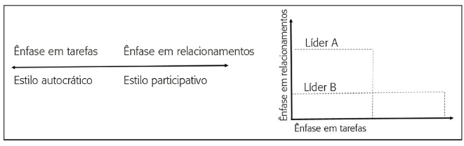
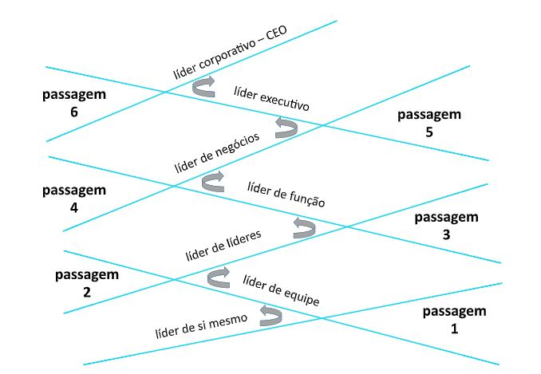
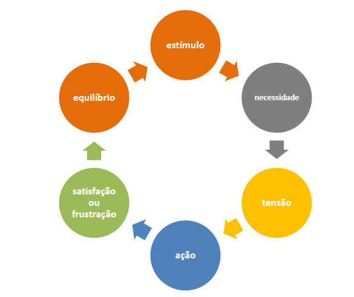

--- 
title: "FGV MBA Gestão Empresarial"
author: "Eduardo dos Santos Almeida"
date: "`r Sys.Date()`"
site: bookdown::bookdown_site
documentclass: book
bibliography: [book.bib, packages.bib]
url: "https://eduardodudu.github.io/FGV_KeyNotes/"
cover-image: "images/fgv-logo.png"
description: |
  Resumo do curso de MBA da FGV de gestão empresarial.
biblio-style: apalike
csl: chicago-fullnote-bibliography.csl
---
```{r include=FALSE, cache=FALSE}
# example R options set globally
options(width = 60)

# example chunk options set globally
knitr::opts_chunk$set(
  comment = "#>",
  collapse = TRUE
  )
```

# About

 Resumo do curso de MBA gestão empresarial da FGV.


## Pacotes usados

```{r include=F}
# automatically create a bib database for R packages
knitr::write_bib(c(
  .packages(), 'bookdown', 'knitr', 'rmarkdown'
), 'packages.bib')
```

<!--chapter:end:index.Rmd-->

```{r include=FALSE, cache=FALSE}
# example R options set globally
options(width = 60)

# example chunk options set globally
knitr::opts_chunk$set(
  comment = "#>",
  collapse = TRUE
  )
```
# Gestão Estratégica {#gestao-estrategica}

## Evolução do pensamento estratégico

```{r setup, include=FALSE, warning= F}
options(digits=2)
library(knitr)
library(png)

```


### Estratégia

> "A arte do general"

Segundo Porter, [@porter2004estrategia] a estrégia é definida pelo conceito de ajuste das atividades, onde se afirma que para criar uma vantagem competitiva é necessário atingir os seguintes niveis de maturidade:

  * Estratégia de sucesso é o resultado de fazer muitas coisas bem e integrá-las
  * Se não há ajuste entre as atividades, não há estratégia distintiva e a estratégia será insustentável

Porter apresenta o conceito de ajuste, pelo qual as atividades são consistentes entre si e reforçam-se mutuamente para criar uma vantagem competitiva e rentabilidade superior.  Porter identifica três tipos de ajuste, que são mutuamente exclusivos.

  1. Ajuste de primeira ordem: Garante que a vantagem competitiva das atividades seja acumulada e não se perca
  2. Ajuste de segunda ordem: Ocorre quando as atividades estão se reforçando
  3. Ajuste de terceira ordem: É o esforço de otimização

O ajuste entre as três ordens coletivamente auxiliam na formulação estratégica


### As escolas do pensamento estratégico {.tabset .tabset-fade .tabset-pills}

#### Escolas de natureza prescritiva

    * Escola do design:
 
      - Descrição: Combinação dos ambientes interno e externo, buscando o melhor ajuste
      
      - Abordagem: 
      
        1. Processo racional, formalizado e controlado, deliberado e não intuitivo
        2. Formulação da estratégia pelo executivo chefe
        3. Modelo de formulação simples e informal
        4. Estratégias devem ser únicas
        5. Processo de design completo quando as estratégias estão formuladas como perspectivas
        6. As estratégias devem ser explícitas
        7. A estratégia só pode ser implementada após os passos anteriores
      
      - Críticas: 
      
        1. Minimiza a importância do aprendizado
        2. Centralização da responsabilidade na alta direção
        3. Distância entre formulação e implementação
        
      - Ferramentas: SWOT

    * Escola do planejamento:
    
      - Descrição: Processo formal com conjunto específico de etapas que devem ser seguidas rigorosamente
    
      - Abordagem:
      
        1. Determinação de objetivos
        2. Auditoria do ambiente interno
        3. Auditoria do ambiente externo
        4. operacionalização das estratégias.
        
      - Premissas:
      
        1. Processo de planejamento formal, controlado, decomposto em etapas, delineado por check-lists e apoiado por técnicas e analises
        2. Executivo chefe é responsável pelo planejamento e execução dos planejadores
        3. Estratégias implantadas por meio da atenção a objetivos, orçamentos, programas e planos operacionais, para todos os níveis

      - Críticas:
      
        1. Planos elaborados x Realidade (Falácia da análise x síntese)

    * Escola do posicionamento:
      
      - Descrição: Influenciada pelos trabalhos de Porter, trata a estratégia como um processo analítico de posicionamento competitivo no mercado através de uma estratégia genérica de competição.
  
      - Premissas:
      
        1. Estratégias são genéricas e identificam posições no mercado  
        2. Racionalidade econômica e mercado competitivo
        3. Processo analítico para identificar estratégia genérica de competição
        4. Analistas com recomendações de processos analíticos quantificáveis
        5. O mercado direciona a escolha do posicionamento estratégico, que por consequência determina a estrutura organizacional
  
      - Tipos de estratégia:
      
        1. Diferenciação
        2. Custo
        3. Foco
      
      - Ferramentas: Cinco forças de Porter
      
      - Críticas: 
      
        1. Foco Estreito: Econômico x social e político
        2. Contexto: Direcionado para empresas tradicionais e grandes
        3. Excesso de formalização: Dificulta aprendizado, criatividade e envolvimento emocional


#### Escolas de natureza descritiva

    * Escola do empreendedorismo:
  
      - Descrição: Processo visionário que surge dentro de um líder, sendo elaborada através das experiências e sabedoria de um líder proativo
      
      - Premissas: 
        
        1. A estratégia existe na mente do líder de uma visão de futuro da organização
        2. Processo de elaboração advém da sabedoria e experiências do líder
        3. O líder atua com um controle pessoal da implantação das idéias
        4. Formulação da estratéegia é maleável
        5. A organização deve ser flexível para ser capaz de reformular as idéias do líder
        6. A estratégia empreendedora visa encontrar um nicho de mercado protegido das forças de competição
        
      - Críticas:
      
        1. Dependência excessiva ao líder
        2. Sobrecarga ao desempenho do líder
        3. Falta de embasamento científico 
  
    * Escola cognitiva:
  
      - Descrição: Estratégia pautada pela experiência e senso comum estruturada em dois grupos. **Objetiva** para a estrutura do conhecimento e **subjetiva** pela interpretação do mundo
      
      - Premissas:
      
        1. A estratégia incia-se através da mente do estrategista
        2. A estratégia emerge em forma de perspectivas
        3. O mundo pode ser modelado e estruturado de acordo com as interpretações do que é percebido
        4. A estratégia é definida como um conceito abstrato que não corresponde diretamente com a realidade
        
      - Críticas:
      
        1. A estratégia é pautada mais pelo potencial do que pelo entendimento de como as estratégias são criadas
        
    * Escola do aprendizado:
    
      - Descrição: Processo emergente de plano gerencial da percepção no tempo do que funciona e o que não funciona
      
      - Premissas: 
        
        1. Ambiente de négocios é um sistema complexo e por este motivo a estratégia deve seguir um processo de aprendizagem para acompanhar o entendimento da complexidade ao longo do tempo
        2. O sistema coletivo aprende, existem vários estrategistas em potencial na organização
        3. O aprendizado ocorre de forma emergente
        4. Gerenciamento do processo de aprendizagem estratégica para emergências continuas (Gestão do conhecimento)
        5. As estratégias surgem inicialmente através da percepção de padrões do passado
        
      - Críticas:
      
        1. Inexistência de estratégias definidas
        2. Estratégias perdidas
        3. Estratégias erradas
        
    * Escola do poder:

      - Descrição: Processo de negociação entre os stakeholders através do poder, influência e da política na negociação dos interesses
      
      - Premissas:
        
        1. A formulação da estratégia é definida pelo poder e política
        2. As estratégias deste processo se tornam posicionamentos e artifícios
        3. Poder Micro: Lado político na administração da organização
        4. Poder Macro: Relações da organização com o ambiente de negócios
        
      - Críticas:
      
        1. Exagero na relação de poder
        2. Não aborda pontos na formação da estratégia
        
    * Escola cultural:

      - Descrição: Formação da estratégia como um processo de força social da cultura
      
      - Premissas:
        
        1. Processo de interação social
        2. Processo de aculturação ou socialização
        3. A estratégia é entendida como uma perspectiva
        
      - Críticas:
      
        1. Possibilidade de estagnação da organização

    * Escola ambiental:

      - Descrição: Formação da estratégia como um processo reativo em resposta as mudanças do ambiente
      
      - Premissas:
        
        1. O ambiente é o elemento central da formação da estratégia
        2. A liderança é um elemento passivo no entendimento do ambiente promovendo adaptações
        3. As organizações tendem a se estruturar em nichos distintos
        
      - Críticas:
      
        1. Permissividade ao fator ambiental se abstendo da capacdidade de definir opções inerentes ao ambiente
        
#### Escolas de natureza híbrida

    * Escola da configuração:

      - Descrição: Processo de transformação da organização definido pelo ciclo de vida da organização e pauta-se da concepção das escolas anteriores
      
      - Premissas:
        
        1. O ponto fundamental é manter a estabilidade ou sustentar mudanças estratégicas
        2. As estratégias resultantes podem assumir planos, padrões, perspectivas e posições
        
      - Críticas:
      
        1. Excesso de simplificação no entendimento da organização

### Níveis de estratégia

  * **Corporativa:** Decisão de quais negócios competir
  * **Competitiva (Negócio):** Decisão de como competir
  * **Funcional (Tático):** Atuação de uma área funcional da empresa sob a estratégia definida

### Estratégia e os 5 Ps

  * **Plano:** Direção, guia ou curso de ação para o futuro.
  
    - "A verdadeira estratégia da organização é aquela que é implementada, e não aquela que é formulada."
  
  * **Padrão:** Consistência do comportamento ao longo do tempo.
      + Caso: McDonald's
  
      + Método VRIN - Visão Baseada em um conjunto de recursos tangíveis e intangíveis

          1. Valioso: Os recursos que geram valor para a empresa podem ser uma fonte de vantagem competitiva
          2. Raro: Um recurso que é raro gera opções estratégicas que não estão disponíveis para os concorrentes
          3. Difícil de imitar:  Os recursos que são difíceis de imitar, são fontes de vantagem competitiva
          4. Não substituível: Um recurso que não possui substitutos pode ser capaz de sustentar uma estratégia única no mercado
          

  * **Posição:** Posicionamento ou localização de determinados produtos ou serviços em determinados mercados. 
      + Caso: Azul
      
  * **Perspectiva** - Maneira fundamental de funcionamento da organização.
  * **Estratagema (Trama):** Manobra específica para vencer, com astúcia, um oponente ou concorrente.
      + Caso: Tróia

#### Quando utilizar os 5 Ps

  1. **Coleta de informações:** Documentação e validação de tudo que foi considerado
  2. **Prototipagem de idéias novas:** Testar se essas ideias são realistas, práticas e robustas
  3. **Validação final da estratégia:** Validação da estratégia e ajuste das inconsistências
  

## Administração estratégica e alinhamento

### Administração estratégica
  
Processo de implementação do planejamento e administração, Ansoff (2001) define dois desafios:
  
  1. Análise da competitivade
  2. Integração da intenção estratégica nas várias áreas de negócio


### Gestão estratégica

A gestão estratégica pode ser entendida como a arte de escolha de objetivos estratéticos de forma a maximizar sua competitividade no mercado. É um processo continuo e circular que visa manter a empresa integrada com o ambiente através da:
  
  * Análise do ambiente
  * Estabelecimento de diretrizes organizacionais e formulação
  * Implementação e controle da estratégia 

Características do processo de gestão estratégica:  

  1. Atuação global
  2. Proatividade e foco participativo
  3. Criatividade e inovação 
  4. Aprendizagem contínua 
  5. Organização em unidades estratégicas de negócio
  6. Ènfase em alianças
  7. Sustentabilidade
     + Social
     + Ambiental
     + Econômica
     + Espacial: Equilíbrio entre população rural e urbana
     + Cultural
  8. Alinhamento estratégico (BSC)
	
### Governança corporativa

Criação de mecanismos internos e externos que assegurem que as decisões corporativas serão tomadas no melhor interesse dos indivíduo através de um conjunto de leis que visam:

  1. Assegurar o direito dos stakeholders
  2. Disponibilizar informações
  3. Acesso aos direitos dos stakeholders
  3. Interação entre os stakeholders
  
Andrade e Roesetti: A construção e operação de sistemas de governança corporativa se utilizam dos 8 Ps:

  1. Propriedade
  2. Princípios
      + Equidade
      + Transparência
      + Prestação de contas
      + Responsabilidade corporativa
  3. Propósitos
  4. papéis
  5. Poder
  6. Práticas
  7. Perenidade
  8. Pessoas
  
## Referênciais estratégicos

Os referenciais estratégicos são instrumentos dinâmicos direcionadores da tomada de decisão e possuem uma sequência metodológica:

  1. Definição do negócio
  2. Definição de missão, visão e valores
  3. Análise do ambiente externo: Tendências, cenários, oportunidades e ameaças
        + Análise das 5 forças de Porter
  4. Análise do ambiente interno
        + Elaboração da matriz SWOT
  5. Formulação da estratégia competitiva e definição da cadeia de valor
  6. Implantação e controle
        + Balance scored card e planos de ação
        
### Definição do negócio

Entendimento de quais são as necessidades dos clientes e benefícios que buscam atender

  * Perguntas para a definição dos negócios: (Harold e Prahada)
      + O que fazemos hoje que devemos continuar?
      + O que fazemos hoje que não devemos continuar
      + O que não fazemos hoje e devemos começar
      + O que nossos concorrentes estão fazendo
      

  * Indentificação do negócio atual: (Drucker, 1998)
      + Quem é mesmo o seu cliente ?
      + Quais os benefícios que ele busca ?
      + Por que o cliente faz negócios com você ?
      
      
  * Criação do modelo de negócios
  * Adequação às tendências do ambiente de negócios
  
### Missão, visão, valores e políticas

  * Visão: Idealização da empresa no futuro
  * Missão: Razão da existência da organização ($\ne$ Lucro)
  * Valores: Crenças e ideiais a serem seguids (Coerência com a prática real)
  * Políticas: Diretrizes que legitimam os valores definidos
      + Políticas de remunderação, capacitação, saúde, segurança, etc
      
## Análise do ambiente externo

Análise de longo prazo em um mundo de incertezas para se preparar

   * Construir elos de hipótees
   * Construir diferentes situações


### Cenários

  * Análise do ambiente geral: Avaliação de tendências ao grupo de variáveis no macroambiente de negócios
  
      + Segmentos:
          + Demográfico
          + Econômico
          + Sociopolítico
          + Tecnológico
    
  * Desenvolvendo cenários:
  
      1. Construção de cenários: Alinhado aos segmentos
          a. Definir os propósitos dos cenários
          b. Escolha dos temas para abordagem
          c. Identificar tendências mais relevantes dos temas
          d. Desenvolvimento dos cenários mais prováveis
          e. Elaborar o direcionamento estratégico em respostas aos cenários propostos
      
      2. Oportunidades e ameaças
      
      * Análise setorial (Análise da indústria) [Porter, 2005]
          + Predição do nível médio de lucratividade, longo prazo dos competidores e conhecer as forças competitivas
          + Identificar as diferenças de rentabilidade entre competidores
            
      * Metodologia que visa:
          + Analisar o setor e prever sua evolução
          + Onde competir: Compreender a concorrência e sua própria posição
          + Como competir: Formular uma estratégia competitiva
            
#### 5 Forças competitivas

| Dimensão Horizontal (Cooperativas)   | Dimensão Vertical (Cooperativos e competitivos) |
| :----------------------------------- | --------------------------------- |
| Grau de rivalidade entre as empresas | Poder de barganha dos compradores |
| Ameaça de novos entrantes            | Poder de barganha dos fornecedores |
| Ameaça de produtos substitutos       | 


* Características:

  + Rivalidade entre as empresas:
      - Crescimento lento da indústria
      - Ciclo de vida em maturidade ou declínio
      - Grande número de competidores
      - Custo fixo alto
      - Concorrentes divergentes com menor incentivo a cooperação

  + Ameaça de novos entrantes:
      - Histórico de reatliações
      - Empresas com acúmuluo de recursos para posicionamento competitivo
      - Alto grau de diferenciação
      - Barreiras de acesso:
          * Fornecedores
          * Regulamentação
          * Patentes

  + Produtos substitutos:
      - Percepção de valor relativa
      - Alto custo de mudança do produto atual para o substituto
  
  + Poder de barganha dos compradores:
      - Produtos de pouco valor
      - Custo de mudança de produtos baixo
      - Nível elevado de informação do consumidor
      - Acesso a níveis superiores da cadeia
  
  + Poder de barganha dos fornecedores:
      - Poucos fornecedores
      - Importância estratégica
      - Não existem produtos substitutos
      - Fornecedores podem se tornar competidores
    
  
* Principais críticas:
  1. Focados apenas no ambiente industrial
  2. Não analisa segmentos sociais, políticos, tecnológicos, econômicos
  3. Não considera estrutura de redes colaborativas (Linux)
  4. Responsabildiades socioambientais
  
## Análise do ambiente interno


Gerenciamento dos recursos existentes

```{r, warning=F, include=T, echo=F, fig.align='center'}
img1_path <- "./01. Data/01. Images/01. Análise ambiente interno.PNG"
## img1 <- readPNG(img1_path, native = TRUE, info = TRUE)
include_graphics(img1_path, dpi = 50)
```


* Diagnóstico do ambiente interno:
   - Quais são os recursos
   - Quais as capacidades e competências necessárias
   - Forças e fraquezas internas
   - Causas das forças e fraquezas
   - Desempenho da empresa versus dos competidores
   
* Recursos, Capacidades e competências essencias
  - Vantagem competitiva reside no gerenciamento de recurses e capacidades
      + Resource Based view (RBV)
      
  - Recursos tangíveis e intangíveis: Necessitam de capacidades para a vantagem competitiva
  
  - Vantagem competitiva: Combinação de recursos disponíveis
  - Capacidades: Interação entre os recursos em um ambiente complexo, baseado na gestão do connhecimento
  - Competências essencias: Conjunto de habilidades e tecnologias que a empresa domina que sustente a vantagem competitiva
      + Critérios (Herald e Prahald, 2006)
            * Valiosa: Beneficia-se das oportunidades e neutraliza as ameaças
            * Rara: Recurso único
            * Difícil de imitar
            * Insubstituível
            
* Diagnóstico das forças e fraquezas 
  
  * Forças: Facilita a missão e alcance dos objetivos
  * Fraquezas: Prejudica a missão e alcance dos objetivos
  
  * Oportunidades/Ameaças: O que deve ser feito
  * Forças/Fraquezas: O que pode ser feito

### Análise das forças e fraquezas

Possui um conjunto de validação quantitativa e qualitativa (Uso de formulário no livro)


#### Fatores críticos de sucesso (FCS)

Priorizar as atividades-chave do negócio
  
  - FCS e capaccidades: Identificar os FCS e construir as capacidades para gerenciá-los de forma eficaz
  
  - FCS visa responder:
  1. Por que os clientes fazem negócio conosco
  2. Por que os clientes compraram pela primeira vez conosco
  3. Quais as vantagesn que temos que os competidores não tem
  4. Quais as nossas atividades difíceis de imitar
  
Feito o FCS, é possível montar a matriz SWOT


#### Matriz SWOT e a avaliação estratégica


| Tipo      | Oportunidade                          | Ameaças                     |
| :-------- | :------------------------------------ | :-------------------------- |
| Forças    | 1. Alavancagem da capacidade ofensiva | 2. Capacidades defensivas   |
| Fraquezas | 3. Restrições ou debilidades          | 4. Crise ou vulnerabilidade |


## Formulação da estrategia competitiva

### Matriz e ANSOFF (Produto x Mercado)
Modelo de planejamento em várias etapas e busca a sinergia entre as funções da empresa


| Produto   | Excedente                     | Novo |
| -------   | ----------                    | ------ |
| Existente | a. Penetração de mercado      | b. Desenvolvimento de mercado |
| Novo      | c. Desenvolvimento de produto | d. Diversificação |


### Estratégias genéricas de competição:

  - Vantagem competitiva = Liderança em custo ou diferenciação


```{r, warning=F, include=T, echo=F, fig.align='center'}
img1_path <- "./01. Data/01. Images/01. Estratégias Genericas.PNG"
img1 <- readPNG(img1_path, native = TRUE, info = TRUE)
include_graphics(img1_path, dpi = 50)
```


### Cadeia de valor

A cadeia de valor e o deempenho das atividades individuais refletem a história da empresa

Agregação de valor por meio de atividades:

  1. Primárias: Principal agregação de valor
  2. Secundárias: sporte as atividades primárias
  
Exemplos:

| Primárias            |    Secundárias |
|  ------------------- | -------------- |
| Logística de entrada |        Compras |
| Operação             |            P&D |
| Logística externa    |             RH |
| Marketing e vendas   | Infraestrutura |
| Serviços pós-venda   |                |


```{r, warning=F, include=T, echo=F, fig.align='center'}
img1_path <- "./01. Data/01. Images/01. Cadeia de valor.PNG"
img1 <- readPNG(img1_path, native = TRUE, info = TRUE)
include_graphics(img1_path, dpi = 50)
```


### Posicionamento estratégico


| Mapas estratégicos | Grupos estratégicos | 
| ------------------ | ------------------  |
|Representação dos grupos no mercado de acordo com as dimensões escolhidas | Conjunto de empresas que seguem estratégias semelhantes |

  - Etapa da análise de grupos:
  1. Definição dos concorrentes
  2. Lista de dimensões estratégicas
  3. Avaliação na lista que afetem a posição competitiva das empresas
  4. Plotar o mapa estratégico das 2 principais dimensões
  5. Definir os grupos no setor
  6. Interpretar o mapa
  
### Líderes de mercado

Abordagem para construção de estratégias competitivas (Treacy e Wiersman, 1998)

Conceitos:

  1. Proposição de valor: Promessa implícita que toda empresa faz aos seus clientes
  2. Sustentada por um modelo operacional orientado para o valor
  3. Disciplinas de valor
      - Excelência operacional
      - Liderança em produto
      - Intimidade com o cliente
      - Aprisionamento (Lock-in)

### Estratégia do Oceano Azul

Kim e Maugborgne (2005) definiram uma abordagem que apresenta o método para tornar a competição irrelevante nos processos de estratégia competitiva através das definições:

  * Oceanos azuis: Espaços de mercado não conhecidos e sem competição e portanto a serem desbravados
  * Oceanos vermelhos: Espaços de mercado conhecidos com alta competição
  * Inovação de valor: Criar valor ao mercado enquanto elimina ou reduz itens ou serviços sem valor para os clientes
  

### Sistemas de atividades

Modelo de ajuste das atividades da cadeia de valor visando a vantagem competititva a prova de imitações (Porter,1996)

```{r, warning=F, include=T, echo=F, fig.align='center'}
img1_path <- "./01. Data/01. Images/01. Sistemas de Atividades.PNG"
img1 <- readPNG(img1_path, native = TRUE, info = TRUE)
include_graphics(img1_path, dpi = 50)
```


- Adicionar valor para clientes e/ou criar valor comparável a um custo menor
  - A vantagem competitiva surge do ajuste ideal entre as atividades
  - A sustentabilidade está em todo o sistema de atividades e a eficácia operacional pode ser alcançada pelos concorrentes


| Eficácia operacional | \ne | Eficácia estratégica                      |
| :------------------- | :-- | :---------------------------------------- |
| TQM                  |     | Posicionamento estratégico em variedade   |
| JIT                  |     | Posicionamento estratégico em necessidade |
| MRPII                |     | Posicionamento estratégico em acesso      |

  

## Objetivos estratégicos

- Definição dos objetivos (Drucker,1988)
Tentativa de facilitar o julgamento, proporcionando uma base de fatos e padrões de confiança

- Alinhados com os referênciais estratégicos da organição
  1. A filosofia
  2. Análise ambiental
  3. Estudo de cenários

Classificação dos objetivos:

| Prazo | Natureza            | Forma |
| :---- | :------------------ | :---- |
| Longo | Gerais              | Qualitativo |
| Médio | Específicos (Metas) | Quantitativo |
| Curto |                     |     |

Conteúdo dos objetivos: (Thompson e Strickland III,2002)

  - Objetivos financeiros:  Curto prazo
  - Objetivos estratégicos: Longo Prazo
  
Implementação dos objetivos:

- Atitudes: (Senge,2002)

| Negativas            | Positivas          |
| :------------------- | :----------------- |
| Obediência relutante | Engajamento        |
| Desobediência        | Participação       |
| Apatia               | Obediência genuína |


Objetivos devem desempenhar (Tavares, 1991) funções abrangentes para todos os níveis de modo a:
  
  1. Orientar a ação
  2. Definir o ritmo dos negócios
  3. Motivar pessoass
  4. Facilitar a avaliação do desempenho
  
Desdobramento dos objetivos:

  - Referênciais estratégicos: Missão, visão, valores
  - Análise ambiental: SWOT
  - Estudo de cenários
  - Análise das forças competitivas: 5 Forças de Porter
  
- Priorização dos objetivos (GUT) (Kepner e Tregoe, 1978)

Fator e peso de 1 a 5 para gravidade, urgência e tendência para cada aspecto da análise, multiplicando os fatores para priorização

Perguntas chave:

| Gravidade                  | Urgência                     | Tendeêcia                                   | Peso |
| :------------------------- | :--------------------------- | :------------------------------------------ | :--- |
| Extremamente importante ?  | Ação bastante urgente ?      | Se não atuar, vai piorar muito ?            | 5    |
| Muito importante ?         | Ação urgente ?               | Se não atuar, vai piorar ?                  | 4    |
| Imporatnte ?               | Ação relativamente urgente ? | Se não atuar, vai permanecer ?              | 3    |
| Relativamente importante ? | Posso aguardar ?             | Se não atuar, vai melhorar ?                | 2    |
| Pouco importante ?         | Sem pressa ?                 | Se não atuar, Vai recuperar completamente ? | 1    |

Após priorizar os objetivos, define-se metas que devem ser:

  * Coerente com a missão, visão e valores
  * Clara, divulgada e aceita
  * Realista e estimulante a desafios
  * Priorizada com um sistema de avaliação e controle
  
### Plano de ação

Caminho pelo qual a empresa deve iniciar a jornada de implementação (Barçante, 1998)

Plano de ação visa:

  1. Conscientizar, evoluir e treinar as pessoas
  2. Documentar os novos padrões
  3. Definir autoridades e responsabilidades
  4. Adequar equipamentos, materiais e recursos
  5. Monitorar os resultados
      - 5W2H

## Balanced Scorecard

Sistema de integração da gestão estratégica no curto, médio e longo prazo, visando o aprendizado e o crescimento organizacional, além do controle e alinhamento estratégico

  * Quatro perspectivas (Kaplan, 1996)
      1. Financeira: Melhoria do desempenho financeiro
      2. Clientes: Representam as fontes de receita
      3. Processos internos: Processos internos críticos que a empresa deve ser excelente
      4. Aprendizagem e crescimento: Infraestrutura para atingir os objetivos das perspectivas

### Desdobramento do BSC
  - Relação de causa e efeito entre as perpsectivas
  - Deve ser iniciado pelos objetivos financeiros

  1. Perspectiva financeira:
  
    - 3 Fases do ciclo de negócio:
      1. Crescimento: Início do ciclo de vida
      2. Sustentação: Excelentes retornos
      3. Colheita: Maturidade do ciclo de vida
        
  - Temas financeiros:
      1. Crescimento e mix de receita
      2. Redução de custo e melhoria da produtividade
      3. Utilização dos ativos e estratégia de investimento
  
```{r, warning=F, include=T, echo=F, fig.align='center'}
img1_path <- "./01. Data/01. Images/01. PerspectivasFinanceiras.PNG"
img1 <- readPNG(img1_path, native = TRUE, info = TRUE)
include_graphics(img1_path, dpi = 50)
```

 
   2. Perspectiva dos clientes: (Pag 100)
   
```{r, warning=F, include=T, echo=F, fig.align='center'}
img1_path <- "./01. Data/01. Images/01. PerspectivasClientes.PNG"
img1 <- readPNG(img1_path, native = TRUE, info = TRUE)
include_graphics(img1_path, dpi = 50)
```

Desdobramento dos objetivos dos clientes em diferentes propsições de valor:

```{r, warning=F, include=T, echo=F, fig.align='center'}
img1_path <- "./01. Data/01. Images/01. ClientesDesdobramento.PNG"
img1 <- readPNG(img1_path, native = TRUE, info = TRUE)
include_graphics(img1_path, dpi = 50)
```

 
Conjunto de medidas: (Kaplan e Norton, 1996)

| Medidas Essencias          | Impulsionadores (Direcionadores) | Modelo genérico |
|  ------------------------- |  ------------------------------- |  -------------- |
| Participação de mercado    | Indicadores para cada medida     | Atributos do produto ou serviço |
| Retenção de clientes       |                                  | Imagem e reputação |
| Captação de clientes       |                                  | Relacionamento com o cliente |
| Satisfação dos clientes    |                                  |                 |
| Lucratividade dos clientes |                                  |                 |

 3. Perspectiva dos clientes internos
 
| Abordagem Tradicional | Abordagem BSC |
| --------------------- | ------------ | 
| Monitorar e melhorar processos existentes | Identificação de processos novos |
|                                           | Processos de inovação |

  3. Cadeia de valor:

  - Processo de inovação
  - Processo de operação
  - Processo de pós-venda

```{r, warning=F, include=T, echo=F, fig.align='center'}
img1_path <- "./01. Data/01. Images/01. CadeiaValorGenerica.PNG"
img1 <- readPNG(img1_path, native = TRUE, info = TRUE)
include_graphics(img1_path, dpi = 50)
```


  4. Perspectiva de aprendizagem e crescimento (Pag 103)

Características principais:

  - Capaccidade dos funcionários
  - Capacidade dos sistemas de informação
  - Motivação e empowerment
  

```{r, warning=F, include=T, echo=F, fig.align='center'}
img1_path <- "./01. Data/01. Images/01. AprendizagemCrescimento.PNG"
img1 <- readPNG(img1_path, native = TRUE, info = TRUE)
include_graphics(img1_path, dpi = 50)
```


### Construção do BSC

  1. Elaboração dos objetivos estratégicos
  
```{r, warning=F, include=T, echo=F, fig.align='center'}
img1_path <- "./01. Data/01. Images/01. ObjetivosEstrategicos.PNG"
img1 <- readPNG(img1_path, native = TRUE, info = TRUE)
include_graphics(img1_path, dpi = 50)
```


  2. Elaboração do mapa estratégico (Pag 104)
      * Premissas (Kaplan e Norton, 1997)
        - Perspectiva financeira
        - Perspectiva do cliente
        - Perspectiva de processos internos
        - Perspectiva de aprendizagem e conhecimento

```{r, warning=F, include=T, echo=F, fig.align='center'}
img1_path <- "./01. Data/01. Images/01. MapaEstrategico.PNG"
img1 <- readPNG(img1_path, native = TRUE, info = TRUE)
include_graphics(img1_path, dpi = 50)
```


  3. Construção de painéis estratégicos
      - Comunicação da estratégia
      - Responsabilidade e confiabilidade
      - Frequência de atualização
      - Metas desafiadoras de longo prazo

```{r, warning=F, include=T, echo=F, fig.align='center'}
img1_path <- "./01. Data/01. Images/01. PainelEstrategico.PNG"
img1 <- readPNG(img1_path, native = TRUE, info = TRUE)
include_graphics(img1_path, dpi = 50)
```


\newpage
## Bibliografia

<!--chapter:end:chapters/01-GestaoEstrategica.Rmd-->

```{r include=FALSE, cache=FALSE}
# example R options set globally
options(width = 60)

# example chunk options set globally
knitr::opts_chunk$set(
  comment = "#>",
  collapse = TRUE
  )
```
# Gestão de pessoas {#Gestao-de-pessoas}

## Condicionantes externos e mudanças organizacionais

```{r setup, include=FALSE, warning= F}
options(digits=2)
library(knitr)
```


### Características da sociedade do conhecimento

Atualmente o maior patrimônio é o conhecimento

Carbone  e colaboradores (2009):

* Dados: Conjuntos ordenados de palavras e números
* Informação: Compreensão dos dados
* Conhecimento: Rede de informações que um indivíduo possui eque  lhe  permite  interpretar  a  realidade


> Davenport e Prusak (1998): O conhecimento seria uma espécie  de  mistura  fluida  entre  experiências  descritas,  valores  mantidos, informações recebidas e insights obtidos por um indivíduo.

> Chris Argyris (1977): A aprendizagem  organizacional  consiste  em  um  processo  de  detecção  e correção  de  erros.

> Peter Senge (1999): Processo de aprendizagem organizacional

- Aquisição de conhecimento
- Geração  do  conhecimento
- Compartilhamento  do  conhecimento
- Retenção e registro do conhecimento
- Aplicação do conhecimento


Tipos de conhecimento:

* Tácito: Prática
* Explícito:  Modelagens e ferramentas


### As mudanças e os seus impactos:

- Principais impactos (Hitt, Millere Colella, 2013) 
  - Empregos  com  foco internacional
  - Designações para trabalhos no exterior
  - Relacionamento com estrangeiros como colegas de equipe

- Globalização e hipercompetição
    - Teletrabalho
    - Imigração e emigração
    - Culturas
    
- Escassez de recursos e pressões por competitividade
    - Clientes
    - Pessoas
    - Competências
    - Resultados
    - Produtos e serviços
    - Tecnologia
    
- Mudanças políticas, sociais e tecnológicas

### As mudanças e os reflexos para as organizações

- Pessoas mais conscientes
- Relacionamento com os stakeholders(visão sistêmica)
- Preocupação com recursos naturais
- Maior demanda (exigências) do setor público

### Paradoxos do mundo contemporâneo

* Aumento da disseminação da informação com redução do conhecimento
* Aumento da consciência da escassez de recursos e aumento do consumismo
* Queda de barreiras comerciais e amento de movimentações separatistas

Causas dos paradoxos: (Morin, 1999)

- Percepção polidisciplinar: Ampliação do conhecimento para além da área de atuação
- Conhecimento transversal: Análise dos fenômenos de forma supradisciplinar
- Visão multidisciplinar: Análise dos fenômenos sociais como complexos
- Transacionalidade: Organizações construidas e gerenciadas para além das barreiras nacionais
- Globalidade: Expansão  das  relações  pessoais  ecorporativas  para  o  mundo  como  um  todo

Galbraith e Lawler (1995): A análise dos desafios precisa passar pela compreensão da complexidade que caracteriza a sociedade contemporânea


### Desafios envolvidos em processos de mudança

> A sociedade do conhecimento, ao mesmo tempo em que nos abre portas para grandes conquistas, também nos alerta quanto à complexidade do contexto atual e dos seus desafios

 - Facilitadores no processo de mudança:
    - Contar com gestores apoiadores
    - Utilizar comunicação assertiva
    - Considerar aspectos culturais
    - Começar por itens de menor complexidade
    - Gerar, se possível, benefícios de curto prazo
    - Criar visão de longo prazo
    - Documentar e divulgar os progressos
    - Rever continuamente


## Tendências da gestão org contemporânea

### Valores do modelo industrial de gestão

  1. Manufatura padronizada
  2. Abastecimento
  3. Modelo operacional em escala
  
As linhas de montagem Fordista

> Ford, naquela época, já entendia que nenhuma empresa enriqueceria se o seu entorno empobrecesse.


### A gestão de pessoas na sociedade industrial

- Ajuste e controle
- Capacitação: Uns para mandar e outros para obedecer
- Ausência de trabalho colaborativo


### Cultura

Cultura Organizacional ⇔ Cultura de um país 

Cultura organizacional: Conjunto de crenças, símbolos e valores que são compartilhados por todos em um grupo.

Práticas tradicionais e a evolução da gestão organizacional:

segundo Pereira (1995:39) a evolução  dos modelos de produção e gestão possui três níveis conceituais:

1. Ondas  de  transformação:  A  evolução  da sociedade humana em três grandes momentos (Toffler, 1980:24)

  - Revolução agrícola (até 1750)
  - Revolução Industrial (1750 a 1970)
    - Revolução  Industrial  (1750-1870)
    - Segunda  Revolução  Industrial(1870-1950)
  - Terceira Revolução Industrial (1950-1970)
  - Revolução da informação (após 1970)
  
2. Eras empresariais: Estágios da evoluçãodo  ambiente  empresarial,  a  partir  da  Revolução  Industrial  (Maranaldo,1989:60)
3. Modelos  de  gestão: Conjunto  de concepções  filosóficas  e  administrativas  que  fundamentam  as  práticas gerenciais nas organizações (Pereira, 1995:39)


Principais períodos da gestão industrial (Pereira ,1995)
  
  - Produção em massa (1920-1949): Padronização dos processos e quantidade de produção
  - Eficiência (1950-1969): Burocratização da gestão, focando, especialmente, o controleinterno das operações
  - Qualidade (1970-1989): Satisfação do cliente (Edwards  Deming - TQM)
  - Competitividade (1990-2000): Excelência empresarial por meio do atendimento a stakeholders
  - Capital intelectual (2000+): Inovação, com base na informação e no conhecimento
  

### Valores do modelo pós industrial

A complexidade  social  aumenta  a  responsabilidade  individual  pelaidentificação, raciocínio e solução de problemas (Gilles Lipovetsky, Sébastien Charles, 2004:3)

 - Sistemas complexos (Burgierman, 2014)
    - Escala: Necessário uma estratégia para escala
    - Complexidade: E outra para complexidade

Paradigma holístico: Redes de gente com autonomia para identificar e resolver problemas

Novos Desafios: Produzir um milhão de vezes a mesma coisa -> Produzir um milhão de coisas uma única vez


E ainda é necessário superar a concorrência, que está fazendo as mesmas coisas.


### Diferenças entra a gestão industrial e a pós-industrial

| Avaliação                 | Valores da era industrial                 | Valores da era Pós-Industrial                         |
| :------------------------ | :---------------------------------------- | :---------------------------------------------------- |
|                           | pessoas como peças de uma engrenagem      | pessoas constituindo um sistema dinâmico e vivo       |
|                           | trabalho organizado em linhas de produção | trabalho organizado por meio de células independentes |
|                           | produção de itens padronizados            | produção do que o cliente quer                        |
|                           | valor da eficiência do processo produtivo | valor da flexibilidade das pessoas                    |
|                           | muitos níveis hierárquicos                | responsabilidades coletivas                           |
| Organização da produção:  | Impessoal e burocrata                     | baseada em pessoas                                    |
| Delegar:                  | perda de poder                            | ganho de poder                                        |
| chave de sucesso:         | competição                                | cooperação                                            |
| Decisões:                 | a cúpula pensa e planeja                  | Todo o pessoal-chave participa das decisões           |
| Visibilidade:             | sigilo acerca das estratégias             | transparência                                         |
| qualidade:                | responsabilidade do controle de qualidade | todos são responsáveis                                |
| abertura e transparência: | sem importância                           | ferramentas de sucesso                                |
| Meio ambiente:            | o lucro vale mais que o meio ambiente     | lucro e meio ambiente podem ser compatíveis           |
| mérito:                   | Indidual: vencerá o melhor                | Coletivo: vencerá a colaboração                       |
| fatores relevantes:       | idade e tempo de casa                     | competência e profissionalismo                        |


### Autores e propostas de gestão das últimas décadas


### As novas relações de trabalho

  - Rede:
      - Reduzindo hierarquias
      - Conectando pessoas
      - Compartilhando informações
      

  - Novos cenários
      - sites de colaboração criativa
      - sites de financiamento coletivo
      - e-commerce
      - ensino a distância
      - redes sociais
      - home office
      - terceirização
      - trabalho temporário 


> Para  Trope  (1999),  o  elemento repressor do poder deverá ser praticamente eliminado da organização virtual, o que implicará novas coalizões políticas e o conhecimento especializado como fonte desse poder


### Expatriação e repatriação de trabalhadores

Expatriação é o deslocamento de um profissional, patrocinado por uma empresa, para viver e trabalhar em um país estrangeiro, por período entre um e cinco anos. Repatriação é o processo de retorno dos profissionais expatriados para o país de origem

> Kogute  Zander  (2003)  afirmam  que  as  empresas  multinacionais  buscam  novas formas de transferir o conhecimento gerador de vantagem competitiva para além das fronteiras da matriz

Bartlet e Gohshal (2003) destacam como motivadores de expatriação:
  - A necessidade de incentivar o processo de integração entre subsidiárias
  - Entender  melhor  mercados  locais
  - Facilitar o intercâmbio de informação entre unidades da mesma empresa

Dame e colaboradores (2011) destacam quatro momentos básicos deste processo: 
  1. Seleção de candidatos
    - Características  essenciais  para  esse  perfil Cerdin  e  Brewster  (2014)  e  Muenjohn  e  Armstrong  (2015)
      - Sensibilidade, resiliência, flexibilidade para adaptação a mudanças, habilidade para lidar com situações em diferentes culturas
  2. Preparação
  3. Ajustamento
  3. Repatriação

Dame e colaboradores  (2011)  destacam  como  problemas  normalmente enfrentados na repatriação:

  1. Sofrer perda de status e redução do padrão devida
  2. Obter a recolocação do cônjuge no mercado de trabalho
  3. Sentir que possa ter sacrificado a carreira pelo bem da empresa
  4. Falta de apoio daempresa no processo de repatriação
  5. Incerteza/insatisfação em relação ao novo cargo assumido
  6. Não ter tido suporte da origem no planejamento decarreira enquanto fora
  7. Sensação de que as novas competências adquiridasnão sejam valorizadas pela empresa
  
### Aspectos críticos e novos desafios para os gestores 

Os desafios presentes nas novas relações de trabalho:

| Valores da era industrial          | Valores da era Pós-Industrial    |
| :--------------------------------- | :------------------------------- |
| abastecimento, produto e escala    | inovação, cliente e escopo       |
| produção intelectualmente estática | geração contínua de conhecimento |
| Orientada ao chefe                 | Orienatada a líderes             |


Questões críticas:

  - diversidade cultural
  - educação formal
  - governança corporativa
  


## Alinhamento dos interesses corporativos e individuais

Pensadores:
  - Taylor: racionalização dos  procedimentos  operacionais,  com  a  elevação  da  produtividade,  o  que geraria maior lucro para as empresas e a possibilidade de uma remuneraçã omais elevada para os trabalhadores. Na prática as empresas não repassavam o excedente para os trabalhadores e as condições de trabalho não eram adequadas, foi chamado inclusive de “inimigo número um do trabalhador americano”
  - Mary Parker Follett: A natureza nos revela o poder da biodiversidade, e ums istema ecológico só é equilibrado se contar com diferentes espécies
  - Davel e Vergara (2013): A gestão de pessoas pode ser compreendida a partir de três abordagens dominantes:
      - Funcionalista
      - Estratégica
      - Política

### Interesses Corporativos x Individuais

| Interesses Corporativos     | Interesses individuais       |
| :-------------------------- | :--------------------------- |
| Crescimento sustentável     | empregabilidade              |
| lucratividade               | oportunidades de crescimento |
| produtividade               | orgulho de pertencer         |
| competitividade             | qualidade de vida            |
| qualidade produtos/serviços | melhores salários/benefícios |
| participação no mercado     | liberdade pra trabalhar      |

> "Todo ponto de vista é a vista de um ponto" (Boff, 1997:2)


### Alinhamento de interesses

Elementos necessários ao alinhamento:

  * Comunicação (ouvir)
  * Alinhamento de competências
  * Liderança entusiasmada e legitimada
  * Planejamento de carreira 
  * Educação corporativa


### Competências

Classificações:

| Básicas                   | Essencias                        |
| :------------------------ | :------------------------------- |
| fator de qualificação     | fator de diferenciação           |
| indispensável             | garantia de vantagem competitiva |
| sem garantia de liderança | valor percebido pelo cliente     |

* Técnicas
* Comportamentais
* Cognitivas

Competências necessárias aos profissionais atuais:

* **Compreensão estratégica:** visão, missão, contexto social e econômico
* **liderança:** exemplo, facilitador motivacional
* **Orientação para resultados:** foco, entusiasmo, alinhamento
* **Adaptação à mudança:** lidar com resistências
* **Análise e resolução de problemas:** equilíbrio, pró-atividade, soluções
* **Negociação e persuasão:** influência; ouvinte
* **Networking:** sociabilidade
* **Comunicação:** assertividade, feedback
* **Diversidade cultural:** gestão de equipes, adaptação
* **Resiliência:** equilíbrio emocional
* **Autodesenvolvimento:** aprendizagem contínua
* **planejamento:** Organização, estabelecimento de prioridades
* **Compreensão interpessoal:** empatia
* **Autoconfiança:** Reconhecimento das competências pessoais
* **Disciplina:** Autoconhecimento pra autodesenvolvimento (forças e fraquezas)


### Diferenças intergeracionais

|geração baby boomers | geração X | geração Y |
| -----------------   | ----------|--------- |
| respeitam hierarquia| questionam autoridade| são mais informados |
| são competitivos e automotivados | querem passar mais tempo com a família | não gostam de pedir autorização, preferem agir |
| veem o trabalho como a sua razão de viver| são independentes e individualistas | |desejam trabalhos nos quais possam contribuir | 
| não se importam com o equilíbrio entre vida pessoal e profissional| | são colaborativos| 
| gostam de controle | |querem qualidade de vida |


### Gestão de pessoas

> A gestão de pessoas é, tradicionalmente, definida como a função organizacional responsável por captar, desenvolver, aculturar e manter as pessoas necessárias às estratégias organizacionais.


Evolução:

* Departamento Pessoal → Administração de Recursos Humanos → Administração de Recursos Humanos Estratégica

Gestão Estratégica de Pessoas:

 * Que competências existem atualmente dentro da empresa?
 * Quais são as necessidades para o sucesso futuro da empresa?
 * Como a área de Gestão de Pessoas poderá ajustar as competências às estratégias empresariais?

Responsabilidades do RH:

* Ajudar a organização a desenvolver competências para estar pronta para os desafios do mercado
* Contribuir na definição da estrutura organizacional, processos de trabalho, cultura interna e ajudando nas adequações
* Representar os trabalhadores perante a alta direção, oferecendo crescimento pessoal e profissional e os recursos necessários para a execução do trabalho
* Criar as condições para que a organização possa adaptar-se rapidamente aos ciclos de inovação do mercado

Dimensões externas a serem consideradas:

- Sociais
- Políticas
- Econômicas
- Culturais
- Tecnológicas

Agentes externos a serem considerados:

- Clientes
- Fornecedores
- Concorrentes
- Órgãos reguladores 
- Sindicatos

A consultoria interna: (Orlickas, 2001 e Costa Leite e colaboradores, 2005) 


* Conscientizar os integrantes da organização
* Definir claramente o papel do consultor interno
* Transferir responsabilidades para os gerentes de linha
* Tornar a área de RH uma unidade de negócios
* Possuir profissionais de RH generalistas
* Aplicar técnica de job rotation
* Outras funções

Características do Consultor Interno: (Orlickas, 2001 e Costa Leite e colaboradores, 2005) 

* pensar de forma estratégica
* ser comprometido
* ser multidisciplinar
* ser facilitador interno
* ser isento e racional
* assumir riscos
* ser negociador
* administrar as resistências
* Executar o benchmark
* Racionalizar e desburocratizar
* Definir claramente diretrizes de ação
* Possuir sustentação administrativa e funcional
* enfatizar pessoas

> Importante: saber interpretar a realidade para criar expectativas realistas.


### A educação corporativa

> Se produzir conhecimento passou a ser um ato contínuo e indispensável, torna-se natural que as organizações tragam para si o papel de desenvolver (em diversos aspectos) o seu corpo funcional.

> Fleury e Fleury (2001) observam que estão  ocorrendo  mudanças  na  gestão  de  pessoas  com  a  incorporação do conceito de competências.

>  Eboli  (2004)  destaca  que  a  universidade corporativa é o modelo de uso mais comum da aplicação do conceito de educação corporativa

As universidades corporativas trabalham com o conceito de aprendizagem sob demanda, e com o currículo em sintonia com o mapa de competências dos cargos das organizações:


A educação corporativa promove:

* Formação
* Aperfeiçoamento
* Encontro
* Compartilhamento
* Troca
* Motivação
* Alta performance


Mas o que o aprendizado de uma competência deve incluir? Senge (1999)

* O aprendizado mais importante ocorre no local de trabalho, e não na sala de aula
* O aprendizado mais importante é social e ativo, e não individual e passivo
* O aprendizado mais eficaz resulta de um ciclo contínuo de experiência no próprio local de trabalho
* Nesse esforço em educar os trabalhadores, as UCs se concentram no desenvolvimento de competências e o aprendizado só foca no desenvolvimento da capacidade analítica

> Se o ponto de partida para se tornar umaorganização  que  aprende  está  no  engajamento  de  todos  os  membros  daempresa,  o  passo  seguinte  é  incorporar  as  disciplinas  de  aprendizagemdestacadas  por  Senge  (1999)
>
  - Domínio  pessoal
  - Modelos  mentais
  - Visão compartilhada
  - Aprendizado em equipe
  - Pensamento sistêmico

Vantagem competitiva: Treinamento e desenvolvimento ⇆ estratégias organizacionais

> Privilegiando todos os integrantes da cadeia de valor da organização.

### Universidades corporativas

As UCs trabalham sob demanda, ou seja, ofertam programas de capacitação em sintonia com as competências demandadas pelas funções organizacionais.

* PDI: Plano de desenvolvimento individual (Fernandes, 2013)

- Auxilia  no  desenvolvimento individual  e  no  atendimento  das  necessidades  estratégicas  do  cargo  e da organização
  - Objetivos
  - Diagnósticos

> Abordagem contingencial: Castells (2003) destaca que o mundo vivencio uuma crise nos modelos de gestão tradicionais, marcados pela verticalização,padronização e rigidez de procedimentos, foi nessa ocasião que se iniciou a formação das redes empresariais que acabaram por se tornar uma marca da economia do século XXI. 


## Liderança: Tendências e desafios

### Conceitos e papéis do líder

#### Conceitos

Comportamento organizacional: Segundo Johann (2013), trata da interação humana no ambiente interno das organizações com o propósito de direcioná-la em torno de metas e desempenho.

Inteligência Emocional (Johann, 2013): Daniel Golemann conceituou em 1955 através de um estudo em que pessoas mais bem sucedidas não tinham necessariamente um QI maior, mas  sim  aqueles  que  conheciam e exerciam controle sobre suas emoções, bem como se relacionavam muito bem com os demais

Segundo Johann (2013), essa inteligência emocional pode ser categorizada em torno de cinco habilidades:

  - Autoconhecimento  emocional:  Reconhecer  as  próprias  emoções  e sentimentos quando ocorrem
  - Controle emocional: Lidar com os próprios sentimentos, adequando-os a cada situação que se apresente
  - Motivação: Dirigir as emoções em torno de um objetivo ou realização pessoal
  - Empatia: reconhecer emoções nos outros e colocar-se no seu lugar
  - Relacionamentos  interpessoais:  interação  com  outros  indivíduos, utilizando  competências  sociais

> Liderança é a arte de educar, orientar e estimular as pessoas a persistirem na busca de melhores resultados  num ambiente de desafios, riscos e incertezas (Macêdo  ecolaboradores, 2012:94)

> Para Covey (1996), gerenciar é uma visão dos métodos, a forma ideal de alcançar algo. Já a liderança trabalha com as pessoas que farão com que os objetivos sejam alcançados


#### Líder

Liderança ≠ Gerência

Segundo Macêdo e colaboradores (2012), não existe controvérsia sobre ofato de que o líder deve exercer algum tipo de poder sobre os liderados queformam sua equipe de trabalho, até porque é esse poder que dá suporte àcapacidade de influenciar pessoas a se comportarem como esperado

  - Poder de coação (punição)
  - Poder de recompensa (gratificação) 
  - Poder de referência (admiração)
  - Poder de conhecimento (especialista)
  - Poder legítimo (instituído)
  - Poder de informação (impessoal)
  
É comum que o líder exerça, simultaneamente, diferentes tipos de poderpara influenciar cada um dos membros de sua equipe

Guimarães (2012) afirma que uma das grandes façanhas do líder, além de obter  adesão  à  visão  de  futuro,  é  conseguir  trazer  os  antagônicos  para  a sinergia e motivá-los a ser cooperativos e produtivos

Macêdo  e  colaboradores  (2011)  destacam  que  o  cenário  onde  se desenvolve  o  processo  de  liderança  caracteriza-se  pela  necessidade  de enfrentamento de turbulências, incertezas e contradições. Desafios relacionados aos paradoxos:

  - Ao tempo em que é necessário acompanhar o avanço tecnológico, é precisotambém ser mais humanista
  - Embora seja preciso diversificar o foco de atenção, buscando capacitar-se em  diferentes  saberes,  o  líder  necessita  aprofundar  cada  vez  mais  oconhecimento de sua área específica
  - O aumento da competitividade do negócio precisa ser compatibilizado com ações direcionadas para a integração e a cooperação
  - A busca de qualidade tem de ser empreendida sem prejuízo da rapidez na condução do processo produtivo
  - O pensamento global tem de ser compatibilizado com a ação local
  - A crescente  virtualização  das  relações  sociais  e  profissionais  precisa ocorrer juntamente com a harmonização do uso da tecnologia

Competências do líder:

- Influenciar
    - Para que a missão e a visão da empresa se tornem realidade.
- Educar
- Orientar
- Estimular

Papéis do líder (Quinn, Faerman e Thompson, 2003): 


* Quadrante pessoas: ecomendando  o  emprego  de  mais  flexibilidade  e voltado para o ambiente interno da organização, pode exercer papéis de:
  - Mentor: Preocupação em compreender a si mesmo e aos outros,exercitar empatia e uma escuta ativa e buscar desenvolver os colaboradores
  - Facilitador: Estímulo à coesão da equipe em torno de propósitos comuns, envolvimento de todos nas decisões e busca de soluções negociadas para conflitos

* Quadrante processos: voltando seu olhar para o ambiente interno,mas focado em controles, pode exercer papéis de:
  - Monitor: Além da gestão dos processos e controles, deve ser capaz de usar diferentes fontes de dados, bem como ser ágil na escolha das informações mais relevantes para a tomada de decisão
  - Coordenador: Respondendo pelos fluxos de trabalho, busca planejar o que, quem, quando e como deve ser feito

* Quadrante metas: Formado por uma ênfase no controle de variáveis mais externas
  - Diretor: Mostra a direção a ser seguida, mesmo que não esteja no topo, sabendo como agir e como comunicá-la aos demais, estabelecendo metas e os meios para alcançá-la
  - Produtor: Habilidade em criar e manter ambiente propício para o trabalho produtivo de todos, cuidando da gestão de pessoas e do controle de prazos
 
* Quadrante mudanças: Formados pela exigência de crescente flexibilidade para lidar com o ambiente externo, torna-se crucial para a sobrevivência do negócio na sociedade do conhecimento
  - Inovador: Convivendo num ambiente em constante mutação, vencer resistências próprias e de terceiros, apresentar novas propostas esoluções, planejar as mudanças e obter adesão e comprometimento sãoas exigências desse papel
  - Negociador: Ser capaz de ouvir antes de falar, resolvendo divergências através da negociação de acordos, usa o poder de persuadir ao invés demandar, e apresentar seus pontos de vista de forma clara e convincente


Necessidade de equilíbrio dos papéis: **Necessário equilíbrio**

* Inovador (quadrante mudanças) x coordenador (quadrante processos)
* Diretor (quadrante metas) x mentor (quadrante pessoas)

> Segundo  Soto  (2002),  uma  liderança  de  sucesso  é  relacionada  a comportamentos,  habilidades  e  ações  adequadas


#### Líderes eficazes

Código da liderança, Ulrich, Smallwood e Sweetman (2009) concluíram que 60% a 70% das competências são:

  - Ser estrategistas: Planejar o futuro e o caminho que será seguido
  - Ser executores: Colocar ideias em prática
  - Ser gestores que sabem cativar, motivar e otimizar os talentos
  - Ser desenvolvedores de capital humano: Investir e construir as próximas gerações
  - Servir de exemplo: Saber se colocar e se expor de forma adequada


#### Poder e liderança

Chefe → Líder → Gestor-líder

> Todo líder exerce algum tipo de poder

* Poder de posição:
  - Legítimo
  - De recompensa e coercitivo
* Poder pessoal:
  - Conhecimento
  - Referência
* Poder impessoal:
  - Poder de informação

Delegação: repassar poder?

> A delegação permite o deslocamento da autoridade (não da responsabilidade) de tomada de decisões de um nível organizacional para outro. Portanto, a delegação implica empowerment.

Mitos e verdades:

| Verdades          | Mitos                   |
| :--------------------- | :------------------------------------ |
| um  decisor racional, com atribuições claras e informações imparciais | um decisor diante de tarefas imprevistas e informações parciais       |
| um planejador sistemático com visão de longo prazo e                  | um planejador pressionado por ações de curto prazo e                  |
| instrumentos de trabalho: metas, planos, resultados e prazos.         | instrumentos de trabalho: surpresas, sustos, contingências, problemas |


#### Estágio de maturidade versus estilo de liderança

O foco:

* Está no que o líder é
* Está no que o líder faz
* Não permanece apenas no líder

O líder deve:

* Determinar: quando a maturidade dos liderados é baixa
* Persuadir: quando a maturidade dos liderados está entre baixa e moderada
* Compartilhar: quando a maturidade dos liderados está entre moderada e alta
* Delegar: quando a maturidade dos liderados é alta

#### Liderança conectiva

> Própria do cenário atual, em que imperam as alianças, fusões e mudanças de toda ordem. São líderes que percebem a força que existe nas interconexões entre pessoas

Ações dos líderes conectivos:

* Associando as suas visões aos sonhos dos outros, conectando e combinando, jamais dividindo e conquistando
* Criando um sentido de comunidade, reunindo líderes e liderados em torno de objetivos comuns
* Incentivando os colaboradores a assumirem responsabilidades em todos os níveis
* Fortalecendo líderes em potencial, inclusive futuros sucessores
* Demonstrando autenticidade


### Modelos de liderança

A abordagem comportamental desenvolveu-se com base em diversosestudos sobre liderança buscando relacionar o sucesso alcançado por determinadas organizações com o sistema de liderança por elas adotado, sendo mapeado diferentes estilos de liderança:

- Estilo Participativo (Likert, 1971)
    - Eficiente fluxo de comunicação
    - Decisões de forma participativa
    - Melhores condições de trabalho


Kurt  Lewin  (1973)  foi  outro  pioneiro  dos  estudos  sobre  estilos  deliderança, propondo a existência de três formas de liderar uma equipe:

- Estilo autocrático: Adotado por líderes centralizadores, que tomam decisões sozinhos, definindo responsabilidades e mantendo rígido controle sobre todos os processos
- Estilo participativo: O líder dá espaço para que os integrantes da equipe participem da tomada de decisões, ouvindo opiniões e sugestões, bemc omo delegando tarefas e dando feedback como referência
- estilo laissez-faire (ou liberal): O líder deixa os integrantes decidirem sozinhos sobre metas e métodos.

A combinação dos estilos é chamada de *visão bidimensional da liderança*: (Cavalcanti  e  colaboradores, 2009)



### Teoria da liderança situacional, de Hersey e Blanchard

Segundo Cavalcanti e colaboradores (2009), o modelo situacional traz à tona a necessidade do líder compatibilizar seu estilo conforme o nível de maturidade de seus liderados quanto as maturidades:

  - Maturidade do trabalho dos liderados
  - Maturidade psicológica dos liderados

Os  autores  trabalham  com  dois  vetores  fundamentais  de  atenção  dos líderes no relacionamento com seus liderados:

  - A orientação para as tarefas
  - A orientação para os relacionamentos

Tendo como resultante, quatro modelos de liderança com base nos estagios de maturidade


  1. Determinar: E1 x M1 
  2. Persuadir: E2 x M2
  3. Compartilhar: E3 x M3
  4. Delegar: E4 x M4

Críticas:

  - Relativismo que seus autores tentam dar à avaliação do desempenho gerencial (Hersey e Blanchard, 1986)
  - A maturidade geral de um indivíduo ou de um grupo pode mudar em projetos ou tarefas diferentes (Guimarães, 2012)

Defesas:

 - Adaptabilidade (Hersey e Blanchard, 1986): Capacitação do líder em saber usar o estilo mais adequado a cada situação que se apresenta
  

### Competência gerenciais requeridas: o Pipeline da liderança

Charam, Drotter e Noel (2009) desenvolveram a proposta que denominaram “pipeline da liderança”.



> "O pipeline não é um cilindro reto, mas um cano que se curva em seis pontos. Cada uma dessas passagens representa uma mudança na posição organizacional"

* Passagem 1: De gerenciar a si mesmo para gerenciar equipes
  - Administração do tempo
  - Disciplina
  - Planejamento
* Passagem 2: De gerenciar equipes para gerenciar líderes
  - Conhecimento da equipe
  - Princípio de visão estratégica
* Passagem 3: De gerenciar líderes para gestor funcional
  - Trabalho em equipe
  - Exímio estrategista
  - Delegação
* Passagem 4: De gestor funcional para gestor de negócios
  - Autonomia
  - Atenção aos feedbacks
  - Análise
* Passagem 5: De gestor de negócios para gestor executivo
  - Visão sistêmica
  - Avaliação da equipe
  - Gestão de situações complexas
* Passagem 6: De gestor executivo para gestor corporativo
  - Líderes visionários, com exímia capacidade de formar as suas equipes

O pipeline foi dimensionado para grandes empresas. Assim, os autores propõem uma simplificação para pequenas empresas: Passagem 1, passagem 3 e passagem 4

Liderança de nível 5 (Jim Collins)

* Capaz de aliar extrema humildade pessoal a uma firme vontade profissional
* Ambicioso, mas com foco na empresa
* Busca pela formação de sucessores com desempenhos melhores que os dele próprio
  
Competências gerais:

  - Manter equipes
  - Possuir adaptabilidade
  - Gerir incerteza
  - Gerir aprendizado
  - Possuir visão sistêmica
  - Formar equipes


### Motivação como Liderança 

Motivação:

  - Maslow: Necessidades humanas
      1. Nível 1: Necessidades fisiológicas básicas
      2. Nível 2: Necessidades de segurança
      3. Nível 3: Necessidades sociais
      4. Nível 4: Necessidade de autoestima
      5. Nível 5: Necessidade de autorrealização
  - Herzberg: Fatores higiênicos e motivacionais
  - Equidade: Justiça


### Mulheres e a liderança do século XX

Tom  Peters  (2004:110)  apontou  que:

> “A liderança desejada na Nova economia tem atributos femininos que vão desde maior capacidade de relacionamento e aprendizado até o respeito à intuição”

Para Covey (1996), o papel do líder no século atual não é apenas fazer agestão da mudança, mas preparar o próprio futuro, dentro de um cenário que se modifica constantemente e que ele deve liderar

Para Cheshire (2012), modelos de liderança do passado oferecem orientação limitada para o contexto das empresas do futuro. Uma nova forma de mundo empresarial e de seus líderes está surgindo, integrando consciência, cultura e natureza, além de incluir arte, ética, ciência, meio ambiente, saúde, valores pessoais, sabedoria coletiva e know-how técnico

### Teoria das características da função: (Hackman e Oldham)

* Variedade de habilidades
* Identidade da tarefa
* Importância da tarefa
* Autonomia
* Feedback

### Outras contribuições no estudo da liderança

* Liderança carismática (Maximiano, 2004): Baseado nas características de personalidade do líder, conforme percebidas pela equipe. Autoconfiança,habilidade de articulação e fortes convicções

 - Críticas: (Cavalcanti e colaboradores, 2009)
   - Narcisismo
   - Dificuldade de ouvir as pessoas
   - Sua base repousa sobre aspectos fortemente subjetivos (Robins, 2000) 

* Liderança visionária (Cavalcanti et al., 2009): Pressuposto de que pessoas de visão conseguem ir além das limitações do dia a dia das organizações, projetando ações concretas para atingir futuras metas

Essa visão do futuro, segundo Johann (2013), poderá se transformar numpropósito estratégico desde que:

 - Seja desafiante na percepção da maioria dos funcionários
 - Tenha uma data para seu atingimento
 - Forme um slogan/palavra de fácil memorização por todos
 - Contenha indicadores que sinalizem quais as metas que, ao serem alcançadas, materializam essa visão de futuro

* Liderança transacional (Robbins, 2000:42): Conduzem ou motivam seus seguidores em direção às metas estabelecidas por meio do esclarecimento das funções e das exigências das tarefas ~> Gerentes

* Liderança transformacional (Robbins, 2000:65): Inspiram seus seguidores a transcender os próprios interesses e que são capazes decausar um impacto profundo e extraordinário em seus liderados ~> Líderes

* Líder coaching: Promotor e inspirador doauto desenvolvimento dos liderados, ensinando-os a aprender por si e a apresentarem resultados

### Ciclo motivacional




#### Processos motivacionais

Compreender e aceitar diferenças é fundamental!

O comportamento das pessoas é resultado de diferentes motivações. Portanto, o que motiva uma pessoa pode não motivar a outra

> Faça aos outros aquilo que eles querem que lhes seja feito


### Os desafios da liderança

* Globalização
* Motivação
* Gênero
* Tecnologia
* Gerações

Ingredientes indispensáveis:

* Consciência de propósito: A sua equipe tem de saber a que vem
* Explicitação de balizamentos: Os limites existem, 
  - Mas são flexíveis: Liberdade com responsabilidade
* Comunicação: Franca e respeitosa
* Feedback constante: Ajuda, quando necessário, a corrigir rumos
* Compartilhamento de informações: Leva-nos ao compartilhamento do poder
* Negociação: O acordo é imprescindível 
  – Com parceiros, sempre negociamos
* Humildade intelectual: A aprendizagem é um processo contínuo nas nossas vidas
* Comportamento ético: Quando atuamos em rede, o sucesso é de todos


\newpage
## Bibliografia

<!--chapter:end:chapters/02-GestaoPessoas.Rmd-->

```{r include=FALSE, cache=FALSE}
# example R options set globally
options(width = 60)

# example chunk options set globally
knitr::opts_chunk$set(
  comment = "#>",
  collapse = TRUE
  )
```
# Gestão de projetos {#gestao-projetos}

## Conceitos e características dos projetos

```{r setup, include=FALSE, warning= F}
options(digits=2)
library(knitr)
library(png)
```

### Conceitos e definições

Segundo o PMBOK® (PMI, 2013:38), gestão de projetos é a aplicação de conhecimentos, habilidades,ferramentas e técnicas às atividades do projeto, a fim de atender aos seus requisitos

O PMBOK® (PMI, 2013) dividiu o conhecimento sobre gestão de projetos em 47 processos de gerenciamento.Esses processos estão distribuídos em dez áreas de conhecimento:

1. Gestão da integração
2. Escopo
3. Tempo
4. Custos
5. Recursos humanos
6. Qualidade
7. Aquisições
8. Riscos
9. Comunicação
10. Partes envolvidas (Stakeholders)


```{r, warning=F, include=T, echo=F, fig.align='center'}
img1_path <- "./01. Data/01. Images/04. Gerenciamento de projetos.PNG"
img1 <- readPNG(img1_path, native = TRUE, info = TRUE)
include_graphics(img1_path, dpi = 50)
```


Dentro do PMBOK® os processos de gestão de projetos, além de classificados por área de conhecimento, estão também organizados em cinco grupos de processos:

1. Iniciação
2. Planejamento
3. Execução
4. Monitoramento e controle
5. Encerramento

#### PMI

Fundado em 1969 (USA), o Project Management Institue – PMI, responsável pelo Guia PMBOK® 

 - Possui representação em mais de 120 países/282 capítulos
 - Programa de certificação internacional1 e 8 credenciais
   - CAPM: Certified Associate in Project Management 
   - PMP: Project Management Professional 
   - PgMP: Program Management Professional
   - PfMP: Portfolio Management Professional
   - PMI-PBA: PMI Professional in Business Analysis
   - PMI-RMP: PMI Risk Management Professional
   - PMI-SP: PMI Scheduling Professional
   - PMI-ACP: PMI Agile Certified Practitioner
 - É responsável pelo Guia PMBOK® outros padrões


#### PMBOK

O guia de conhecimento de gerenciamento de projetos é um conjunto de melhores práticas aplicadas na maior parte do tempo na maioria dos projetos de qualquer natureza e é atualizado de 04 em 04 anos por voluntários e praticantes de gerenciamento de projetos de todo o mundo. É um padrão de gerenciamento de projetos suportado pela ANSI American National Standards Institute.

Importante ressaltar que o PMBOK é um guia e não uma metodologia de gerenciamento de projetos, isso significa que:

 - Reconhecimento geral: Existe um consenso em relação ao seu valor e à sua utilidade
 - Boa prática: Existe um acordo geral de que a aplicação de conhecimento, habilidades, ferramentas e técnicas podem aumentar as chances de sucesso de muitos projetos 


### Fases do projeto

Sequência típica de fases no ciclo de vida de um projeto:

1. Termo de abertura
2. Declaração do escopo
3. Plano
4. Linha de base
5. Progresso
6. Aceitação
7. Aprovação
8. Entrega

```{r, warning=F, include=T, echo=F, fig.align='center'}
img1_path <- "./01. Data/01. Images/04. Fases Projeto.PNG"
img1 <- readPNG(img1_path, native = TRUE, info = TRUE)
include_graphics(img1_path, dpi = 50)
```


### Estrutura do gerenciamento de projetos

- Projeto
Um projeto é um esforço temporário empreendido para criar um produto, serviço ou resultado exclusivo, com características específicas:
 
1. possui início e fim
2. É único
3. É feito por pessoas
4. É elaborado progressivamente
5. Necessita de práticas (PMBOK)


 - Subprojetos: Divisão de projetos visando facilitar o gerenciamento e o controle. Esse conceito é normalmente usado quando há serviços contratados por uma empresa externa ou outra unidade funcional na organização

Á medida que o projeto avança, adquirimos mais conhecimento sobre ele

Os resultados de um projeto: 

- Alteram as naturezas das operações
- Impulsionam mudanças
- Geram benefícios
- Permitem a criação de valor do negócio


- Programa
Um programa é um conjunto de múltiplos projetos coordenados, relacionados, geridos de forma coordenada,

```{r, warning=F, include=T, echo=F, fig.align='center'}
img1_path <- "./01. Data/01. Images/04. Gestao de Programas.PNG"
img1 <- readPNG(img1_path, native = TRUE, info = TRUE)
include_graphics(img1_path, dpi = 50)
```


- Portfólio 

Portfólios são uma coleção de projetos ou programas e outros trabalhos que sejam agrupados de forma a facilitar o gerenciamento efetivo daquele trabalho para atender objetivos empresariais estratégicos.

Para refletirmos sobre a integração de projetos, programas e portfólio, vamos analisar a figura a seguir do Guia PMBOK®

```{r, warning=F, include=T, echo=F, fig.align='center'}
img1_path <- "./01. Data/01. Images/04. Projetos programas e portfolios.PNG"
img1 <- readPNG(img1_path, native = TRUE, info = TRUE)
include_graphics(img1_path, dpi = 50)
```


Principais diferenças de termos:

- Programa: Libera benefícios durante a sua execução
- Projeto: Libera benefícios somente após o seu término, é única e temporário
- Processos: Contínuas e repetitivas

> Atenção! A visão de gestão das operações de uma organização não é contemplada pelo Guia PMBOK®.

Quando falamos da criação de cultura do gerenciamento de projetos de uma organização, existem diversos fatores que influenciam a aplicação dessas práticas, além do fator humano. No entanto, as operações têm alta influência considerando, por exemplo: 

- Atenção da orgniazação
- Foco do executivo
- Prioridade nos momentos de crise
- Impacto na cultura de projetos

É importante compreendermos que os profissionais de projetos precisam ter habilidades para lidar com essas características no momento de aplicação de práticas de gerenciamento de projetos. 

```{r, warning=F, include=T, echo=F, fig.align='center'}
img1_path <- "./01. Data/01. Images/04. Portfolio programas projetos e operacoes.PNG"
img1 <- readPNG(img1_path, native = TRUE, info = TRUE)
include_graphics(img1_path, dpi = 50)
```


### Gerenciamento de projetos organizacional

Podemos considerar ciclos desde a tomada de decisão até a implementação dos projetos estratégicos. Observe que, quanto maior a empresa, maior a complexidade e os atores envolvidos.


```{r, warning=F, include=T, echo=F, fig.align='center'}
img1_path <- "./01. Data/01. Images/04. Gerenciamento de projetos organizacionais.PNG"
img1 <- readPNG(img1_path, native = TRUE, info = TRUE)
include_graphics(img1_path, dpi = 50)
```


Essa estrutura necessita ser desdobrada até o nível de execução, ou seja, é um desafio imposto às organizações para manter a real essência da sua estratégica na execução e com práticas que visam:

- priorizar (portfólio)
- organizar múltiplas demandas (programa)
- Executar (projetos) 
- Atingir o sucesso pleno da transformação


Processo de decisão organizacional:

```{r, warning=F, include=T, echo=F, fig.align='center'}
img1_path <- "./01. Data/01. Images/04. Processos de decisao organizacional.PNG"
img1 <- readPNG(img1_path, native = TRUE, info = TRUE)
include_graphics(img1_path, dpi = 50)
```

> lembrando que, quanto menor for a empresa, a quantidade de atores envolvidos do processo também se reduz, havendo o compartilhamento de papéis


O Guia PMBOK® determina cinco conceitos-chave importantes para compreender as práticas:


```{r, warning=F, include=T, echo=F, fig.align='center'}
img1_path <- "./01. Data/01. Images/04. Conceitos-Chave PMBOK.PNG"
img1 <- readPNG(img1_path, native = TRUE, info = TRUE)
include_graphics(img1_path, dpi = 50)
```

> Atenção! As fases de um projeto estão associadas diretamente à natureza do produto final previsto pelo projeto, e não são os cinco grupos de processo (iniciação, planejamento, execução, monitoramento & controle e encerramento)


### Ciclo de vida do produto versus ciclo de vida do projeto:

- Ciclo de vida do produto
   - Introdução
   - Cresimento
   - Maturidade
   - Declínio

```{r, warning=F, include=T, echo=F, fig.align='center'}
img1_path <- "./01. Data/01. Images/04. Ciclo de vida do produto.PNG"
img1 <- readPNG(img1_path, native = TRUE, info = TRUE)
include_graphics(img1_path, dpi = 50)
```

- Influências e custos de mudança no ciclo de vida

1. O nível de incertezas é o mais alto e, portanto, o risco de não atingir os objetivos é o maior no início do projeto. A certeza de término geralmente se torna cada vez maior conforme o projeto continua

2. A  capacidade  das  partes  interessadas  de  influenciarem  as  características  finaisdo produto do projeto e o custo final do projeto é mais alta no início e torna-secada  vez  menor  conforme  o  projeto  continua

```{r, warning=F, include=T, echo=F, fig.align='center'}
img1_path <- "./01. Data/01. Images/04. Influencias e custos.PNG"
img1 <- readPNG(img1_path, native = TRUE, info = TRUE)
include_graphics(img1_path, dpi = 50)
```


Ao longo do ciclo de vida de um produto, existirão diversos projetos que irão suportar as principais etapas de período, da ideia à descontinuidade. Para cada projeto, haverá as respectivas fases e entrega:

- Análise
- Design
- Implementação
- Teste


Tipos de ciclo de vida de projeto:

- Preditivo (Ciclo de vida clássico): Os esforços seguem uma ordem pré-definida até a conclusão do projeto.
- Adaptativo: Desenvolvido à medida que se desenrola o dia a dia do projeto, 


Dentro do ciclo de vida de cada projeto, há geralmente uma ou mais fases associadas com o desenvolvimento do produto, serviço ou resultado planejado pelo projeto, chamadas de **ciclo de vida de desenvolvimento** que podem ser:

- Preditivos
- Iterativos
- Incrementais
- Adaptativos
- Híbrdo


Documentos de negócio:

O gerente de projetos deve assegurar que o gerenciamento de projetos esteja alinhando com a estratégia da organização. Existem documentos recomendados para essa ação:

- Business case: Documento de viabilidade técnica e econômica que visa definir e sustentar benefícios e suportar a tomada de decisão ao longo da execução do projeto

- Plano de gerenciamento de benefício: Plano que determina como medir os benefícios no fim do projeto


### Ambientes de operação dos projetos

Influências organizacionais:

- Ativos de processos organizacionais (APOs): São planos, processos, políticas, procedimentos e bases de conhecimento específicos da organização e por ela usados. Internos à empresa

- Fatores ambientais da empresa (FAES): Referem-se às condições fora do controle da equipe que influenciam, restringem ou direcionam o projeto. Externos à empresa, podendo ser:
  - Cultura
  - Distribuição geográfica
  - Normas governamentais
  - Infraestrutura
  - Condições de mercado
  - Canais de comnunicação
  
Sistemas organizacionais:

Projetos operam dentro das restrições impostas pela organização por meio da sua estrutura e governança. Tal estrutura irá influenciar diretamente em como uma prática de gerenciamento de projetos deve ser aplicada, considerando a FAEs e após.


Estruturas organizacionais:

Tipos de modelos tradicionais:

 - Funcional
 - Matricial
 - Projetizada


```{r, warning=F, include=T, echo=F, fig.align='center'}
img1_path <- "./01. Data/01. Images/04. Estruturas organizacionais Tradicional.PNG"
img1 <- readPNG(img1_path, native = TRUE, info = TRUE)
include_graphics(img1_path, dpi = 50)
```


```{r, warning=F, include=T, echo=F, fig.align='center'}
img1_path <- "./01. Data/01. Images/04. Estruturas Organizacionais.PNG"
img1 <- readPNG(img1_path, native = TRUE, info = TRUE)
include_graphics(img1_path, dpi = 50)
```


Com o passar do tempo, o avanço e o aprimoramento de práticas, ferramentas e técnicas, observou-se novos tipos de estrutura:

- Orgânico (Simples)
- Funcional (Centralizado)
- Multidividsional
- Matriz
  - Forte
  - Fraca
  - Equiibrada
- Orientada a projetos
- virtual
- Híbrido
- EGP


<!-- IMAGEM-->

### Escritório de gerenciamento de projetos (PMO)

Tem o principal objetivo de apoiar área, setor, departamento ou organização na gestão de projetos, programas e portfólio por meio de práticas consolidadas no mercado, por isso:

- Os gerentes não são obrigatoriamente subordinados ao PMO
- Os gerentes de projetos não devem ser necessariamente especialistas na área do projeto
- O PMO monitora e avalia o gerenciamento do projeto mas não controla e avalia pessoas
- O PMO não possui obrigatoriamente distinção de aplicação em projetos estratégicos x operacionais ou simples x complexos


Funções de um PMO:

```{r, warning=F, include=T, echo=F, fig.align='center'}
img1_path <- "./01. Data/01. Images/04. Funcoes PMO.PNG"
img1 <- readPNG(img1_path, native = TRUE, info = TRUE)
include_graphics(img1_path, dpi = 50)
```


Papel do gerente de projetos:


```{r, warning=F, include=T, echo=F, fig.align='center'}
img1_path <- "./01. Data/01. Images/04. Profissional de projetos.PNG"
img1 <- readPNG(img1_path, native = TRUE, info = TRUE)
include_graphics(img1_path, dpi = 50)
```


Responsabilidades do gerente de projetos:

1. Conhecimento: O que o gerente de projetos sabe sobre o gerenciamento de projetos, ou seja, compreender o PMBOK®
2. Desempenho: Capacidade de aplicar conhecimento em gerenciamento de projetos e está relacionado à experiência em gerenciamento de projetos
3. Pessoal: Comportamento do gerente de projetos na execução do projeto ou atividade relacionada (Soft-skills)

Recomendado o desenvolvimento dos gerentes nos tópicos:

1. Gerenciamento técnico de projetos (práticas, ferramentas e técnicas)
2. Comportamental
    a. Liderança
    b. Motivação
    c. Influência
    d. Tomada de decisões
    e. Negociação
    f. Gerenciamento de conflitos
    g. Construção de equipes
  
3. Gerenciamento estratégico e de negócios (visão do negócio)


Comparação Liderança x Gerenciamento:


```{r, warning=F, include=T, echo=F, fig.align='center'}
img1_path <- "./01. Data/01. Images/04. Lideranca x Gerenciamento.PNG"
img1 <- readPNG(img1_path, native = TRUE, info = TRUE)
include_graphics(img1_path, dpi = 50)
```


### Restrição tripla

Conceito fundamental da concepção dos projetos e proporção de manipulação das variáveis:

1. Tempo
2. Escopo
3. Custo

A seguinte constatação destas 3 variáveis são definidas:

1. Os elementos possuem dependência entre si
2. A mudança de um vértice afetará os demais
3. Manter o equilíbrio entre eles é o trabalho do gerente de projetos


```{r, warning=F, include=T, echo=F, fig.align='center'}
img1_path <- "./01. Data/01. Images/04. Restricao Tripla.PNG"
img1 <- readPNG(img1_path, native = TRUE, info = TRUE)
include_graphics(img1_path, dpi = 50)
```


### Níveis de maturidade de um PMO

```{r, warning=F, include=T, echo=F, fig.align='center'}
img1_path <- "./01. Data/01. Images/04. Niveis Maturidade PMO.PNG"
img1 <- readPNG(img1_path, native = TRUE, info = TRUE)
include_graphics(img1_path, dpi = 50)
```


\newpage
## Estrutura do gerenciamento de projetos

Sequenciamento apresentado:


### Termo de abertura

Também chamado de project charter, é o documento que reconhece formalmente a existência do projeto. O termo de abertura apresenta informações importantes para o planejamento, e sua estrutura pode ser adaptada de acordo com as necessidades de cada organização, desde que seja redigido em um número reduzido de páginas, pois não se trata do projeto em si, mas do termo de abertura. A partir do termo de abertura, será possível identificar quais são os elementos necessários à estruturação e apresentação do projeto


```{r, warning=F, include=T, echo=F, fig.align='center'}
img1_path <- "./01. Data/01. Images/04. Termo de Abertura.png"
img1 <- readPNG(img1_path, native = TRUE, info = TRUE)
include_graphics(img1_path, dpi = 50)
```


### Plano de projeto

O plano do projeto é o principal documento resultante da etapa de planejamento, que norteará a execução do projeto e estabelecerá a base de referência para a execução e o controle necessário, até seu encerramento. Reunirá documentos relacionados às diversas áreas de conhecimentos a serem consideradas no gerenciamento de um projeto:

- Objetivo do projeto
- Mapa dos principais stakeholders
- Expectativas traduzidas em metas claras
- Escopo detalhado com especificação dos produtos resultantes de cada etapa
- Critérios de aceitação dos produtos (qualidade)
- Estrutura organizacional do projeto
- Matriz de responsabilidades
- Custo orçado para a execução, detalhado em etapas e entregáveis
- Duração de cada etapa e esforço necessário para execução
- Cronograma representando a estratégia de execução do projeto
- Especificação das tolerâncias acordadas entre as partes
- Especificação dos riscos e ações preventivas e contingenciais
- Especificação  dos  principais  eventos  de  comunicação  e  estratégias  necessárias  para  distribuição  das informações para as partes envolvidas
- Definições sobre a forma como serão tratadas eventuais mudanças


```{r, warning=F, include=T, echo=F, fig.align='center'}
img1_path <- "./01. Data/01. Images/04. Visao do plano de projeto.PNG"
img1 <- readPNG(img1_path, native = TRUE, info = TRUE)
include_graphics(img1_path, dpi = 50)
```


### Declaração de escopo (DEP)

Documento descritivo que, a partir do termo de abertura do projeto aprovado, inicia o desdobramento e detalhamento do produto final do projeto, tidos como chave em toda a história de um projeto e do seu gerenciamento até a conclusão, deve ser elaborada de maneira colaborativa com os principais envolvidos e ao ser completada, essa declaração servirá de input para a confecção da ferramenta da EAP

Alguns tópicos que podem constar no documento:

- Nome do projeto
- Objetivo
- Produto final
- Escopo funcional
- Documentação técnica
- Documentação de referência
- Exclusões do escopo do projeto
- Fatores críticos de sucesso
- Análise preliminar dos riscos
- Critérios de aprovação do produto final


### Estrutura Analítica do Projeto (EAP/WBS)

O primeiro passo para a efetiva gestão do projeto é criar sua estrutura. Isso ajuda a entendê-lo como um todo, dando uma visão do que se pretende alcançar, em um nível de detalhamento apropriado. Essa estrutura é denominada estrutura analítica do projeto (EAP). A EAP é baseada no conteúdo do escopo do projeto e na entrada de insumos gerados por meio da percepção de especialistas e técnicos que tenham vivenciado projetos similares. Ela se organiza de maneira hierárquica, podendo ser apresentada de forma gráfica (mais comum, lembrando um organograma) ou em forma de lista itemizada

A ferramenta ilustra, de forma simples, a visão de todo o trabalho a ser feito, divide o produto do projeto em partes lógicas e inter-relacionadas hierarquicamente e também é usada como ferramenta de comunicação.

Técnicas para a composiçao da EAP:

1. Decomposição: Assumir a visão do projeto e estruturar em pedaços, podendo ser usando em conjunto das fases do ciclo de vida do projeto 
2. Pacotes de trabalho: Usar as entregas do projeto


```{r, warning=F, include=T, echo=F, fig.align='center'}
img1_path <- "./01. Data/01. Images/04. Exemplo EAP.PNG"
img1 <- readPNG(img1_path, native = TRUE, info = TRUE)
include_graphics(img1_path, dpi = 50)
```


Dicas de limite de composição da EAP:

1. Ao decompor o nível superior, é necessário no mínimo 2 filhos
2. Em subníveis, cada atividade deve ter no mínimo oito horas de atividades e, no máximo, 80 horas de atividade
3. Ponto de atenção: se o menor nível estiver usando a regra 8/80h e possuir 240 horas de atividades, significa que será necessário decompor em três pacotes de trabalho de 80 horas
4. Necessário elaborar o cronograma de atividades para saber a quantidade de tempo necessária para as atividades


Exemplo: Mapeamento de processos


```{r, warning=F, include=T, echo=F, fig.align='center'}
img1_path <- "./01. Data/01. Images/04. EAP Mapeamento Processos.PNG"
img1 <- readPNG(img1_path, native = TRUE, info = TRUE)
include_graphics(img1_path, dpi = 50)
```

### Linha de base


A linha de base serve como:

- Parâmetro de comparação entre planejado e realizado 
- Avaliação da performance do projeto.

O plano de gerenciamento do projeto contém inúmeras linhas de base para a mensuração do desempenho, chamadas de Linha de Base de Performance de um Projeto:

- Escopo
- Tempo
- Custo 

```{r, warning=F, include=T, echo=F, fig.align='center'}
img1_path <- "./01. Data/01. Images/04. Linha de Base.PNG"
img1 <- readPNG(img1_path, native = TRUE, info = TRUE)
include_graphics(img1_path, dpi = 50)
```


### Lista de atividades

O resultado da EAP é um conjunto de atividades bem estruturado, contendo todas as atividades que estão previstas para o projeto. Não há, em um primeiro momento, a identificação dos relacionamentos, mas apenas uma lista das atividades do projeto, com um número para identificação e uma possível descrição do escopo a que se refere. A lista das atividades pode conter, além das descrições propriamente ditas, outros identificadores, como atividades predecessoras e sucessoras, recursos necessários e prazos para a realização do projeto. Esses detalhamentos servirão para o processo de criação e acompanhamento do cronograma e do sequenciamento de atividades


### Determinação do sequenciamento das atividades

Após a elaboração da lista de atividades, é importante estabelecer o relacionamento lógico entre elas. Isso significa sequenciar essas atividades através do **diagrama de rede**


```{r, warning=F, include=T, echo=F, fig.align='center'}
img1_path <- "./01. Data/01. Images/04. Sequenciamento Atividades.PNG"
img1 <- readPNG(img1_path, native = TRUE, info = TRUE)
include_graphics(img1_path, dpi = 50)
```

#### Método do diagrama de precedência (MDP):

O MDP é uma técnica adequada para identificação do sequenciamento das atividades. A identificação das dependências é baseada em três tipos:

1. Dependências obrigatória: Envolvem limitação de recursos
2. Dependências arbitradas: Baseadas em informações históricas ou melhores práticas
3. Dependências externas: Estão fora do projeto e influenciam diretamente as redes de atividades

Há quatro tipos de relações de dependência e precedência que podem ser demonstradas por meio dos diagramas de rede:

1. Término para início: A atividade sucessora somente poderá ser iniciada após a predecessora ter sido concluída
2. Término para término: O término da atividade sucessora depende do término da atividade predecessora, mas as duas acontecem em paralelo
3. Início para início: O início da atividade sucessora somente poderá ocorrer após o início da atividade predecessora
4. Início para término: O início da atividade sucessora estabelece o fim da atividade anterior predecessora

O método do diagrama de precedência mais utilizado é o término para início, muitos softwares já desenvolvem em conjunto do MDP com o cronograma do projeto:

```{r, warning=F, include=T, echo=F, fig.align='center'}
img1_path <- "./01. Data/01. Images/04. MDP.PNG"
img1 <- readPNG(img1_path, native = TRUE, info = TRUE)
include_graphics(img1_path, dpi = 50)
```


### Cronograma de projeto 

O cronograma é uma ferramenta que apoia a aplicação e organização das atividades de algumas práticas e técnicas, **sempre pautada pela EAP e a lista de atividades**, considerando:

1. Relacionamento lógico entre as atividades
2. Recursos envolvidos em cada atividade
3. Orçamento
4. Outros itens

A estrutura inicial tem como base a estrutura analítica do projeto, como em exemplo:

1. Projeto
  1. Fase 1
      1. Entrega 1
          1. Pacote de trabalho 1
                1. Atividade 01
                    - Tempo
                    - Recursos
                    - Custo
                2. Atividade 02
                
> É importante criar um equilíbrio no grau de detalhamento das atividades, relacionado diretamente ao tipo, porte e à complexidade do projeto


#### Estimativa de duração das atividades

A estimativa de duração da atividade pode ser obtida utilizando as técnicas:

- **Estimativa por analogia (top-down):** 

Utilizada quando há especialistas, utiliza valores do projeto, como escopo,custo, orçamento e duração, como parâmetros para o cálculo da duração das atividade

- **Estimativa paramétrica:** 

Utilizada quando há informações de projetos similares, é traçada uma relação entre a quantidade de trabalho e a taxa de produtividade de outros projetos

- **Analisa das reservas:** 

Técnica que examina os riscos para o cronograma do projeto e constrói as reservas de tempo em buffers. Os valores serão bem determinados e com sólidas justificativas

- **Estimativa dos três pontos:** 

Trata-se de uma média ponderada e variância entre 3 cenários:

- Otimista (O)
- Moderada (M)
- Pessimista (P)

A média é calculada através da fórmula:

$$
\begin{align*}
   \textbf{Média (M)} & \ = \frac{\left(P+4\cdot M+O\right)}{6}  \\
\end{align*} 
$$ 

- **Modelo PERT**

O modelo PERT utiliza-se da modelagem dos três pontos e desenvolve o conceito de variância e projeção estatística de uma distribuição empírica gausiana (Normal), tendo a média e a variância calculados em:

$$
\begin{align*}
   \textbf{Média (M)} & \ = \frac{\left(P+4\cdot M+O\right)}{6}  \\
   \\
   \textbf{Variância (V)} &  =\ \left(\frac{\left(P-O\right)}{6}\right)^{^2} \\
\end{align*} 
$$ 

O tempo esperado para uma sequência de atividades é a soma dos tempos esperados para cada atividade individualmente. O mesmo acontece com a variância dessa sequência em relação às variâncias individuais das atividades. Podemos aproximar a distribuição de probabilidades da sequência de atividades de uma distribuição normal. Dessa forma, as chances de o tempo total do projeto ultrapassar um valor predeterminado podem ser retiradas de valores tabelados para esse tipo de distribuição de probabilidades

$$
\begin{align*}
   \textbf{Z} & \ = \frac{\left(Ts-Te\right)}{\sqrt{V}} \\ 
   
\textbf{Onde:} \\

& Ts = \text{Tempo superior} \\
& Te = \text{Tempo médio} \\
& V = \text{Variância}
\end{align*} 
$$ 
Com o resultado do valor standard do tempo superior, é possível assimilar a probabilidade do tempo estar dentro do tempo superior estimado, que normalmente é referenciado como o tempo limite da tarefa:

```{r, warning=F, include=T, echo=F, fig.align='center'}
img1_path <- "./01. Data/01. Images/04. Standard Normal.png"
img1 <- readPNG(img1_path, native = TRUE, info = TRUE)
include_graphics(img1_path, dpi = 50)
```

Seguindo exemplo da tabela acima: Caso uma avaliação de tempo limite de 15 dias tendo Z = 1.33 a probabilidade de que o tempo de execução da tarefa seja 15 dias ou menos é de 90.82%


#### O método do caminho crítico (CPM)


O CPM foi criado pela DuPont Corporation nos anos 1950 e é uma sequência de atividades de uma rede, da qual apresenta a duração total bem como o caminho mais longo e o mais curto. Um atraso no tempo de qualquer atividade que esteja no caminho crítico fará com que o projeto dure mais

Segundo o PMBOK®, essa é uma técnica de análise de cronogramas utilizada para determinar a flexibilidade (ou folga) nos caminhos na rede de atividades do projeto, a fim de calcular a duração mínima para o projeto (PMI,2013).

De posse da EAP, o primeiro passo para a programação é identificar claramente as dependências, a sequência lógica entre as tarefas e aplicar as durações com dias de início e término para cada uma. O resultado final é compreendido por quatro datas:

1. Data de início da atividade
2. Primeira data em que a atividade pode terminar
3. Última data em que a atividade pode começar
4. Última data em que a atividade pode terminar

Com base nas dependências do sequenciamento das atividades é possível determinar os quatro tipos de datas e finalizar o diagrama de atividades no tempo, permitindo a avaliação de atividades flexíveis e restritas

A infraestrutura das datas e execução das atividades no diagrama é da seguinte forma:

```{r, warning=F, include=T, echo=F, fig.align='center'}
img1_path <- "./01. Data/01. Images/04. Infraestrutura CPM.PNG"
img1 <- readPNG(img1_path, native = TRUE, info = TRUE)
include_graphics(img1_path, dpi = 50)
```

O diagrama segue a seguinte estrutura:

```{r, warning=F, include=T, echo=F, fig.align='center'}
img1_path <- "./01. Data/01. Images/04. Diagrama CPM.PNG"
img1 <- readPNG(img1_path, native = TRUE, info = TRUE)
include_graphics(img1_path, dpi = 50)
```

Conforme na figura:

- Atividade C: Tempo de 20 dias

      - Data de início da atividade: Dia 20, resultante da etapa B
      - Primeira data em que a atividade pode terminar: dia 40, devido início + tempo da atividade
      - última data de término: Dia 40, devido ao início da data da atividade fim
      - última data de início: Dia 20, devido última data de término - Tempo da atividade = 20

- Atividade F: Tempo de atividade 12 dias

      - Data de início da atividade: Dia 9, resultante da etapa E
      - Primeira data em que a atividade pode terminar: dia 21, devido início + tempo da atividade
      - última data de término: Dia 40, devido ao início da data da atividade fim
      - última data de início: Dia 20, devido última data de término - Tempo da atividade = 40 - 12 = 28

Desta forma, é possível avaliar a folga das atividades:

- Folga de atividade C: 0, pois tanto a relação de última atividade quanto início de atividade dão 0

      - 40 - 40 = 0
      - 20 - 20 = 0

Isto faz com que esta atividade pertença ao caminho crítico, pois qualquer tempo excedente no tempo de atividade de 20 dias gera um atraso igual na data de fim, isto ocorre no fluxo A -> B -> C -> Fim

- Folga da atividade F: 19 dias, pois tanto a relação de última atividade quanto início de atividade dão 19 dias

      - 40 - 21 = 19
      - 28 - 9 = 19
    
Isto faz com que esta atividade pertença aos fluxos de folga, é importante perceber que as folgas ocorrem devido as dependências presentes em um caminho crítico, isto ocorre no fluxo D -> E -> F -> Fim


#### Diagrama de Gantt

O gráfico de Gantt é bastante utilizado por equipes de projeto e costuma ser a visualização-padrão usada pelos softwares de gestão de projetos e é resultado dos métodos aplicados no CPM


```{r, warning=F, include=T, echo=F, fig.align='center'}
img1_path <- "./01. Data/01. Images/04. Gantt.PNG"
img1 <- readPNG(img1_path, native = TRUE, info = TRUE)
include_graphics(img1_path, dpi = 50)
```

#### Técnicas para redução do tempo total do projeto

Existem as seguintes técnicas para comprimir o projeto:

- Compressão (crashing): ocorre quando há a opção de se reduzir o tempo do projeto, criando soluções alternativas, como alocar mais recursos em determinadas atividades a fim de reduzir suas durações e costuma custar mais caro tende a gerar problemas em situações de recursos muito especializados

- Paralelismo (fast tracking): É utilizado quando é possível sobrepor etapas queseriam executadas em sequência

- Nivelamento dos recursos: Visa equilibrar o cronograma de um projeto atendendoa restrições de recursos


### Orçamento


O orçamento do projeto deve compor o recurso financeiro para todo o trabalho a ser feito, considerando que, para cada risco identificado, será necessário:

- Descrição
- Oportunidades e ameaças
- Probabilidade
- Impacto
- Estratégia
- Plano de resposta ao risco
- Responsável


O orçamento do projeto deve compor o valor para todo o trabalho a ser feito, considerando:

- Custos de todos os recursos envolvidos 
- Pessoas, equipamento, material, capacitação, contratação, etc
- Reservas para o tratamento de riscos

Uma técnica simples para determinar o orçamento é feita a partir da EAP, determinando os custos dos componentes menores para os componentes maiores, até determinar o custo total do projeto:

- Passo 1: Determinar o custo dos componentes menores

```{r, warning=F, include=T, echo=F, fig.align='center'}
img1_path <- "./01. Data/01. Images/04. Elaboracao Orcamento l.PNG"
img1 <- readPNG(img1_path, native = TRUE, info = TRUE)
include_graphics(img1_path, dpi = 50)
```


- Passo 2: Determinar os custos dos componentes maiores

Observar que o custo das fases será a soma dos pacotes de trabalho que são a soma dos componentes menores


```{r, warning=F, include=T, echo=F, fig.align='center'}
img1_path <- "./01. Data/01. Images/04. Elaboracao Orcamento ll.PNG"
img1 <- readPNG(img1_path, native = TRUE, info = TRUE)
include_graphics(img1_path, dpi = 50)
```


### Planejamento de custos

O orçamento do projeto deve compor o valor (recurso financeiro) para todo o trabalho a ser feito, considerando (mas não se limitando) a elementos ligados as áreas de qualidade, riscos, reservasorçamentárias, aquisições

Após a aprovação do orçamento de um projeto, é importante determinar o fluxo de caixa. O fato de um orçamento de R$ 1.000.000,00 estar aprovado não significa que o valor estará disponível em caixa no outro dia. É preciso provisionar o desembolso para os pagamentos previstos para o projeto:

```{r, warning=F, include=T, echo=F, fig.align='center'}
img1_path <- "./01. Data/01. Images/04. Provisionamento Orcamento.PNG"
img1 <- readPNG(img1_path, native = TRUE, info = TRUE)
include_graphics(img1_path, dpi = 50)
```


### Grupos de processos:

1. Iniciação: Formaliza o início de um novo projeto ou fase junto com as principais partes interessadas
2. Planejamento: Estrutura o plano do projeto e os seus componentes auxiliares
3. Execução: Executa o plano com objetivo de concluir o trabalho definido para construção das entregas do projeto
4. Monitoramento e controle: Acompanha as ações em execução e avalia o desempenho com base no plano (Planejado x Realizado)
5. Encerramento: Formaliza o término do projeto com os stakeholders


Áreas de conhecimento do gerenciamento:

1. Integração: Definir, unificar, agrupar, bem como coordenar vários processos e atividades de gerenciamento de projetos
2. Escopo: Assegurar que o projeto inclua todo o trabalho do projeto 
3. Cronograma: Estruturar, organizar e gerenciar as atividades de todo o trabalho
4. Custos: Estimar, determinar e gerenciar os custos de todo o trabalho
5. Qualidade: Determinar e garantir a conformidade dos processos de gerenciamento de projetos e produto final
6. Recursos: Determinar, mobilizar, desenvolver e gerenciar todos os recursos necessário para todo o trabalho a ser feito pelo projeto
7. Comunicações: Definir, organizar, coletar, distribuir e gerenciar todas as comunicações determinadas para o projeto
8. Riscos:  Identificar,  organizar,  analisar, implementar as respostas e monitorar os riscos conhecidos do projeto
9. Aquisições: Determinar, conduzir e gerenciar as aquisições necessário para realização do trabalho 
10. Stakeholders: Identificar, engajar e gerenciar as partes interessadas do projeto


```{r, warning=F, include=T, echo=F, fig.align='center'}
img1_path <- "./01. Data/01. Images/04. Grupos de Processos ll.PNG"
img1 <- readPNG(img1_path, native = TRUE, info = TRUE)
include_graphics(img1_path, dpi = 50)
```


Processos de gerenciamento de projetos :

49 Processos organizados em visões da área de conhecimento e por grupo de processos, organizados em 10 capítulos (04 a 13) por cada área do conhecimento do gerenciamento, com subcapítulos dos processos

A orientação é de que um projeto faça a implementação desses cinco grupos de processos, considerando que processos são grupos de ações e atividades inter-relacionadas e sobrepostas. Os processos pertencerão sempre a um dos cinco grupos ou naturezas, porém, na prática, eles serão realizados de forma interativa.


```{r, warning=F, include=T, echo=F, fig.align='center'}
img1_path <- "./01. Data/01. Images/04. Grupos de Processos.PNG"
img1 <- readPNG(img1_path, native = TRUE, info = TRUE)
include_graphics(img1_path, dpi = 50)
```


### Interação de grupos de processos em um projeto

Os grupos de processos de gerenciamento de projetos estão ligados pelos objetivos que produzem. Em geral, as saídas de um processo se tornam entradas para outroprocesso ou são entregas do projeto. Entre os grupos de processos e seus processos, as saídas dos processos estão relacionadas e possuem um impacto nos outros grupos de processos

```{r, warning=F, include=T, echo=F, fig.align='center'}
img1_path <- "./01. Data/01. Images/04. Interacao Grupos Ciclo.PNG"
img1 <- readPNG(img1_path, native = TRUE, info = TRUE)
include_graphics(img1_path, dpi = 10)
```


### Processos de Grupos & Area de conhecimento

Os grupos de processos de gerenciamento de projetos estão ligados pelos objetivos que produzem. Em geral, as saídas de um processo se tornam entradas para outro processo ou são entregas do projeto. O Grupo de processos de planejamento fornece ao Grupo de processos de execução um plano de gerenciamento do projeto e uma declaração do escopo do projeto documentados, e frequentemente atualiza o plano de gerenciamento do projeto conforme o projeto se desenvolve. Além disso, os grupos de processos raramente são eventos distintos ou únicos, eles são atividades sobrepostas que ocorrem em diversos níveis de intensidade durante todo o projeto

```{r, warning=F, include=T, echo=F, fig.align='center'}
img1_path <- "./01. Data/01. Images/04. Processos de Grupos e Area de conhecimento.png"
img1 <- readPNG(img1_path, native = TRUE, info = TRUE)
include_graphics(img1_path, dpi=50)
```


\newpage
## Acompanhando a gestão do projeto

O acompanhamento da gestão do projeto fica divida em três:

1. Gestão de recursos humanos
2. Gestão da comunicação
3. Gestão das aquisições


### Gestão de recursos humanos

Ainda que todos os aspectos técnicos estejam muito bem planejados, será grande a probabilidade de o projeto ter uma ou várias de suas frentes comprometidas se o fator humano não for considerado e devidamente trabalhado, o que deve ser feito durante todo o seu ciclo de vida, desde o início até seu encerramento

A gestão dos recursos humanos deve trabalhar os processos relacionados à organização e à gestão da equipe do projeto, e o gerente do projeto considere a necessidade de:

  - Desenvolver o plano de recursos humanos: Identificar e documentar funções, responsabilidades, habilidades necessárias e relações hierárquicas do projeto, além de um plano de gestão de pessoal
  
  - Mobilizar a equipe do projeto: Garantir a disponibilidade das pessoas a serem alocadas na execução das atividades do projeto
  
  - Desenvolver a equipe do projeto: Desenvolver e aprimorar as competências da equipe, criando condições para um melhor desempenho de suas funções
  
  - Gerenciar a equipe do projeto: Acompanhar o desempenho dos membros da equipe, avaliando, dando feedback e resolvendo eventuais problemas


```{r, warning=F, include=T, echo=F, fig.align='center'}
img1_path <- "./01. Data/01. Images/04. Gestao RH.png"
img1 <- readPNG(img1_path, native = TRUE, info = TRUE)
include_graphics(img1_path, dpi=50)
```

```{r, warning=F, include=T, echo=F, fig.align='center'}
img1_path <- "./01. Data/01. Images/04. Gestao RH2.png"
img1 <- readPNG(img1_path, native = TRUE, info = TRUE)
include_graphics(img1_path, dpi=50)
```

#### Matriz de recursos

Também chamado de mapa de recursos, os recursos de um projeto devem ser determinados para atender todo o trabalho a ser feito pelo projeto. Durante a elaboração do cronograma e orçamento, os recursos devem ser determinados. Nesse processo, é importante considerar:

- Quantidade de recursos
- Experiência  do  profissional: Dimensionamento do tempo de excecução das tarefas

```{r, warning=F, include=T, echo=F, fig.align='center'}
img1_path <- "./01. Data/01. Images/04. Mapa de recursos.PNG"
img1 <- readPNG(img1_path, native = TRUE, info = TRUE)
include_graphics(img1_path, dpi = 50)
```


### Gestão da comunicação

A gestão da comunicação é fundamental para aproximar o projeto de seus stakeholders. Por essa razão, deve ser planejada com cautela. O planejamento da comunicação de um projeto, segundo Gasnier (2001), deveria considerar:

- A definição dos stakeholders
- Do conteúdo da mensagem
- Dos meios através dos quais esta deverá ser transmitida
- Seu formato
- Periodicidade
- Responsáveis pela sua emissão


Segundo o PMBOK® (PMI, 2013), a gestão da comunicação deve considerar os seguintes processos, que acompanham todo o ciclo de vida do projeto:


- Planejar o gerenciamento das comunicações: Deve-se buscar reconhecer a necessidade de informação edefinir as estratégias mais adequadas para trabalhá-la ao longo de todo o projeto

- Gerenciar as comunicações: Após definido o plano, deve-se trabalhar na criação dos instrumentosnecessários para levar a mensagem do projeto, distribuir, receber e armazenar as informações

- Controlar as comunicações: É necessário iniciar o controle de modo a garantir que todas as ações planejadas sejam trabalhadas em conformidade


```{r, warning=F, include=T, echo=F, fig.align='center'}
img1_path <- "./01. Data/01. Images/04. Gestao Comunicacao.png"
img1 <- readPNG(img1_path, native = TRUE, info = TRUE)
include_graphics(img1_path, dpi=50)
```

#### Análise de partes interessadas

As partes interessadas determinam o caminho a seguir do projeto. Principalmente, as partes interessadas de alto poder e influência, em um projeto é importante saber distinguir as partes com maior influência e poder para saber quais gerenciamentos devem ser priorizados

Gráfico de poder versus influência:


```{r, warning=F, include=T, echo=F, fig.align='center'}
img1_path <- "./01. Data/01. Images/04. Grafico de poder versus influencia.PNG"
img1 <- readPNG(img1_path, native = TRUE, info = TRUE)
include_graphics(img1_path, dpi = 50)
```

Após a identificação e categorização das principais partes interessadas, a matriz de comunicação é elaborada. A matriz de comunicação determina uma série de eventos sobre como comunicação do projeto deve ser gerada, coletada, armazenada, distribuída e rastreada durante o projeto. É importante ressaltar que, comunicação em excesso prejudica da mesma forma que pouca informação

Exemplo de matriz de comunicação:

```{r, warning=F, include=T, echo=F, fig.align='center'}
img1_path <- "./01. Data/01. Images/04. Matriz de comunicacao.PNG"
img1 <- readPNG(img1_path, native = TRUE, info = TRUE)
include_graphics(img1_path, dpi = 50)
```


### Gestão das aquisições

Segundo o PMBOK® (PMI, 2013), a gestão das aquisições abrange os processos necessários para comprar ou adquirir produtos, serviços ou resultados externos à equipe do projeto. Contempla a gestão de contratos e controle de suas mudanças, de modo que o gerente do projeto deverá considerar a necessidade de: 


- Planejar as aquisições: Documentar as decisões de compras do projeto, especificando a abordagem eidentificando potenciais fornecedores
- Realizar as aquisições: Obter respostas dos fornecedores, selecionar fornecedores e adjudicar contratos
- Administrar as aquisições: Gerenciar aquisições, monitorando o desempenho do contrato, realizando eventuais mudanças e ajustes quando forem necessários
- Encerrar as aquisições: Finalizar todas as aquisições do projeto

A decisão de executar um projeto internamente ou terceirizá-lo (make or buy) não é trivial. É necessário que se analisem as vantagens e desvantagens de cada opção, de modo a tomar uma decisão informada. Vários fatores devem ser levados em consideração:

- Prazos
- Custos de desenvolvimento (diretos e indiretos)
- Custos de propriedade
- Qualidade
- Controle

Vantagens e desvantagens de terceirizar ou produzir:

```{r, warning=F, include=T, echo=F, fig.align='center'}
img1_path <- "./01. Data/01. Images/04. Vantagens e desvantagens Terceirizar.PNG"
img1 <- readPNG(img1_path, native = TRUE, info = TRUE)
include_graphics(img1_path, dpi=50)
```


Existem diversas modalidades de aquisição que dependem do objeto a ser adquirido, de sua importância e da estratégia da organização:


- Empreitada por preço global: Quando se contrata a execução do projeto ou do serviço por preço fixo e total
- Preço unitário: Quando se contrata a execução do projeto, do serviço ou do bem por preço fixo de unidades determinadas
- Administração contratada: Quando se contrata a execução do projeto ou serviço


```{r, warning=F, include=T, echo=F, fig.align='center'}
img1_path <- "./01. Data/01. Images/04. Gestao aquisicao.png"
img1 <- readPNG(img1_path, native = TRUE, info = TRUE)
include_graphics(img1_path, dpi=50)
```


#### Processo de contratação

A partir da EAP, é identificado as aquisições necessárias do projeto e o tempo do processo deve ser considerado no cronograma como atividades previstas. Existem alguns tipos documentos que podem apoiar o processo de contratação do projeto, por exemplo:

- Carta convite
- Memorando de entendimentos
- Request for propostal (RFP)
- Edital técnico


\newpage
## Controle de projetos

### Riscos em projetos

O risco do projeto é um evento ou condição incerta que, se ocorrer, terá um efeito positivo ou negativo sobre pelomenos um de seus objetivos, como tempo, custo, escopo ou qualidade. Como tal, o risco é sempre sobre o futuro,sobre algo que pode ou não acontecer

- Riscos conhecidos: São identificados ao longo de todo o projeto, que podem:
    - Ser antecipados
    - Avaliados com relação à probabilidade e ao impacto
    - Ter contramedidas

- Riscos desconhecidos (Incertezas): Não  são  mapeados  por  falta  de conhecimento e é importante:
    - Reservas contingências (esforço e custo)


```{r, warning=F, include=T, echo=F, fig.align='center'}
img1_path <- "./01. Data/01. Images/04. Gestao Riscos.PNG"
img1 <- readPNG(img1_path, native = TRUE, info = TRUE)
include_graphics(img1_path, dpi=50)
```


Os processos de gestão de riscos do projeto incluem, segundo o PMBOK®(PMI, 2013):

- Gestão de riscos: Decisão de como abordar, planejar e executar as atividades de gestão de riscos de um projeto

- Identificação de riscos: Determinação dos riscos que podem afetar o projeto e documentação de suas características

- Análise qualitativa de riscos: Priorização dos riscos para análise ou ação adicional subsequente, por meio de avaliação e combinação de sua probabilidade de ocorrência e impacto

- Análise quantitativa de riscos: Análise numérica do efeito dos riscos identificados nos objetivos gerais do projeto

- Planejamento de respostas a riscos: Desenvolvimento de opções e ações para aumentar as oportunidades e reduzir as ameaças aos objetivos do projeto

- Monitoramento e controle de riscos: acompanhamento dos riscos identificados, monitoramento dos riscosresiduais, identificação dos novos riscos, execução de planos de respostas a riscos e avaliação da suaeficácia durante todo o ciclo de vida do projeto.


#### Identificação de riscos

Técnicas de identificação de riscos:

A partir da EAP, os riscos devem ser identificados pela equipe do projeto. Após a lista de risco, é necessário realizar a análise, que pode ser do tipo qualitativa ou quantitativa.

- Brainstorming: Geração de ideias sobre o risco do projeto sob a liderança de um facilitador com a equipe do projeto e especialistas externos ao projeto

- Check-list: checklist é uma lista de perguntas, organizada por tipos ou fontes de risco, que objetiva despertar a noção de risco no projeto

- SWOT: Associando as forças com as oportunidades, poderemos identificar os riscos positivos do projeto e as fraquezas com as ameaças pode ajudar a identificar os riscos negativos do projeto

- Delphi: Epecialistas  participam  anonimamente,  buscando  um  consenso imparcial sem influência da equipe interna
    - Softwares: FreeMind, MindGenius, MindManager

- Slip de Crawford: Cada participante deve receber a documentação a ser analisada com antecedência, para estudá-la com calma e, em seguida, escrever os riscos em um número pré-determinado de fichas

- Entrevistas: Realizadas  com  participantes  experientes  do  projeto, stakeholders  e especialistas no assunto para identificação de riscos

- Causa raiz: Investigação  das  causas  essenciais  dos  riscos  do  projeto possibilitando o agrupamento de riscos por causas

- Design thinking: Conjunto de técnicas de incentivo à criação, análise e ao levantamento de informações como apoio visual com objetivo de solucionar um problema


Estrutura analítica de riscos (EAR):

A classificação ocorre definindo-se a fonte genérica do risco. Tais fontes são tipicamente organizadas em uma estrutura denominada estrutura analítica dos riscos. De acordo com o PMBOK® (PMI, 2013), a EAR é uma representação dos riscos identificados do projeto, organizados hierarquicamente por categoria e subcategoria de riscos


```{r, warning=F, include=T, echo=F, fig.align='center'}
img1_path <- "./01. Data/01. Images/04. EAP Riscos.PNG"
img1 <- readPNG(img1_path, native = TRUE, info = TRUE)
include_graphics(img1_path, dpi = 50)
```


#### Análise qualitativa dos riscos

A definição da análise qualitativa dos riscos é feita pela determinação da probabilidade do risco e do seu impactono caso de ele acontecer. Segundo Heldman, Baca e Jansen (2007), a probabilidade é uma medida da força da chance que um evento tem de ocorrer

Determinar a probabilidade e o impacto pode ser muito complexo, e uma técnica muito usada é o julgamento de um especialista da probabilidade e do impacto

Existem dois caminhos para a análise qualitativa dos riscos (Salles Jr., 2010):

- **Qualificação:** Em que é atribuído um grau de uma escala à chance de o risco ocorrer e um grau de outraescala ao impacto, caso o risco ocorra
  - Escalas de Likert:
    Eckes (2001) defende a utilização das chamadas escalas Likert com cinco escolhas. Segundo o autor, as escalas de 1 a 5 são melhores que escalas maiores,como de 1 a 10 ou de 0 a 100, porque as pessoas não utilizam todos os níveis dessas escalas, optando por números extremos. Além disso, as escalas Likert geram mais consistência, uma vez que pessoas com opiniões semelhantes tendem a escolher os mesmos pontos. As escalas podem ser feitas com números, adjetivos ou mesmo cores.


```{r, warning=F, include=T, echo=F, fig.align='center'}
img1_path <- "./01. Data/01. Images/04. Escala de Likert Risco.PNG"
img1 <- readPNG(img1_path, native = TRUE, info = TRUE)
include_graphics(img1_path, dpi = 50)
```

> É importante notar que os números utilizados na escala não têm uma relação especial com os valores reais deprobabilidade e impacto. O uso da opção "alta", por exemplo, associada com o número 0,7 não representa,necessariamente, uma probabilidade de 70% de chance de ocorrência

Surowiecki (2005) documenta inúmeros casos em que as decisões dos grupos são quase sempre melhores do que as que poderiam ser feitas por qualquer membro do grupo individualmente

Uma vez definida a probabilidade e o impacto de cada risco, devemos, então, calcular a exposição a eles. Naqualificação, isso é normalmente feito com a ajuda de uma matriz de probabilidade versus impacto:

```{r, warning=F, include=T, echo=F, fig.align='center'}
img1_path <- "./01. Data/01. Images/04. Matriz Prob x Impacto.PNG"
img1 <- readPNG(img1_path, native = TRUE, info = TRUE)
include_graphics(img1_path, dpi = 50)
```

A análise qualitativa é uma ferramenta simples e de excelente custo x benefício. No entanto, em certas situaçõesuma análise mais sofisticada vale o esforço, de quantificação.

### Análise quantitativa dos riscos

- **Quantificação:** Em que é feita uma estimativa da probabilidade da ocorrência do risco e uma avaliação numérica, normalmente em valor financeiro ou em tempo, do impacto gerado, caso o risco ocorra

Segundo PMBOK® (PMI, 2013), os objetivos da análise quantitativa dos riscos são:

- Quantificar os possíveis resultados do projeto e suas probabilidades
- Avaliar a probabilidade de se atingir um objetivo específico do projeto
- Identificar os riscos que requerem mais atenção pela quantificação da sua contribuição relativa ao risco geral do projeto
- Identificar objetivos de custo, prazo e escopo que sejam realistas e realizáveis, dado o risco do projeto
- Determinar a melhor decisão de gestão do projeto, quando os resultados forem incertos


  - Árvore de decisão: Árvore de decisão é uma representação gráfica dos cálculos do valor esperado. Ela permite avaliar as consequências de decisões do projeto. Existem três tipos de nós
      1. Nós de decisão: Representados por quadrados, são variáveis ou ações que o tomador de decisão controla
      2. Nós de eventos de oportunidade: Representados por círculos, são variáveis ou eventos que não podem ser controlados pelo tomador de decisão
      3. Terminal ou nós finais: Representados por campos sem conexão, são pontos finais onde os valores de saída são anexados
      

```{r, warning=F, include=T, echo=F, fig.align='center'}
img1_path <- "./01. Data/01. Images/04. Arvore de Decisao.PNG"
img1 <- readPNG(img1_path, native = TRUE, info = TRUE)
include_graphics(img1_path, dpi = 50)
```

> Pela figura: os arcos de conexão aos nós representam os tipos de cenários levantados e a soma da probabilidade do arco entre os nós deve ser 1, desta forma é possível segregar o impacto numérico para cada probabilidade do fluxo, e isto se mantém a medida que a árvore aumenta suas ramificações. Na análise do investimento, a proporção de análise é das ramificações até a raiz para estimar o custo total do cenário, o resultante disso é uma comparação quantitativa entre os cenários


### Planejamento de resposta aos riscos


O planejamento de respostas a riscos é o processo de elaboração de um plano de ação que permita o aproveitamento das oportunidades e melhor proteção contra as ameaças. O custo da ação deve ser compatível com a exposição ao risco ou, pelo menos, com seu impacto.

A criação da melhor resposta para cada risco é um processo criativo que é iniciado pela análise da descrição do risco, sua probabilidade, seu impacto e sua exposição. A matriz de probabilidade versus impacto pode indicar adireção geral da resposta. Genericamente, temos dois tipos de respostas:


1. Proativas ou de contenção: A ação é executada antes de o evento ocorrer

```{r, warning=F, include=T, echo=F, fig.align='center'}
img1_path <- "./01. Data/01. Images/04. Respostas Preventivas.PNG"
img1 <- readPNG(img1_path, native = TRUE, info = TRUE)
include_graphics(img1_path, dpi = 50)
```

2. Reativas ou de contingência: A ação é executada após o risco se tornar uma realidade e o evento ocorre

```{r, warning=F, include=T, echo=F, fig.align='center'}
img1_path <- "./01. Data/01. Images/04. Respostas Reativas.PNG"
img1 <- readPNG(img1_path, native = TRUE, info = TRUE)
include_graphics(img1_path, dpi = 50)
```


#### Tipos de estratégias aos riscos:

1. Riscos positivos

```{r, warning=F, include=T, echo=F, fig.align='center'}
img1_path <- "./01. Data/01. Images/04. Riscos positivos.PNG"
img1 <- readPNG(img1_path, native = TRUE, info = TRUE)
include_graphics(img1_path, dpi = 50)
```


2. Riscos negativos

```{r, warning=F, include=T, echo=F, fig.align='center'}
img1_path <- "./01. Data/01. Images/04. Riscos negativos.PNG"
img1 <- readPNG(img1_path, native = TRUE, info = TRUE)
include_graphics(img1_path, dpi = 50)
```


#### Priorização dos riscos

O objetivo dessa matriz, além de detalhar a lista de riscos identificados, é realizar uma priorização, ou seja, avaliar quais os riscos devem ser tratados por conta da probabilidade versus impacto nos objetivos do projeto e de acordo com a reservas financeiras para o tratamento de riscos

Cada Risco deve ter sua resposta que estará relacionado diretamente a atividades de cronograma e um custo que deve ser avaliado junto ao orçamento

```{r, warning=F, include=T, echo=F, fig.align='center'}
img1_path <- "./01. Data/01. Images/04. Matriz Risco.PNG"
img1 <- readPNG(img1_path, native = TRUE, info = TRUE)
include_graphics(img1_path, dpi = 50)
```


### Monitoramento e controle de riscos

Monitoramento e controle é o processo contínuo de implementar os planos de resposta a riscos, monitorando modificações em seus status e avaliando a efetividade de sua gestão

Os seguintes eventos provocam uma reavaliação obrigatória dos riscos:

- Um risco desaparece: Ele deve ser retirado do plano e, talvez, substituído por um novo
- Um marco do projeto é alcançado: Os marcos sinalizam mudanças no perfil do risco do projeto
- Ocorre uma mudança no projeto: Uma mudança de escopo, por exemplo, pode mudar o perfil de risco
- Um risco vira evento: Se um risco se torna um fato real, ele deixa de ser risco

Periodicamente, a equipe deve reavaliar o planejamento de risco tentando detectar:

- Mudanças no status dos riscos
- Probabilidade: A probabilidade de um risco pode aumentar ou diminuir conforme novas informações surgem
- Impacto: O impacto de um risco pode mudar, principalmente em resposta a uma estratégia bem-sucedida de mitigação
- Ineficácia das estratégias: As estratégias escolhidas podem se mostrar inadequadas e ser substituídas
- Novos riscos: À medida que novas informações surgem, novos riscos podem aparecer


### Sistemas de custeio de projetos

#### Custos diretos

Custos atribuídos ao trabalho direto no projeto, sem necessidade de rateio para alocação, que podem ser do tipo:

- Custos fixos: Custos que não se alteram de acordo com a quantidade de trabalho do projeto ou de atividades de produção
- Custos variáveis: Qualquer custo que se altera proporcionalmente à quantidade de trabalho do projeto ou de produtos fabricados


#### Custos indiretos

Custos indiretos são despesas e gastos gerais incorridos em benefício de mais de um projeto, não identificados diretamente às suas atividades e referentes à continuidade do negócio. Podem ser alocados usando o critério de rateio, podendo ser do tipo:

- Custos administrativos: Relacionados às atividades de administração da empresa
- Custos comerciais: Decorrentes das atividades de comercialização dos produtos e serviços da empresa
- Custos tributários: Custos relacionados a disposições legais, compreendendo tributos, e tarifas
- Custos financeiros: Referentes ao custo do dinheiro, juros de empréstimo para financiar capital de giro daorganização ou para aquisição de bens duráveis


#### Técnica do valor agregado (TVA)

Segundo Barbosa e colaboradores (2009:103) a principal vantagem dessa metodologia de gestão é integrar o que está sendo entregue pelo projeto (escopo) na linha do tempo (cronograma) considerando todos os recursos que foram utilizados (custos) para medir objetivamente o desempenho do projeto


A base da TVA é a determinação de três dimensões de análise:

1. Valor planejado (VP): Representa o trabalho que deveria ter sido feito
2. Custo real (CR): Representa o quanto custou o trabalho que foi feito
3. Valor agregado (VA): Representa o valor do trabalho que já foi feito

Segundo o PMBOK® (PMI, 2013), a TVA tem a vantagem de promover a integração de medidas de cronograma, custos (ou recursos) e escopo no processo de avaliar o desempenho do projeto

A partir das três dimensões básicas (VP, CR e VA), a TVA permite a geração de um grande número deindicadores e índices. Os principais são:


$$
\begin{align*}
   & VC \ \ = \ \ VA - CR  \\ 
   & VP_r \ \ = \ \ VA - VP \\
   & ENT \ \ = \ \ \sum_{i}^{N} CR_i \\
   
\\   
\textbf{Onde:} \\

& VC = \text{Variação de Custos} \\
& VA = \text{Valor Agregado} \\
& VP = \text{Valor Planejado} \\
& CR = \text{Custo Real} \\
& VP_r = \text{variação de prazo} \\
& ENT = \text{Estimado no término} \\
& i = \text{índice do tempo} \\
& N = \text{Tempo final} \\

\end{align*} 
$$ 

Outros indicadores:

```{r, warning=F, include=T, echo=F, fig.align='center'}
img1_path <- "./01. Data/01. Images/04. Indicadores orcamento.PNG"
img1 <- readPNG(img1_path, native = TRUE, info = TRUE)
include_graphics(img1_path, dpi = 50)
```


Vargas (2002), mostra alguns dos indicadores em uma análise gráfica cumulativa:


```{r, warning=F, include=T, echo=F, fig.align='center'}
img1_path <- "./01. Data/01. Images/04. Indicadores Analise Evolutiva.PNG"
img1 <- readPNG(img1_path, native = TRUE, info = TRUE)
include_graphics(img1_path, dpi = 50)
```


Apesar de sua riqueza em opções de análise, os três indicadores destacados (VC, VPr ENT) são os mais comumente usados em TVA. Existem outros indicadores:

- VT: Aponta a quantidade de atraso atual em dias
- AAT: Mostra a quantidade prevista no fim do projeto em dias.

No entanto, eles podem ser mais acuradamente medidos diretamente no cronograma. Por outro lado, os indicadores VC e VPr são característicos do método e podem fornecer informações importantes. Usados em conjunto, permitem que um executivo ou cliente infira o que está acontecendo no projeto, mesmo sem ter detalhes de seu andamento, conforme quadro:

```{r, warning=F, include=T, echo=F, fig.align='center'}
img1_path <- "./01. Data/01. Images/04. Quadro Indicadores.PNG"
img1 <- readPNG(img1_path, native = TRUE, info = TRUE)
include_graphics(img1_path, dpi = 50)
```


\newpage
## Práticas de projetos e outros padrões

Tipos de práticas apresentadas:

- Ferramentas da qualidade
- Planejamento ágil de projetos
- ISO 21.500
- PRINCE2
- IPMA


### Ferramentas da qualidade

Qualidade em projetos:

1. Produto final do projeto
2. Processos de gerenciamento de projetos aplicados

Tipos de ferramenta:

1. Check-lists
2. Diagramas de causa e efeito
3. Fluxogramas
4. Diagramas de Pareto
5. Histogramas
6. Gráficos de controle
7. Gráficos de dispersão


Fluxo de qualidade do projeto:


```{r, warning=F, include=T, echo=F, fig.align='center'}
img1_path <- "./01. Data/01. Images/04. Fluxo Qualidade Projeto.PNG"
img1 <- readPNG(img1_path, native = TRUE, info = TRUE)
include_graphics(img1_path, dpi = 50)
```


### Planejamento ágil de projetos


A SCRUM trata de, a partir do produto desejado, particionar pequenas entregas que serão priorizadas por ordem de valor e importância pelo cliente. A equipe técnica constrói testa e entrega dentro de um ciclo iterativo previsto chamado de SPRINT, que pode durar de 2 a 4 semanas. Aevolução da construção dessas pequenas entregas é acompanhada diariamente em reuniões de 10 minutos em que todos ficam em pé. Além disso, ocorrem as reuniões de planejamento do próximo ciclo e lições levantadas do último ciclo, como a proposta de aumentar a eficiência do time. Com papéis e responsabilidades bem definidas e o envolvimento das  pessoas  certas,  o  método  apoia  a  comunicação  entre  equipe  e  cliente  reduzindo  possíveis “ruídos”. Trata-se de uma aplicação prática que traz ganhos e agilidade nos processos de gestão.

O método poderia ser aplicado a um pacote de trabalho da EAP, em que a visão seria por sprints, em nosso exemplo de 15 dias. Ao de final desse ciclo, algo seria entregue ao cliente com a percepção de valor


```{r, warning=F, include=T, echo=F, fig.align='center'}
img1_path <- "./01. Data/01. Images/04. SCRUM.PNG"
img1 <- readPNG(img1_path, native = TRUE, info = TRUE)
include_graphics(img1_path, dpi = 50)
```


### ISO 21.500

De acordo com Krause (2014), a norma ABNT ISO 21.500 foi criada para ajudar as organizações no desenvolvimento das melhores práticas em gerenciamento de projetos, que possui a seguinte estrutura:

 1. Escopo: Cobre a abrangência da norma e a sua aplicação nas organizações. 
 2. Termos e definições: Contém dezesseis termos e definições relacionados a gerenciamento de projetos
 3. Conceitos do gerenciamento de projetos: Descreve conceitos que representam uma importância relevante durante a execução dos projetos:
    a. Projeto
    b. Gerenciamento de projeto
    c. Estratégia organizacional e projeto
    d. Ambiente de projetos
    e. Governança de projetos
    f. Projetos e operações
    g. Partes interessadas e a organização do projeto
    h. Competências da equipe do projeto, ciclo de vida do projeto;
    i. Restrições dos projetos
    j. Relacionamento entre os conceitos do gerenciamento de projetos e os processos
    k. Os conceitos estão centrados na geração de valor para as organizações
 4. Processos do gerenciamento de projetos: Identifica os processos recomendados, que devem ser aplicados em todo o projeto ou fases do projeto. Os processos são genéricos e podem ser utilizados por qualquer projeto ou organização
  
  
### PRINCE2

O método de gerenciamento de projetos mais amplamente adotado no mundo. É usado por pessoas e organizações em vários setores diferentes e é composto por sete princípios obrigatórios para a classificação de um projeto PRINCE2:


- Justificativa continuada de negócios: Também deve haver uma razão justificável para estar executando e gerenciando o projeto
- Aprenda  com  a  experiência: As  equipes  de  projeto  devem aprender com as lições em trabalhos anteriores
- Papéis  e  responsabilidades  definidos: Deve  ter  uma estrutura organizacional clara e envolver as pessoas certas nas tarefas certas
- Gerenciar por etapas: Devem ser planejados, monitorados e controlados passo a passo
- Gerenciar por exceção: As pessoas que trabalham no projeto devem receber a quantidade certa de autoridade para trabalhar, efetivamente, no ambiente
- Foco nos produtos: Os projetos se concentram nos requisitos de definição, entrega e qualidade do produto
- Adaptar para se adequar ao ambiente do projeto: Deve ser adaptado para se adequar ao ambiente, tamanho, complexidade, importância, capacidade e risco do projeto

```{r, warning=F, include=T, echo=F, fig.align='center'}
img1_path <- "./01. Data/01. Images/04. Prince2.PNG"
img1 <- readPNG(img1_path, native = TRUE, info = TRUE)
include_graphics(img1_path, dpi = 50)
```


Os temas do PRINCE2 fornece orientações específicas sobre como adaptar a determinados ambientes e, descrevem as etapas do ciclo de vida do projeto:

- Business case: Criação e manutenção de um registro da justificativa comercial do projeto
- Organização: Definição dos papéis e das responsabilidades individuais de toda a equipe do projeto
- Qualidade: Requisitos e medidas de qualidade, e como o projeto os entregará
- Planos: Etapas necessárias para o desenvolvimento dos planos e as técnicas que devem ser usadas
- Risco: Efetiva identificação dos riscos e das oportunidades que possam impactar o projeto
- Mudança: Como o gerente de projeto avaliará e agirá em mudanças no projeto
- Progresso: Viabilidade e desempenho contínuos dos planos


### IPMA


A International Project Management Association (IPMA) possui um padrão mundial para competências nas áreas de gerenciamento de projetos, programas e portfólios:

- Para os indivíduos: IPMA Individual Competence Baseline (IPMA ICB)
- Para projetos excelentes:  IPMA Project Excellence Baseline (IPMA PEB)
- Para organizações: IPMA competences Organization Baseline (IPMA OCB)
- IPMA para coaches, treinadores e consultores no campo de projetos, programas e portfólios: ICB4CCT


<!-- ## Acrônimos -->


<!--chapter:end:chapters/03-GestaoProjetos.Rmd-->

```{r include=FALSE, cache=FALSE}
# example R options set globally
options(width = 60)

# example chunk options set globally
knitr::opts_chunk$set(
  comment = "#>",
  collapse = TRUE
  )
```
# Gestão de conflitos

## Processos de negociação

```{r setup, include=FALSE, warning= F}
options(digits=2)
library(knitr)
library(png)
```


O processo de negociação visa buscar um acordo satisfatório para as partes, a negociação passa por três momentos que caracterizam as fases mais importantes decompostas em estágios:

1. Planejamento: Proporciona ao negociador uma visão mais clara do cenário que poderá encontrar e reduzir o grau de ansiedade e insegurança geradas por situações novas.
    a. Planejamento: Laboratório de hipóteses sobre como estimular asconcessões e como resistir às tentativas de persuasão da outra parte na execução
    b. Preparação: Simulações levantando as objeções e as resistências que poderão ocorrer
2. Execução: Possibilita canalizar energias relacionais e substantivas de intensidade e natureza adequadas em cada momento
    a. Preliminar: Há uma predominância da ocupaçãodo tempo com questões de relacionamento
    b. Abertura: Argumentos e propostas factuais predominam
    c. Exploração
    d. Encerramento
3. Controle: Deve ser feito de forma sistemática, tanto das condições do que foi acordado quanto na avaliação doscomportamentos dos negociadores
    a. Controle das condições
    b. Avaliação
  
```{r, warning=F, include=T, echo=F, fig.align='center'}
img1_path <- "./01. Data/01. Images/05. Processo Negociacao.PNG"
img1 <- readPNG(img1_path, native = TRUE, info = TRUE)
include_graphics(img1_path, dpi = 50)
```


A qualidade do planejamento e da preparação exerce um papel essencial no processo de negociação

O planejamento de uma negociação corretamente estruturado divide-se em cinco etapas mais importantes:

1. Análise ambiental
2. Análise quantitativa
3. Planejamento tático
4. Simulação


Os principais conceitos do modelo mental de planejamento são descritos por ideias-chave:

- Partes, objeto e contexto
- Necessidades e interesses
- Objetivos, posições e limites
- Moedas de troca, valores e argumentos
- Autonomia; balanço relativo de poder, posicionamentos estratégicos e passos táticos
- Ponto de recuo e a melhor alternativa em caso de não acordo (Macna), 
- Resultado ótimo e acordo

### Partes, objeto e contexto

O  planejamento  começa  por  uma  análise  ambiental  na  qual  os  negociadores  procuram  contextualizar  a negociação. Nesse momento, entre outras questões, obrigatoriamente três devem estar presentes:

1. As partes envolvidas
2. Qual o objeto de negociação
3. Quais as variáveis ambientais que afetam o contexto da negociação?


Identificando as partes num mapa multidimensional:

Diamond (2012:44) afirma que existem "quase sempre pelomenos três pessoas em uma negociação, ainda que apenas duas estejam presentes"

O modelo de partes, proposto por Wood e Colosi (1999), considera que o processo de negociação é multidimensional e ajuda a identificar os stakeholders que afetam e são afetados pelo processo. Nesse modelo existem quatro dimensões: horizontal, vertical interna, interna e vertical externa

- Horizontal: Dimensão mais evidente, pois é em torno da mesa que as partes visíveis estarão interagindo. De cada lado da mesa está um negociador ou uma equipe, que representa uma parte de certo ambiente, os intermediários têm um papel importante e, quando há suspeita de que afetem os resultados, devem ser tratados como partes envolvidas

- Vertical Interna: desenvolve-se uma negociação com a hierarquia superior para definir níveis de autonomia, e com clientes ou fornecedores internos para identificar interesses e alinhar expectativas, e são definidas a estratégia e as implicaçõesdos resultados dentro de faixas e limites estabelecidos

- Interna: A equipe negociadora visa definir a estratégia, criar alternativas de movimentos táticos, distribuir papéis e esclarecer a amplitude da autonomia

- Vertical externa: Identificar os tomadores de decisões estratégicas e as relações de poder e de influência 

```{r, warning=F, include=T, echo=F, fig.align='center'}
img1_path <- "./01. Data/01. Images/05. Modelo de Partes.PNG"
img1 <- readPNG(img1_path, native = TRUE, info = TRUE)
include_graphics(img1_path, dpi = 50)
```


Contextualizando a negociação:

- Tipo de negociação: Interna ou externa
- Horizonte das relações: O relacionamento atual e o desejado para o futuro são de curto, médio ou longo prazo
- Grau de interdependência entre as partes: O nível atual e o desejado para o futuro são de baixo, moderado ouelevado grau de interdependência
- Balanço relativo de poder entre as partes: Quem tem mais poder? Ou o poder é relativamente simétrico? E no médio e longo prazo, o balanço de poder tende a mudar? A quem poderá favorecer ?


A negociação é composta por dois modelos:

  1. Negociação distributiva: Competição entre negociadores para obtenção de margem de valor
  2. Negociação Integrativa: Chamada de negociação ganha-ganha, trata-se de estabelecer condições de troca visando a um ganho de margem agregado maior
  
    - Subjetivo x Objetivo: Quanto maior a objetividade nos interesses da negociação melhor.

Numa negociação, é importante levar o interesse da pessoa do subjetivo ao objetivo. Caso Silvio santos: Show do milhão.

Metas SMART:

- Específico
- Mensurável
- Aplicável
- Relevante
- Temporal


Características de um bom negociador

  1. Raciocinio rápido em ambiente de incerteza, podendo ser melhorado com um bom planejamento
  2. Ter conhecimento (Informação): Objetivo, com quem, sobre o mercado da negociação
  3. Integridade
  4. Etapa do planejamento: Saber qual é o objetivo
  5. Autocontrole

Convencimento x Persuasão:

 - Convencimento: Uso de argumentos racionais
 - Persuasão: Uso de argumentos emocionais 


11 competências necessárias para um negociador de alta performance:

  1. Preparação  estratégica: Capacidade  de  prever  variáveis  que  possam  interferir  no processo decisório da negociação. 
  2. Abordagem e rapport: Capacidade de identificar diferenças individuais e adaptar-se a elas para criar e manter relacionamentos de maneira íntegra e saudável.
  3. Comunicação e persuasão: Habilidade  de  expressar  ideias,  pensamentos  e informações com linguagem clara e objetiva
  4. Raciocínio sob pressão e incerteza: Capacidade de elaborar pensamentos, táticas e estratégias em cenários de alto risco e pressão
  5. Exposição  a  riscos: Capacidade  de  propor  ofertas  e  soluções  em  ambientes  de incerteza
  6. Flexibilidade: Capacidade de lidar com situações complexas, dinamizando o processo de  negociação
  7. Investigação  de  interesses: Habilidade de questionar a outra parte de forma estratégica e aprofundar nos reais motivos
  8. Escuta ativa: Habilidade de entender o interlocutor 
  9. Revelação  de  interesses: Habilidade  de  revelar  os  interesses  pessoais  no timing correto. Administração da ansiedade, trocando informações de forma estratégica
  10. Convergência de interesses: Capacidade de encontrar áreas de acordo de soluções de interesse comum, atendendo necessidades mútuas
  11. Solução de impasses: Capacidade de elaborar e apresentar soluções criativas nos momentos de tensão
  
  
Níveis de habilidades do negociador:

Alinha as 11 competências de um negociador a 4 níveis de maturidade crescentes em cada competência

```{r, warning=F, include=T, echo=F, fig.align='center'}
img1_path <- "./01. Data/01. Images/05. Habilidades Negociador.PNG"
img1 <- readPNG(img1_path, native = TRUE, info = TRUE)
include_graphics(img1_path, dpi = 50)
```


### Objetividade e interesse

Uma boa negociação começa com um bom planejamento, e, antes de planejar, algumas informações precisam ser reunidas:

  - Partes: Com quem vou negociar?
  - Objeto: O que vou negociar?
  - Contexto: Qual é o ambiente ou o mercado da negociação?
  
Com base no insumo das respostas é possível montar o interesses comum versus interesses antagônicos em jogo entre os integrantes da negociação, a premissa básica desta análise é na formulação clara e objetiva dos interesses

```{r, warning=F, include=T, echo=F, fig.align='center'}
img1_path <- "./01. Data/01. Images/05. Interesses complement e antagonicos.PNG"
img1 <- readPNG(img1_path, native = TRUE, info = TRUE)
include_graphics(img1_path, dpi = 50)
```

Identificar os interesses de ambas as partes pode facilitar o processo negocial. Um passo antes  de  chegar  às  soluções  é  entender  o  problema. As  suas  propostas  farão  mais  sentido  se estiverem alinhadas com os reais interesses envolvidos. Transforme o interesse comum em algo concreto e perceptível para a contraparte. Seja flexível para abrir mão dos interesses de menor grau de importância para conseguir o que realmente agrega valor. Faça perguntas que estimulem maior diálogo, minimize as perguntas que tenham respostas objetivas


Interesse x posição:

- Interesse: O que eu realmente quero
- Posição: A forma com que é feito a negociação para alcançar o objetivo
  

Satisfação = percepção - expectativa

  - percepção >> expectativa: Maior custo, pode gerar aumento na expectativa para um segundo projeto
  - expectativa < percepção: Insatisfação

Conclusão: Entender os interesses para atender exatamente o desejado, sem excesso ou falta

Negociador precisa saber perguntar:
    - Perguntas fechadas: Respostas diretas (Pessoas mais prolixas e que tende a sair do foco da negociação)
    - Perguntas abertas: Repostas mais abertas (Pessoas mais tímidas)


### Controle Emocional

> Manter razão e emoção em um mix adequado em todas as atividades

Goleman (1995) afirma que o controle potencializa a aplicação, e a falta dele pode levar a consequências  imprevisíveis

Kahneman (2012) separa a nossa forma de pensar em sistema 1 e sistema 2. 

  - O sistema 1 opera automática e rapidamente
  - O sistema 2 está associado a escolhas e concentração


\break


Curva  da  morte,  de  Kübler-Ross  e  Kessler  (2007):

Descreve os estágios pelos quais as pessoas passam a lidar com perda, luto e tragédia. Esses estágios também podem ser percebidos em todas as situações de negociação quando surgem bloqueios ou impasses que impedem o alcance dos resultados esperados por uma das partes.


```{r, warning=F, include=T, echo=F, fig.align='center'}
img1_path <- "./01. Data/01. Images/05. Curva da morte.PNG"
img1 <- readPNG(img1_path, native = TRUE, info = TRUE)
include_graphics(img1_path, dpi = 50)
```

Percepção refratária: Processo de raiva, exige a necessidade do tempo para acalmar a pessoa para voltar ao processo normal da curva da morte. Em situações de negação em negociações pode ocorrer o extresse. É importante estar perceptivo a estas situações de negar ou ser negado uma proposição e os impactos dela.


O melhor cenário para uma negociação é quando temos objetivos claros, reconhecemos os objetivos  da  contraparte,  controlamos  as  nossas reações  emocionais  e  entendemos  as  reações emocionais da contraparte


Processo ganha-ganha:

```{r, warning=F, include=T, echo=F, fig.align='center'}
img1_path <- "./01. Data/01. Images/05. Cenarios Negociacoes.PNG"
img1 <- readPNG(img1_path, native = TRUE, info = TRUE)
include_graphics(img1_path, dpi = 50)
```


### Relevância da análise quantitativa

Pode diminuir as questões subjetivas e os vieses da tomada de decisão, bem como fortalecer a autoconfiança do negociador. Além disso, as falhas em datas, valores e critérios geram dúvidas e comprometem a credibilidade do negociador


```{r, warning=F, include=T, echo=F, fig.align='center'}
img1_path <- "./01. Data/01. Images/05. Quantificaveis Planejamento.PNG"
img1 <- readPNG(img1_path, native = TRUE, info = TRUE)
include_graphics(img1_path, dpi = 50)
```

### Propósito da negociação

Como  parte  do  planejamento  das  negociações,  algumas  questões  cruciais  precisam  ser  respondidas:

- Qual é o proposito ?
- Quais são as nossas necessidades e as da outra parte?
- Com que intensidade as necessidades mobilizamenergias para defender os interesses ?
- Qual o objeto de negociação?
- Quais são os objetivos das partes?

Entre as causas mais comuns de paradas e impasses em negociações está a confusão feita entre:

- **Necessidades:** 
    1. Nierenberg (1991:93-118) com apoio do trabalho de Maslow (2003) sobre a pirâmide de necessidades e destaca que para se iniciar uma negociação, é preciso haver pelo menos duas partes motivadas por necessidades 
    2. Diamond (2012:163) resume que as metas são o que se deseja ao final da negociação. As necessidades são as razões do que se deseja.

- **Interesses:** 
    - Interesses centrais: Fisher e Shapiro (2009:200-201) tratamdas implicações dos cinco interesses centrais que estimulam as emoções das negociações
        a. Apreciação: Usado de duas formas:
            - Como interesse: É o senso de reconhecimento valorizado
            - Como ação: Envolve o entendimento do ponto de vista e o reconhecimento do mérito de seu raciocínio
        b. Afiliação: O senso de conexão de alguém com outra pessoa ou grupo, podendo ser estruturais ou pessoais
        c. Autonomia: Independência de influenciar ou decidir sem pressionar os outros
        d. Status: A posição de alguém em comparação à posição de outros.
        e. Papel: O título de um cargo com seu correspondente conjunto de atividades esperadas de uma pessoa
        
    - Interesses específicos: Para Fisher, Ury e Patton (2005:60), o interesse específico é a atenção dada a um objeto que é útil para alguém e a conciliação de interesses, funciona por dois motivos:
        a. para cada interesse, geralmente existem diversas posições possíveis e capazes de satisfazê-lo
        b. por trás das posições opostas, há muito mais interesses em comum do queconflitantes

- **Objeto:** Sob o que a negociação se discute

- **Objetivos:** O objetivo do negociador é atingir suas metas, após definido o objeto, é fundamental explicitar o que se deseja obter da outra parte e Lax e Sebenius (2009:91) destacam que é necessário desenvolver a habilidade de perguntar


Relação entre necessidades, interesses, objeto e objetivos:


```{r, warning=F, include=T, echo=F, fig.align='center'}
img1_path <- "./01. Data/01. Images/05. Proposito Negociacao.PNG"
img1 <- readPNG(img1_path, native = TRUE, info = TRUE)
include_graphics(img1_path, dpi = 50)
```

Segundo  Cohen  (2007),  o  fato  de  tantas  coisas  serem  negociáveis  não  quer  dizer  que tenhamos de negociar tudo, o tempo todo. 

Perguntas para confirmar a necessidade de negociação, tente também colocar-se no lugar da contraparte:

  - Sinto-me bem negociando nessa situação em particular?
  - A negociação vai satisfazer as minhas necessidades?
  - Será que os objetivos que obterei nessa negociação compensam o gasto de energia e tempo da minha parte?
  
Caso as respostas sejam negativas para a simulação da contraparte, pense  em  argumentos iniciais que farão com que a contraparte responda positivamente essas questões e também perceba propósito para engajar-se nessa negociação


### Moedas de troca, bases da argumentação e autonomia

Podemos identificar as moedas de troca como recursos controlados por uma parte, sendo seu valor um atributo fundamental. As moedas de troca são transacionadas mesmo que, muitas vezes, sequer tenhamos a noção de quais tipos de moedas estão sendo valorizados pelo outro.

Muitas vezes o negociador encontra interlocutores que têm dificuldade de trazer à mesa moedas de troca de seuinteresse. Nesse caso, cabe ao mais experiente colocar na mesa sugestões de moedas que estaria disposto a aceitar,uma vez que a finalidade é viabilizar o alcance de objetivos, alguns dos quais o outro pode desconhecer.

As moedas de troca estão no núcleo da argumentação e das propostas. De fato, toda argumentação visa afetar ooutro, por isso pressupõe um contato intelectual, cuja finalidade é, em síntese, fazer com que a outra parte se movimente com concessões, para isto é necessário avaliar:

1. **Autonomia para decidir e influenciar:** Com o conhecimento de quem, tem a autoridade para decidir ou influenciar, é possível priorizar as questões em que ele pode funcionar como facilitador para a obtenção do acordo e a autonomia de decisão se apresenta por meio de duas vertentes principais:
  a. A que vem com autoridade para decidir
  b. A capacidade de influenciar quem decide
  
2. **O principal e o agente:** Nas negociações, os principais são aquelas pessoas que tomam as decisões, e os agentes são as que representam os interesses dos principais tomadores de decisão, dois  tipos  de  agentes  podem  ser  escolhidos  para  agir  em  nome  do  principal
  a. Agente independente
  b. Agente com vínculo à organização
  
Um tipo de conflito muito frequente ocorre:
  a. Quando o agente coloca seus interesses acima dos interesses do representado
  b. Quando o agente e o principal não revelam, distorcem ou retardam informações relevantes

3. **Quem tem a autoridade?:** Fisher e Shapiro (2009:78) recomendam aos negociadores ampliar e expandir sua visão de autonomia a partir da constatação de que muitos negociadores, equivocadamente, assumem que sem a habilidade de tomar a decisão fica-se sem poder. E, se o outro não tem essa autoridade, é visto como desprovido de poder e alguém com quem não vale a pena negociar


### Balanço relativo de poder

As bases de poder sustentam o grau de influência que uma parte pode ter em relação à outra e representamimportante referência para a escolha do posicionamento estratégico

Hersey e Blanchard (1986), definem as bases de poder usadas no contexto das negociações:

- Bases de poder originárias de uma organização ou sistema: Poder coercitivo, de influência e de recompensa
- Bases de poder originárias do indivíduo: Poder de referência, de informação e de conhecimento
- Bases de poder de origem mista: poder legítimo legal, quando atribuído pela organização, ou legitimado, quando sustentado por liderados


Tempo, informação e poder:

Independentemente de quem seja o favorecido, o poder relativo entre as partes precisa ser identificado para queos posicionamentos estratégicos e os passos táticos sejam utilizados de forma a produzir os melhores efeito

Cohen (1980) destaca que o sucesso em uma negociaçãodepende da escolha:

S (sucesso) = T (tempo/oportunidade) × I (informação) × P (poder)

- Tempo/Oportunidade: O negociador precisa desenvolver a sensibilidade para perceber o melhor momento para negociar e o timing para efetuar seus movimentos
- Informação: Conhecer o tema ou assunto objeto de negociação e seu contexto, além dacapacidade de antever cenários, são itens fundamentais
- Poder: poder de escolher e decidir, promover e demitir, da experiência e especialização; de influência e conexão, etc


Três  variáveis  estão  sempre  presentes  e  interligadas  na  negociação:

  - **Tempo:** Ganha vantagem o negociador que identifica o prazo limite da outra parte e controla as suas reações quando o seu prazo está chegando ao fim.
  
     Dicas para aproveitar as oportunidades do tempo em uma negociação (Cohen, 2017):
      - Paciência, calma e percepção do momento de ação
      - Não revele seu tempo limite
      - A contraparte, por mais calma que esteja, possui um tempo limite
      - Ações precipitadas devem ser tomadas somente quando for garantida a sua vantagem

  - **Informação:** As  informações  são  imprescindíveis  para  a  tomada  de  decisão  do  negociador. Devemos buscar informações com:
      - Pessoas que trabalham com quem vai negociar
      - Pessoas que já tenham negociado com quem vai negociar
      - Perguntas e percepções durante a interação
      
      Na maioria dos casos, as pessoas se sentem mais confortáveis em dar informações quando não se sentem ameaçada
      
  - **Poder:** Em uma negociação, o **poder aparente** é mais determinante que o **poder real**. Segundo Cohen (2007, p 55), poder é a capacidade de fazer com que as coisas sejam realizadas (duh). Fontes de poder:
      - Recompensa: trocas, concessões, barganhas
      - Investimento: tempo, dinheiro e energia
      - Coerção: pressão e equilíbrio
      - Legitimidade: lei e aceitação
      - Riscos: coragem e bom senso
      - Conhecimento: experiência e talento

### Alternativas de posicionamento estratégico

No planejamento de uma negociação é necessário determinar limites de concessão de forma a evitar armadilhas de pressões e tentações no calor da negociação. Esses limites devem: 

  - Ser suficientemente específicos
  - ser realistas
  - ser flexíveis
  - direcionar a interação
  - permitir o ganho mútuo
  - Viabilizar o acordo

#### Modelo de Thomas e Kilman

Alternativas  de  abordagem  para  negociações  e  conflitos baseadas no modelo de Blake e Mouton (1975):

 - **Poder:** O negociador possui uma posição agressiva, tem como base da emoção a raiva com atitudes para competir, dominar, coagir e pressionar e foca no ganho pessoal, por consequência o resultado da negociação tende a **não criar valor** e no longo prazo tende a gerar isolamento
 - **Amaciamento:** O negociador tende a ceder no momento do conflito. Objetivando o relacionamento e acordo, tem como base a emoção de medo com perfil de atitude de acalmar, adiar, protelar e suavizar, por consequência o resultado da negociação tende a **não criar valor** e no longo prazo tende a gerar frustração para o negociador
 - **Fuga:** Tende a não se engajar em um conflito, tem como base de emoção o medo com atitudes deretração, afastamento e submissão. Não possui foco no relacionamento nem no ganho da negociação, por consequência o resultado da negociação fica fora do seu controle e no longo prazo tende a frustração do negociador
 - **Barganha:** o negociador tende a fazer trocas, sem agregar valor à negociação, com idéias de compor, conceder, compartilhar, condicionar, trocar. O resultado é a troca condicional de favores e concessões e no longo prazo são relações negociais instáveis e pouco ganho mútuo
 - **Integração:** A busca do ganho mútuo requer uso de racionalidade, planejamento e integridade. As ideias associadas são: colaborar, solucionar problemas, buscar relações de longo prazo. O resultado é a troca condicional de favores e concessões. Em longo prazo, o resultado desse posicionamento são relações negociais estáveis e duradouras


```{r, warning=F, include=T, echo=F, fig.align='center'}
img1_path <- "./01. Data/01. Images/05. Estrategias de abordagens de negocios.PNG"
img1 <- readPNG(img1_path, native = TRUE, info = TRUE)
include_graphics(img1_path, dpi = 50)
```

#### Barganha posicional

Fisher et al. (2005) afirmam que negociadores que barganham com as suas posições tendem a obter resultados ineficazes quanto ao equilíbrio entre ganhos e relacionamentos. 

```{r, warning=F, include=T, echo=F, fig.align='center'}
img1_path <- "./01. Data/01. Images/05. Posturas do Negociador.PNG"
img1 <- readPNG(img1_path, native = TRUE, info = TRUE)
include_graphics(img1_path, dpi = 50)
```


#### MACNA


A Macna (Melhor Alternativa em Caso de não Acordo) ou plano B, visa planejar alternativas caso haja perda em cada propósito da negociação e escolher a melhor estratégia delas. Macna também é conhecido por:

  - Batna: Better alternative to no agreement
  - Maana: Melhor alternativa à negociação de um acordo
  - Mapuana: Melhor alternativa para um acordo não alcançado
  - Madi: Melhor alternativa disponível.

Todos esses e outros mais acrônimos possuem o mesmo significado. 

A Macna é um elemento de grande importância, pois determina quando o negociador deve se retirar danegociação, e pode ser escolhida com base no fato de que negociamos para sobreviver, maximizando a satisfação. Ou, segundo Fisher, Ury e Patton (2005:120), as pessoas negociam para produzir algo melhor do que seria possível obter sem negociar.

### Resultado ótimo e obtenção do melhor acordo

Para Fiani (2004:2), “situações que envolvam interações entre agentes racionais que se comportamestrategicamente podem ser analisadas formalmente como um jogo. Por isso a **teoria dos jogos** contribui ao estabelecer conexões entre:

a. Os dois processos: Jogos e negociações
b. Os Agentes: Jogadores e negociadores
c. A racionalidade: Meios para alcançar objetivos e para viabilizar interesses
d. Comportamento estratégico: Tomada de decisão e posicionamento estratégico
e. Interações: Jogadas e rodadas de negociação

Fisher, Ury e Patton (2005:79) alertam sobre a importância deas partes estarem abertas para inventar opções que lhes pareçam aceitáveis:

- Solução ótima de Pareto: Conceito de economia em que, na situação considerada, representa o melhor para as partes, em que a eficiência do acordo pode ser medida pela comparação do resultado negociado com uma solução que crie a maior utilidade para cada uma


O equilibrio de nash e o dilema do prisioneiro:

O dilema do prisioneiro é a exemplificação de um problema retratado na teoria dos jogos, com amplas aplicações nas negociações, onde a busca do melhor por parte de cada jogador (negociador) produz um resultado não ótimo do ponto de vista do conjunto  dos  jogadores. O dilema se passa na situação onde cada preso é induzido a escolher entre acusar o outro ou silenciar:

- Se um acusa e o outro silencia,  o  que  acusa  será  libertado  e  seu  depoimento  levará  o  outro  para  a  cadeia  por  20  anos.
- Se  ambos  se acusarem, ficarão presos cinco anos
- se silenciarem, ficarão presos um ano, por um delito menor

O equilíbrio de Nash ocorre quando um negociador maximiza seus ganhos com base no comportamento do outro. No exemplo do dilema do prisioneiro, o equilíbrio de nash está no silencio dos dois prisioneiros. Contudo, a premissa da teoria dos jogos é a aplicação de agentes individuais que busquem a utilidade máxima das suas ações, o resultado será de ambos se acusando. (*Em situações de jogos repetitivos há parâmetros de ações com avaliação do momento de troco do adversário)


```{r, warning=F, include=T, echo=F, fig.align='center'}
img1_path <- "./01. Data/01. Images/05. Dilema Prisioneiro.PNG"
img1 <- readPNG(img1_path, native = TRUE, info = TRUE)
include_graphics(img1_path, dpi = 50)
```


### Síntese: bases para atuar de maneira eficaz nas negociações

O livro desenvolveu um modelo mental de planejamento das negociações, que também pode funcionar como um check-list:

```{r, warning=F, include=T, echo=F, fig.align='center'}
img1_path <- "./01. Data/01. Images/05. Modelo Mental Planejamento.PNG"
img1 <- readPNG(img1_path, native = TRUE, info = TRUE)
include_graphics(img1_path, dpi = 50)
```


\newpage
## Aspectos Relacionais

### Aspectos relacionais e o software mental

Os aspectos relacionais tratam de estilos, comportamentos e práticas adotados pelos negociadores e considera queno núcleo do processo de negociação está o indivíduo, que precisa ser conhecido. Por isso, o autoconhecimento e aconsciência de que é importante conhecer o outro na sua individualidade são fatores de extrema relevância quandose trata de fortalecer a competência de negociar.


Natureza humana, condicionantes culturais e personalidade:

Os impactos dos aspectos relacionais se manifestam nas relações interpessoais e intergrupais em atividades quedependem de negociações e são tão antigos quanto a noção de humanidade.  Evoluem com a influência de fatorescondicionantes culturais e se manifestam pela personalidade de cada um:

- Personalidade
- Cultura
- Natureza humana

> O indivíduo está no núcleo do processo de negociação

```{r, warning=F, include=T, echo=F, fig.align='center'}
img1_path <- "./01. Data/01. Images/05. Programa Mental Humano.PNG"
img1 <- readPNG(img1_path, native = TRUE, info = TRUE)
include_graphics(img1_path, dpi = 50)
```


Hierarquia, status, consideração e influência:

- Respeito e consideração: O benefício da influência de quem não tem o poder na mesano mínimo fará com que se preserve a relação, e até se crie um aliado fiel
- O poder da influência: Em  vez  de  usarmos  a  autoridade,  precisamos  usar  a  influência


Condicionantes culturais:

O trabalho para construir e manter conexõessociais  inicia-se  no  estudo  da  cultura  do  outro,  identificando  pontos  em  comum  mesmo  diante  de  conflitos

- Diversidade: Iguais e diferentes
Para Hendon, Hendon e Herbig (1996), os estilos de negociação de nacionalidades diferentes combinam cultura,história, sistema político e status econômico

- Etnocentrismo: Nós e os outros

Etnocentrismo é definido na antropologia como a visão que as pessoas manifestam ao considerar seu grupo étnicoou cultura o centro de tudo,

- Rituais e convenções sociais, crenças e ideologia
- O jeito brasileiro de negociar
Sobral, Carvalhal e Almeida (2008), foi identificado  que  os  negociadores  brasileiros  têm  uma  concepção  colaborativa  (menos  competitiva),  relacional (menos substantiva), da natureza da atividade negocial


### Principais conceitos de base para melhorar a sua comunicação ao negociar.

#### Diferenças de filtros pessoais

Segundo O’Connor e Seymour (1995), transformamos a realidade em um mapa mental. Para isso, utilizamos três filtros para a percepção da realidade:

 - Omissão
 - Generalização
 - Distorção

Nós filtramos a nossa experiência quando as transformamos em representações internas e, ainda, ao escolhermos palavras para descrever essas experiências:

 - A linguagem apaga ou omite a nossa experiência. Ela é lenta demais para expressar todas as informações sobre uma experiência.
 - A linguagem generaliza ao aplicar regras de exemplos únicos a um contexto mais amplo. 
 - A linguagem distorce a experiência, atribui maior peso a alguns elementos e minimiza outros.

Confundir o mapa mental com a experiência, pode levar a três mal-entendidos:

 1. Traduzimos a nossa experiência para linguagem e permitimos que as palavras nos limitem. 
 2. Podemos supor erroneamente que os outros compartilham as nossas suposições e assim omitimos partes vitais de nossa mensagem.
 3. Entendemos mal os outros porque preenchemos as lacunas entre as palavras com base no nosso mapa da realidade, em vez de descobrirmos o mapa deles.


#### Sistemas representacionais

Segundo O’Connor e Seymour (1995), a maneira como assimilamos, armazenamos e codificamos informações por meio dos nossos sistemas representacionais: visual, auditivo e sinestésico (tato, paladar e olfato).

Podemos identificar o sistema representacional da contraparte e adaptar a nossa linguagem para favorecer a comunicação e a empatia. A outra parte compreenderá com mais facilidade a sua mensagem, pois você está falando a linguagem dela.

Para identificar o sistema representacional de preferência de outra pessoa, é normal evidenciarmos algumas pistas:

 - Por meio de palavras
 
    - Visual
    - Auditivo
    - Sinestésico (Tato)
  
 - Movimentos oculares

```{r, warning=F, include=T, echo=F, fig.align='center'}
img1_path <- "./01. Data/01. Images/05. Visualizacao.PNG"
img1 <- readPNG(img1_path, native = TRUE, info = TRUE)
include_graphics(img1_path, dpi = 50)
```

 - Linguagem Corporal
 
    - Visual: Tom de voz mais alto, falam rápido e, em geral, vestem-se melhor que os outros de mesmo status economico-social
    - Auditivo: Tom de voz uniforme e agradável, tendem a sussurrar ou assobiar, podem expressar movimentos rítmicos no corpo, como se estivessem dancaçando
    - Sinestésico (Tato): Tendem a respirar de forma plena e profunda; usam gestos para falar; falam com tom de vos baixo; e, com frequência, tocam as suas roupas ou o seu próprio corpo


### Modelos de estilos e comportamentos

Os principais modelos fazem uso de instrumentos de avaliação baseados nos estudos de especialistas na teoria dapersonalidade, como Carl Jung, Karen Horney e Erich Fromm, entre outros (Schultz e Schultz, 2002). 

Estilos são tendências encontradas pelas pessoas para atingir objetivos e superar barreiras. Identificar o seu perfil é fundamental para o autoconhecimento. Já a identificação do perfil da pessoa com quem você precisa negociar pode levar ao entendimento das diferenças interpessoais, e a adaptação ao estilo do outro pode facilitar muito as negociações.

#### MBTI (Indicadores  tipológicos  Myers-Briggs)

O método MBTI identifica quatro dimensões básicas da personalidade humana, a combinação dessas preferências identifica 16 tipos de personalidades. (BARON, 2001)

 1. Quanto à maneira de captar energia:
   - Extroversão (E): Captam as informações do externo
   - Introversão (I): Captam as informações intermanente (Não tem a ver com timidez)
   
 2. Quanto à maneira de captar informações:
   - Análise (A): Atentos às informaçõese dão mais importância ao "que é" e ao "que foi"
   - Intuição (T): Atentos aos pressentimentos e insights e valorizam o "que deveria ser"
   
 3. Quanto à maneira de tomar decisões:
 
   - Razão (Z): Tomam decisões de forma objetiva e lógica
   - Sentimentos (S): Tomam decisões de forma subjetiva, a partir dos seus valores

 4. Quanto à orientação dada ao estilo de vida:
  
   - Rigidez (G): Tendem a viver de maneira organizada e planejada
   - Flexibilidade (F): Tendem a viver de maneira espontânea e livre

Segundo Baron (2001), a descrição resumida dos 16 tipos Myers-Briggs:

 1. Tipo analítico rígido (AG): Os administradores

São motivados pela necessidade de serem úteis e servir. Gostam de ser ater a procedimentos padronizados. Valorizam a tradição, os costumes e as regras sociais.

> Como conviver com os AGs: peça desculpas se fizer algo errado. Valorize o seu perfeccionismo, a sua diligência, lealdade e disposição para as responsabilidades. Tente fazer as coisas da maneira mais correta possível, sem desperdícios e confusões. Honre os seus compromissos para ganhar a sua confiança. Respeite a sua inclinação para o tradicional. Seja específico e prático

    
```{r, warning=F, include=T, echo=F, fig.align='center'}
img1_path <- "./01. Data/01. Images/05. Administradores.PNG"
img1 <- readPNG(img1_path, native = TRUE, info = TRUE)
include_graphics(img1_path, dpi = 50)
```


 2. Tipo analítico flexível (AF): os ativos
 
São motivados pela necessidade de liberdade e ação. Valorizam viver no aqui e agora.

> Como conviver com os AFs: valorize o seu entusiasmo, otimismo e habilidade para lidar com crises. Acompanhe-o nas suas aventuras. Dê-lhes liberdade. Não os sobrecarregue com planos e rotinas. Quando lhes pedir algo, dê-lhes alternativas e deixe-os agir. Não tente mudá-los. Evite analisar procedimentos e sentimentos. Não os sobrecarregue com muitos assuntos

```{r, warning=F, include=T, echo=F, fig.align='center'}
img1_path <- "./01. Data/01. Images/05. Ativos.PNG"
img1 <- readPNG(img1_path, native = TRUE, info = TRUE)
include_graphics(img1_path, dpi = 50)
```


 3. Tipo intuitivo racional (TZ): os pesquisadores
 
São motivados pela necessidade de compreender o mundo à sua volta. Valorizam a competência e o poder mental

> Como conviver com os TZs: valorize a sua objetividade, o seu conhecimento e a sua agilidade. Respeite a sua independência e autonomia. Evite mostrar-se dúbio ou excessivamente dependente. Aprenda a participar de conversas interessantes e intelectualmente estimulantes. Evite a abordagem sentimental. Não tema discutir com eles e, quando o fizer, não leve para o lado pessoal. Valorize o seu bom senso, conselhos e sugestões. 


```{r, warning=F, include=T, echo=F, fig.align='center'}
img1_path <- "./01. Data/01. Images/05. Pesquisadores.PNG"
img1 <- readPNG(img1_path, native = TRUE, info = TRUE)
include_graphics(img1_path, dpi = 50)
```


 4. Tipo intuitivo sentimental (TS): os idealistas
 
São motivados pela necessidade de entender os outros e a si mesmos. Valorizam autenticidade e integridade e anseiam por um mundo ideal

> Como conviver com os TSs: valorize os sentimentos que são capazes de expressar. Faça-os entender que o NÃO nem sempre significa rejeição ou raiva. Seja diplomata, pois são sensíveis à desaprovação. Encoraje-os a perseguir os seus ideais. Seja compreensivo e paciente com a sua necessidade de expressar sentimentos. Não julgue as suas variações de humor.


```{r, warning=F, include=T, echo=F, fig.align='center'}
img1_path <- "./01. Data/01. Images/05. Idealistas.PNG"
img1 <- readPNG(img1_path, native = TRUE, info = TRUE)
include_graphics(img1_path, dpi = 50)
```


#### Relações interpessoais

Outro modelo importante, de aplicação específica para identificar estilos de negociadores, baseia-se nas energias usadas nas relações interpessoais e adota os estudos de tendências da personalidade para o domínio ou asubmissão, feitos por Karen Horney (Schultz e Schultz, 2002)

```{r, warning=F, include=T, echo=F, fig.align='center'}
img1_path <- "./01. Data/01. Images/05. Energias e Estilos.PNG"
img1 <- readPNG(img1_path, native = TRUE, info = TRUE)
include_graphics(img1_path, dpi = 50)
```


#### Instrumentalidade e expressividade

Com base nas pesquisas que levaram Spence eHelmreich (1978) a desenvolver um questionário de atributos pessoais (personal attributes questionnaire) compostopor 24 afirmações, os pesquisadores propõem duas escalas e classificam as pessoas de acordo com adjetivo smasculinos ou femininos


```{r, warning=F, include=T, echo=F, fig.align='center'}
img1_path <- "./01. Data/01. Images/05. Instrumentalidade e expressividade.PNG"
img1 <- readPNG(img1_path, native = TRUE, info = TRUE)
include_graphics(img1_path, dpi = 50)
```


#### Inteligência geral

Segundo Gardner (1994), com base em sua teoria das inteligências múltiplas, as formas de manifestação da inteligência podem ser:

- Linguística
- Musical
- Lógico-matemática
- Espacial
- Sinestésica
- Interpessoal
- Intrapessoal

Goleman (1995), desenvolveu o conceito de inteligência emocional considerando três habilidades adaptativas:

- A expressão da emoção
- Regulação da emoção com relação a si mesmo e aos outros
- Utilização das emoções na solução de problemas

Indivíduos com elevado QE escutam as críticas e as utilizam para melhorar, valorizam a diversidade esão eficientes para estabelecer relacionamentos (Furnham, 2001)

Negociadores considerados eficazes, embora sejam entusiastas e sensíveis, também tendem a ter um elevado quociente de inteligência (QI), ou seja, a medida do grau de inteligência associada à velocidade de raciocínio.


### Negociação é comunicação

Negociação é um processo de comunicação com objetivo de chegar a um consenso. Por isso,  não  há  negociação  sem  comunicação

Em síntese, a prática da comunicação é cíclica e se manifesta em três momentos:

- Emissão
- Recepção
- Validação

Diamond (2012:17, 68) afirma que quase todas as negociações fracassadas se devem a uma má comunicação ou àfalta dela e propõe um conjunto de componentes básicos de uma comunicação eficaz nas negociações: 
1. Comunique-se sempre
2. Ouça e faça perguntas
3. Valorize as pessoas, não as culpe
4. Sintetize com frequência
5. Faça a inversão de papéis
6. Seja impertubável
7. Enuncie metas
8. Seja firme sem prejudicar o relacionamento
9. Procure pequenos sinais
10. Discute as diferenças de percepção
11. Descubra como eles assumem compromissos
12. Consulte antes de decidir
13. Concentre-se no que você pode controlar
14. Evite debater sobre quem tem razão


Outros fatores importantes:

- Escutar: o mais importante é a outra parte
- Mensagem, comunicação expressiva e argumentação
- Percepção
- Rapport e empatia: O rapport é a capacidade de estimular o outro a sentir que há uma sintonia entre ambos
- Janela de Johari: útil para compreender que relacionamentos superficiais ou não estabilizados conspiram contra o resultado ótimo, pois implicam áreas cegas e de fachadasamplas, e áreas públicas conhecidas reduzidas:
    - Área pública: Relação de confiança (informação aberta)
    - Área cega: Os outros não fornecem informações para mim
    - Área de fachada: Área oculta da qual eu não forneço informações para os outros
    - Área desconhecida: Nem eu tenho a informação nem os outros a têm


```{r, warning=F, include=T, echo=F, fig.align='center'}
img1_path <- "./01. Data/01. Images/05. Johari.PNG"
img1 <- readPNG(img1_path, native = TRUE, info = TRUE)
include_graphics(img1_path, dpi = 50)
```


Fisher et al. (2005) apontam três barreiras para uma comunicação eficaz:

  1. Achamos que não há necessidade de conversar
  2. Comunicamos em um só sentido: apenas “informamos” aos outros
  3. Enviamos mensagens desconexas
      a. Objetivos  conflitantes 
      b. Público  variado 
      c. Emoções  conflitantes
      

#### Comunicação verbal

> ativação associativa: ideias e sensações foram evocadas por uma palavra. 

Por esse motivo, a comunicação verbal do negociador deve ser estruturada de forma a evitar sentimentos e reações negativas:

 - Procure facilitar a decisão do outro. Em vez de apresentar um problema, ofereça soluções a serem escolhidas
 - Busque palavras que geram sensações positivas e evite as que levam a sentimentos ou memórias negativa
 - Evite  as  ameaças
 
> O yes set é quando o negociador utiliza afirmações ou questionamentos que ele tem certeza de que a contraparte concordará, ou responderá de maneira positiva. Quando bem feito, as partes parecem estar de acordo, ser aliadas ou pensar da mesma forma. Isso funciona bem porque os semelhantes se atraem. Quando chega o ponto de a contraparte achar impossível discordar, é a hora de fazer a sugestão. Uma vez que a confiança e o rapport são estabelecidos, é hora de iniciar o direcionamento, a orientação ou a sugestão (MOINE; HERD, 1988). 


Dicas segundo Moine e Herd (1988) para uso do Yes Set: quando a contraparte enviar sinais de concordância, comece a orientá-la para novas áreas de debate. Quando encontrar resistência, volte até o ponto onde estavam de acordo. Outra ótima arma na comunicação verbal são as histórias e metáforas. Contar histórias, ou story telling, tem sido muito utilizado em apresentações e treinamentos.


#### Comunicação não verbal

Negociadores eficientes sabem ler nas entrelinhas o que as pessoas estão dizendo, e isso lhes permite saber a hora de avançar ou recuar, confiar ou buscar mais informações, ceder ou pedir. 

Goman (2010) indica os "Cinco Cs" da percepção:

 1. Contexto: O ambiente, o horário do dia, a contraparte e outros elementos podem influenciar na comunicação não verbal. 
 2. Conjunto: Vários sinais não verbais com significados semelhantes reforçam o seu significado. 
 3. Congruência: Quando pensamentos e palavras estão em sintonia, você percebe isso se confirmar na linguagem corporal. Gestos e expressões ficam alinhados com as palavras. 
    - Incongruência: Sinal corporal de conflito interno incompatível com a comunicação verbal
 4. Consistência: Conhecer o padrão de comportamento de uma pessoa sob condições de relaxamento para que possa compará-lo às expressões e aos gestos que surgem quando a pessoa está estressada
 5. Cultura: Quanto mais você sabe sobre a formação de uma pessoa, os seus hobbies e interesses, melhor consegue compreender por que certos gestos ou posturas são parte do seu repertório pessoal e por que o desvio desses padrões é significante


#### Espelhamento 

Segundo Moine e Herd (1988), quando simulamos os gestos e a postura da outra parte, tornamos mais fácil a criação de empatia e relacionamento com o outro. A contraparte confiará mais em você e sentirá que você a compreende e aceita.

>ATENÇÃO: Não é necessário imitar o outro! Isso pode parecer falso e ter o efeito contrário! Um bom espelhamento estabelece apenas semelhanças nas posturas e nos gestos. A cópia exagerada e evidente é considerada ofensiva (O’CONNOR; SEYMOUR, 1995). Por isso, é recomendado que treine antes de utilizar em uma negociação

### Estratégia e tática

Estratégia possui foco em longo prazo, as táticas buscam ganhos imediatos. Vale lembrar que uma boa negociação deve equilibrar os interesses de ganhos e de manutenção do relacionamento. Os ganhos mútuos devem ser explorados e priorizados para que o relacionamento em longo prazo seja garantido e, assim, futuras negociações sejam possíveis.

Tipos de táticas de abordagem:

1. Concorrência: A concorrência pode forçar alguém a ceder além do planejado.
    - Como reagir: Defender o seu preço com base na qualidade do produto ou serviço prestado
    
2. Perplexidade: A contraparte se manifesta com um semblante aborrecido ou uma afirmação de descrédito quando é mencionado o preço ou as condições do contrato
    - Como reagir: Não fazer concessões até ter um entendimento seguro acerca do motivo da perplexidade
    
3. Pequenas concessões: Grandes concessões são feitas com menor resistência se forem divididas em pequenas concessões
    - Como reagir:
      a. Expor a tática utilizada de maneira sutil, mostrando o total de concessões já feitas
      b. Reagir com a mesma tática, pedindo também pequenas concessões em troca (Matriz de concessões)
      
4. Hierarquia: Precisa da aprovação de um superior para o fechamento do acordo, permitindo uma nova oportunidade no poder de barganha
    - Como reagir: a melhor forma de reagir é não permitir que a outra parte utilize esta tática. Deve-se perguntar à outra parte, bem no início da negociação, se é ela quem toma a decisão final
    
5. Limite orçamentário: Após toda negociação acerca do objeto a ser contratado, alega que possui um limite de orçamento disponível para executá-lo
    - Como reagir:
      a. Reforçar  a  qualidade  do  seu  projeto
      b. Rever  o  seu  planejamento, alterando outros parâmetros como prazos, escopo e qualidade

6. Falsa retirada: Não deseja ir ao extremo de finalizar a negociação mas finge estar disposto
    - Como reagir: Uma das alternativas
      - Abandonar  a  negociação
      - Tentar  dividir  a  diferença
      - Ceder  à  questão  visando  a  algum benefício em troca
  
7. Peixe morto: A contraparte coloca na mesa de negociação algo que não espera conseguir e que sabe que será recusada para insinuar que desistirá do assunto mas considerando isso como uma grande concessão pela qual deseja algo em troca
    - Como reagir: 
      a. Dizer que ultrapassa os limites
      b. Usar a falsa retirada
      c. Abandonar a negociação
      d. Fazer uma concessão condicionada

8. Cachorrinho: O negociador deixa a sua contraparte manusear o que está sendo negociado, antes da discussão do acordo. Depois de encantado com aquele cachorrinho, uma pessoa pode ficar incapacitada de buscar um melhor acordo
  - Como reagir: 
   - A tática do cachorrinho é tão poderosa que a única reação eficaz é abandonar a negociação
   - Sair da jogada e autorizar que uma terceira parte prossiga com a negociação

9. Blefe: A contraparte fornece informações esperando que não haja possibilidade ou interesse pela sua verificação
 - Como reagir: 
    a. Atrasar a resposta para verificar ou demonstrar que vai verificar a informação
    b. Expor fatos e estatísticas
    c. Abandonar a negociação
  

10. Bom e mau sujeito: Tática de dois interlocutores, um bom e outro mau, o bom aparenta querer o acordo mas que necessita da aprovação final do interlocutar mau, que faz exigências de concessões para fechar o acordo
  - Como reagir:
    a. Desmascarar a técnica de maneira sútil, trazendo o interlocutor mau para a mesa de negociações
    b. Utilizar a mesma técnica, também dependendo da aprovação de um terceiro


### Negociação baseada em princípios, consenso e relacionamentos

Fatores importantes do comportamento ético e confiança:

- Manipulação e integridade nas negociações
- Comportamento ético
- Confiança e reputação

Negociação baseada em princípios:

Fisher et al. (2005) apresentam o método da negociação baseada em princípios ou negociação dos méritos. Esse método é fundamentado em quatro passos:

  - Pessoas: Separe as pessoas do problema
  - Interesses: Concentre-se nos interesses, não nas posições
  - Opções: Crie variedade de possibilidades antes de decidir o que fazer. ~> Brainstorming
    Segundo Fisher et al. (2005), há quatro obstáculos fundamentais que inibem a invenção de uma multiplicidade de opções
      - Julgmaneto prematuro
      - Busca por uma resposta única
      - A pressuposição de um bolo fixo
      - Criar feudos de responsabilidades de problemas
  - Critérios: Insista que o resultado tenha algum padrão objetivo

Fisher et al. (2005) sugerem algumas ações para diminuir a tensão das discussões:
  
  - Reconheça e compreenda as emoções do outro quanto as suas 
  - Explicite as emoções e reconheça-lhes a legitimidade
  - Deixe que o outro lado desabafe
  - Não reaja a explosões emocionais 
  - Use gestos simbólicoss
    - Saiba pedir desculpas


### Consenso e relacionamentos

Uma forma produtiva de priorizar a descoberta de ganhos mútuos é a técnica de construção de consenso, na qualas partes redigem uma lista de opções imagináveis para criar valor e atingir o acordo, ajudadas por terceiros. Os papéis desses facilitadores devem ser bastante definidos. Susskind, McKearnan e Thomas-Larmer (1999), sugerem que as reuniões destinadas a resolver disputas por meio da construção do consenso devem ter patrocinadores


```{r, warning=F, include=T, echo=F, fig.align='center'}
img1_path <- "./01. Data/01. Images/05. Patrocinadores e Consenso.PNG"
img1 <- readPNG(img1_path, native = TRUE, info = TRUE)
include_graphics(img1_path, dpi = 50)
```


#### Compreendendo os conflitos

O conflito é necessário para manter uma organização competitiva no mercado, pois pode gerar mudanças e resultados positivos. Uma boa gestão de conflitos deve equilibrar as necessidades dos envolvidos. Para isto, é necessário entender o processo de conflitos que consiste em:

  1. Condições antecedentes
  2. Processo de conflito
  3. Conflito
  4. Resultado
  
```{r, warning=F, include=T, echo=F, fig.align='center'}
img1_path <- "./01. Data/01. Images/05. Processo de conflito.PNG"
img1 <- readPNG(img1_path, native = TRUE, info = TRUE)
include_graphics(img1_path, dpi = 50)
```

Além da negociação propriamente dita, a conciliação e a mediação também são formas de intervir em conflitos. Para isto é necessário identificar as causas dos conflitos para intervir:

```{r, warning=F, include=T, echo=F, fig.align='center'}
img1_path <- "./01. Data/01. Images/05. Causas conflitos.PNG"
img1 <- readPNG(img1_path, native = TRUE, info = TRUE)
include_graphics(img1_path, dpi = 50)
```


Supressão x conciliação x resolução do conflito:

> A supressão do conflito é um cessar-fogo temporário uma vez que a negociação sobre orçamento termina. A conciliação é uma espécie de suborno para criar um clima mais adequado para que se trabalhe junto pacificamente. A conciliação pode ser um passo adequado a se dar, mas não é a resolução do conflito e não deve ser confundido com isso

Dicas para a resolução de conflito:

  1. Ouça  cuidadosamente  ambos  os  lados
  Cloke e Goldsmith (2001) destacam três partes importantes do ato de ouvir atentamente:
     a. O seu objetivo é aumentar o seu entendimento e entender a cultura e o contexto do conflito
     b. Ouvir ativa e abertamente, com empatia, e entender o centro do conflito,
     c. Descobrir  as  emoções subjacente
  2. Saiba as causas subjacentes do conflito
  3. Separe o que importa do que está atrapalhando
  4. Busque formas criativas de percorrer o caminho atéa resolução 
  5. Alavanque o entendimento que você conseguiu para agir


### Aprender

A aprendizagem tem um papel importante no processo de desenvolvimento e de melhoria contínua dosnegociadores. Uma referência estruturada para essa aprendizagem pode ser subsidiada pelos principais pressupostosda qualidade aplicados às negociações


```{r, warning=F, include=T, echo=F, fig.align='center'}
img1_path <- "./01. Data/01. Images/05. Aprendizagem.PNG"
img1 <- readPNG(img1_path, native = TRUE, info = TRUE)
include_graphics(img1_path, dpi = 50)
```


\newpage
## Aspectos substantivos

Pode-se descrever os aspectos substantivos mais importantes do processo de negociação por meio de trêselementos principais: interesses substantivos, objeto e objetivos.

Interesse, objeto e objetivo:

```{r, warning=F, include=T, echo=F, fig.align='center'}
img1_path <- "./01. Data/01. Images/05. Interesse e objeto.PNG"
img1 <- readPNG(img1_path, native = TRUE, info = TRUE)
include_graphics(img1_path, dpi = 50)
```


### Metas e a busca de resultados reais

Diamond (2012:15) enfatiza que, as metas são o que você busca conseguir no fim da negociação e você deve negociar para alcançá-las. Numa negociação,você não deve buscar relacionamentos, interesses, ganho mútuo ou qualquer outra coisa só porque acha que tem uma ferramenta eficaz nas mãos. Tudo o que fizer em uma negociação deve explicitamente aproximá-lo de suas metas para essa negociação específica. De outra forma, será irrelevante ou prejudicial para você.

- Onde estamos e aonde queremos chegar: Reunir informação a respeito de metas próprias e do outro é fundamental para intervir de maneira estruturada eeficaz

- Expectativa e realidade: é fundamental identificar, durante o planejamento, possíveis problemas quanto a expectativas não realistas, suas ou da outra parte


### Negociações comerciais

Segundo as dimensões da avaliação POC (partes, objeto e contexto), como foi tratado no capítulo 1, o ambiente dessas negociações pode ser descrito como:

- Partes: No plano da mesa de negociação, na dimensão horizontal, a transação é predominantemente bilateral
- Objeto: De baixa ou média complexidade
- Contexto: Os mercados são o palco das transações comerciais


### Custo, valor e poder

A definição de preço de oferta de um produto vai muito além de custo mais margem, pois é influenciada também por variáveis como:
oportunidade, pressão do tempo, benefício percebido, condições de pagamento, status, reputação e outros. 


### Barganha posicional e Zopa

a Macna de cada uma das partes auxilia na definição da área de barganha, também chamada de Zona de Provável Acordo (Zopa). Os limites de cada parte são chamados de pontos de resistência, ou pontos de recuo. A intersecção entre as faixas de barganha das partes representa a zona de provável acordo.


```{r, warning=F, include=T, echo=F, fig.align='center'}
img1_path <- "./01. Data/01. Images/05. Faixa de Barganha.PNG"
img1 <- readPNG(img1_path, native = TRUE, info = TRUE)
include_graphics(img1_path, dpi = 50)
```


### Negociações empresariais

Negociações comerciais entre empresas, sejam elas públicas ou privadas, obedecem a processos mais formais. Além disso, princípios de gestão e governança corporativa determinam que as transações, internas e externas, sejam conduzidas de forma criteriosa, estruturada e devidamente documentada, visando garantir transparência e resultados consoantes com os objetivos organizacionais. Por essas e outras razões, as empresas se utilizam de alguns processos comuns para buscar no mercado aquilo de que necessitam para operar

1. RFI (Request for information): A RFI é uma forma de pesquisa, feita tipicamente durante a fase de planejamento, por meio da qual uma empresa busca obter informações no mercado, compotenciais provedores da solução

2. RFQ (Request for quotation): A RFQ é utilizada quando a empresa demandante já tem suficientemente identificado e definido o que busca adquirir, porém necessita de informação sobre como e a que custo poderá fazê-lo no mercado. Desse modo, potenciais fornecedores são convidados a apresentar seus preços e condições comerciais

3. RFP (Request for proposal): A RFP está prevista nas situações em que a empresa demandante sabe perfeitamente o que precisa para suprir suas necessidade. A resposta final pode se dar pela troca de documentos padronizados ou por meio de reuniões presenciais


### Risco e incerteza

O economista Frank Knight (2006) propôs a distinção entre incerteza e risco, considerando que o risco é umaincerteza mensurável. Riscos podem ser de tipos variados quanto a causas e impactos: risco econômico, financeiro,operacional, físico, contratual


### Qualidade e acordo de níveis de serviço (SLA)

A qualidade é um aspecto substantivo muito importante nas negociações comerciais e empresariais por ser umafonte de diferenciação e competitividade no mercado. De modo bem pragmático, pode-se definir o SLA como um acordo, entre o provedor de um serviço e seu cliente, que quantifica o nível mínimo aceitável do serviço pelo cliente, interno ou externo

Entre os argumentos a favor da negociação de um acordo de nível de serviço, podemos destacar a forma como:

- Ajuda a estabelecer objetivos de qualidade mensuráveis e critérios claros de avaliação
- Permite aos clientes saber exatamente pelo que estão pagando e como aferir se o que estão recebendo é o quedeveriam receber
- Estabelece um esquema de incentivos para que o serviço seja prestado segundo parâmetros de qualidadedefinidos pelo cliente
- Pode ser aplicado também no contexto interno das organizações para promover a cultura de orientação para o cliente

Principais tópicos de um SLA:

### todo Incluir imagem

### Contrato

Nos contextos comercial e empresarial, contratos formais são firmados para, além de representar o acordo devontade entre as partes, cumprir algumas finalidades. São elas:

```{r, warning=F, include=T, echo=F, fig.align='center'}
img1_path <- "./01. Data/01. Images/05. Contratos.PNG"
img1 <- readPNG(img1_path, native = TRUE, info = TRUE)
include_graphics(img1_path, dpi = 50)
```


Geralmente, será possível enquadrar a necessidade de formalização deum acordo num dos tipos de documentos:

- Mou (Memorandum of understanding): Declarar a intenção das partes e sinaliza a intenção de cooperação entre as partes em explorar as oportunidades do negócio

- LoA (Letter of Agreement): Utilzado em contextos de certa padronização do objeto e das condições contratuais, podendo ser replicada para tipos de transações similares

- Contratos e acordos: Documentos de força jurídica e também acordos de classificação "guarda-chuva", acordos de confidencialidade, etc


### Tipos de contrato

- Contratos individuais: Nessa configuração, a empresa cliente negocia e contrata aquilo de que precisa individualmente com diferentes fornecedores que se complementam no mercado para oferecer a solução.

- Contrato com integrador: A empresa integradora subcontrata com diferentes fornecedores que se complementam no mercado para compor a solução que deve ser oferecida

- Contrato com parceria: A empresa admite a formação de um consórcio de empresas que se coordenam entre si para oferecer a solução demandada


\newpage
## Negociação aspectos processuais de execuçãos

Negociar é o processo de alcançar objetivos por meio de um acordo nas situações em que existam conflitos, divergências e antagonismos, de interesses, ideias e posições


### Mecanismos de persuasão

Negociação é, na sua essência, um processo de convencimento. Cada parte procura induzir a outra, seduzindo, por um lado, e usando a coerção, por outro, para buscar a satisfação dos seus interesses. Segundo Cialdini (2006), essa ciência reconhece seis mecanismos de persuasão:

- Reciprocidade
- Escassez
- Autoridade
- Consistência
- Preferência
- Consenso


### Momentos críticos

Em toda situação temos dois tipos de preocupação: a maneira como conduzimos tal situação – o processo – e os resultados, e quisermos melhorar os resultados, temos que melhorar o processo (FISHER et al., 2005, p. 32).

O processo negocial pode ser dividido em três fases distintas:

 1. Planejamento: Esta se refere a toda preparação para a negociação, englobando a coleta de dados e a definição de objetivos, cenários, estratégias e táticas.
  
 2. Interação/execução: Quando os negociadores interagem e discutem interesses, expõem propostas, discutem opções e fecham o acordo
 
 3. Controle: Avaliação do desempenho e os resultados das fases anteriores da negociação
  

### Ferramentas para planejamento

#### Atores da negociação

Os atores da negociação podem ser classificados tendo como base as semelhanças e diferenças em  relação  a  duas  características  fundamentais  do  relacionamento  entre  as  partes:
  
  1. Idéias
  2. Confiança

Com base nestas duas caractéristicas é possível classificar os atores da negociação em:

1. Aliados: Há confiança entre as partes, e as ideias são convergentes
2. Oponentes: á confiança entre as partes, mas há algumas divergências entre as ideias
3. Intermediários (Interlocutores): Há confiança entre as partes, mas as ideias não exercem influência na relação entre as partes
4. Adversários: Não há confiança entre as partes, e as ideias são divergentes


#### Quadro de interesses

O motivo para que uma pessoa decida negociar é a satisfação de pelo menos um interesse. Identificar  e  classificar  esses  interesses  pode  ser  um  excelente  ponto  de  partida  para  o planejamento da negociação:

  - Interesses comuns e complementares: Geram um sentimento de identificação
  - Interesses opostos: Geram sentimento de separação e conflitos
  - Outros interesses: São neutros para os dois lados e podem tornar-se oportunidades para a negociação

Inicie a negociação com os pontos comuns, isso vai auxiliar na criação de confiança e empatia


```{r, warning=F, include=T, echo=F, fig.align='center'}
img1_path <- "./01. Data/01. Images/05. Interesses.PNG"
img1 <- readPNG(img1_path, native = TRUE, info = TRUE)
include_graphics(img1_path, dpi = 50)
```

#### Matriz de concessões

Saber  conceder  e  obter  concessões  é  uma  habilidade muito  importante  em  um negociador. Devem  ser  feitas  duas  matrizes:
  
  - Com o que pode ser concedido
  - Com o que pode ser pedido como contrapartida

Sempre que for conceder algo, o negociador deve receber algo em troca. Essas duas matrizes ajudarão a mensurar as moedas de troca.

```{r, warning=F, include=T, echo=F, fig.align='center'}
img1_path <- "./01. Data/01. Images/05. Matriz Concessoes.PNG"
img1 <- readPNG(img1_path, native = TRUE, info = TRUE)
include_graphics(img1_path, dpi = 50)
```


1. Esta é a pior forma de fazer concessões, pois o valor percebido pela outra parte é inferior ao esforço despendido na concessão
2. Não é confortável para o negociador. O valor percebido é semelhante ao custo da concessão
3. Esta situação tem grande utilidade no aspecto emocional da negociação. Demonstra gestos de cooperação e parceria entre as partes
4. Este é o grande diferencial do bom negociador. A maior dificuldade para encontrar este tipo de relação é o entendimento da realidade e das necessidades dos outros.


#### Planilha de planejamento

A planilha a seguir sugere alguns dados fundamentais que o negociador necessita ter no início da interação. Ela é uma sugestão de tópicos que poderá utilizar em um planejamento para uma negociação. Você pode criar a sua de acordo com as suas necessidades.


```{r, warning=F, include=T, echo=F, fig.align='center'}
img1_path <- "./01. Data/01. Images/05. Planilha Planejamento.PNG"
img1 <- readPNG(img1_path, native = TRUE, info = TRUE)
include_graphics(img1_path, dpi = 50)
```


```{r, echo=FALSE, message=FALSE, warning=FALSE, eval=FALSE}

data <- data.frame(Cenário = c(rep("Cenáro 1",4), rep("Cenáro 2",4), rep("Avaliação",3)),
                   Atributos = c(rep(c("comuns","opostos","concessões","Argumentos"),2), "Perfil","Macna","Fonte de Poder"),
                   Meus = NA, Do_Outro = NA)


sketch = htmltools::withTags(table(
  class = 'display',
  thead(
    tr(
      th(rowspan = 2, "Cenário"),
      th(rowspan = 2, "Atributos"),
      th(colspan = 2, 'Interesses')
    ),
    tr(
      lapply(rep(c('Meus', 'Do outro'), 1), th)
    )
  )
))

DT::datatable(data, editable = 'cell', container = sketch, rownames = FALSE,
              extensions = c('Buttons','ColReorder',"FixedColumns","RowGroup"),
              options = list(pageLength = 15, autoWidth = T,  rowGroup = list(dataSrc = 0),
                             dom = 'Bfrtip',buttons = c('excel','print'),
                             colReorder = TRUE))

```


#### Etapas do processo: Execução

 - Preliminar: criar um clima positivo para a negociação, firmar valores de como vai tratar os demais e como quer ser tratado e definir a natureza, parâmetros e escopo do negócio.
 
 - Abertura: confirmar os interesses identificados no planejamento como necessidades da outra parte e expor os seus interesses na negociação. A partir dos interesses identificados, uma das partes expõe a sua proposta.
 
    - Confirmação de interesses
    - Exposição das propostas
 
 - Exploração: encontrar e testar os valores alternativos, ceder e obter concessões de maneira a transformar o acordo possível e vantajoso para ambas as partes.
 
 - Encerramento: confirmar o entendimento entre as partes, estruturar o acordo, formalizar e planejar as ações necessárias para garantir que o compromisso seja cumprido.


#### Padrões de concessão

Cada negociador pode ter um padrão de oferta de concessões, isto é, pode ter uma maneira específica de conduzir as suas concessões. Escolher o seu padrão e conhecer o da outra parte pode trazer grandes vantagens na negociação, como descobrir o prazo do outro ou quando ele ainda pode conceder mais. 

Para reconhecer seu estilo de concessão, foi criado um modelo de padrões concessão, simulando uma negociação com até 5 concessões, onde a soma limite de concessões é de um valor hipotético de 100. Desta forma, é apresentando 6 perfis de negociador

```{r, warning=F, include=T, echo=F, fig.align='center'}
img1_path <- "./01. Data/01. Images/05. Padroes de concessao.PNG"
img1 <- readPNG(img1_path, native = TRUE, info = TRUE)
include_graphics(img1_path, dpi = 50)
```

Analisando a tabela 1, acima, proposta por Wanderley (1998) apresenta-se os tipos de perfis de negociador:

  - Padrão 1: Este negociador não luta pelo desejável e logo concede o seu limite
  
  - Padrão 2: Caracteriza o negociador que somente concede quando está chegando ao seu  prazo  limite
  
  - Padrão 3: O  negociador  concede,  cada  vez  mais,  valores  maiores,  e  isso  pode encorajar  a  outra  parte  a  querer  mais,  pois  aumenta  as  suas  expectativas.
  
  - Padrão 4: Embora não seja tão negativo quanto o anterior, provoca na outra parte a sensação  de  que,  sempre  que  insistir,  conseguirá  uma  concessão  de  igual  amplitude.
  
  - Padrão 5: O  negociador  deixa  claro  quando  está  chegando  ao  seu  limite,  e  as concessões são cada vez menores. Importante ressaltar que o limite do fornecedor é o poder  de  conceder,  não  o  prazo  da  negociação.
  
  - Padrão 6: A  resistência  inicial  ajuda  a  testar  a  persistência  da  outra  parte.  As concessões finais indicam quando o negociador está chegando ao seu limite.


#### Etapas do processo: Controle

Segundo Kahneman (2012), para o desenvolvimento  pessoal,  é  fundamental  aprendermos a  reconhecer  e  aprender  com  os  nossos próprios erros

Dicas para ajudar no controle da sua negociação:

- Registrar os processos de negociação
- Comparar o previsto com o realizado
- Analisar as consessões e suas consequências
- Incluir notas e observações para a próxima reunião e arquivar
- Avaliar-se como negociador e buscar pontos de melhoria para futuras negociações


\newpage
## Exercícios

### Unidade 1

1. Uma negociação tem início: no planejamento
2. Em uma negociação, há dois tipos de interesse: os resultados e o relacionamento
3. O  melhor cenário para uma negociação é aquele em que prevalecem a: Razão e objetividade
4. Para descobrir os interesses da outra parte de forma objetiva em uma negociação, devemos: perguntar
5. O uso do poder é uma postura instintiva de caráter: áspero
6. NÃO é uma postura instintiva de negociação: a integração
7. É uma postura instintiva de negociação:
    - Barganha
    - Uso de poder
    - Amaciamento
8. Os principais ingredientes da fórmula de sucesso de uma negociação são: Tempo, informação e poder
9. Em uma negociação, o poder pode ser classificado em dois diferentes tipos: Aparente e real
10. NÃO é fonte de poder aparente: a hierarquia.
11. É fonte de poder aparente:
    - O risco
    - Legitimidade
    - Concorrência
12. Para planejar as moedas de troca na negociação, utiliza-se a ferramenta: matriz de concessões
13. Sobre a Macna, NÃO se pode afirmar que ela: Diminui o poder da contraparte
14. Sobre a Macna, É possível afrimar:
    - Determina limites e poderes
    - Considera opções de mercado
    - Determina a zona de possível acordo

### Unidade 2

<!--chapter:end:chapters/04-GestaoConflitos.Rmd-->

```{r include=FALSE, cache=FALSE}
# example R options set globally
options(width = 60)

# example chunk options set globally
knitr::opts_chunk$set(
  comment = "#>",
  collapse = TRUE
  )
```
# Marketing

## Fundamentos de Marketing

```{r setup, include=FALSE, warning= F}
options(digits=2)
library(knitr)
library(kableExtra)
library(tidyverse)
library(png)
library(readxl)

options(knitr.kable.NA = '')
options(kableExtra.auto_format = FALSE)

path <- "./01. Data/02. Tables/06. Tabelas_Marketing.xlsx"

data <- path %>% 
        excel_sheets() %>% 
        set_names() %>% 
        map(read_excel, path = path)
```


### Conceito de marketing

```{r, warning=F, include=T, echo=F}
kable(data$Conceito, caption = "Conceitos de Marketing") %>%
      kable_styling(c("striped", "condensed", "responsive","hover"), full_width = F)

```

A meta do marketing sempre será a satisfação dos desejos e das necessidades do cliente:

- No âmbito das necessidades: suprir aquelas ligadas à alimentação, ao abrigo e à manutenção da vida.
- No âmbito dos desejos: Ligados ao pertencimento e aceitação por um grupo, ao status, à segurança e à diversão


### Histórico

```{r, warning=F, include=T, echo=F}
kable(data$Historico, caption = "Conceitos de Marketing") %>%
      kable_styling(c("striped", "condensed", "responsive","hover"), full_width = F)
```


### Escopo do Marketing

O escopo do marketing é o conjunto de áreas diversas que possibilita ao marketing a idealização, adequação, produção, distribuição e efetivação da venda de um produto ou serviço.

Cobra (1997) descreve como escopo de marketing:

- Composto de marketing (os quatro Ps – produto, preço, praça e promoção)
- Comportamento do consumidor
- Administração de vendas e do produto
- Comunicação com mercado
- Marketing social
- A logística e embalagem
- A pesquisa mercadológica


#### Composto de marketing (Marketing mix)

Definido por McCarthy (1960): Os 4 Ps

- **Produto/Serviço**: O item mais importante do mix de marketing, tendo todos os demais girando ao seu redor
  - Produto: Tangível, pode ser visto, tocado e sentido
  - Serviço: Não apresenta algo concreto a ser adquirido, apenas uma ação futura e apresenta as características:
      - Intangibilidade: Um serviço não pode ser tocado ou experimentado antes de ser prestado
      - Inseparabilidade: Não é possível estabelecer uma separação entre a sua produção e o seu consumo
      - Variabilidade: Um serviço prestado nunca é igual a outro
      - Perecibilidade: Um serviço não pode ser estocado para ser consumido futuramente
      
> Há uma chance muito pequena, ou quase nula, de que se possa corrigir uma impressão negativa causada em um cliente que recebeu um serviço com o qual não ficou satisfeito

      - Pilares de confiabilidade do serviço: Berry e Parasuraman resumem a melhor forma de vencer as dificuldades inerentes à venda de serviços e evitar falhas nesse processo
      1. Liderança do serviço
      2. Teste completo do serviço
      3. Infraestrutura para serviços sem erro

    - Padronização de serviços
      - Identificar problemas ou oportunidades de melhoria
      - Analisar problemas para que sejam encontradas soluções
      - planejar ações potenciais que aumentem a satisfação do cliente
      - Executar as ações que foram previamente planejadas e cumprir os procedimentos
      - Avaliar e monitorar as ações e as suas respectivas reações
      - Repetir as ações que foram positivas

\break

    - Classificação dos produtos: Podem ser classificados quanto as entidades
      - Consumidor
          1. Industriais: Adquiridos por empresas de manufatura e prestação de serviços, ou pelos governos
          2. Consumo: Comprados pelo consumidor final, para satisfazer um desejo ou uma necessidade pessoal ou familiar
      - Período de uso
          1. Duráveis: Geralmente, possuem preços altos e longa durabilidade
          2. Consumíveis: Adquiridos frequentemente pelo consumidor
          3. Descartáveis: Curto período de uso
          4. Colecionáveis: itens de valor elevado e cujo consumo não é uma preocupação
      - Orientação
          1. Conveniência: Comprados com frequência, vendidos por uma base de preço e disponibilizados
          2. Especialidade: Exigem bastante esforço de quem compra, normalmente vinculado a uma marca
          3. Compra comparada: produtos cuja compra está atrelada a uma pesquisa de mercado prévia
          4. Preferência: Produtos que já conseguiram a fidelização do consumidor
          
\break          
          
  - Níveis de produto e serviço: Todo produto vai oferecer um benefício central, que é a sua razão de existir

```{r, warning=F, include=T, echo=F, fig.align='center'}
img1_path <- "./01. Data/01. Images/06. Niveis de um Produto.PNG"
img1 <- readPNG(img1_path, native = TRUE, info = TRUE)
include_graphics(img1_path, dpi = 50)
```
    
- **Preço:** O marketing vai interferir em aspectos que transcendem o preço  propriamente  dito,  influenciando  no  valor  que  o  produto ou serviço possui para o mercado


 - Ponto de Equilíbrio: Trata-se de um percentual estimado onde a empresa atinge um ponto em que ainda não tem lucro, mas já obteve de volta o valor investido. Quanto menor for o percentual onde o produto/serviço consegue atingir seu Ponto de Equilíbrio, mais seguro é o negócio.
 
\begin{align*}
  & Peq\ = \frac{Cf}{\left(Rec\ -\ Cv\right)}\cdot100 \\

\\ 
\textbf{Onde:} \\ 
& Cf = Custo fixo \\
& Rec = Receitas \\
& Cv = Custo variável
 
\end{align*} 
 
\break

  - Preço e qualidade: Fatores sinalizadores de qualidade
      1. Intrínsecos: Envolvem a composição do produto
      2. Extrínsecos: Envolvem aspectos exteriores ao produto ou serviço, como a marca, a garantia e o preço

> Qualidade que o cliente não é capaz de perceber não é qualidade!


- **Praça:** Também chamado de pontos de venda (POS), etapa concretizada de transmitir o produto ou serviço até o seu consumidor, incluindo os momentos em que esse produto sai da fábrica ou empresa

  - Distribuição
    1. Movimentação física: Diz respeito a fretamento, manuseio, armazenamento, localização ideal da fábrica, controle de estoques e processamento de pedidos
    2. Canais de distribuição: Complexo grupo de empresas que realiza a distribuição, podendo ser agentes, varejistas ou atacadistas
      - Funções:
          a. Venda e pós-venda
          b. Transporte, armazenamento e manutenção
          c. Recolhimento e transmissão de informação
          d. Formação de oferta comercial
          e. Diluir Risco comercial 
    
  - Circuitos de distribuição
    1. Circuito Direto: A empresa que produz o produto ou serviço vende diretamente aos consumidores
    2. Circtuito Indireto: Antes de chegar ao consumidor, o produto passa por intermediários no circuito de distribuição

  - Pontos de venda: Ao se escolher o local ideal para a venda de um produto, alguns aspectos devem ser observados na região.
      1. Visibilidade
      2. Perfil demográfico
      3. Concorrência


- **Promoção:** Qualquer iniciativa que pretenda mostrar a marca, o produto ou serviço ao mercado é uma promoção


#### Novo Composto de marketing (Marketing mix)

Philip Kotler (2012) propôs uma atualização no mix marketing, em 8 Ps:

- **Pessoas:**Refere-se a todas as pessoas envolvidas no negócio. O consumidor precisa ser atingido pela divulgação e abraçado pelo atendimento.

- **Processo:** Aborda as metodologias e os procedimentos para fazer o produto ou serviço chegar ao cliente. A padronização deve ser capaz de refletir uma imagem, e essa imagem deve ser percebida pelo cliente

- **Posicionamento:** Observação constante do ambiente onde o serviço é realizado ou o produto é vendido.

- **Performance (Produtividade e qualidade):** Produtividade e qualidade

- **Ambiente físico:**  O que o cliente pode perceber de valores da empresa por meio de tudo o que ela possui de concreto

- **Promoção e educação:** Releitura dos 4 Ps originais

- **Elementos de produto:** Releitura dos 4 Ps originais

- **Preço:** Releitura dos 4 Ps originais

### Marketing Holístico

O marketing holístico tem como base quatro pilares:

1. Marketing Integrado: Busca oferecer ao consumidor uma experiência unificada e perfeita durante a sua interação com a marca
2. Marketing Interno: Alinhar os colaboradores e convence-los de o quanto são importantes a visão, os valores e a missão da empresa
3. Marketing de Relacionamento: Criar vínculo e envolver emocionalmente o cliente
4. Marketing da Performance: Medição do retorno obtido com as iniciativas na promoção da marca, o produto/serviço ou uma atividade.


### Ambientes de Marketing

Kotler e Armstrong (2008), caracterizaram dois ambientes que exercem grande influência nas atividades da empresa:

1. Microambiente: Formado pela empresa propriamente dita, os seus fornecedores, intermediários, clientes, concorrentes e o público em geral. Todos os elementos internos a uma organização são integrantes do microambiente, chamados de 5M
  a. Homens
  b. Dinheiro
  c. Máquinas
  d. Materiais
  e. Mercados

> A gestão dos 5Ms é chamada de marketing interno.

  - Itens formadores do microambiente:
  
    a. Empresa
    b. Fornecedores
    c. Intermediários
    d. Concorrentes
    e. Clientes

2. Macroambiente: Formado pelo ambiente demográfico, econômico, natural, tecnológico, político e cultural. O macroambiente é formado por forças que interferem no microambiente e cujas interações são  de  difícil  controle:
  a. Forças demográficas
  b. Forças naturais
  c. Forças culturais
  d. Forças políticas
  e. Forças tecnológicas
  f. Forças econômicas


## Consumidor e posicionamento

### Comportamento do consumidor

Todo o esforço de marketing tem como base a criação de valor, aquilo que faz com que o cliente veja o produto ou serviço de forma a extrapolar as suas qualidades tangíveis, tenha uma relação emocional com ele, de modo que nada possa ser equiparado ao que ele representa ou venha a superá-lo.

O comportamento do consumidor consiste no conjunto de atividades mentais que ocorrem no momento de percepção, seleção, compra e uso dos produtos e serviços. Este é influenciado por quatro fatores: 

1. Fatores culturais: A cultura incrementa o indivíduo com valores, percepções, preferências e atitudes do meio ou grupo social a que pertence, de forma a interferir nos seus hábitos de consumo.

2. Fatoreis psicológicos: Refere-se às emoções que vão levar ou não um indivíduo a comprar, podendo ser do tipo:
    a. Crenças e atitudes
    b. Aprendizagem
    c. Motivação
    d. Percepção

3. Fatores sociais: Envolve grupos cuja influência na decisão de compra é muito contundente, pois possuem larga abrangência emocional,também conhecidos como formadores de opinião e são classificados como:
    a. Informais: Familiares, amigos, colegas de profissão, de trabalho
    b. Formais: Vinculados a uma estrutura social, como igrejas, sindicatos, entidades de classe, partidos políticos


4. Fatores pessoais: Toda experiência vivida vai interferindo no seu modo de pensar, no seu padrão de beleza, nos seus hábitos, nas suas crenças e nos seus paradigma. Tipos de fatores:
    a. Idade e estágio de vida
    b. Estilo de vida
    c. Ocupação
    d. Condição econômica
    e. Personalidade
    
    
#### O Consumo On-Line

Limeira (2007) aponta alguns fatores motivadores deste comportamento:

1. Fator econômico
2. Necessidade de informação e educação
3. Escapismo social
4. Controle e interação
5. Socialização


#### Modelo de comportamento do consumidor 

Kotler (1998) propôs um modelo de comportamento de consumidor cuja combinação dos itens traça o caminho a ser percorrido pelo marketing

```{r, warning=F, include=T, echo=F, fig.align='center'}
img1_path <- "./01. Data/01. Images/06. Modelo de comportamento Consumidor.PNG"
img1 <- readPNG(img1_path, native = TRUE, info = TRUE)
include_graphics(img1_path, dpi = 50)
```
    

#### Processo de decisão de compra

Uma necessidade é o start para a tomada de decisão de compra, o papel do marketing é interferir nesse processo de forma ativa


##### Pirâmide de Maslow

Em meados de 1950, o psicólogo Abraham Maslow criou um elemento para explicar a escala das necessidades humanas. A aplicação da teoria proposta por Maslow mostra ao marketing como atrair o cliente no momento em que ele decide realizar a compra.


```{r, warning=F, include=T, echo=F, fig.align='center'}
img1_path <- "./01. Data/01. Images/06. Maslow.PNG"
img1 <- readPNG(img1_path, native = TRUE, info = TRUE)
include_graphics(img1_path, dpi = 50)
```


##### Estágios da decisão de compra

O processo de decisão de compra vai obedecer a uma sequência de estágios. Com base nos estudos de Kotler, Etzel, Walker e Stanton (2001), podemos descrever essa sequência da seguinte forma:

1. Reconhecimento da necessidade
2. Busca de informações
3. Avaliação de alternativas
4. Compra
5. Pós-Compra


### Marketing de relacionamento

Trata-se de um conjunto de ações de uma empresa com vistas à criação e manutenção de um relacionamento positivo e duradouro com os clientes. Nesse sentido, algumas atitudes se tornam padrão:

1. Aproveitar cada oportunidade para atualizar dados cadastrais
2. Entender e utilizar os critérios de segmentação e personalização
3. Contatar o cliente de modo sistemático e frequente (????? SÉRIO ISSO????? Cruzes....)
4. Criar ações de incentivo
5. Monitorar os resultados

> Um marketing de relacionamento eficaz faz com que o cliente avalie positivamente a marca, o produto ou serviço, e, como consequência, fale bem dele. Dessa forma, o cliente promove uma  das  melhores  formas  de  divulgação  que  existe:  a  propagação, de forma gratuita, da sua opinião. Além disso, embute nessa propaganda a credibilidade de quem usou e aprovou aquilo de que fala


#### Classificação do cliente

Um banco de dados sobre os clientes de uma empresa é um bem valioso e um marco fundamental do marketing de relacionamento. Com base no seu banco de dados, a empresa pode direcionar a sua estratégia de marketing e algumas atividades dão início ao marketing de relacionamento com o cliente:

1. Informar ofertas e lançamentos de produtos
2. Realizar pesquisas de satisfação
3. Elaborar programas de fidelidade que ofereçam bonificações, premiações e descontos

Nos contatos com o cliente, o elemento mais importante a ser percebido é o feedback, que vai denunciar a sua satisfação ou insatisfação, algo a que a empresa deve responder de forma imediata.

Um cliente é classificado de acordo com a sua trajetória e a relação estabelecida com a empresa. Se a relação estabelecida for positiva, a sequência será a seguinte: 

1. Prospect: Possível comprador; 
2. Shopper: Cliente que visita o negócio pelo menos uma vez
3. Eventual: Cliente que adquire um ou mais produtos da empresa
4. Regular: Consome com regularidade
5. Defensor: Consome e passa a elogiá-lo, divulgando a sua experiência para outras pessoas


Tipos de clientes influenciadores:

1. Cliente pessoal: Influencia a vida e o desempenho da pessoa no seu trabalho, como parentes, cônjuges, filhos, amigos, etc.
2. Cliente interno: Influencia o empregado no seu processo produtivo
3. Cliente do concorrente: Compra do concorrente da empresa
4. Influenciador digital: Passam a ser influência sobre segmentos específicos de público, num universo massivo de pessoas.


Tipos de papéis de compra

A prática mercadológica mostra que nem sempre o usuário final é aquele que compra o produto ou o serviço. existem os seguintes papéis de compra:

1. Iniciador: Quem tem a idéia de realizar a compra
2. Especificador: Por conhecimento, define as especificações técnicas
3. Decisor: É quem decide, autoriza, viabiliza a compra
4. Influenciador: É aquele que ajuda na determinação das características, seja por sua relação ou experiência na utilização
5. Comprador: Quem realiza a compra efetivamente
6. Usuário: Quem usa o produto/serviço


### Segmentação

Segmentar  é  fracionar.  Em  marketing,  a  segmentação  significa  o  fracionamento  do  mercado  em  grupos  de  indivíduos com características, necessidades e modos de atuação semelhantes.

#### Tipos de mercado

O marketing identifica três tipos específicos de mercado com os quais se relaciona de forma bastante específica:

1. Mercado Consumidor
2. Mercado Concorrente
3. Mercado Fornecedor

#### Níveis de segmentação do mercado

Kotler (2012) apresenta uma proposta com diferentes tipos de marketing, cada um focado em determinado segmento do mercado, de acordo com o público a que se direciona:

1. Marketing de Massa: A empresa tem sua atenção voltada para a produção, a distribuição e a promoção de massa

2. Marketing de segmento: A empresa direciona os seus esforços de marketing para isolar alguns segmentos e personalizar os seus produtos para esse mercado

3. Marketing de Nicho: Quando um segmento é subdividido em grupos menores, com características próprias

4. Marketing Local: Focado em um público com características regionais e locais

5. Marketing Individual (Customizado): Direcionado a consumidores individuais, sendo o produto ou serviço customizado e personalizado


Critérios de segmentação:

- Segmentação B2C
    a. Geográfica
    b. Psicográfica
    c. Demográfica
    d. Comportamental
    
- Segmentação B2B
    a. Tipo de organização
    b. Etapa de transformação
    c. Aplicação/utilização

#### Vantagens da segmentação

- Identificar um Mercado específico
- Detalhamento e direcionamento do marketing mix
- Avaliação de um mercado potencial
- Identificação de produtos concorrentes em um mercado específico e o desenvolvimento de posições competitivas

> Para o marketing, quanto melhor for segmentado o público-alvo,  mais  precisas  serão  as  iniciativas  propostas,  as  campanhas e a avaliação de resultados

#### Pesquisa de mercado

Conhecer bem o cliente é essencial para o sucesso de qualquer iniciativa de marketing, pois essa é a melhor forma de direcionar as atividades de aproximação pretendida

A pesquisa de mercado consiste em um processo que inclui:

1. A definição do objetivo da pesquisa
2. O desenvolvimento do plano
3. A coleta de informações
4. Análise das informações
5. Apresentação dos resultados

**Pesquisas primárias:** As pesquisas primárias visam colher informações sobre os resultados das vendas e a eficácia das ações de marketing. São classificadas como primárias porque, em geral, partem do zero e podem ser classificadas em:

- Entrevistas
- Pesquisas de hábitos e atitudes
- Pesquisas de repetição
- Pesquisas qualitativas
- Pesquisas de experimentação
- Pesquisas por amostragem
- Pesquisas realizadas por meio de canais de comunicação

**Pesquisas secundárias:** As pesquisas secundárias analisam dados que já foram publicados por grandes instituições de pesquisa e têm como finalidades identificar concorrentes, estabelecer referencias e localizar alvos mais segmentados em que pode ser possível atuar 


### Posicionamento 

A capacidade que uma empresa ou um produto tem de conquistar uma posição de liderança no mercado é uma poderosa força em marketing. Dessa forma, é certo afirmarmos que toda boa estratégia de marketing tem em si uma boa estratégia de posicionamento.

McKenna (1999) denomina estratégias de posicionamento dinâmico, um processo tridimensional, formado pela sobreposição de posicionamentos:

1. Posicionamento do produto: Construir uma reputação baseada em valores tangíveis, como a liderança em tecnologia, o grau de inovação e a qualidade

2. Posicionamento do mercado: Credibilidade a ser adquirida pelo produto junto aos seus consumidores

3. Posicionamento da empresa: Seu sucesso financeiro é um fator preponderante de confiabilidade junto ao mercado

Kotler (1999) afirma que o posicionamento de mercado "é a ação de projetar o produto e a imagem da organização com o fim de ocupar uma posição diferenciada na escolha de seu público-alvo"


#### Proposta de valor

Proposta  de  valor  é  o  que  a  empresa  se  propõe  a  oferecer  aos  seus  clientes  a  partir  da  combinação única do seu produto ou serviço com o preço, o relacionamento e a imagem que o seu negócio pode ter

Michael Porter (1986) apresentou três opções de estratégia de valor que podem ser utilizadas pelas empresas:

1. Diferenciação de Produtos: a empresa deve procurar ser única no seu setor
2. Liderança em preço: Foco na minimização de custo e eficiência produtiva
3. Atendimento de um nicho específico: A empresa deve procurar obter uma vantagem competitiva em um segmento único ou em um grupo de segmentos de mercado, excluindo os demais.


Para Porter (1986), como cada uma das três opções mencionadas requer uma cultura organizacional específica e uma gestão completamente diferente, nenhuma empresa pode ser boa em todas elas, pois não há dinheiro suficiente para isso. Treacy e Wiersema (1995) criticam essa afirmação, dizendo ser possível que uma empresa seja a melhor por diferenciar o seu produto e, ainda assim, apresentar preços baixos, propondo as chamadas disciplinas de valor.

Disciplinas de valor:

1. Uma empresa poderá ser líder em produtos
2. Uma empresa poderá ser operacionalmente excelente e
3. Uma empresa poderá ser íntima dos seus clientes

Para que seja excelente em uma das disciplinas de valor, a empresa precisa seguir quatro regras básicas.

1. Tornar-se melhor em uma das três disciplinas de valor
2. Alcançar um nível de desempenho aceitável nas outras áreas, mas se manter focada naquela que vai significar a sua distinção no mercado
3. Uma vez identificada a disciplina que será o seu diferencial, investir na melhoria contínua para manter a sua posição e não perder a liderança para concorrentes de mercado
4. Manter-se em constante aperfeiçoamento, o que inclui as outras três regras, pois o cliente é exigente, e os concorrentes também desenvolvem esforços pessoais para sobre sobrepujá-lo


#### Valor de uma marca 

Kotler (2012) descreve quatro níveis de significado de uma marca:

1. Benefícios: Vantagens obtidas por meio do uso do produto/serviço
2. Atributos: Características estéticas e funcionais do produto
3. Valores associados: valores associados à marca que são reconhecidos, identificados e valorizados pelo consumidor
4. Personalidade: Características associadas à marca por meio da propaganda


Aaker (1996) explica que uma identidade e uma posição de marca bem estruturadas e implementadas trazem uma série de vantagens para a organização:

- Orientam e aperfeiçoam a estratégia de marca
- Proporcionam oportunidade de percepção das opções de expansão da marca
- Melhoram a memorização da marca, etc


#### Tipos de posicionamento

O posicionamento é baseado no fato de que a marca, o produto ou serviço deve ser especial e fazer o consumidor ter uma experiência superior, uma enorme satisfação e as suas necessidades supridas, além de ser surpreendido. Para alcançar esse objetivo, o marketing pode optar por alguns tipos de posicionamento

- Atributo
- Tipo de usuário
- Contra concorrente
- Categoria
- Benefício
- Por uso
- Preço/Qualidade


#### Diferenciação

Tipos de diferenciação:

- Por produto
    - Preço ou vantagem de custo:
    - Benefícios do produto
    - Serviços agregados
    - Canal de distribuição
    - Imagem da marca

- Por serviço
    - Fácil obtenção
    - Pedido realizado com presteza
    - Treinamento do atendimento ao cliente
    - Assistência ao cliente

- Pessoal
    - Competência
    - Cortesia
    - Credibilidade
    - Confiabilidade
    - Responsiviidade
    - Comunicação excelente
    
- Canal de distribuição
    - De cobertura (Disponibilidade)
    - De competência (Acessibilidade)
    - De desempenho (Fluidez)
    
- Imagem: Diferencial mais importante para distinguir o produto dos seus concorrentes. 


## Marketing Estratégico

O marketing estratégico é o estudo das atividades que antecedem a produção e a venda de um produto ou serviço, organizado em:

1. Análise do mercado
2. Escolha do mercado-alvo
3. Concepção do produto
4. Definição do preço
5. Seleção dos mecanismos de distribuição

Kotler (2012) afirma que o ponto central do marketing estratégico moderno pode ser descrito como SAP

- Segmentação
- Alvo
- Posicionamento

A tomada de decisão estratégica conta com uma ferramenta muito importante denominada: As  cinco  forças  de  Porter.

- Rivalidade entre os concorrentes: Pode diminuir a lucratividade, devido a acirrada disputa de preços
  - Mercados em declínio ou estáveis
  - Crescimento lento do setor
  - Elevados custos fixos ou de estoque
  - Numero elevado de concorrentes
  
- Poder de negociação dos fornecedores: Quanto a empresa está dependente do fornecedor

- Poder de negociação dos clientes: Dependência a um número reduzido de clientes

- Ameaça de novos entrantes: Potencial de perda de mercado e necessidade de investir em divulgação

- Ameaça de produtos substitutos: A empresa precisa sempre estar modernizando seu produto


### Estratégias

Criar uma estratégia em marketing implica obter resposta para três perguntas:

1. Onde estamos?: A resposta a essa pergunta consiste no ponto de partida para as atividades do marketing 
    a. Análise do estado atual da empresa
    b. Entendimento da missão, visão e valores da empresa
    c. Identificação dos stakeholders
    d. Estudo das oportunidades e ameaças
    
2. Para onde vamos?: Esforço de planejamento futuro, a estruturação da proposta de alternativas estratégicas

3. Como chegaremos lá?: O que é necessário para que os objetivos desejados sejam atingidos


#### Tipos de estratégia

1. **Sobrevivência:** As estratégias de sobrevivência dizem respeito a uma situação em que a empresa não tem outra alternativa a não ser superar

2. **Manutenção:** Estratégias de manutenção ocorrem quando a empresa opta por manter-se no mercado, subdivide-se em:
  a. Nicho: Esforço para um nicho específico
  b. Estabilidade: Manutenção de um estado de equilíbrio ou o retorno a esse estado em caso de perda
  c. Especialização: Conquistar ou manter a liderança de mercado a partir da concentração de esforços de especialização em uma única ou em poucas atividades no mercado


3. **Crescimento:** Utilizadas quando o mercado apresenta situações favoráveis e podem ser dos tipos:
  a. Internacionalização: Atuar em outros países
  b. Joint venture: Junção de duas empresas
  c. Expansão: Aumento do portfolio de produtos/serviços, deve ser feito com cautela


4. **Desenvolvimento:** Predominância de pontos fortes e oportunidades da empresa que favorecem no crescimento, possui as estratégias:
  a. Desenvolvimento de mercado: Atuação em outros mercados ou internacionalização
  b. Desenvolvimento de produtos e serviços: Ampliação ou desenvolvimento de novos produtos/serviços
  c. Desenvolvimento de capacidade: Aperfeiçoar equipe, investir em tecnologia e associação entre empresas
  d. Desenvolvimento de estabilidade: Estabelecer uma imagem da empresa
  

### Planejamento estratégico

Segue a estrutura:

1. **Levantamento de dados:** Em resumo, na fase de levantamento de dados, serão cumpridas as seguintes etapas:
  a. Conhecimento do negócio: Levantamento do conceito e das características do negócio
  b. Análise do ambiente: pesquisa do macroambiente e microambiente, e análise de ameaças e oportunidades (SWOT)
  c. Definição do público-alvo
  d. Definição do posicionamento no mercado
  e. Definição da marca
  f. Definição dos objetivos e metas
  g. Definição das estratégias de marketing
  
2. **Implementação:** Plano de ação que registrará a identificação e a realização de ações 

3. **Monitoramento e controle:** Implementadas ações corretivas e preventivas em torno das atividades que necessitarem de ajuste


#### Análise SWOT

A Análise Swot é um modelo amplamente utilizado em Administração e constitui uma ferramenta essencial para que o marketing alcance o sucesso do planejamento.

A análise SWOT possui a seguinte etapa:

1. Análise dos fatores internos [SW]: Identificam-se os fatores-chave ^[Fatores Críticos de Sucesso?] de sucesso e os atributos essenciais dentro do setor em que a empresa atua

2. Análise dos fatores externos [OT]: Os fatores externos são aqueles ligados ao macroambiente e ao microambiente


```{r, warning=F, include=T, echo=F, fig.align='center'}
img1_path <- "./01. Data/01. Images/06. SWOT.PNG"
img1 <- readPNG(img1_path, native = TRUE, info = TRUE)
include_graphics(img1_path, dpi = 50)
```


#### Plano de Marketing

O Plano de Marketing é o mapa que documenta o planejamento de marketing e possui a seguinte estrutura

```{r, warning=F, include=T, echo=F, fig.align='center'}
img1_path <- "./01. Data/01. Images/06. Plano de Mkt.PNG"
img1 <- readPNG(img1_path, native = TRUE, info = TRUE)
include_graphics(img1_path, dpi = 50)
```


### Estratégias p/ Mix-Marketing

1. Estratégias de produto: Alinhado ao Ciclo de vida do produto e possui uma estratégia para cada etapa do ciclo:
    a. Introdução: Crescimento lento com alto investimento em marketing
    b. Crescimento: Crescimento acelerado e surgimento de competidores
    c. Maturidade: Estabilização do produto no mercado
    d. Declínio: Obsolescência do produto, redução de distribuições, preços e investimento em propaganda

- Embalagem: A embalagem é necessária para proteger, conservar e transportar o produto, e para identificar o produto e a marca, além das informações necessárias sobre o produto

2. Estratégias de distribuição: Objetiva a acessibilidade dos consumidores ao produto ou serviço, e deve seguir as seguintes etapas:
    a. Segmentação de clientes por preferências
    b. Identificar as funções associadas a cada segmento
        - Informações de qualidade sobre o produto
        - Customização do produto
        - Definir o tamanho do lote
        - Disponibilidade
        - Serviços pós-venda
        - Logística
    c. Confrontar o projeto elaborado com as melhores práticas do mercado
    d. Definir alternativas ao comportamento dos envolvidos na distribuição
    e. Verificar os custos e avaliar os benefícios.
    f. Integração entre o projeto de distribuição e a estrutura de canais já existentes na empresa

  - Tipos de estratégia:
    a. Intensiva: Massificação da acessibilidade do produto para todos os tipos de venda
    b. Seletiva: Venda dos produtos por intermediários selecionados
    c. Exclusiva: Concede o direito exclusivo de a um número limitado de revendedores em determinada região
    
3. Estratégias de promoção: Marcos Cobra (2009) nos apresenta as seguintes estratégias de promoção:
  a. Identificação da marca: Atingir o maior número de pessoas possível
  b. Identificação do consumidor: Pesquisas sobre a expectativa do consumidor
  c. Identificação com o produto: Atenção especial à embalagem, ao preço, à qualidade e ao atendimento
  d. Posicionamento do produto: Focada na melhor visualização e memorização do produto 
    
  - Pontos de venda: Atividades  como  liquidações,  descontos e vendas promocionais ocorridas no momento em que o consumidor está decidindo pela compra possuem resultados muito positivos


4. Estratégias de precificação: Há dois tipos de estratégia para precificação de um produto:
  a. Desnatação: Ocorre quando um produto inovador é inserido no mercado com um preço elevado
  b. Penetração: A penetração ocorre quando o produto é inserido no mercado com um preço inicial relativamente baixo.
  
  - Preço de referência: O preço de referência pode sofrer modificações à medida que o consumidor vai adquirindo informações sobre o produto ou dando-lhe uma importância emocional tão grande que torne irresistível a compra.
  

### Comunicação integrada de MKT

Kunsch  (1996)  conceitua  comunicação  integrada  como  uma  junção  da  comunicação  institucional, da comunicação mercadológica e da comunicação interna, formando o composto da comunicação  organizacional.

A comunicação integrada de marketing tem por objetivo fixar o  produto  na  mente  do  cliente,  oferecer  incentivos  e  informações,  gerar  atitude  favorável,  criar  uma  imagem  sustentável do produto e posicionar estrategicamente a marca. Esses objetivos devem ser atingidos a partir de uma mensagem única, coerente, congruente e crível.

Critérios para propostas de comunicação integrada:

1. Coerência da linguagem adotada
2. Realização das tarefas de comunicação em equipes multifuncionais desde a sua concepção
3. Racionalização das atividades

#### Plano de comunicação integrada

Para implantar um plano de comunicação integrada, é necessário cumprir as seguintes etapas:

1. Definir a imagem da marca e os objetivos da comunicação
2. Entender o produto ou serviço em foco
3. Definir o público-alvo e entender a situação atual em que se encontra a empresa
4. Definir o orçamento
5. Definir as estratégias de comunicação e as ferramentas ideais a serem trabalhadas
6. Elaborar um calendário de ações
7. Avaliar os resultados


#### Ferramentas de comunicação integrada

Divide-se em três grupos:

- Tradicionais
  1. Propaganda: Divulgações pagas, ex: anúncios impressos e eletrônicos, embalagens, encartes,
  2. Publicidade: Comunicação gratuita, ex: Anúncios gratuitos
  3. Patrocínio: Vincular a marca a uma manifestação cultural, ex: Patrocínio de atletas
  4. Promoção: ex: cupons de venda, brindes, descontos, etc
  5. Marketing direto: Sistema interativo de comunicação que usa um ou mais meios de propaganda, ex: Sites
  6. Venda pessoal: ex: Feiras e apresentações de venda

- Complementares
  1. Merchandising: Inserção de produtos em eventos
  2. Ações cooperadas com o trade: Campanhas de comunicação de varejo
  3. Marketing digital: Uso das redes on-line
  4. Eventos: Comunicações ocorridas em eventos cuja orientação é técnica
  5. Folhetos e catálogos
  6. Marketing de relacionamentos: Foca os clientes-alvo, identificados e ativos
  
- Inovadoras
  1. Advertainment: Atividade de entretenimento associando o evento a marca
  2. Marketing viral: Comunicação nas redes sociais para promover uma ideia, uma mensagem ou até um boato 
  3. Buzz marketing: Marketing boca a boca,
  

```{r, warning=F, include=T, echo=F, fig.align='center'}
img1_path <- "./01. Data/01. Images/06. Grupos Com Integ.PNG"
img1 <- readPNG(img1_path, native = TRUE, info = TRUE)
include_graphics(img1_path, dpi = 50)
```


#### Decisão sobre a composição do mix da comunicação integrada de marketing

São muitas as possibilidades de composição do mix que formará a comunicação integrada de marketing, para tanto, alguns métodos podem ser utilizados


- Orçamento: O orçamento mostrará quais as ferramentas são sustentáveis
- Tipo de mercado-alvo: As atividades serão diferentes para o mercado consumidor e o organizacional
- Disposição do comprador: Custo-benefício de cada ferramenta e efetividade 
- Ciclo de vida do produto: Para cada fase do ciclo de vida há uma necessidade específica de comunicação


#### Controle das ações de comunicação integrada de marketing

Os sistemas de avaliação e controle possuem determinados critérios

- Áreas de abrangência: Existem três áreas a serem observadas, de forma a comparar os resultados e verificar se os objetivos foram cumpridos
  a. Criação: Análise da percepção do consumidor as diferentes ações de comunicação
  b. Mídia: Análise dos resultados de alcance, aceitabilidade e eficácia do conteúdo e mídia
  c. Marketing: Avaliação se houve mudanças de metas de distribuição, de vendas, de participação de mercado
  
- Antes e depois: Aponta a situação atual e o método avaliativo escolhido para averiguar a mídia e o resultado

- Quem avalia: Executivos  avaliarão  os  profissionais  responsáveis  pelo  marketing

- Quando avaliar: O intervalo e o momento da avaliação vão variar de acordo com o interesse de monitoramento da campanha

- Como avaliar: Por meio de pesquisas e testes no alcance das mídias


#### Pesquisa de marketing

A pesquisa é uma importante ferramenta do marketing e possui os objetivos:

1. Análise do mercado
2. Conhecer o perfil do cliente
3. Avaliar a aceitação dos produtos
4. Identificar a melhor estratégia de inserção do produto no mercado
5. Identificar o segmento de enfoque
6. Monitorar os resultados tanto da empresa quanto de concorrentes


Planejamento da pesquisa de marketing:

1. Definição dos problemas e objetivos da pesquisa de mercado
  a. Objetivo principal da pesquisa: Percepção do consumidor à marca
  b. Público-alvo: Características demográficas
  
2. Desenvolvimento da pesquisa de mercado
  a. Tipo de pesquisa: Quantitativa e/ou Qualitativa
  b. Seleção da amostra da pesquisa: Aleatória ou segmentos
  
3. Elaboração do questionário de pesquisa 
4. Aplicação de questionário da pesquisa de mercado
5. Resultados


## Tecnologia e Marketing

A  tecnologia  vai  estar  presente  tanto  nas  iniciativas  de  marketing quanto no próprio produto, seja na sua produção, no desenvolvimento do seu perfil ou da sua utilidade.

Vantagens do uso da tecnologia:

1. Comunicação customizada
2. Controle e normatização
3. Acesso à informação
4. Qualidade de dados e informação


### Bigdata

Conhecido pelos 4 Vs:^[Na verdade não, os 4 Vs foram resultado de propagandas desenvolvidas por empresas, há artigos criticando esta definição pois o problema central do big data é a complexidade em estruturar os dados, o volume e velocidade não tendem a ser tão críticos dado a capacidade de processamento e paralelização]

1. Volume
2. Variedade
3. Velocidade
4. Veracidade
5. Valor


### Mídias

Tipos de mídia digital:

1. Marketing de conteúdo: Conteúdo mais extenso, mais informativo e que necessite da atenção do cliente
2. Mídias sociais
3. Mobile marketing: Mídias em ambiente de celular
  a. Banners: Aparece em algum lugar da tela do aplicativo
  b. Interstitials: Publicidades de youtube (Podem ser fechados)
  c. Vídeos: Vídeos curtos
  d. Native ads: Propagandas sob formato de artigo
  e. Push notification: Aparece no celular mesmo com a tela bloqueada
  f. Incentivized ads:  interagem com o público e oferecem alguma vantagem ao assiti-lo
  g. Links patrocinados: A partir de mecanismos de busca
  h. E-mail marketing: E-mail
  
4. Praças virtuais: Loja virtual


### Comportamento do cliente frente à adoção de tecnologia

Os perfis de cliente são descritos por Everett Rogers (2003) da seguinte maneira: ^[Na verdade, essa classificação é conhecida e atribuída aos tipos de consumidores no ciclo de vida do produto]

1. Inovadores (Innovators)
2. Adotantes precoces (early adopters)
3. Maioria inicial (early majority):
4. Maioria tardia (late majority)
5. Retardatários (laggards)


### Avaliação das atividades tecnológicas de marketing

#### Medidas para o marketing virtual

As ferramentas de métrica permitem avaliar as seguintes questões:

1. Adservers: Interação com a mídia
    + Como está a frequência e o alcance da mídia?
    + Como foi a interação público?
    
2. Painéis de audiência e pesquisa
    + Como está a audiência entre os sites da mesma categoria?
    + O usuário transita entre os sites concorrentes? 
    + Qual o perfil do público de cada site?
    
3. Web analytics: Análise de navegação ocorrida no site
    + Que serviços ou produtos foram adquiridos?
    + Qual conteúdo foi mais consumido?
    + Quais as atividades realizadas no site?
    
4. Ferramentas de monitoramento, audiência e engajamento
    + O que estão dizendo nas redes sociais sobre a empresa? 
    + Quais são os influenciadores?
    


**Métricas de Web Analytics**

  1. Número de sessões: Volume do tráfego que o site recebeu (Tráfego \ne Pessoas)
  2. Taxa de conversão: Percentual de vendas ou o percentual de cadastros realizados num intervalo de tempo
  3. Taxa de vendas: Vendas originadas pelo contato a partir da mídia digital
  4. Ticket médio: Razão entre as vendas originadas pela mídia digital e tradicionais
  5. Return on investiment (ROI):  Calcula o faturamento de uma empresa, descontando as despesas em um período
  6. Return on advertising spend (ROAS): ROI sem despesas
  7. Custo por ação ou venda (CPA): Custo de cada venda para a empresa
  8. Satisfação do cliente: Marketing de relacionamento

**Índices de eficiência da mídia**

  1. Brand awareness: Quantidade de curtidas, visualizações e seguidores através de uma comunicação
  2. Engajamento com a marca: Quantidade de compartilhamentos, páginas visitadas e taxa de rejeição
  3. Geração de leads: Quantidade de usuários a entrarem em páginas de venda
  4. Educação do mercado: Número de páginas visitadas e de inscrições nas newsletters
  5. Lifetime-value: Tempo de contrato de cada cliente

#### Tipos de canais

- Multichannel: Quando uma empresa decide por utilizar vários canais diferentes
- Crosschannel: canais que se comunicam entre si
- Omnichannel: Estratégia de conteúdo entre os canais de forma cooperativa, ex: Loja virtual + Leggio


\newpage
## Bibliografia

<!--chapter:end:chapters/06-Marketing.Rmd-->

```{r include=FALSE, cache=FALSE}
# example R options set globally
options(width = 60)

# example chunk options set globally
knitr::opts_chunk$set(
  comment = "#>",
  collapse = TRUE
  )
```
# Ética e sustentabilidade

## Ética, moral e valores

```{r setup, include=FALSE, warning= F}
options(digits=2)
library(knitr)
library(kableExtra)
library(tidyverse)
library(png)
library(readxl)


options(knitr.kable.NA = '')
options(kableExtra.auto_format = FALSE)

path <- "./01. Data/02. Tables/07. Tabelas_Etica.xlsx"

data <- path %>% 
        excel_sheets() %>% 
        set_names() %>% 
        map(read_excel, path = path)

```

### Conceitos, princípios e fundamentos

- **Moral:** Desde o surgimento dos primeiros agrupamentos sociais, cada um deles estabeleceu para si mesmo normas de convivência, que assumiram a forma de valores, referentes ao bem e ao mal, aplicados à conduta de indivíduos no meio social.

> valores variam muito dependendo de cada sociedade

- **Ética (filosofia moral):** Caracteriza-se como uma atividade reflexiva que procura interrogar sobre as diferentes práticas morais

Sócrates (470-399 a.C.), por sua postura crítica e questionadora, inicia historicamente tal atividade filosófica de interrogação sobre as normas morais estabelecidas em um dado contexto cultural.


  - Ética aplicada: Chamado de ética profissional, trata-se da fundamentação teórica geral que lhe garante legitimidade
  - Juízo ético com pretensão de universalidade: Pretende-se uma moral que se aplique a todas as pessoas
  - Juízo estético: De caráter particular, ex: Gosto musical
  - Diversidade Moral: As pessoas têm comportamentos e valores diferentes e tal situação gera afinidades ou conflitos

- Juízos éticos e juízos morais Vázquez (1985):
  - Juízos Morais: Relativos à prática e localizados em cada situação específica, analisados sob o aspecto do indivíduo
  - Juízoes Éticos: Geram reflexões teóricas sobre comportamentos morais, são abrangentes e sempre atingem a comunidade como um todo. A definição do que é bom é um problema ético. 

- **Direito:** A legislação estabelece o que não pode ser feito, enquanto a ética dedica-se a pensar o que deve ser feito. É possível cometer muitos delitos éticos sem que isso implique qualquer crime

> O ético precede o legal e tanto o conteúdo justo ou injusto das leis, como o seu respeito e acatamento, são de natureza ética. Zajdsznajder, (2001:74)

- **Política:** Segundo Bobbio (2004:954), o termo política significa tudo o que se refere à cidade e, consequentemente, o que é urbano, civil, público e até mesmo sociável e social


- **Religião:** Tugendhat (1997:13) critica a fundamentação das normas morais via religião, visto que pressupõe-se que se é crente, sendo intelectualmente desonesto manter-se ligado a respostas religiosas para as questões morais apenas porque elas permitem soluções simples. Conclusão: Questões de ordem religiosa devem ficar restritas ao âmbito pessoal

Pensadores:

```{r, warning=F, include=T, echo=F}
kable(data$Conceito, caption = "Conceitos de ética") %>%
      kable_styling(c("striped", "condensed", "responsive","hover"), full_width = F)

```


### Histórico de definições

```{r, warning=F, include=T, echo=F}
kable(data$Historico, caption = "Período histórico") %>%
      kable_styling(c("striped", "condensed", "responsive","hover"), full_width = F)

```


### Kant e o utilitarismo inglês

#### Teoria ética do dever

- A lei fundamental da razão pura prática (Kant, 1984:129): Age segundo uma máxima tal que possas ao mesmo tempo querer que ela se torne uma lei universal

Chauí, 1994:346, deduz as três máximas morais que exprimem a incondicionalidade dos atos realizados por dever:

1. Age como se a máxima de tua ação devesse ser erigida por tua vontade em lei universal da Natureza
2. Age de tal maneira que trates a humanidade, tanto na tua pessoa como na pessoa de outrem, sempre como um fim e nunca como um meio 
3. age como se a máxima de tua ação devesse servir de lei universal para todos os seres racionais

> máximas são deduções do imperativo categórico e devem ser realizadas simultaneamente: é tudo ou nada

Para Kant, existem três modos de agir:

1. Por dever
2. Conforme o dever
3. Contrariamente ao dever

- Uso público e uso privado da razão, (Kant, 1974): Todo cidadão tem o direito e o dever de fazer uso público de sua razão

#### Utilitarismo

Jeremy Bentham (1748-1832) e John Stuart Mill (1806-1873), o utilitarismo tem no princípio da utilidade o critério
de avaliação ética dos atos humanos. A ação dotada de maior valor ético é aquela que maximiza a felicidade geral e
minimiza a dor

Trata-se de uma fundamentação que oferece um critério consequencialista, distanciando-se da visão kantiana, pois
recorre a uma análise dos resultados prováveis de cada ação, tendo em vista o bem comum

É importante observar que essa fundamentação da ética pressupõe a confiança na capacidade humana de análise racional das consequências de cada decisão, tendo em vista a maximização do benefício social

Thiry-Cherques (2008:94) define que o utilitarismo se opõe frontalmente às doutrinas não consequencialistas, que sustentam que determinados atos são certos ou errados em si mesmos e não pelas consequências que acarretam


### Modelos de gestão ética

- Ética da convicção e ética da responsabilidade. Weber, 1959: Toda atividade orientada pela ética pode subordinar-se a duas máximas totalmente diferentes e irredutivelmente opostas:

  + Ética da convicção: baseada em princípios essenciais, ou direitos humanos, ou a teoria de Kant
  + Ética da responsabilidade: Raízes aristotélicas e mantém sua referência principal no utilitarismo 

Máxima da Ética da Convicção: Cumpra suas obrigações ou siga as prescrições

> Cada um dos modelos de gestão ética oferece critérios antagônicos para o processo de tomada de decisão


```{r, warning=F, include=T, echo=F, fig.align='center'}
img1_path <- "./01. Data/01. Images/07. Etica Convic x Resp.png"
img1 <- readPNG(img1_path, native = TRUE, info = TRUE)
include_graphics(img1_path, dpi = 50)
```
    

Dilemas éticos:

Kidder (2007:203) diferencia tentação moral de dilema ético:

- Tentação moral: Escolha entre opções que são, de modo evidente, corretas ou erradas. A pessoa que decide tem consciência disso
- Dilema ético: Escolha entre o certo e o certo. A pessoa que decide não obtém nenhum tipo de vantagem com sua decisão


### Desafios éticos na pós-modernidade

Bauman (1999:288) compreende a pós-modernidade como a condição atual da modernidade, que agora, conflituosamente consciente de suas dificuldades, percebe a problemática implícita em realizar seu projeto integralmente

Giddens (1991:56), por sua vez, prefere a noção de modernidade tardia/radicalizada como mais adequada para referir-se à sociedade em que vivemos

> “fomos deixados com perguntas que uma vez pareceram ser respostas [...]. Uma consciência geral deste fenômeno se filtra
em ansiedades cuja pressão todos sentem”

Habermas (Habermas, 1992:118), prefere compreender a modernidade como um projeto inacabado, sugerindo que deveríamos aprender com os desacertos que acompanham o projeto

- Niilismo: vivência angustiante da perda de sentido e propósito para a vida humana

> "A cultura já não pode mais proporcionar uma explicação adequada do mundo que nos permita construir ou ordenar nossas vidas" (Featherstone, 1997:15)


### Ética e poder nas organizações: o papel do líder

- Sofistas: grandes mestres de retórica e oratória que convenciam o povo a votar de acordo com seus interesses, ou daqueles que os financiavam

Para Sócrates, a liderança precisa demonstrar virtudes práticas e interagir com seus liderados para fomentar seu próprio desenvolvimento. Desta forma, é possível distinguir os modelos de liderança:

1. Militar: O gestor se impõe pela força e pela ameaça
2. Religioso: O gestor se apresenta como salvador, prometendo a solução de todos os problemas
3. Sofista: O gestor argumenta com sua equipe, procurando convencê-la de suas próprias ideias
4. Socrático: o gestor demonstra virtudes e investe no crescimento de seus liderados, desenvolvendo habilidades e competências

Presença de um líder que aja segundo as duas máximas socráticas:

1. Só sei que nada sei: Conhecimento da sua própria incapacidade de obter conhecimento pleno 
2. Parteiro de ideias: Possibilita que cada um traga à tona seus próprios conceitos


- Relações de poder, Foucault (1995:245-246): As relações de poder se enraízam profundamente no nexo social
  
  + Liderança pelo exemplo: Uma das principais qualidades do líder ético é a coerência entre seu discurso e suas ações
  
Brechas de valores, Grosso (2005): Conjunto de equívocos cometidos no cotidiano, chamado de moral cotidiana organiado em quatro dimensões:

1. O que pensa: Valores solidificados em sua consciência
2. O que diz: A forma como seus valores são transmitidos aos demais
3. O que faz: Ações
4. O que demonstra: Linguagem não verbal


#### Abuso de poder

Robbins, Judge e Sobral (2010:406): Quanto maior a dependência de B em relação a A, maior o poder de A sobre B

Wagner III e Hollenbeck (2009) alertam que há abuso no exercício do poder quando ele não é orientado para promover o máximo de bem para a maior quantidade de pessoas

- Assédio Moral: Fiorelli, Fiorelli e Malhadas Jr.(2007) destacam alguns aspectos fundamentais

  1. Conduta abusiva: Excede os limites de regras e valores do grupo social
  2. Visibilidade: Materializada por meio de ações do assediador
  3. Intenção: O assediador deve agir com o objetivo de atingir a pessoa-alvo
  4. Dano comprovado: O assédio moral só pode ser caracterizado com o dano comprovado
  5. Comportamento repetido por longo tempo: elemento importante para afastar a possibilidade de ofensa isolada.

De acordo com Fiorelli, Fiorelli e Malhadas Jr. (2007) há diferente tipos de assediados:

1. Assediado perverso: Assume o papel de vítima com o objetivo de desestabilizar o agressor
2. Assediado narcisista: Não aceita ser gerenciado porque não encontra qualidades no seu gerente, o considerando inferior
3. Assediado obsessivo: Sofre se  não consegue atingir os padrões mínimos de desempenho satisfatório
4. Assediado passivo-agressivo: Não conta com a solidariedade nem do chefe e nem de colegas, ficando desprotegido de possíveis agressores

Esses autores propõem uma classificação para os procedimentos de assédio moral, como segue:

1. Procedimentos de intimidação: Iniciam o processo de assédio moral, uma vez que são quase imperceptíveis.
2. Procedimentos de ataque: O indivíduo é mais incisivo, a agressividade é explícita
3. Procedimentos de relacionamento: O agressor procura destruir os relacionamentos interpessoais da vítima
4. Procedimentos de punição: A punição é causa de muitos efeitos negativos especialmente quando injusta
5. Procedimentos de isolamento: Comportamentos de indiferença a uma determinada pessoa, 
6. Procedimentos de Estigmatização: Comportamentos preconceituosos
7. Procedimentos ofensivos à moral: Merecem relevância por serem de extrema gravidade


Hirigoyen (2001) explicita as formas de constrangimento:

1. Deformação da linguagem: Comunicação com voz fria
2. Recusa à comunicação direta: O agressor fere a dignidade da vítima de maneira vaga e não explica seus motivos.
3. Desqualificação: Negar as qualidades da pessoa
4. Isolamento e deterioração do ambiente de trabalho
5. Afronta à competência: Desrespeitar o talento profissional
6. Indução ao erro: levar uma pessoa a cometer uma falha, para criticá-la
7. Assédio sexual: atividade indesejada de caráter sexual que afeta o emprego da pessoa e cria um ambiente de trabalho hostil


### Moral nas organizações brasileiras

A moral da sociedade brasileira foi construída com base nos valores do patrimonialismo ibero-americano. Assim, herdamos a moral patrimonialista, cujas características são apontadas por Rodríguez (2006):

1. Autoritarismo dos dirigentes
2. Políticas públicas voltadas para benefício próprio
3. Solidariedade social apenas entre os detentores do poder: práticas do nepotismo e do clientelismo
4. O sucesso da organização depende dos dirigentes
5. Corrupção em todos os níveis do empreendimento.

Srour (2008:106-120) apresenta:

1. Moral da parcialidade: Marcada por desonestidade, suborno, etc
2. Moral da parceria:  Marcada por interesses de médio e longo prazo, acordos, relações de cooperação e rejeição de fraudes

#### Código de conduta e comitê de ética

1. Código moral: Tem origem na religião ou nos valores individuais da liderança. Não é uma titulação adequada para as organizações
2. Código de conduta: compreensão de um código estabelecido com base nas experiências vivenciadas pelo grupo social ao longo do tempo
3. Código de ética: Regras orientadoras de comportamentos elaboradas a partir dos valores éticos

Patrus-Pena e Castro (2010) apresentam os benefícios da adoção de um código de conduta

```{r, warning=F, include=T, echo=F, fig.align='center'}
img1_path <- "./01. Data/01. Images/07. Benef Cod Etica.PNG"
img1 <- readPNG(img1_path, native = TRUE, info = TRUE)
include_graphics(img1_path, dpi = 50)
```


## Responsabilidade social e governança

### Fundamentos da responsabilidade social

Stoner e Freeman (1999) apresentam com base no livro "O evangelho da riqueza" de Andrew Carnegie (1835-1919) uma abordagem da responsabilidade social das grandes empresas baseada nos parâmetrios:

1. Princípio da caridade: os ricos dasociedade deveriam ajudar os menos afortunado
2. Princípio da custódia: Empresas e os ricos desempenhassem o papel de zeladores das fortunas, guardar seu dinheiro, e o dos fundos destinados à caridade, em confiança, para o restante da sociedade


Ashley e colaboradores (2005) apresentam a dualidade entre a responsabilidade social para a sociedade e acionistas(parte dela) com base no julgamento histórico de Henry Ford e acionistas minoritários que deixou de distribuir parte dos dividendos para alocar na empresa e funcionários, do qual a Suprema Corte de Michigan foi favorável aos acionistas minoritários, 

Bowen (1957) sugere que os responsáveis por uma empresa são curadores não apenas dos acionistas ou proprietários mas também dos empregados, fornecedores, consumidores, comunidade vizinha e do público em geral tendo o cuidado com as condições de trabalho e a oferta de oportunidades de progresso e desenvolvimento

- Auditores Sociais: Conjunto independente que faria uma apreciação imparcial das diretrizes e ações da companhia

As boas práticas e sua sistemática divulgação vão forjando os contornos da responsabilidade social, rumo à chamada cidadania corporativa

- Pessoas
- Meio ambiente
- Relações econômicas

### Responsabilidade social e cidadania corporativa

Histórico das definições de responsabilidade social

```{r, warning=F, include=T, echo=F}
kable(data$Responsabilidade, caption = "Histórico responsabilidade social") %>%
      kable_styling(c("striped", "condensed", "responsive","hover"), full_width = F)

```


- Terceiro setor: Melo Neto e Fróes (1999) definem como a integração por organizações não governamentais (ONGs), institutos, e outrasentidades sem fins lucrativos

Porter e Kramer (2006) reforçam que a responsabilidade social pode ser uma fonte de inovação, de oportunidades e de vantagem competitiva.

### Cidadania corporativa

Melo Neto e Fróes (1999) argumentam que uma empresa cidadã é aquela que aporta recursos financeiros, recursos tecnológicos e horas de trabalho a projetos comunitários de interesse público e, assim, se faz merecedora do respeito, da confiança e da admiração dos seus clientes.

- Empresa cidadã (Matten e Crane (2005))

  1. Direitos sociais: A corporação como provedora
  2. Direitos civis: A corporação como facilitadora
  3. Direitos políticos: A corporação como canal


### Balanço social e indicadores GRI


O Instituto Ethos de Empresas e Responsabilidade Social (Ethos), fundado em 1998, disponibiliza um conjunto de protocolos denominado indicadores Ethos para negócios sustentáveis e responsáveis


```{r, warning=F, include=T, echo=F, fig.align='center'}
img1_path <- "./01. Data/01. Images/07. Indicadores Ethos.png"
img1 <- readPNG(img1_path, native = TRUE, info = TRUE)
include_graphics(img1_path, dpi = 50)
```


- Global Reporting Initiative (GRI)

Organização criada pela ONU que formula um modelo que detalha diretrizes para relato de sustentabilidade, organizado em um modelo composto por dois blocos de conteúdos 

1. Conteúdos-padrão geral: Demandam  informações  das  políticas  degestão  nas categorias
   a. Estratégia e análise
   b. Perfil organizacional
   c. Aspectos materiais e limites
   d. Engajamento dos stakeholders
   e. Perfil do relatório
   f. Governança
   g. Ética
   h. Integridade

2. Conteúdos-padrão específicos
  a. Categoria econômica
  b. Categoria ambiental
  c. Categoria social
  
```{r, warning=F, include=T, echo=F, fig.align='center'}
img1_path <- "./01. Data/01. Images/07. GRI Especificos.PNG"
img1 <- readPNG(img1_path, native = TRUE, info = TRUE)
include_graphics(img1_path, dpi = 50)
```

```{r, warning=F, include=T, echo=F, fig.align='center'}
img1_path <- "./01. Data/01. Images/07. GRI Especificos_Social.PNG"
img1 <- readPNG(img1_path, native = TRUE, info = TRUE)
include_graphics(img1_path, dpi = 50)
```

Oliveira (2013) define dicas que podem minimizar o risco de erros na elaboração de balanços sociais

```{r, warning=F, include=T, echo=F, fig.align='center'}
img1_path <- "./01. Data/01. Images/07. Elab Balanc Sociais.PNG"
img1 <- readPNG(img1_path, native = TRUE, info = TRUE)
include_graphics(img1_path, dpi = 50)
```

- Globalização cooperativa: Melo Neto e Fróes (2002) sugerem uma forma de empreendedorismo social para enfrentar o desemprego, a exclusão social e o empobrecimento


### Normas de responsabilidade social

- ISE BM&FBovespa (Bolsa de Valores de São Paulo): Instituiu o índice de sustentabilidade empresarial (ISE)
  + ISE: índice que mede o retorno total de uma carteira de no máximo 40 empresas com reconhecido comprometimento com a responsabilidade social e a sustentabilidade

- Programa Em Boa Companhia (BVS&A): Plataforma de captação de recursos para serem investidos em projetos socioambientais do país

- SA 8000: Norma técnica de certificação de organizações que atendam a requisitos relativos aos direitos do trabalhador

- OHSAS 18000: Define os requisitos mínimos que as empresas devem cumprir para evitar riscos em que os trabalhadores estão expostos

- ISO 26000: Norma didática com conceitos, termos e definições referentes à responsabilidade social

- Selo Abrinq Amigo da Criança: ONG criada em 1990 que visa promover a defesa dos direitos e o exercício da cidadania de criançase adolescentes


### Fair trade (comércio justo)

A World Fair Trade Organization (WFTO), criada na Holanda em 2009, busca maior equidade no comércio internacional, contribuindo para o desenvolvimento sustentável. Um de seus princípios de maior expressividade é o pagamento de preço justo no recebimento do produto, além de um bônus que deve beneficiar toda a comunidade

- stockholders vs stakeholders:
  - Stockholders: Maximização do lucro (Friedman)
  - Stakeholders Interesse de diversos grupos da sociedade no desempenho social e ambiental da empresa
  


### Governança corporativa

De acordo com Machado Filho (2006:80) a governança corporativa trata dos mecanismos externos e internos para o alinhamento de interesses entre os gestores e os acionistas, que desejam maior transparência entre si e os gestores, e equidade entre as partes acionárias, minoritárias e majoritárias.

No Brasil, as diretrizes para a governança corporativa são regidas pelo Instituto Brasileiro de Governança Corporativa (IBGC), fundado em 1995

O IBGC recomenda, para as organizações, a estrutura mostrada na figura, e estabelece que também sejam observados os seguintes princípios básicos:

  a. Transparência: Disponibilizar aos stakeholders as informações de natureza tangível ou intangível

  b. Equidade: Tratamento justo a todos os sócios e demais stakeholders

  c. Prestação de contas: Os agentes de governança devem prestar contas de sua atuação, e assumir integralmente asconsequências de seus atos e omissões

  d. Responsabilidade corporativa: Os agentes de governança devem  zelar  pela  sua sustentabilidade  e  longevidade


```{r, warning=F, include=T, echo=F, fig.align='center'}
img1_path <- "./01. Data/01. Images/07. Gover IBGC.PNG"
img1 <- readPNG(img1_path, native = TRUE, info = TRUE)
include_graphics(img1_path, dpi = 50)
```


A Lei Sarbanes Oxley (SOx), criada nos EUA prevê duras penalidades para os executivos das empresas, com destaque para o presidente e para o diretor financeiro, imputando a esses a responsabilidadepela condução e fiscalização de controles internos e pelas prestações de contas aos acionistas

No caso do Brasil, a Comissão de Valores Mobiliários (CVM), autarquia vinculada ao Ministério da Fazenda e que regula o segmento de empresas de capital aberto, modificou regulamentações e instituiu outras


### Gestão da reputação

- Reputaçao: A reputação é um pilar, em permanente processo de lapidação, que diz respeito à maneira como um produto, uma pessoa ou uma organização é percebido pelos outros

- Imagem: A  imagem  não  é  um  conceito  em construção. Ela é uma fotografia

Para gerir sua reputação, a organização deve colocar suas ações presentes a serviço da construção de uma imagem futura positiva

Srour (2008) consolidou um conjunto de exigências para que uma empresapossa gerir sua reputação:

1. Manter fortes laços com ospúblicos de interesse
2. Adotar padrões internacionais de responsabilidade socioambiental
3. Monitorar os riscos
4. Administrar as marcas
5. Gerenciar  as informações sobre os ambientes interno e externo

Patrus-Pena e Castro (2010) destacam 7 dimensões:

1. Ética
2. Cultural
3. Tecnológica
4. Educativa
5. Gerencial
6. Psicológica
7. Política

Ashley e colaboradores (2005) defendem que a empresa precisa se conhecer para poder definir sua orientação estratégica à responsabilidade social

```{r, warning=F, include=T, echo=F, fig.align='center'}
img1_path <- "./01. Data/01. Images/07. Conhec Empresa.png"
img1 <- readPNG(img1_path, native = TRUE, info = TRUE)
include_graphics(img1_path, dpi = 50)
```

### Desenvolvimento moral da organização

O estágio de desenvolvimento moral da organização determina a qualidadeda relação da empresa com seus públicos de interesse e a forma de aplicação de conceitos tais como: 

- Responsabilidade socioambiental
- Governança corporativa

Logsdon e Yuthas (2005:48) apresentam as forças influenciadoras do desenvolvimento moral

```{r, warning=F, include=T, echo=F, fig.align='center'}
img1_path <- "./01. Data/01. Images/07. Fator Desenv Moral.PNG"
img1 <- readPNG(img1_path, native = TRUE, info = TRUE)
include_graphics(img1_path, dpi = 50)
```

- Expectativas da alta administração: Influenciam decisivamente as práticas morais dosdemais gestores e dos empregados
    a. Fatores individuais: Relação de maturidade da administração
    b. Fatores ambientias: Pressão da sociedade e da competição

- Processos organizacionais: Meios para os dirigentes comunicaremaos empregados suas expectativas sobre resultados esperados e padrões de comportamentos desejados e proibidos

- Desenvolvimento moral organizacional: Caracterizam os estágios de desenvolvimento moral da organização, que podem ser
    - Pré-convencional: Representa uma organização atuando no mercado apenas visando alcançar seus objetivos imediatos
    
    - Convencional: As organizações agem por pressão externa e respeitamexigências legais e contratuais
    
    - Pós-convencional: A organização impregnou-se com um dever moral, de modo que as ideias de ética e responsabilidade social corporativa não são apenas instrumentos para alavancar o lucro da organização

```{r, warning=F, include=T, echo=F, fig.align='center'}
img1_path <- "./01. Data/01. Images/07. Niveis Desenv Moral.PNG"
img1 <- readPNG(img1_path, native = TRUE, info = TRUE)
include_graphics(img1_path, dpi = 50)
```


## Sustentabilidade como vantagem competitiva

- Fundamentos, conceituação e princípios:

Em decorrência dos estudos sobre os impactos ao meio ambiente, em 1972, em Estocolmo, acontecea Conferência das Nações Unidas sobre o Meio Ambiente Humano, que ficouconhecida como Conferência de Estocolmo

Da conferência a criação do Programa das Naçõe sUnidas para o Meio Ambiente (Pnuma) e no conceito de desenvolvimento sustentável

Desenvolvimento sustentável: Trata-se múltiplas dimensões a serem buscadas pelo desenvolvimento e compromisso com as gerações presentes e futuras

Dessa reunião, destaca-se a Declaração de Princípios de Estocolmo (ONU, 1972):

1. Princípio do desenvolvimento ou do desenvolvimento sustentáveL
2. Princípio da informação e da participação
3. Princípio do poluidor pagador 


- Objetivos do desenvolvimento sustentável

Tem como objetivos atender a necessidades de forma mais equânime e garantir, no tempo, recursos para as gerações futuras.

- Colapso da ilha da Páscoa: Estudo de Diamond(2006) sobre a ocupação da ilha de Páscoa, as  atividades que se desenvolveram, culminando com o colapso da ilha.

Diamond  apontaquatro razões para o colapso dessa população e que devem ser pautados como base para o desenvolvimento sustentável:

1. O distanciamento entre a ilha e o continente e demais ilhas do Pacífico [Benchmarking - Know-how]
2. As características naturais presentes na ilha de Páscoa não foram observadas nas demais ilhas do Pacífico
3. O desmatamento progressivo que ocorreu na ilha
4. Estrutura Social

Outra análise de Diamond (2006) recai sobre a tomada de decisão, apontando para:

1. Incapacidade da população e seus dirigentes de anteverem o problema
2. Percepção de que há mudanças, mas sem identificação do problema
3. Problema ser percebido, mas sua manutenção não interessar a algum grupo
4. Não se ter uma solução à vista, apesar de saber do problema
5. Experiência passada de insucesso na solução do problema

###  Estágios para a sustentabilidade corporativa

Há seis estágios a percorrer pelas empresas para alcance da sustentabilidade

1. Controle da poluição
2. Conformidade Legal
3. Eco eficiência
  - Sistema de gestão ambiental
  - Produção mais limpas
4. Gestão de riscos
  - Ações de responsabilidade social
5. Gestão da reputação
  - Análise do ciclo de vida
6. Parcerias, inovação, legado social

```{r, warning=F, include=T, echo=F, fig.align='center'}
img1_path <- "./01. Data/01. Images/07. Sustentabilidade Corporativa.PNG"
img1 <- readPNG(img1_path, native = TRUE, info = TRUE)
include_graphics(img1_path, dpi = 50)
```


### Triple bottom line

Empresas devem incorporar às suas decisões e ações as dimensões econômica, social e ambiental (Elkington,2012)

Elkington desenvolveu o tripple bottom line, também chamado de dimensões do desenvolvimento sustentável que consiste em um diagrama com as dimensões:

1. **Pilar econômico - Profit:** O lucro é o motor para a sobrevivência da empresa e remuneração docapital investido
2. **Pilar ambiental - Planet:** Contabilizar a riqueza natural diz respeito aconsiderar os elementos dos ecossistemas (tais como flora, fauna,microrganismos, solo, ar, água e minerais)
3. **Pilar social - People:** Questões sociais, éticas e culturais

Com base nas dimensões, há a presença das interseções:


1. **Interseção Econômico-Ambiental:** Nessa interseção, Elkington indica aquilo que ocorre com a prática da ecoeficiência
2. **Interseção socioambiental:** Essa interseção deve ser vista sob o foco interno das organizações na busca de maior equidade de oportunidades entre gêneros e políticas inclusivas de seus funcionários
3. **Interseção socioeconômica:** Analisa o padrão de consumo da sociedade, a equidade de oportunidades e a inclusão social


```{r, warning=F, include=T, echo=F, fig.align='center'}
img1_path <- "./01. Data/01. Images/07. Tripple Bottom.PNG"
img1 <- readPNG(img1_path, native = TRUE, info = TRUE)
include_graphics(img1_path, dpi = 50)
```


### Múltiplas demandas dos stakeholders

Assim como as dimensões da sustentabilidade têm se incorporado às decisões das empresas, o reconhecimento do poder de influência dos stakeholders tem levado as empresas a identificar e a analisar a demanda desses atores sociais que exercem e sofrem influência sobre suas operações

Identficação e análise das partes interessadas:

1. Partes interessadas: Nomear os agentes
2. Demandas: Explicitar a influência que cada stakeholder nomeado exerce ou o que este espera da empresa
3. Ações: Indicar as providências que serão tomadas e as documentações


### Retorno intangível e gerenciamento do risco corporativo

Ruschel define retorno intangível como algo que não podemos tocar, como credibilidade, confiança, honestidade e reputação, que vem sendo valorizados pelos stakeholders e, na medida em que são percebidos por estes e mensuráveis, se materializam, por exemplo, com investimento e valor maior da ação no mercado

A gestão de riscos tornou-se uma ferramenta de gestão para evitar que eventos dessa natureza tomem grandes proporções. Ter consciência dos riscos, preveni-los e saber o que fazer minimiza os danos e, consequentemente, os custos com reparação, indenizações, desgaste da imagem da empresa e perda de seu valor

O gerenciamento de riscos busca-se identificar os eventos de risco,estimar sua probabilidade de ocorrência, avaliar seus efeitos, tomar medidas edeterminar ações caso ocorram

#### Classificação de riscos

Para fins de identificação e classificação de riscos, entre inúmeros critérios alternativos, o IBGC (2007:18) propõe uma categorização segundo a origem, natureza etipo:

```{r, warning=F, include=T, echo=F, fig.align='center'}
img1_path <- "./01. Data/01. Images/07. Class Eventos Risco.PNG"
img1 <- readPNG(img1_path, native = TRUE, info = TRUE)
include_graphics(img1_path, dpi = 50)
```

Os eventos de risco identificados podem ser analisados conforme quadro:

```{r, warning=F, include=T, echo=F, fig.align='center'}
img1_path <- "./01. Data/01. Images/07. Class Eventos Risco.PNG"
img1 <- readPNG(img1_path, native = TRUE, info = TRUE)
include_graphics(img1_path, dpi = 50)
```

1. A coluna Análise é fruto do cruzamento dos pontos atribuídos à probabilidade e ao impacto resultando em risco baixo, médio e alto.
3. A prioridade trata-se do ordenamento da análise
2. A ação deve ser priorizada pelo resultante da prioridade


O IBGC (2007) sinaliza quatro formas de tratamento para os riscos:

1. Evitar o risco, optando-se por não se envolver
2. Aceitar o risco, tendo como alternativas reter o risco no nível, reduzir ou minimizar
3. Prevenir e reduzir os riscos e os danos, através de medidas que virão diminuir a probabilidade de ocorrência e contingenciamentos
4. Capacitar a organização para identificar os riscos, antecipá-los,mensurá-los, monitorá-los e mitigá-lo

### Modelos de avaliação de sustentabilidade

Há inúmeros relatórios que as empresaspodem apresentar para comunicar as ações à sociedade, por exemplo:

1. Balanço social
2. Indicadores Ethos
3. Global Reporting Initiative (GRI)
4. Índice de sustentabilidade empresarial (ISE)
5. ISO 26000
6. The International Framework do Relato Integrado (RI)

Mas não é somente no âmbito empresarial que novos indicadores e índicesforam desenvolvidos e passaram a ser divulgados:


1. Produto interno bruto (PIB): Soma de todos os bens e serviços produzidos em uma área geográfica em um determinado período

2. Índice de desnenvolvimento humano (IDH): Congrega o PIB per capita duas dimensões sociais:
  
  - Longevidade
  - Educação

3. Indicadores de desenvolvimento sustentável (IDS): 62 indicadore sagrupados  em  quatro  dimensões  de  sustentabilidade

  - Ambiental
  - Social
  - Econômico
  - Institucional
    
4. Índice de felicidade interna bruta (FIB): Mensura nove dimensões que correspondem a: 

  - Bem-estar psicológico
  - Uso do tempo
  - Vitalidade  da  comunidade
  - Diversidade  cultural
  - Saúde
  - Educação
  - Diversidade e resiliência ecológica
  - Padrão de vida
  - Boa governança
    
5. Inclusive wealth index (IWI): Integra variáveis relativas aos capitais econômico, social e natural com a taxa de crescimento demográfico, numa perspectiva de longo prazo.


\newpage
## Bibliografia

<!--chapter:end:chapters/07-Etica-Sustentabilidade.Rmd-->

```{r include=FALSE, cache=FALSE}
# example R options set globally
options(width = 60)

# example chunk options set globally
knitr::opts_chunk$set(
  comment = "#>",
  collapse = TRUE
  )
```
# Gestão estratégica

## TI e Estratégia

```{r setup, include=FALSE, warning= F}
options(digits=2)
library(knitr)
library(kableExtra)
library(tidyverse)
library(png)
library(readxl)


options(knitr.kable.NA = '')
options(kableExtra.auto_format = FALSE)

path <- "./01. Data/02. Tables/07. Tabelas_Etica.xlsx"

data <- path %>% 
        excel_sheets() %>% 
        set_names() %>% 
        map(read_excel, path = path)

```


A TI pode ser entendida por todo o arcabouço tecnológico e humano que inclui SIs, computadores,  profissionais  especialistas,  redes de  comunicação,  repositório  de  dados  e  as  suas  diferentes mídias, usados pelas organizações a fim de coletar, armazenar, compreender e disseminar  informações,  ainda  que  adquiridos  externamente,  que  possibilitem  ao  negócio  tomar  decisões  e  realizar  os  seus  processos  de  geração  de  valor  (KALAKOTA;  ROBINSON,  2002;  TURBAN et al., 2010)

```{r, warning=F, include=T, echo=F, fig.align='center'}
img1_path <- "./01. Data/01. Images/08. ETL.PNG"
img1 <- readPNG(img1_path, native = TRUE, info = TRUE)
include_graphics(img1_path, dpi = 50)
```

- Visão da TI em camadas:

O  modelo em camadas oferecido Weill et al. (2002, p. 160), complementado com a visão de Turban et  al.  (2010,  p.  61),  oferece  um  bom  referencial  que  permite  identificar  tecnologias  ligadas a hardware, software e sistemas de comunicação


```{r, warning=F, include=T, echo=F, fig.align='center'}
img1_path <- "./01. Data/01. Images/08. Visao TI Camadas.PNG"
img1 <- readPNG(img1_path, native = TRUE, info = TRUE)
include_graphics(img1_path, dpi = 50)
```
A infraestrutura de TICs oferece a base para que apoiemos todos os demais SIs, que recebem em conjunto o nome de TI aplicada

### TI nas organizações

Toda  organização  pode  ser  compreendida  em  termos  dos  seus  processos  de  negócios que  se destinam a criar um produto ou serviço que fatalmente trará consigo um  componente  físico  e  um  componente  informacional as quais  serão  extremamente  úteis  ao  longo  de  toda  a  cadeia  de  valor  (PORTER;  MILLAR,  1985; PORTER, 1986)

- Cadeia de valor pré internet:

```{r, warning=F, include=T, echo=F, fig.align='center'}
img1_path <- "./01. Data/01. Images/08. Cadeia de valor Pre Internet.PNG"
img1 <- readPNG(img1_path, native = TRUE, info = TRUE)
include_graphics(img1_path, dpi = 50)
```

- Matriz de internsidade da informação cadeia de valor x produto

```{r, warning=F, include=T, echo=F, fig.align='center'}
img1_path <- "./01. Data/01. Images/08. Matriz produto x Valor.PNG"
img1 <- readPNG(img1_path, native = TRUE, info = TRUE)
include_graphics(img1_path, dpi = 50)
```

> No  setor  de  serviços  a  densidade  de  informações  no  nível  do  produto/serviço  e  da  cadeia  de  valor  é  alto  quando comparado  às  indústrias  de  transformação  mais  tradicionais.

Com o advento da internet, houve um impacto  bastante  profundo  nas organizações, seja sob a perspectiva interna, oferecida pela cadeia de valor, seja sob a externa, propiciada pelo modelo das cinco forças competitivas, chamado de Bolha da Internet. Por este motivo, houve uma revisão dos modelos por Porter em 2001.

- Cadeia de valor pós-internet:

```{r, warning=F, include=T, echo=F, fig.align='center'}
img1_path <- "./01. Data/01. Images/08. Cadeia de valor Pos-internet.PNG"
img1 <- readPNG(img1_path, native = TRUE, info = TRUE)
include_graphics(img1_path, dpi = 50)
```

- Cinco forças competitivas:

```{r, warning=F, include=T, echo=F, fig.align='center'}
img1_path <- "./01. Data/01. Images/08. Cinco forcas.PNG"
img1 <- readPNG(img1_path, native = TRUE, info = TRUE)
include_graphics(img1_path, dpi = 50)
```

As organizações são conjuntos de processos, e os processos são ativos organizacionais perecíveis.

```{r, warning=F, include=T, echo=F, fig.align='center'}
img1_path <- "./01. Data/01. Images/08. Representacao Processos.PNG"
img1 <- readPNG(img1_path, native = TRUE, info = TRUE)
include_graphics(img1_path, dpi = 50)
```

Os processos integrados dependem de sistemas de informação (SIs). É imperativo que os SIs tenham flexibilidade, porém nessa integração os processos se deterioram rapidamente.

Ao  analisarmos  o  indicador-chave  de  performance  de  um  processo  – Key  Performance  Indicator (KPI)   –   e compará-lo à referência de mercado, teremos uma diretriz clara para guiar os esforços e esclarecer os objetivos mensuráveis

```{r, warning=F, include=T, echo=F, fig.align='center'}
img1_path <- "./01. Data/01. Images/08. Tier processos.PNG"
img1 <- readPNG(img1_path, native = TRUE, info = TRUE)
include_graphics(img1_path, dpi = 50)
```


Atualmente, observa-se que as redes de comunicação, as plataformas digitais e as aplicações web ganharam uma dimensão onipresente em qualquer indústria. Uma parte dessa rápida disseminação das TIs é determinada pela sua capacidade de gerar valor com custos cada vez menores e pode ser explicada pelo efeito combinado e multiplicador de quatro leis com impactos comprovados e sentidos nas últimas décadas, nos processos de negócios, em produtos e serviços, conforme indicado na figura 5 (SCHALLER, 1997; KOCOVIC, 2008)

```{r, warning=F, include=T, echo=F, fig.align='center'}
img1_path <- "./01. Data/01. Images/08. Leis Impulsionadoras TI.PNG"
img1 <- readPNG(img1_path, native = TRUE, info = TRUE)
include_graphics(img1_path, dpi = 50)
```

Empresas líderes normalmente possuem investimentos mais robustos em P&D, a fim de explorar não só as tecnologias da informação, mas outras áreas do conhecimento que possam alavancar de forma integrada a sua competitividade no seu segmento atual e outros igualmente promissores.

Logo em seguida, encontramos as seguidoras rápidas. Essas competidoras acompanham de muito perto o movimento das líderes, buscando aprender com os seus erros e desdobramentos dos seus passos iniciais

Por fim, posicionam-se  os  seguidores  mais  lentos,  que  obviamente  adotam  uma  postura  bastante  conservadora,  normalmente  atrelada  ao  baixo  risco  e  ao  baixo  custo


### Transformação digital: Indústria 4.0

As 3 primeiras revoluções industriais trouxeram a produção em massa, as linhas de montagem, a eletricidade e a tecnologia da informação, elevando a renda dos trabalhadores e fazendo da competição tecnológica o cerne do desenvolvimento econômico. A quarta revolução indus-trial,  que terá um impacto mais profundo e exponencial,  se caracteriza,  por um conjunto detecnologias que permitem a fusão do mundo físico, digital e biológico (FGV, 2018).

De acordo com o Boston Consulting Group (Rüßmannet al., 2015), a Indústria 4.0 transformará o projeto de fabricação,  operação e serviço de produtos e sistemas de produção.  A conectividade e a interação entre peças, máquinas e seres humanos tornarão os sistemas de produção 30% mais rápidos e 25% mais eficientes e elevarão a personalização em massa a novos níveis.

```{r, warning=F, include=T, echo=F, fig.align='center'}
img1_path <- "./01. Data/01. Images/08. Revolucoes Industriais.PNG"
img1 <- readPNG(img1_path, native = TRUE, info = TRUE)
include_graphics(img1_path, dpi = 50)
```

- 9 Pilares do avanço tecnológico:

```{r, warning=F, include=T, echo=F, fig.align='center'}
img1_path <- "./01. Data/01. Images/08. IoT Pillars.png"
img1 <- readPNG(img1_path, native = TRUE, info = TRUE)
include_graphics(img1_path, dpi = 20)
```

Com os avanços das novas tecnologias que já estavam no radar de muitos especialistas, como inteligência artificial, big data, computação em nuvem, internet das coisas. O World Economic Forum (WEF) desenvolveu a partir de 2015 iniciativas específicas para tratar o tema transformação digital dentro do amplo espectro de mudanças trazidas pela Indústria 4.0 (HOFFMAN; WEINELT; SPELMAN, 2015)

O estudo do WEF estima que, consideradas as 11 indústrias e a sociedade como um todo, a transformação digital pode representar até US$ 100 trilhões na próxima década (WEF, 2017). O grande ponto, é que esse montante foi obtido a partir de uma análise do ponto de vista de captura de valor, ou seja, implica que as capacidades digitais estejam desenvolvidas na sua plenitude.

- Construção de capacidades na transformação digital:

```{r, warning=F, include=T, echo=F, fig.align='center'}
img1_path <- "./01. Data/01. Images/08. Capacidades Transf Digital.PNG"
img1 <- readPNG(img1_path, native = TRUE, info = TRUE)
include_graphics(img1_path, dpi = 50)
```


A colisão das tendências gera novas possibilidades em termos de inovação em processos de negócio, modelos de negócio e aprimoramento da experiência do cliente, estruturado nas tendências:

1. **Mobilidade:** Os sistemas de comunicação móvel, que incluem as redes móveis celulares como conhecemos, ampliaram o seu potencial de penetração em outras áreas, como mobile banking, m-commerce, mobile commerce e redes sociais

2. **Internet das coisas:** Conexão de objetos físicos a capacidade de reunir e transmitir dados e atuar ativamente com o ambiente e o usuário utilizado nos mais variados ambientes:

```{r, warning=F, include=T, echo=F, fig.align='center'}
img1_path <- "./01. Data/01. Images/08. Ambientes IOT.PNG"
img1 <- readPNG(img1_path, native = TRUE, info = TRUE)
include_graphics(img1_path, dpi = 50)
```

3. **Blockchain:**  De acordo com Iansiti (Iansiti & Lakhani, 2017),  o blockchain pode ser resumido em 4características básicas:

  a. Base de dados distribuída: Cada agente dentro do blockchina possui acesso íntegro a base de dados e seu histórico completo. Nenhum agente controla os dados e as informações. Qualquer agente pode verificar os registros das transações parceiras diretamente, sem a necessidade de um intermediador.

```{r, warning=F, include=T, echo=F, fig.align='center'}
img1_path <- "./01. Data/01. Images/08. Blockchain Distributed.png"
img1 <- readPNG(img1_path, native = TRUE, info = TRUE)
include_graphics(img1_path, dpi = 50)
```
  b. Transmissão P2P: A comunicação ocorre diretamente entre os pares de agentes sem anecessidade de centralização. Cada par armazena e gera informação para os outros pares.
  
  c. Transparência e pseudônimo: Toda transação e valor associado é visível a todos com acesso  ao  sistema. Cada  usuário  na  blockchain  possui  um  único  código  de  endereço alfanumérico que o identifica. Os usuários podem escolher se manter anônimo ou prover provas de sua identidade à outros. As transações ocorrem entre os endereços do blockchain.
  
  d. Registros irreversíveis: A medida que a transação é registrada na base de dados e atualizada às contas, os registros não podem ser alterados, pois estarão lincados a todos os registros de transação históricos anteriores (Dado o nome "chain"). Os algoritmos executam a avaliação histórica das transações.

```{r, warning=F, include=T, echo=F, fig.align='center'}
img1_path <- "./01. Data/01. Images/08. Blockchain Hash.png"
img1 <- readPNG(img1_path, native = TRUE, info = TRUE)
include_graphics(img1_path, dpi = 50)
```
  e. Lógica computacional: As transações do blockchain podem ser atribuídas a lógica computacional e são programáveis.  Desta forma os usuários podem programar as regras dos algoritmos para automatizar as ações de transações entre os pares

As  redes  blockchain  como  a  Ethereum  possivelmente  sinalizam  com  mais  segurança  e  menos  exposição  ao  risco  para  os  smart  contracts  nas  modalidades  de  pagamento  pré  ou  pós-transação  de  ativos  financeiros,  suporte  transacional  logístico,  e  até  mesmo  as  iniciativas  de  crowdfunding.  Os  investidores  interessados  em  adquirir  um  ativo  financeiro  como  máquinas  equipamentos,  imóveis,  ou  mesmo  seguros  podem  optar  por  fazer  a  transação  usando  a  rede  blockchain, por exemplo, o Ether.

- Exemplo de aplicação smart contract:

```{r, warning=F, include=T, echo=F, fig.align='center'}
img1_path <- "./01. Data/01. Images/08. Smart Contracts.PNG"
img1 <- readPNG(img1_path, native = TRUE, info = TRUE)
include_graphics(img1_path, dpi = 50)
```

4. **Computação em nuvem:** Evolução natural de conceitos como virtualização  de  hardware  e  computação  distribuída.  Em  essência,  significa  que  posso  consumir  recursos  computacionais  a  partir  de  um ambiente de fornecimento de processamento e infraestrutura online (cloud) estruturado em  data centers,  sem  a  necessidade  de  investimentos  em  ativos  físicos

```{r, warning=F, include=T, echo=F, fig.align='center'}
img1_path <- "./01. Data/01. Images/08. Caracteristicas Cloud.PNG"
img1 <- readPNG(img1_path, native = TRUE, info = TRUE)
include_graphics(img1_path, dpi = 50)
```

As principais vantagens de uso de aplicações em nuvem são:

  - Self service sob demanda, suportando sazonalidades
  - Ampla conectividade à internet ou redes privadas
  - Recursos compartilhados de forma transparente (pool de recursos)
  - pay per use: Somente o volume utilizado é cobrado
  - escalabilidade e baixo custo inicial: Pois pode crescer em incrementos pequenos de acordo com o negócio
  - Redução do custo total de propriedade (TCO)
  - Migração de capex para opex
  - Rentabilização dos recursos “virtualizados”


5. **Inteligência artifical:** O modelo que possivelmente explica o estágio evolutivo avançado com que muitas aplicações de inteligência artificial (IA) tem aparecido pode ser visto, onde se vê a interação entre poder de processamento, big data e modelos de dados a partir dos quais é viável a observação da IA ou simplesmente máquinas inteligentes

```{r, warning=F, include=T, echo=F, fig.align='center'}
img1_path <- "./01. Data/01. Images/08. Impulsionadores IA.PNG"
img1 <- readPNG(img1_path, native = TRUE, info = TRUE)
include_graphics(img1_path, dpi = 50)
```

Na  perspectiva  de  Schwab  (2016),  do  Fórum  Econômico  Mundial,  existem  duas  forças  motrizes que ditam o impacto da TI nos empregos:

  a. Disrupção causada pela tecnologia  motivada  pela  substituição  da  força  de  trabalho. Ex: Uso de RPAs
  b. Efeito  capitalizado  pelo  crescimento  na  demanda  de  produtos  e  serviços,  criando  empregos  mais  especializados em diversas indústrias

6. **Big data:** De acordo com os estudos de Jonathan Stuart Ward e Adam Barke (Ward & Barker, 2013) não existe uma única definição unificada, e há muitas definições diversas e muitas vezes contraditórias, contudo está predominantemente associado a duas idéias principais: Armazenamento e análise de dados

- Definições do Big Data:

```{r, warning=F, include=T, echo=F, fig.align='center'}
img1_path <- "./01. Data/01. Images/08. Definicoes BigData.PNG"
img1 <- readPNG(img1_path, native = TRUE, info = TRUE)
include_graphics(img1_path, dpi = 50)
```


Jonathan e Adam (Ward & Barker, 2013), concluem que apesar das diferenças existentes em cada uma das definições mencionadas na tabela, existem alguns pontos de similaridade.Destaforma, conclui-se que todas as definições fazem pelo menos uma das seguintes afirmações:

  a. Tamanho: O volume dos conjuntos de dados é um fator crítico.
  b. Complexidade: A estrutura, comportamento e permutações dos conjuntos de dados é um fator crítico.
  c. Tecnologias: As ferramentas e técnicas que são usadas para processar um conjunto de dadosconsiderável ou complexo é um fator crítico.
  

> A apostila utiliza-se do conceito 4VS: Volume, variedade, velocidade e valor

```{r, warning=F, include=T, echo=F, fig.align='center'}
img1_path <- "./01. Data/01. Images/08. 4Vs.PNG"
img1 <- readPNG(img1_path, native = TRUE, info = TRUE)
include_graphics(img1_path, dpi = 50)
```


### Planejamento e estratégia de TI

#### Estratégias associadas à TI 

No  modelo  concebido  por  Earl  (1996),  toda  a  integração  entre  as  estratégias  de  TI  e  de  negócio fica bastante evidente.

- As estratégias de TI e o seu alinhamento

```{r, warning=F, include=T, echo=F, fig.align='center'}
img1_path <- "./01. Data/01. Images/08. Estrategias TI.PNG"
img1 <- readPNG(img1_path, native = TRUE, info = TRUE)
include_graphics(img1_path, dpi = 50)
```

  1. Estratégia organizacional: Deve funcionar como um direcionador das  demais  estratégias
  2. Estratégia de SIs: Deve considerar as necessidades correntes do negócio
  3. Estratégia  de  TI: Define  como  as  tecnologias  e  a  infraestrutura  subjacente  devem  conectar-se  e  interagir  para  possibilitar  que  os  SIs  funcionem 
  4. Estratégia de gestão da informação: Constituir os  papéis  da  TI  com  as  suas  atribuições  e  responsabilidades e métricas (SLAs e KPIs)


#### Alinhamento da TI à estratégia

No modelo de alinhamento concebido por Luftman (2000), percebe-se que há um longo percurso para atingir níveis de maturidade mais elevados no alinhamento entre a TI e o negócio (LUFTMAN; KEMPAIAH, 2007). 

```{r, warning=F, include=T, echo=F, fig.align='center'}
img1_path <- "./01. Data/01. Images/08. Alinhamento TI Estrategia.PNG"
img1 <- readPNG(img1_path, native = TRUE, info = TRUE)
include_graphics(img1_path, dpi = 50)
```


A governança de TI compreende três vetores:

1. Controle
2. Risco
3. Transparência

A  sua  esfera  de  contribuição  ocorre  em  áreas  diversas,  por  exemplo:

1. Processos: BPM CBOK
2. Projetos: PMBOK®, PRINCE2®
3. Vlor da TI para o negócio: Val IT®
4. Riscos da TI para o  negócio: Risk  IT
5. Indicadores: Cobit
6. Gestão  de  serviços de TI: ITIL®
7. Gestão de projetos, programas e projetos: OPM3®
8. Mapa estratégico da empresa: IT BSC


#### Papéis da TI

Correia Neto e Leite (2015) destacam que existem quatro papéis possíveis de serem desempenhados pela TI:

1. Apoio administrativo: Rotinas administrativas com pouca ou nenhuma interação direta com  produtos  e  serviços  da organização.
2. Suporte ao negócio: Desempenham um papel mais preponderante nas operações do negócio
3. Estruturação do Negócio: Sustenta a grande maioria dos processos de negócio como sistemas ERPs e módulos de SCM
4. Fusão ao negócio: A TI passa a ser uma parte significativa do próprio negócio definindo e criando produtos, serviços e soluções


#### Estrutura organizacional da TI

A tabela abaixo revela que nas grandes organizações a tendência de especialização tende a ser extrema, devido à complexidade e à natureza dos serviços oferecidos

```{r, warning=F, include=T, echo=F, fig.align='center'}
img1_path <- "./01. Data/01. Images/08. Peq e Grandes Empresas.PNG"
img1 <- readPNG(img1_path, native = TRUE, info = TRUE)
include_graphics(img1_path, dpi = 50)
```


Uma estrutura organizacional típica pode ser vista na figura 15, onde se notam algumas das suas funções, bem como o diretor de TI que, no caso de uma organização de pequeno ou médio porte, surge como principal executivo, enquanto no caso de organizações de porte global o CIO lidera a estrutura.


```{r, warning=F, include=T, echo=F, fig.align='center'}
img1_path <- "./01. Data/01. Images/08. Estrutura Org TI.PNG"
img1 <- readPNG(img1_path, native = TRUE, info = TRUE)
include_graphics(img1_path, dpi = 50)
```


#### Outsourcing de TI

O Business Process Outsourcing (BPO) permitiu às organizações estabelecerem verdadeiras parcerias com fornecedores bastante experientes para outsorcing

Os  riscos  mais  comuns  decorrentes  do  outsourcing  de  TI,  em  face  da  decisão,  devem  ser  norteados por três perguntas-chave que aparecem na tabela


```{r, warning=F, include=T, echo=F, fig.align='center'}
img1_path <- "./01. Data/01. Images/08. Riscos Terceirizacao TI.PNG"
img1 <- readPNG(img1_path, native = TRUE, info = TRUE)
include_graphics(img1_path, dpi = 50)
```

O que se deve levar em conta em uma decisão relacionada à terceirização da TI:

1. Motivos que levam à decisão (custo, foco no core business, desempenho, etc.)
2. Riscose benefícios potenciais
3. Renovação e flexibilidade dos instrumentos contratuais
4. Relacionamentocom fornecedores
5. Clima organizacional
6. Autonomianas decisões ligadas à TI, entre outros

Na figura vemos as principais características de uma estratégia de outsourcing bem-sucedida

```{r, warning=F, include=T, echo=F, fig.align='center'}
img1_path <- "./01. Data/01. Images/08. Outsourcing Sucedido.PNG"
img1 <- readPNG(img1_path, native = TRUE, info = TRUE)
include_graphics(img1_path, dpi = 50)
```


## Impacto da TI nos negócios

### Diferenciação, liderança de custos e enfoque

Porter (1989) desenvolveu um modelo que explica as estratégias genéricas de qualquer organização baseado no princípio de que estas devem buscar obter liderança distinguindo-se das concorrentes por meio de diferenciação, do seu custo total ou ainda por meio do enfoque que oferece em dado segmento geográfico ou demográfico

```{r, warning=F, include=T, echo=F, fig.align='center'}
img1_path <- "./01. Data/01. Images/08. Estrategias Genericas.PNG"
img1 <- readPNG(img1_path, native = TRUE, info = TRUE)
include_graphics(img1_path, dpi = 50)
```

- Estratégia de diferenciação: produtos que apresentem uma proposta de valor percebida pelos seus clientes de forma superior e, por isso, estão dispostos a pagar um preço superior
- Estratégia de custo: Alcançar ganhos de escala derivados de compras racionalizadas, ganhos de eficiência nos processos, etc
- Estratégica  de  enfoque: Segmento  específico  seja  explorado  oferecendo  atributos de diferenciação ou custo


No longo prazo, é possível explorar:

1. As estratégias de custo e diferenciaçãosimultaneamente, desde que em linhas de produto distintas
2. A combinação diferenciação + custo + enfoque


### Redesenho de processos e inovação

Na visão de Turban et al. (2010), o BPM está  no  papel  central  que  a  reengenharia  possui  para  transformar  os  processos  de  negócio

Um  esforço  típico  para  o  redesenho  de  processos  pode  empregar  diversos  métodos  e  ferramentas  de  áreas  distintas  como:

1. Diagramas
  a. Pareto
  b. Ishikawa 
2. Qualidade
  a. Análises de sensibilidade
  
BPM CBOK®: Identifica que, em linhas gerais, um esforço de redesenho de processos apresenta etapas como as que seguem na figura

```{r, warning=F, include=T, echo=F, fig.align='center'}
img1_path <- "./01. Data/01. Images/08. Redesenho Processos.PNG"
img1 <- readPNG(img1_path, native = TRUE, info = TRUE)
include_graphics(img1_path, dpi = 50)
```


### Infraestrutura de TI

#### Sistemas e redes

os Sistemas de informação (SI), dependem da disponibilidade e eficiência dessa infraestrutura de rede de comunicação para poder executar os seus processos, compreendendo a TI em camadas, e refletida na figura


```{r, warning=F, include=T, echo=F, fig.align='center'}
img1_path <- "./01. Data/01. Images/08. Redes de comunicação.PNG"
img1 <- readPNG(img1_path, native = TRUE, info = TRUE)
include_graphics(img1_path, dpi = 50)
```


##### Armazenamento de dados

O data center nada mais é que o espaço físico, seguro e devidamente climatizado e dotado de redundâncias de conectividade e abastecimento de energia pode ser próprio ou terceirizado.

Os databases, ou bancos de dados, tão indispensáveis para quaisquer SIs, passam a ter um papel bastante preponderante, uma vez que servem de repositórios para sistemas variados, ou ainda optar pelos diversos serviços existentes de armazenamento em nuvem (cloud storage)

Vantagens de migração para uma ifraestrutura de cloud:

- Custo de dados transmitidos e armazenados (US$/megabyte) em queda vertiginosa
- Tendência de comoditização da infraestrutura, sobretudo com soluções em nuvem.
- Migração dos custos em Capex (investimento de capital) para Opex (gastos operacionais)

#### Segurança da informaçãoCom 

Com  a  exposição  cada  vez  maior  das  organizações  aos  benefícios  da  TI  e  a  sua  crescente  adoção,  é  necessário  que  estas  também  se  preocupem  com  os  riscos  inerentes,  decorrentes  do  ambiente ultraconectado abordada pelo **IT Governance  Institute  (ITGI)**,  por  meio  de  um  framework chamado de  **Risk  IT**

É possível perceber que a segurança das informações do negócio pode estar exposta com base em três aspectos:

1. Risco de oportunidade
2. Risco de sucesso/fracasso do projeto de TI
3. Risco de desempenho operacional

Esta estrutura pode ser esquematizada na figura abaixo

```{r, warning=F, include=T, echo=F, fig.align='center'}
img1_path <- "./01. Data/01. Images/08. Riscos Organizacionais.PNG"
img1 <- readPNG(img1_path, native = TRUE, info = TRUE)
include_graphics(img1_path, dpi = 50)
```

Segundo a pesquisa Data Breach Investigation Report (DBIR) e Turban et al. (2010) os principais fatores de incidentes com a segurança da informação advém:

1. Erro humano
2. Operação inadequada de sistemas
3. Falha de implantação de software em sistemas existentes

Outro fator importante é que mais de 70% dos incidentes são decorrentes de agentes externos.Cerca de 30% são oportunizados por agentes internos ao negócio.Em 4% dos casos, há colaboração dos dois tipos de agente.


Modalidades de ataque:

1. Hacking: Indivíduos que acessam os sistemas de informação de forma ilegal visando obter dados sigilosos ou manipular as transações ocorridas dentro do SI
2. Malware: Software malicioso utilizado para se infiltrar nos sistemas
3. Ramsoware: Variação do malware onde criptografa os dados e inviabiliza o acesso a dados pela empresa

Na visão de Turban et al.(2010, p. 656),  os  mecanismos  preventivos,  quando  aliados  ao  pessoal  devidamente  capacitado,  possibilitam  reduzir  a  probabilidade  e  minimizar  o  impacto  desse  tipo  de  evento.  Esses  mecanismos de defesa atuam nas seguintes linhas expressas na figura abaixo

```{r, warning=F, include=T, echo=F, fig.align='center'}
img1_path <- "./01. Data/01. Images/08. Seguranca Informacao.PNG"
img1 <- readPNG(img1_path, native = TRUE, info = TRUE)
include_graphics(img1_path, dpi = 50)
```

As  medidas  podem  ser  implementadas  no  âmbito  de  sistemas: 

- Firewalls: Restringem  o  acesso  de  forma  granular  até  os  sistemas  de  identificação por biometria
- Tokens: Comuns nos sistemas de internet banking que também propiciam criptografia nas comunicações

Na visão de Turban  et  al.  (2010)  e  O’Brien  (2011), estas medidas atuam no sentido de prover:

1. Privacidade
2. Autenticidade
3. Integridade
4. Confiabilidade
5. Bloqueio


- Paradoxo do controle/privacidade: Quanto mais segurança for necessária em um sistema de informação, mais controle é preciso implementar; com isso, o usuário desse sistema precisará abrir mão de parte da sua privacidade (BARNES, 2006)


## TI Aplicada nas organizações

### Principais tipos de SIs

Com  a  forte  tendência  de  ofertas  em  nuvem,  dentro  do  modelo  Software como  Serviço  (SaaS)

É possível observar as interconexões e consequentes interdependências dos sitemas de informação (KALAKOTA; ROBINSON, 2002). Principalmente entre:

1. SCM: Supply Chain
2. ERP: Enterprise Resource Planning
3. BI: Business Intelligence
4. CRM: Customer Relationship Management


```{r, warning=F, include=T, echo=F, fig.align='center'}
img1_path <- "./01. Data/01. Images/08. Interrelacao SIs.PNG"
img1 <- readPNG(img1_path, native = TRUE, info = TRUE)
include_graphics(img1_path, dpi = 50)
```

Rainer e Turban (2009) e Turban et al. (2010) trazem uma classificação dos SIs que pode ser vista na figura

```{r, warning=F, include=T, echo=F, fig.align='center'}
img1_path <- "./01. Data/01. Images/08. Panorama de SIs.PNG"
img1 <- readPNG(img1_path, native = TRUE, info = TRUE)
include_graphics(img1_path, dpi = 50)
```

Tipos de SIs:

1. Sistema de informação executiva (SIE): Principais usuários os executivos mais estratégicos do negócio são desenhados para incorporar informações externas à organização. Ferramental que possibilite a tomada de decisão em situações bastante complexas, como o próprio planejamento estratégico e os seus desdobramentos nesse nível como por exemplo:

 a. Painéis de indicadores (dashboards)
    - Power BI
    - Tableau
 
 b. Business Model Canvas (BMC): Desenvolvido por Osterwalder e Pigneur (2010), ferramenta que influenciou toda uma geração de soluções que abordam por meio de um design mais atraente e intuitivo o planejamento estratégico
 
 c. Cenários prospectivos: Ferramentas de planejamento estratégico utilizando de prospecção de cenários
    - Cascade  Strategy 
    - Scopi4
    - Pointwise  Unconstrained  Minimization  Approach  (Puma)
    - Arena,  Promodel  e  MathLab

2. Decision Support Systems (SAD): Traz informações competitivas e posicionamento de produtos de concorrentes até mesmo o emprego de modelagem e simulação matemática mediadas para a criação de cenários e análise de sensibilidade

3. Sistemas de Informação Gerencial (SIGs): Possibilitam a consulta e a criação de relatórios, sobretudo no nível gerencial, oferecerem informações que possibilitem decisões de natureza mais operacional ou mesmo tática. Como exemplo os pacotes de CRM. Os fornecedores mais comuns para esse tipo de solução que trata de aprimorar a gestão dos clientes e diversos stakeholders são:

  - CRM: Salesforce,  Oracle,  SAP,  SugarCRM,  e  Microsoft  Analytics.
  - gerenciamento  de  projetos (Project  Portfolio  Management [PPM]):  Planview, HP, Clarity PPM

4. Sistemas de Processamento de Transações (SPTs): sistemas que se dedicam a estruturar as operações do negócio que são refletidas no dia a dia por meio de venda de produtos ou serviços, ou mesmo a sua produção em si


### Enterprise Resource Planning

Os sistemas integrados de gestão empresarial, conhecidos como ERPs, representam uma grande função de estruturação dos processos de negócio das organizações (TURBAN et al., 2010).

Nesse sentido, eles buscam **abrangência, integração e agilidade** nos processos que transpassam diversos departamentos ou até mesmo organizações parceiras

Podemos citar como as principais características de um ERP:

```{r, warning=F, include=T, echo=F, fig.align='center'}
img1_path <- "./01. Data/01. Images/08. Caracteristicas ERP.PNG"
img1 <- readPNG(img1_path, native = TRUE, info = TRUE)
include_graphics(img1_path, dpi = 50)
```


1. Escalabilidade: Caso o negócio venha a crescer o pacote adquirido estará apto a crescer com o negócio. Possui riscos de aprisionamento tecnológico
2. Modularidade: Permite que as implementações na forma de projetos
3. Customização: Componentes da solução devem ser ajustados à realidade da organização, gerando custos elevados de horas em consultoria.
4. Padronização: Trazem ofertas de melhores práticas de mercado e modelos de comunicação entre empresas

#### Implantações

- Benefícios das implantações: Redução de estoques, pessoal e aumento de produtividade ilho  (2001,  p.  53) 

Schmidt Neto e Borges (2006), trazem as etapas e fases normalmente desenvolvidas em estratégias de ERP:

```{r, warning=F, include=T, echo=F, fig.align='center'}
img1_path <- "./01. Data/01. Images/08. Implantacao ERP.PNG"
img1 <- readPNG(img1_path, native = TRUE, info = TRUE)
include_graphics(img1_path, dpi = 50)
```

#### Market Share

Segundo  a  pesquisa  realizada  pela  FGV  anualmente,  o  mercado brasileiro  de  fornecedores  de  ERP  está  concentrado  em  poucos  participantes  que  estão  bastante  focados  no  segmento  de  médio  e  grande  porte.

```{r, warning=F, include=T, echo=F, fig.align='center'}
img1_path <- "./01. Data/01. Images/08. Market share Brasil.PNG"
img1 <- readPNG(img1_path, native = TRUE, info = TRUE)
include_graphics(img1_path, dpi = 50)
```


### CRM

- CRM: A gestão do relacionamento com os clientes e a sua fidelização pode  apresentar  uma  natureza  centrada  em:

  1. Contato  pessoal  com  clientes (customer  facing)
  2. Contato impessoal com clientes (customer touching)
  3. Inteligência para o negócio centrada no cliente (customer-centric intelligence)
  
Essas categorias de CRM podem ser também percebidas como mais operacionais representadas pelas duas primeiras ou analíticas como no caso da última delas (GOODHUE et al., 2002; TURBAN et al., 2010). O CRM deve ser visto, portanto, como uma estratégia que integra diversas perspectivas:

```{r, warning=F, include=T, echo=F, fig.align='center'}
img1_path <- "./01. Data/01. Images/08. CRM.PNG"
img1 <- readPNG(img1_path, native = TRUE, info = TRUE)
include_graphics(img1_path, dpi = 50)
```


Autores apontam alguns dados bastante interessantes que corroboram a compreensão das contribuições que o CRM pode trazer (KALAKOTA; ROBINSON, 2002, p. 166):

```{r, warning=F, include=T, echo=F, fig.align='center'}
img1_path <- "./01. Data/01. Images/08. Beneficios CRM.PNG"
img1 <- readPNG(img1_path, native = TRUE, info = TRUE)
include_graphics(img1_path, dpi = 50)
```


- Tipos de lideres:
  - Hunters: Executivos  de  venda  com  perfil  mais  assertivo
  - Farmers: Executivos focados no relacionamento e na manutenção dos clientes


- Pipeline/Funil de vendas:

```{r, warning=F, include=T, echo=F, fig.align='center'}
img1_path <- "./01. Data/01. Images/08. Funil de vendas.PNG"
img1 <- readPNG(img1_path, native = TRUE, info = TRUE)
include_graphics(img1_path, dpi = 50)
```


Os  principais  fornecedores  do  mercado,  de  acordo  com  Markovski  (2017) são:

1. Salesforce (26%|51%)
2. Oracle (7%|21%)
3. SAP (7%|14%)
4. Microsoft, Adobe, etc (11%|14%)

> Há uma diferença de percentual na apostila e nos slides


### BI

Na  visão  de  Turban  et  al.  (2010), Business Intelligence  pode  ser  compreendido  como  um  sistema  que  propicia  acesso interativo aos dados, possibilitando a manipulação destes e o fornecimento aos executivos da capacidade de conduzir análises fundamentadas em dados

Segundo Jeronimo (2011), os sistemas de BI estão calcados em três tipos de tecnologias que quando  combinadas  permitem  uma  melhor  gestão  do  desempenho  empresarial:

- Data warehouse
- Ferramentas  analíticas 
- Relatórios


```{r, warning=F, include=T, echo=F, fig.align='center'}
img1_path <- "./01. Data/01. Images/08. BI.PNG"
img1 <- readPNG(img1_path, native = TRUE, info = TRUE)
include_graphics(img1_path, dpi = 50)
```

Há uma grande variedade de soluções que abrangem desde soluções em nuvem, plataformas focadas  em  redes  sociais  e  mesmo  aquelas  de  cunho  mais  tradicional.  Os  fabricantes  mais  tradicionais  são:

1. IBM: Se apoia em IA, notadamente com o IBM Watson
2. Microsoft: Power BI e Azure
3. SAP  HANA
4. SAS
5. Tableau

### E-business e E-commerce

E-commerce refere-se à parte “visível” do e-business. Já e-business redefine valor por meio da velocidade do serviço, da conveniência, da personalização e do preço em torno da informação transacionada.

A figura ilustra os três níveis onde a organização pode atuar, indicando que o e-commercefaz parte do escopo do e-business

```{r, warning=F, include=T, echo=F, fig.align='center'}
img1_path <- "./01. Data/01. Images/08. Ebusiness Ecommerce.PNG"
img1 <- readPNG(img1_path, native = TRUE, info = TRUE)
include_graphics(img1_path, dpi = 50)
```

- Consumidor digital brasileiro:

```{r, warning=F, include=T, echo=F, fig.align='center'}
img1_path <- "./01. Data/01. Images/08. Consumidor Brasileiro.PNG"
img1 <- readPNG(img1_path, native = TRUE, info = TRUE)
include_graphics(img1_path, dpi = 50)
```

- 90% dos internautas fazem pesquisas em sites (Google), blogs, fóruns e lojas virtuais antes de comprar um produto ou contratar um serviço
- 32% das visitas de sites de e-commerce vêm da busca orgânica
- 34% das vendas em sites de e-commerce são geradas por visitas iniciadas em mecanismos de buscas.


- Modalidades do e-business

```{r, warning=F, include=T, echo=F, fig.align='center'}
img1_path <- "./01. Data/01. Images/08. Modalidades Ebusiness.png"
img1 <- readPNG(img1_path, native = TRUE, info = TRUE)
include_graphics(img1_path, dpi = 50)
```


- Modelos de negócio e a TI

Descrevem o valor que a organização oferece a um ou vários segmentos de clientes, apresentando a sua arquitetura e a sua rede de parceiros para criar comercialização, entrega de valor e capital de relacionamento. Com isso, geram fluxos de receita lucrativos e sustentáveis

**Dilema do modelo de negócios** (Christensen (2013) e Tongur e Engwall (2014)): Repensar  o  seu  modelo  de  negócio enquanto se reposiciona frente a uma intensa mudança tecnológica

**Ágoras**: redes  de  negócios  em  que  compradores  e  fornecedores  estabelecem  um  mercado  com  mecanismos  de  descoberta  dos  preços  e  participantes  que  oportunizem  uma  dinâmica   como   a   dos   leilões

**cadeia de valor**: Situação em que uma organização se ocupa de integrar diversos produtores, mas a oferta final ao consumidor leva  à  sua  marca  registrada

**Rede  distributiva**: Viabiliza  que  outros  setores  da  economia  estabeleçam  os  seus  próprios  modelos  de  negócio,  atuando  como  uma  plataforma  de  negócios

Osterwalder  e  Pigneur  (2010), descrevem  cinco  padrões  de  modelos  de  negócio:

1. Desagregadas: É fácil identificar que coexistem vários modelos de negócios, mais  apropriado  para  grandes  organizações,  pois  necessita  de  recursos  em  abundância
2. Cauda Longa: Apoiam-se  em  vendas  com  alta  receita  gerada  a  partir  de  nichos  que de forma agregada tornam-se bastante interessantes
3. Multifaces: Permite  que  a  organização  trabalhe  com  clientes  de perfil distinto de forma segmentada
4. Gratuito: Oferecimento  de  produtos  ou  serviços  de  maneira  contínua objetivando atrair usuários com benefícios adicionais que poderão ser convertidos em usuários pagantes
5. Aberto: Permite que a organização capture valor a partir da colaboração em massa de parceiros.


#### Business Model Canvas

criado por Alexander Osterwalder e Yves Pigneur com grande apelo ao design thinking, elabora de forma visual um  mecanismo  que  integra  a  equipe a repensar  o  seu  modelo  de  negócio  atual

```{r, warning=F, include=T, echo=F, fig.align='center'}
img1_path <- "./01. Data/01. Images/08. BMC.PNG"
img1 <- readPNG(img1_path, native = TRUE, info = TRUE)
include_graphics(img1_path, dpi = 50)
```


## Avaliação de investimentos, governança e compliance

### Avaliação de investimentos em TI

O  investimento  agregado  em  TI  passa  a  ser  percebido  como  um  portfólio  composto  de  programas  e  projetos

```{r, warning=F, include=T, echo=F, fig.align='center'}
img1_path <- "./01. Data/01. Images/08. Portfolio TI.PNG"
img1 <- readPNG(img1_path, native = TRUE, info = TRUE)
include_graphics(img1_path, dpi = 50)
```

Quaisquer que sejam os investimentos em TIs, estes devem acontecer sempre em três esferas distintas (Turban et al. (2010))

- Hardware
- Software
- Pessoas


Segundo o entendimento de Ross e Beath (2002), podemos categorizar os investimentos em TI em quatro tipos distintos:

```{r, warning=F, include=T, echo=F, fig.align='center'}
img1_path <- "./01. Data/01. Images/08. Tipologia Investimentos TI.PNG"
img1 <- readPNG(img1_path, native = TRUE, info = TRUE)
include_graphics(img1_path, dpi = 50)
```

- **Melhoria de processos:** Aplicações da TI com uma natureza mais operacional focado na mecanização/racionalização de processos, sendo mais fácil de ser alcançado, Venkatraman (1994)
- **Experimentos:** Oportunidades de resultados de longo prazo e naturalmente mais estratégicos e complexo, Venkatraman (1994)
- **Renovação:** Investimentos na manutenção de hardware, software, redes e servidores para evitar a sua obsolescência, Ross e Beath (2002)
- **Transformação:** Aplicado a modelos de negócios disruptivos com muitos participantes, que precisam de acesso rápido em tempo real às informações (STOLTERMAN; FORS, 2004; WESTERMAN et al., 2011) 


- Investimentos em TI

```{r, warning=F, include=T, echo=F, fig.align='center'}
img1_path <- "./01. Data/01. Images/08. Conceitos Distintos.PNG"
img1 <- readPNG(img1_path, native = TRUE, info = TRUE)
include_graphics(img1_path, dpi = 50)
```

O ITGI  no  seu  framework  de  governança  denominado  Val  IT®,  procura  elucidar desafios típicos ao lidar com investimentos em TI (ITGI, 2008)

1. Problemas de entrega das capacidades técnicas desejadas
2. Limitado entendimento dos gastos em TI
3. Abdicação do poder decisório dos executivos do negócio
4. Fraco alinhamento entre TI e negócio
5. Questionamento acerca do real valor da TI para o negócio
6. Impactos para o negócio com investimento em TI mal sucedidos.

Correia  Neto  e  Leite  (2015)  recomendam  um  roteiro  com  algumas  perguntas  orientativas  que, somadas às análises tradicionais de natureza quantitativa:

```{r, warning=F, include=T, echo=F, fig.align='center'}
img1_path <- "./01. Data/01. Images/08. Avaliacao Investimentos.PNG"
img1 <- readPNG(img1_path, native = TRUE, info = TRUE)
include_graphics(img1_path, dpi = 50)
```

Diversas  publicações  especializadas  na  área  de  TI  identificam  regularmente  as  prioridades  dos CIOs, entre as quais destacamos a do Gartner

1. Infraestrutura e data Center
2. Business intelligence e analytics
3. Cloud
4. ERP
5. Redes, voz e comunicação
6. Digitalização e digital marketing
7. Segurança
8. Mobilidade
9. Aplicações específicas da indústria
10. CRM 
11. Modernização de sistemas legados


### Governança em TI e compliance

A  governança  em  TI  deve  ser  entendida  como  um  desdobramento  natural  da  governança  corporativa (IBGC, 2015, p. 20). O grande norteador de boa parte das referências em  termos  de  governança  de  TI  deriva-se  de  três  vetores  representados

```{r, warning=F, include=T, echo=F, fig.align='center'}
img1_path <- "./01. Data/01. Images/08. Governanca TI.PNG"
img1 <- readPNG(img1_path, native = TRUE, info = TRUE)
include_graphics(img1_path, dpi = 50)
```


- Adoção de frameworks de governança de TI

```{r, warning=F, include=T, echo=F, fig.align='center'}
img1_path <- "./01. Data/01. Images/08. Frameworks TI.PNG"
img1 <- readPNG(img1_path, native = TRUE, info = TRUE)
include_graphics(img1_path, dpi = 50)
```


#### Modelos de governança – frameworks

```{r, warning=F, include=T, echo=F, fig.align='center'}
img1_path <- "./01. Data/01. Images/08. Principais Frameworks.PNG"
img1 <- readPNG(img1_path, native = TRUE, info = TRUE)
include_graphics(img1_path, dpi = 50)
```


1. **Foco em serviços, processos e controles**

 - **ITIL Information  Technology  Infra-Structure  Library:** Apresenta as melhores práticas quando da oferta de serviços de TI e enfoca o ciclo de vida de um serviço de TI e define processos específicos para a gestão do ambiente de serviços de TI.
 
Está organizado nos processos:

 a. Estratégia de serviços
 b. Design de serviços
 c. design de serviços
 d. transição dos serviços
 e. operação dos serviços
 f. melhoria contínua dos serviços
      
```{r, warning=F, include=T, echo=F, fig.align='center'}
img1_path <- "./01. Data/01. Images/08. ITIL.PNG"
img1 <- readPNG(img1_path, native = TRUE, info = TRUE)
include_graphics(img1_path, dpi = 50)
```

 - **Cobit:** Define processose indicadores que caracterizam um a boa gestão de TI, muito utilizado por consultorias, Inclui processos para controle da geração de valor da TI para a organização e é naturalmente integradoao Val IT® e ao Risk IT®
 
Os princípios do Cobit são (ITGI, 2012):

 1. Corresponder às expectativas dos stakeholders
 2. Abranger a organização em todos os seus aspectos
 3. Aplicar um único framework de forma integrada
 4. Habilitar uma abordagem holística
 5. Diferenciar a governança da gestão 

Os controles previstos pelo Cobit® para pavimentar o alinhamento da TI como negócio  agem  em  quatro  domínios (LUNARDI et al., 2014):

 1. Planejamento  e  organização
 2. Aquisição  e  implementação
 3. Entrega e suporte do serviço
 4. Monitoramento 

```{r, warning=F, include=T, echo=F, fig.align='center'}
img1_path <- "./01. Data/01. Images/08. Cobit.PNG"
img1 <- readPNG(img1_path, native = TRUE, info = TRUE)
include_graphics(img1_path, dpi = 50)
```

 - **BPM CBOK Business  Process  Management  Commom  Book  of  Knowledge:** Estrutura-se em torno de áreas de conhecimento que tratam de explorar a modelagem de processos, chamada BPMN ou notação BPM, estabelecendo padrões comuns para a representação de SIs na interação destes com os processos de negócio
 
Exemplo de um worflow BPM:
  
```{r, warning=F, include=T, echo=F, fig.align='center'}
img1_path <- "./01. Data/01. Images/08. BPMN.PNG"
img1 <- readPNG(img1_path, native = TRUE, info = TRUE)
include_graphics(img1_path, dpi = 50)
```

  
2. **Foco em projetos**

 - **PMBOK guide:** Possibilita que as organizações desenvolvam as suas própriasmetodologias para gerenciar os seus projetos a partir do seu contexto, analisando de acordo com a sua realidade aspectos como custo,   escopo,   cronogramas,  recursos, aquisições,  riscos  e  stakeholders.

```{r, warning=F, include=T, echo=F, fig.align='center'}
img1_path <- "./01. Data/01. Images/08. PMBOK.PNG"
img1 <- readPNG(img1_path, native = TRUE, info = TRUE)
include_graphics(img1_path, dpi = 50)
```

Metodologias híbridas: O PMBOK está cada vez mais sendo integrado aos métodos ágeis contidas no Scrum que permitam transitar entre a desordem costumeira nas fases iniciais dos projetos, até estágios mais gerenciáveis de preceitos  do  PRINCE2 Snowden e Boone (2007) e PMI (PMI, 2017, p. 73)

```{r, warning=F, include=T, echo=F, fig.align='center'}
img1_path <- "./01. Data/01. Images/08. Cynefin PMBOK.PNG"
img1 <- readPNG(img1_path, native = TRUE, info = TRUE)
include_graphics(img1_path, dpi = 50)
```


  - **PRINCE2:** Se estrutura em torno de sete processos, sete temas, sete princípios e considera  também  o  ambiente  no  qual  o  projeto  será  desenvolvido, preconiza um business case e é mais enxutodo que o PMBOK Guide

```{r, warning=F, include=T, echo=F, fig.align='center'}
img1_path <- "./01. Data/01. Images/08. Prince2.PNG"
img1 <- readPNG(img1_path, native = TRUE, info = TRUE)
include_graphics(img1_path, dpi = 50)
```


 - **OMP3:** Aborda  a  questão  da  maturidade  em  gerenciamento de projetos sobre a perspectiva das dimensões ou dos meios PMI (2013)

```{r, warning=F, include=T, echo=F, fig.align='center'}
img1_path <- "./01. Data/01. Images/08. OMP3.PNG"
img1 <- readPNG(img1_path, native = TRUE, info = TRUE)
include_graphics(img1_path, dpi = 50)
```


3. **Foco em qualidade de software**

  - **CMMI Capability   Maturity   Model:**  Referência  amplamente  utilizada  em  cenários  distintos  em  que  se  deseja  avaliar  o  grau  de  maturidade  organizacional. Possuindo 5 níveis de maturidade em 22 áreas de processos.
  
```{r, warning=F, include=T, echo=F, fig.align='center'}
img1_path <- "./01. Data/01. Images/08. CMMI.PNG"
img1 <- readPNG(img1_path, native = TRUE, info = TRUE)
include_graphics(img1_path, dpi = 50)
```
  
  - **Discipline Agile Delivery:** Pode  ser  percebido  como  um  conector  que  interliga  as  muitas  metodologias  ágeis (Scrum, Kanban, XP, etc) e facilita o conceito de MVP. Estruturado por meio do seu ciclo de vida
  
```{r, warning=F, include=T, echo=F, fig.align='center'}
img1_path <- "./01. Data/01. Images/08. DAD.PNG"
img1 <- readPNG(img1_path, native = TRUE, info = TRUE)
include_graphics(img1_path, dpi = 50)
```

  
4. **Foco em risco e valor para o negócio**

  - **Risk IT:**  Prepara a organização para identificar, avaliar, planejare executaras respostas aos riscos inerentes ao uso da TI e possui visão pragmática da continuidade dos negócios e da recuperação de desastres (ITGI 2009) (SHEFFI; RICE JR., 2005), conceituado em três  domínios:

  1. Governança  de  risco
  2. Avaliação do risco
  3. Resposta ao risco
  
```{r, warning=F, include=T, echo=F, fig.align='center'}
img1_path <- "./01. Data/01. Images/08. ITGI.PNG"
img1 <- readPNG(img1_path, native = TRUE, info = TRUE)
include_graphics(img1_path, dpi = 50)
```
  
  - **Val IT:** Os  domínios  explorados  pelo  Val  IT®  se  preocupam,  portanto,  em  definir  as  perspectivas  complementares da entrega de valor, gestão de portfólio e gestão de investimentos que podem ser percebidas  por  meio  das  múltiplas  facetas  do  Val  IT. Possui as perspectivas:
  
  1. Foco estratégico
  2. Foco no valor
  3. Foco na arquitetura
  4. Foco na entrega
  
```{r, warning=F, include=T, echo=F, fig.align='center'}
img1_path <- "./01. Data/01. Images/08. Val IT.PNG"
img1 <- readPNG(img1_path, native = TRUE, info = TRUE)
include_graphics(img1_path, dpi = 50)
```
 

5. **Foco integrado**

  - **Togaf The Open  Group  Architecture  Forum:** Integra TI, estratégia, projetos e portfólio da organização, sendo, portanto, mais amplo e orientado a resultados, e visa melhorar a eficiência e eficácia do negócio por meio da sua transformação, usando a arquitetura corporativa para a criação de novas capacidades organizacionais.
  
Estabelece  níveis  estruturais  distintos, criados  por  meio  de  um  processo  iterativo  denominado  Architecture  Development  Method  (ADM) composto  de  oito  fases.

  1. Níveis estruturais:
  
  a. arquitetura  de  negócios
  b. arquitetura  de  dados  e de  aplicação
  c. arquitetura  de  tecnologias

  2. Fases:

```{r, warning=F, include=T, echo=F, fig.align='center'}
img1_path <- "./01. Data/01. Images/08. ADM Togaf.PNG"
img1 <- readPNG(img1_path, native = TRUE, info = TRUE)
include_graphics(img1_path, dpi = 50)
```


### Compliance

Diz respeito às **normas** ou aos **procedimentos** que objetivam a **identificação**, a **prevençãoe** o combate a **fraudes**, promovendo assim um comportamento **ético** e determinados **padrões de conduta** nas atividades conduzidas pelas organizações.

- Riscos de compliance:

```{r, warning=F, include=T, echo=F, fig.align='center'}
img1_path <- "./01. Data/01. Images/08. Riscos Compliance.PNG"
img1 <- readPNG(img1_path, native = TRUE, info = TRUE)
include_graphics(img1_path, dpi = 50)
```


Principais marcos regulatórios:

1. **FCPA Foreign Corrupt Practices Act (EUA, 1977):** Responsabilização objetiva dos executivos em atos de corrupção para obtenção de vantagem indevida
2. **Sarbannes-Oxley (EUA, 2002):** A infraestrutura de TI deve dispor de controlese permitir a emissão de relatórios financeiros confiáveise auditáveis e acesso, em tempo real,aos dadosde toda a operação do negócio
3. **UKBA UK Bribery Act (Reino Unido, 2010):** Inclusão das esferas pública e privada (mesmo em outros países) e consideração de toda a cadeia produtiva e dos seus SIs
4. **Lei Anticorrupção (Brasil, 2013):** Responsabilização nas esferas administrativa, cível e penal e rastreabilidade das informações em SIs e por toda a cadeia produtiva


\newpage
## Bibliografia

<!--chapter:end:chapters/08-Gestao-Estrategica-TI.Rmd-->

```{r include=FALSE, cache=FALSE}
# example R options set globally
options(width = 60)

# example chunk options set globally
knitr::opts_chunk$set(
  comment = "#>",
  collapse = TRUE
  )
```
# Contabilidade financeira

## Contabilidade e sistema de informação contábil

```{r setup, include=FALSE, warning= F}
options(digits=2)
library(knitr)
library(kableExtra)
library(tidyverse)
library(png)
library(readxl)


options(knitr.kable.NA = '')
options(kableExtra.auto_format = FALSE)

path <- "./01. Data/02. Tables/09. Tabelas_Contabilidade.xlsx"

data <- path %>% 
        excel_sheets() %>% 
        set_names() %>% 
        map(read_excel, path = path)

```

### Fundamentos da contabilidade

- Contabilidade: Visa gerar informações acerca da situação patrimonial, econômica e financeira da entidade por meio dos relatórios que compõem as demonstrações contábeis, visando:

1. Controle (Função financeira): Certifica que está agindo de acordo com os planos através do controle do patrimônio

```{r, warning=F, include=T, echo=F, fig.align='center'}
img1_path <- "./01. Data/01. Images/09. Funcao financeira.PNG"
img1 <- readPNG(img1_path, native = TRUE, info = TRUE)
include_graphics(img1_path, dpi = 50)
```


2. Planejamento (Função econômica): Decisão das ações para o futuro através da apuração de resultado

```{r, warning=F, include=T, echo=F, fig.align='center'}
img1_path <- "./01. Data/01. Images/09. Funcao economica.PNG"
img1 <- readPNG(img1_path, native = TRUE, info = TRUE)
include_graphics(img1_path, dpi = 50)
```


### Conceitos básicos da contabilidade

- Gasto: Representa todo e qualquer esforço econômico para aquisição de bens ou serviços que podem **ou não** resultar em um fato financeiro
  
  - Custo: Gasto agregado com o objetivo de gerar receitas. Ex: Insumos produtivos
  - Despesas: Fasto que contribui para a geração de receitas. Ex: Despesas administrativas
  - Investimentos: Gasto ativado atribuído à geração de benefícios futuros. Ex: Máquinas
  - Perdas: Gasto anormal, imprevisto ou involuntário. Ex: Inadimplência de clientes
  

- Receitas: Valores que a empresa recebe ou tem direito, resultado de suas operações. Exemplo:

  - Vendas de produtos
  - Vendas de serviços
  - Aluguéis
  - Financeiras

A relação entre as receitas e os gastos geram o que se chama de lucro ou prejuízo


- Fluxo do sistema contábil: A composição do sistema contábil se assemelha a um processo de extração, transformação e carregamento de dados (ETL) para gerar as demonstrações contábeis que visa atender a diferentes tipos de usuários:

```{r, warning=F, include=T, echo=F, fig.align='center'}
img1_path <- "./01. Data/01. Images/09. Fluxo do Sist Contabil.PNG"
img1 <- readPNG(img1_path, native = TRUE, info = TRUE)
include_graphics(img1_path, dpi = 50)
```

- Fatos contábeis: Eventos que podem ser mensurados de forma econômica e financeira que atribuem os conceitos:

  - Regime de caixa: Refere-se ao reconhecimento contábil ao evento financeiro efetivo, com os registros de caixa
  - Regime de competência: Refere-se aos eventos econômicos independente de terem sido apgos ou não.
  
> Eventos econômicos tenndem a se transformar em eventos financeiros com a exceção da ocorrência de inadimplências

Os fatos contábeis são divididos nas categorias:

  1. Fatos permutativos: Não alteram a situação patrimonial da empresa (Lucro x Prejuízo). Ex: Compra de estoque a prazo.
  2. Fatos modificativos: Alteram a situação patrimonial da empresa. Ex: Vendas de produtos
  
De acordo com Perez (Perez Junior e Begali, 1999) estes fatos precisam ser registrados, registrando nos livros:

  1. Livro diário: Registra as transações de forma cronológica
  2. Livro razão: Registro de forma analítico e separados por tipo de evento

Contas contábeis: Trata-se de uma codificação em forma racional e planificada (Plano de contas)


### Informações contábeis

As informações contábeis possuem vários relatórios, dentre eles os mais conhecidos são:

1. **Balanço patrimonial (BP):** Indicua a situação econômica e financeira da empresa em certo momento.
2. **Demonstração de resultado (DRE):** Resultado da relação entre as receitas, custos e despesas
3. **Demonstração do fluxo de caixa:** Informa as movimentações e saldo do caixa

4. **Demonstração das mutações do patrimônio líquido:** Indica as variações e causas no Patrimônio líquido

5. **Demonstração do valor adicionado:** Indica o valor da riqueza gerada pela empresa, obrigatório para empresas de capital aberto

6. **Demonstração do resultado abrangentes:** Indica mudanças no patrimônio líquido


### Estrutura e relação entre o BP e DRE

```{r, warning=F, include=T, echo=F, fig.align='center'}
img1_path <- "./01. Data/01. Images/09. BP x DRE.png"
img1 <- readPNG(img1_path, native = TRUE, info = TRUE)
include_graphics(img1_path, dpi = 50)
```
- Origens e aplicações de recursos:

  a. Origens: Créditos da empresa
  
  - BP: Passivo e patrimônio líquido
  - DRE: Receitas e lucros

  b. Aplicações: Débitos da empresa
  
  - BP: Ativo
  - DRE: Despesas e custos

  c. Capital de giro: Estoques, contas a receber, aplicações de curto praza e caixa
  d. Imobilizado: Máquinas, veículos, prédios 

```{r, warning=F, include=T, echo=F, fig.align='center'}
img1_path <- "./01. Data/01. Images/09. Origens e Aplicacoes.PNG"
img1 <- readPNG(img1_path, native = TRUE, info = TRUE)
include_graphics(img1_path, dpi = 50)
```


### Contabilidade financeira e gerencial

- Contabilidade Financeira: Apura e prepara a elaboração das informações econômicas e financeiras aos usuários externos
- Contabilidade gerencial: Usada para atender as funções de controle e decisão.

As principais diferenças entre a contabilidade financeira e gerencial estão descritas no quadro:

```{r, warning=F, include=T, echo=F, fig.align='center'}
img1_path <- "./01. Data/01. Images/09. Financeira x Gerencial.PNG"
img1 <- readPNG(img1_path, native = TRUE, info = TRUE)
include_graphics(img1_path, dpi = 50)
```


### Estrutura conceitual para apresentação das demonstrações contábeis

A lei 11.638/2007 define a estrutura conceitual básica para a elaboração das demonstrações contábeis que possui a finalidade de:

- Dar suporte aos novos pronunciamentos técnicos e harmonização das regulações, normas contábeis e órgãos reguladores
- Auxiliar os responsáveis, auditores e usuários das demonstrações contábeis quanto ao conteúdo e estruturação técnicas

Desta lei, atribui-se os seguintes aspectos da estrutura conceitual:

- Premissa subjacente da continuidade: Elaboração dos relatórios contábil-financeiros tendocomo premissa a continuidade da entidade, com projeção contínua das operações por um futuro previsível.

- Características qualitativas fundamentais e qualitativas de melhoria: Atributos que fazem as demonstrações se tornarem úteis aos usuários, organizado em dois grupos em imagem

```{r, warning=F, include=T, echo=F, fig.align='center'}
img1_path <- "./01. Data/01. Images/09. Caracteristicas Qualitativas.PNG"
img1 <- readPNG(img1_path, native = TRUE, info = TRUE)
include_graphics(img1_path, dpi = 50)
```


### Limitações contábeis

A contabilidade possui limitações quanto a informações contábeis de aspectos qualitativos como investimentos sociais, custos de oportunidade e agregação de valor. Tais limitações podem ser classificadas em:


```{r, warning=F, include=T, echo=F, fig.align='center'}
img1_path <- "./01. Data/01. Images/09. Limitacoes Contabeis.PNG"
img1 <- readPNG(img1_path, native = TRUE, info = TRUE)
include_graphics(img1_path, dpi = 50)
```


## Estrutura das demonstrações contábeis

### Informação e demonstrações contábeis


1. **Balanço patrimonial (BP):** Organizado em Ativo, passivo e patrimônio líquido. Objetiva demonstrar a estrutura patrimonial e financeira da empresa por meio das origens e aplicações de recursos. Utilizando o método de partidas dobradas.

> Partidas Dobradas: para todo o crédito (ou origem) existe um débito (ou aplicação) correspondente, balanceando a situação.

Para tornar a informação ainda mais clara, devemos apresentar as informações do balançopatrimonial de acordo com o grau de liquidez e nível de exigibilidade:

```{r, warning=F, include=T, echo=F, fig.align='center'}
img1_path <- "./01. Data/01. Images/09. Representacao BP.PNG"
img1 <- readPNG(img1_path, native = TRUE, info = TRUE)
include_graphics(img1_path, dpi = 50)
```

Conforme pronunciamento CPC, a entidade deve classificar:

a. Ativo circulante [CPC 26 (R1), item 66]

  - esperar  realizar  o  ativo,  ou  pretender  vendê-lo  ou  consumi-lo  durante  o  ciclo  operacional normal da entidade
  - o ativo for mantido essencialmente com a finalidade de negociação
  - esperar realizar o ativo no período de até 12 meses 
  - o ativo for caixa ou equivalente de caixa, limitado aos 12 meses
  
b. Ativo não circulante: Os demais ativos serão classificados como não circulantes

c. Passivo circulante [CPC  26  (R1),  item  69]

  - O passivo for mantido essencialmente para a finalidade de negociação
  - Quando  o  ciclooperacional normal da entidade não for claramente identificável, presume-se que sua duração seja de 12 meses e  não tiver direito incondicional de diferir a liquidação 

d. Passivo não circulante: Os demais passivos serão classificados pela entidade como não circulantes

c. Patrimônio líquido: No patrimônio líquido deveremos incluir

  - Capital social
  - Reservas de capital
  - Ajustes de avaliações patrimoniais
  - Reservas de lucros
  - Ações em tesouraria
  - Prejuízo acumulado


2. **Demonstração de resultado (DRE):** Resultado da relação entre as receitas, custos e despesas

A DRE apresenta  informações  relativas  a  um  determinado  período  de apuração, enquanto no balanço patrimonial a informação corresponde ao dia da análise.

Na  DRE,  encontraremos  todos  os  elementos  que  se  caracterizam  como  receitas  edespesas  reconhecidas  dentro  do  período. O  resultado do  exercício  será  determinado  pela  diferença  entre  as  receitas reconhecidas menos as despesas incorridas.

Como disposto no art. 187 da Lei no  6.404/1976,  serão  apresentados  na  demonstração  do resultado do exercício:

```{r, warning=F, include=T, echo=F, fig.align='center'}
img1_path <- "./01. Data/01. Images/09. EAP DRE.PNG"
img1 <- readPNG(img1_path, native = TRUE, info = TRUE)
include_graphics(img1_path, dpi = 50)
```


3. **Demonstração de resultado abrangente (Total):** Mudança  no  patrimônio  líquido não derivados de transações com os proprietários, que compõe:

a. Resultado  do  período: Total  das  receitas  deduzido  das  despesas,  exceto  os  itens reconhecidos como outros resultados abrangentes no patrimônio líquido

b. Ajuste de reclassificação: Valor reclassificado para o resultado no período corrente que foi reconhecido  como  outros  resultados  abrangentes

c. O resultado abrangente total compreende todos os componentes da demonstração do resultadoe da demonstração dos outros resultados abrangentes

O DRA(T) possui a seguinte estrutura:

```{r, warning=F, include=T, echo=F, fig.align='center'}
img1_path <- "./01. Data/01. Images/09. EAP DRA.PNG"
img1 <- readPNG(img1_path, native = TRUE, info = TRUE)
include_graphics(img1_path, dpi = 50)
```


4. **Demonstração do fluxo de caixa:** Informa as movimentações e saldo do caixa, sendo registrado em três grupos de atividade

```{r, warning=F, include=T, echo=F, fig.align='center'}
img1_path <- "./01. Data/01. Images/09. Fluxo Caixa Atividades.PNG"
img1 <- readPNG(img1_path, native = TRUE, info = TRUE)
include_graphics(img1_path, dpi = 50)
```

Modelo de elaboração de um fluxo de caixa:

```{r, warning=F, include=T, echo=F, fig.align='center'}
img1_path <- "./01. Data/01. Images/09. Template Fluxo Caixa.PNG"
img1 <- readPNG(img1_path, native = TRUE, info = TRUE)
include_graphics(img1_path, dpi = 50)
```

Há dois modelos de fluxo de caixa:

- Método indireto:  Permite  visualizar  a  relação entre  o  lucro  e  o  caixa de forma visual

```{r, warning=F, include=T, echo=F, fig.align='center'}
img1_path <- "./01. Data/01. Images/09. EAP indireto.PNG"
img1 <- readPNG(img1_path, native = TRUE, info = TRUE)
include_graphics(img1_path, dpi = 50)
```


- Método direto: Faz-se  uma  descrição  de  entradas  esaídas no disponível durante o exercício

```{r, warning=F, include=T, echo=F, fig.align='center'}
img1_path <- "./01. Data/01. Images/09. EAP direto.PNG"
img1 <- readPNG(img1_path, native = TRUE, info = TRUE)
include_graphics(img1_path, dpi = 50)
```

5. **Demonstração das mutações do patrimônio líquido:** Utilziado para identificar as modificações ocorridas nos elementos que compõem o capital próprio da entidade bem como os fatos que as causaram

Modelo da demnonstração das mutações:

```{r, warning=F, include=T, echo=F, fig.align='center'}
img1_path <- "./01. Data/01. Images/09. EAP DMPL.PNG"
img1 <- readPNG(img1_path, native = TRUE, info = TRUE)
include_graphics(img1_path, dpi = 50)
```


```{r, warning=F, include=T, echo=F, fig.align='center'}
img1_path <- "./01. Data/01. Images/09. Afeta ou Nao Capital.PNG"
img1 <- readPNG(img1_path, native = TRUE, info = TRUE)
include_graphics(img1_path, dpi = 50)
```


6. **Demonstração do valor adicionado:** Indica o valor da riqueza gerada pela empresa e quanto dessa riqueza caberá a cada um dos agentes que contribuíram para sua formação, obrigatório para empresas de capital aberto

O quadro permite visualizar o conjunto de elementos que compõem a demonstração do valor adicionado da empresa, conforme apresentado pelo Comitê de Pronunciamentos Contábeis (CPC 09):

```{r, warning=F, include=T, echo=F, fig.align='center'}
img1_path <- "./01. Data/01. Images/09. EAP DVA.PNG"
img1 <- readPNG(img1_path, native = TRUE, info = TRUE)
include_graphics(img1_path, dpi = 50)
```


7. **Notas explicaivas:** Contêm  informação  adicional  em  relação  à  apresentada  nas demonstrações contábeis

De acordo com a Lei no 11.941/2009 e a Lei no 6.404/1976, art. 176, §5o, as notas explicativas devem:

- Apresentar informações sobre a base de preparação das DCse das práticas contábeis específicas aplicadas para eventos significativos
- Divulgar as informações exigidas pelas práticas contábeis adotadas no Brasil que não estejam apresentadas em nenhuma outra parte das DCs
- Fornecer informações adicionais não indicadas nas próprias DCse consideradas necessárias para uma apresentação adequada


### Relatório da administração

Visa fornecer dados e informações complementares para que os usuários possam tomar suas decisões com maior fundamentação.

Informações apresentadas no RA:

- Cenário econômico em que se insere a entidade
- Indicadores de qualidade e produtividade
- Desenvolvimento tecnológico
- Política social e ambiental
- Eventos subsequentes e expectativas futuras
- Desempenho em relação aos concorrentes

Modelo de apresentação do relatório:

```{r, warning=F, include=T, echo=F, fig.align='center'}
img1_path <- "./01. Data/01. Images/09. Modelo Relat ADM.PNG"
img1 <- readPNG(img1_path, native = TRUE, info = TRUE)
include_graphics(img1_path, dpi = 50)
```


### Relatório dos auditores independentes

Tem como objetivo refletir o entendimento dos auditores acerca dos dados que examinaram, de forma padrão e resumida **Independe dos diretores e funcionáriosda entidade**

Modelo de apresentação do relatório:

```{r, warning=F, include=T, echo=F, fig.align='center'}
img1_path <- "./01. Data/01. Images/09. Modelo Auditores.PNG"
img1 <- readPNG(img1_path, native = TRUE, info = TRUE)
include_graphics(img1_path, dpi = 50)
```


## Elaboração das demonstrações cont. e composição do PL

### Critérios de elaboração das demonstrações contábeis

Será apresentado de acordo com dois modelos fictícios, empresa BETA e Gama.

> Neste resumo estará presente apenas a empresa BETA, a diferença entre os exemplos está no uso de matéria-prima em elaboração presente na simulação patrimonial, e consiste no módulo 3 dos slides para consulta. Este resumo se atenta apenas a estrutura geral de execução das tarefas de relatórios.

- Empresa BETA:

Apresentação dos saldos iniciais da simulação patrimonial:

```{r, warning=F, include=T, echo=F, fig.align='center'}
img1_path <- "./01. Data/01. Images/09. BETA Simulacao Patrimonial Inicial.PNG"
img1 <- readPNG(img1_path, native = TRUE, info = TRUE)
include_graphics(img1_path, dpi = 50)
```

Informações adicionais:

- o estoque inicial de mercadorias é composto de 20 unidades por $ 50,00 cada.
- A empresa adota o custo médio ponderado móvel para avaliação do estoque;
- Distribuição do lucro acumulado no encerramento do exercício, da seguinte maneira:
  - Dividendos provisionados = 25%
  - Reservas de lucros = 75%
  
Transações realizadas no mês de dezembro/x5:

1. compra de 30 unidades de mercadoria para revenda por 60 cada, sendo pagos 40% à vista eo restante em 90 dias
2. venda de 40 unidades do estoque disponível por 80 cada, sendo 80% à vista e 20% a prazo
3. recebimento de 50% do saldo de clientes
4. compra de 20 unidades de mercadoria para revenda por 65 cada, com pagamento à vista
5. pagamento de despesas administrativas no valor de  85
6. pagamento dos juros sobre empréstimos referentes a 0,6% do capital financiado
7. venda de 25 unidades do estoque disponível por 100 cada, sendo 90% à vista e 10% aprazo
8. pagamento referente a gastos com propaganda e publicidade no valor de $ 190
9. pagamento de 50% da dívida com fornecedores
10. aplicação de 80% da disponibilidade financeira em fundos de investimentos
11. transferência do resultado do exercício para a conta lucros acumulados


Resultado Simulação patrimonial:

```{r, warning=F, include=T, echo=F, fig.align='center'}
img1_path <- "./01. Data/01. Images/09. BETA Simulacao Patrimonial Final.PNG"
img1 <- readPNG(img1_path, native = TRUE, info = TRUE)
include_graphics(img1_path, dpi = 50)
```

Demonstração dos fluxos de caixa (método direto):

```{r, warning=F, include=T, echo=F, fig.align='center'}
img1_path <- "./01. Data/01. Images/09. BETA DFC.PNG"
img1 <- readPNG(img1_path, native = TRUE, info = TRUE)
include_graphics(img1_path, dpi = 50)
```

Demonstração de resultado:

```{r, warning=F, include=T, echo=F, fig.align='center'}
img1_path <- "./01. Data/01. Images/09. BETA DRE.PNG"
img1 <- readPNG(img1_path, native = TRUE, info = TRUE)
include_graphics(img1_path, dpi = 50)
```

Os lucros acumulados, conforme relatado nos dados da empresa BETA, serão distribuídos emdividendos, reserva legal e reservas para investimentos, da seguinte forma:

```{r, warning=F, include=T, echo=F, fig.align='center'}
img1_path <- "./01. Data/01. Images/09. BETA Lucros Acumulados.PNG"
img1 <- readPNG(img1_path, native = TRUE, info = TRUE)
include_graphics(img1_path, dpi = 50)
```

Assim sendo, o balanço patrimonial é apresentado:

```{r, warning=F, include=T, echo=F, fig.align='center'}
img1_path <- "./01. Data/01. Images/09. BETA BP Final.PNG"
img1 <- readPNG(img1_path, native = TRUE, info = TRUE)
include_graphics(img1_path, dpi = 50)
```


Demonstração das mutações do patrimônio líquido:

```{r, warning=F, include=T, echo=F, fig.align='center'}
img1_path <- "./01. Data/01. Images/09. BETA Mutacao Patrimonio.PNG"
img1 <- readPNG(img1_path, native = TRUE, info = TRUE)
include_graphics(img1_path, dpi = 50)
```


### Patrimônio líquido e sua composição

- Capital social: Corresponde a todo o investimento realizado na empresa pelos sócios ou acionistas, incluindoo  capital  inicial  e  a  integralização  de  novos  recursos,  bem  como  a  parte  do  lucro  e  outrasreservas  não  distribuídas  e  incorporadas  ao  capital  em  virtude  de  decisões  dos  sócios.

- Reservas de capital: São as que não se originam do resultado do exercício, isto é, não são apuradas e, portanto,não  transitam  pela  demonstração  de  resultado  do  exercício.  As  reservas  de  capital  não decorrem das operações da companhia, mas de operações como o ágio na emissão de ações.

- Reservas de lucro: Consistem na retenção de parte do lucro com finalidade específica. Podendo ser:

  a. Reserva legal: A reserva legal tempor finalidade assegurar a integridade do capital social e somente poderá ser utilizada para compensar prejuízos ou aumentar o capital
  
  b. Reservas estatutárias: As reservas estatutárias são constituídas por determinação do estatuto da companhia e comodestinação de uma parcela dos lucros do exercício
  
  c. Reserva para contingências: Destinar parte do lucro líquido à formação de reserva com afinalidade de compensar, em exercício futuro, a diminuição do lucro decorrente de perda julgada provável,cujo valor possa ser estimado

  d. Reserva de lucros a realizar: Constituída  como  uma  destinação  do  lucro  do  exercício,  sendo,  todavia,optativa sua constituição
  
  e. Reservas de lucros para expansão (retenção de lucros): Visa atender aos projetos de investimentos da companhia, conforme disposto noart. 196 da Lei no 6.404/1976
  
  f. Reserva de Incentivos fiscais: Visa permitir que as companhias abertas, a partir de regulação daCVM, registrem as doações e subvenções para investimento não mais como reserva de capital, esim no resultado do exercício

  g. Reserva especial para dividendo obrigatório não distribuído: Constituída para que a empresa possa vir a pagar, no futuro, os dividendosque deixou de distribuir por falta de condições financeiras, conforme a Lei no 6.404/1976, art.202.


- Lucros e prejuízos acumulados: A partir das modificações incorporadas à lei societária pela Lei no 11.638/2007, o lucro líquido do período deverá ser distribuído na forma de dividendos e retidona conta de reserva de lucros e não mais na conta lucros ou prejuízos acumulados


- Fatores que modificam o patrimônio líquido: 

```{r, warning=F, include=T, echo=F, fig.align='center'}
img1_path <- "./01. Data/01. Images/09. Variacao PL.PNG"
img1 <- readPNG(img1_path, native = TRUE, info = TRUE)
include_graphics(img1_path, dpi = 50)
```


- Ajustes de avaliação patrimonial: A conta ajustes de avaliação patrimonial foi introduzida na contabilidade brasileira pela Leino 11.638/2007 para receber as contrapartidas de aumentos ou diminuições de valor atribuído aelementos de ativo e passivo


## Análise econômico-financeira

### Objetivos e principais usuários

O principal objetivo da contabilidade é prover informações para planejamento e controle, evidenciando dados referentes à situação patrimonial, econômica e financeira de uma empresa que suportam o gestor no processo de tomada de decisões


Pela ótica da empresa, os usuários das demonstrações contábeis são divididos em dois grupos:

- Usuários internos: correspondem aos responsáveis pela gestão da organização, relacionados com o processo decisório
- Usuários externos: Correspondem aos bancos, fornecedores, clientes, investidores, governo,empresas subsidiárias, concorrentes, entre outros

Os principais envolvidos com a análise das demonstrações contábeis:

- Sócios/acionistas: Retorno sobre o capital, avaliação do custo de oportunidade, payback,lucratividade e determinação do fator de solvência, e grau de risco
- Fornecedores: Visam determinar o fator de risco e acapacidade de solvência da empresa
- Instituições financeiras: Visam determinar a capacidade de endividamento e o fator de liquidez, para analisar a maior segurança nas operações de financiamento, desconto de duplicatas e outras operações financeiras
- Clientes: Visam obter informações sobre o fornecimento dos bens e serviços adquiridos, bem como os prazos a serem cumpridos
- Governo: Tributação e arrecadação de impostos, taxas e contribuições
- Acionistas minoritários: Desejam extrair informações sobre o fluxo regular de dividendos
- Empregados: Capacidade de agamento de salários e a situação econômica para análise das perspectivas de crescimento


A análise econômica e financeira deve ser discriminada da seguinte forma: 

1. Análise econômica:  Estudo  do  resultado  (lucro  ou  prejuízo)  gerado  nas  operações  daempresa, em um processo dinâmico
2. Análise financeira: Estudo do capital de giroavaliando  a  capacidade  da  empresa  em  saldar  suas  dívidas

### Análise dinâmica

- Preparação do balanço patrimonial para a análise dinâmica:

```{r, warning=F, include=T, echo=F, fig.align='center'}
img1_path <- "./01. Data/01. Images/09. Analise Dinamica BP.PNG"
img1 <- readPNG(img1_path, native = TRUE, info = TRUE)
include_graphics(img1_path, dpi = 50)
```


- Composição do capital circulante líquido (CCL): 

```{r, warning=F, include=T, echo=F}
kable(data$`Analise Dinamica`, caption = "Métricas da análise dinâmica") %>%
      kable_styling(c("striped", "condensed", "responsive","hover"), full_width = F)

```

- Efeito tesoura (ET)

O  efeito  tesoura  é  um  indicador  que  evidencia  o  descontrole  no  crescimento  das  fontes onerosas de recursos no curto prazo e ocorre quando o saldo em tesouraria apresenta-se em crescente negativo

A tabela exemplifica o efeito tesoura (ET)

```{r, warning=F, include=T, echo=F, fig.align='center'}
img1_path <- "./01. Data/01. Images/09. Efeito Tesoura.PNG"
img1 <- readPNG(img1_path, native = TRUE, info = TRUE)
include_graphics(img1_path, dpi = 50)
```

```{r, warning=F, include=T, echo=F, fig.align='center'}
img1_path <- "./01. Data/01. Images/09. Variaveis ET.PNG"
img1 <- readPNG(img1_path, native = TRUE, info = TRUE)
include_graphics(img1_path, dpi = 50)
```

- variáveis de administração de capital de giro e efeito tesoura

```{r, warning=F, include=T, echo=F, fig.align='center'}
img1_path <- "./01. Data/01. Images/09. Variaveis CG ET.PNG"
img1 <- readPNG(img1_path, native = TRUE, info = TRUE)
include_graphics(img1_path, dpi = 50)
```


### Indicadores econômico-financeira

- Critérios de análise:

  - Análise vertical: Demonstra a participação percentual de cada um dos itens das demonstrações contábeis (DCs) em relação ao somatório de seu grupo
  
```{r, warning=F, include=T, echo=F, fig.align='center'}
img1_path <- "./01. Data/01. Images/09. Analise Vertical.PNG"
img1 <- readPNG(img1_path, native = TRUE, info = TRUE)
include_graphics(img1_path, dpi = 50)
```

```{r, warning=F, include=T, echo=F, fig.align='center'}
img1_path <- "./01. Data/01. Images/09. Analise Vertical ll.PNG"
img1 <- readPNG(img1_path, native = TRUE, info = TRUE)
include_graphics(img1_path, dpi = 50)
```

  - Análise horizontal: Evidencia a evolução ou involução dos componentes das DCs ao longo dos exercícios avaliados, permitindo a análise de tendência

```{r, warning=F, include=T, echo=F, fig.align='center'}
img1_path <- "./01. Data/01. Images/09. Analise Horizontal.PNG"
img1 <- readPNG(img1_path, native = TRUE, info = TRUE)
include_graphics(img1_path, dpi = 50)
```


- Indicadores econômico-financeiros:

Representam o principal critério de análise econômico-financeira. Os índices são segregados em:

1. Estrutura de capital: Avaliam a segurança oferecida pela empresa aos capitais de terceiros e revelam sua política de captação de recursos, bem como a alocação deles nos diversos itens do ativo

2. Liquidez: Medem a posição financeira da empresa em termos de capacidade de pagamento

3. Lucratividade: Demonstram as margens geradas sobre o faturamento líquido na avaliação do resultado

4. Rentabilidade: Avaliam o desempenho global da empresa no que tange ao retorno gerado aos investidores, análise do custo de oportunidade do capital e determinação de payback

5. Prazos médios: Revelam a política de compra, estocagem e venda da empresa

6. Necessidade de capital de giro: Mostra a carência de capital de giro ou folga de caixa da empresa


Métricas:

```{r, warning=F, include=T, echo=F}
kable(data$Indices, caption = "Métricas da análise econômica-financeira", col.names = NULL) %>%
      kable_styling(c("striped", "condensed", "responsive","hover"), full_width = F)

```

```{r, warning=F, include=T, echo=F}
kable(data$Indicadores, caption = "Métricas da análise econômica-financeira") %>%
      kable_styling(c("striped", "condensed", "responsive","hover"), full_width = F)

```


\newpage
## Bibliografia

<!--chapter:end:chapters/09-Contabilidade-Financeira.Rmd-->

```{r include=FALSE, cache=FALSE}
# example R options set globally
options(width = 60)

# example chunk options set globally
knitr::opts_chunk$set(
  comment = "#>",
  collapse = TRUE
  )
```
# Economia Empresarial

## A teoria da demanda e da oferta

```{r setup, include=FALSE, warning= F}
options(digits=2)
library(knitr)
library(kableExtra)
library(tidyverse)
library(png)
library(readxl)


options(knitr.kable.NA = '')
options(kableExtra.auto_format = FALSE)

path <- "./01. Data/02. Tables/10. Tabelas_Economia_Empresarial.xlsx"

data <- path %>% 
        excel_sheets() %>% 
        set_names() %>% 
        map(read_excel, path = path)

```


O foco central da teoria da demanda é a investigação das variáveis que influenciam as decisões dos compradores e dos produtores e sua interação

Antes de desenvolver o assunto é preciso dar uma explicação. Para isolar o efeito de cada variável, os economistas costumam supor que todas as demais variáveis impactantes, sobre a demanda e a oferta, permaneçam constantes naquele período de tempo. Esta hipótese é descrita pela expressão latina ceteris paribus, que significa “tudo mais permanecendo inalterado”

### A teoria da demanda

A teoria da demanda se baseia no processo de escolha das pessoas que em geral buscam maximizar sua satisfação despendendo recursos monetários dentro das possibilidades definidas pela sua renda, individual ou familiar, e pelos preços dos produtos

Utilidade Total, Utilidade marginal e preço:

- **Utilidade Total (UT):** Define uma relação positiva (prazer) no consumo de bens e serviços.
- **Utilidade Marginal (UMg)** Atribui um contrapeso decrescendo em relação ao primeiro consumo a utilidade de cada unidade adicional
- **Preço** Relação de troca que atribui a proporção de valor entre consumidor e produtor

Lei da utilidade marginal decrescente:

> A utilidade total depende das quantidades consumidas e cresce à medida que o consumo cresce. Mas o acréscimo de satisfação a cada copo adicional é cada vez menor. A utilidade marginal decresce. Se o aumento de satisfação tende a diminuir, o preço máximo que o consumidor pagaria pelo primeiro copo seria maior do que pagaria pelos últimos copos adquiridos.

Tabela:

```{r, warning=F, include=T, echo=F, fig.align='center'}
img1_path <- "./01. Data/01. Images/10. UT(mg) Preco.PNG"
img1 <- readPNG(img1_path, native = TRUE, info = TRUE)
include_graphics(img1_path, dpi = 50)
```

Variações da utilidade total e marginal:

```{r, warning=F, include=T, echo=F, fig.align='center'}
img1_path <- "./01. Data/01. Images/10. Variacao UT.PNG"
img1 <- readPNG(img1_path, native = TRUE, info = TRUE)
include_graphics(img1_path, dpi = 50)
```


#### Comportamento da demanda

Uma das hipóteses da teoria da demanda é que todo consumidor é um agente racional: tendo em vista seusdesejos e gostos, e as circunstâncias, ele escolhe o melhor para si. As quantidades  consumidas  de  qualquer  bem  ou  serviço  são  uma  função

Qd = f(P, Pc, Ps, Y)

onde:

1. **Quantidade demandada (Qd)** 
2. **Preço do próprio bem ou serviço (P):** Elemento central na determinação das quantidades adquiridas, segue a lei da demanda.

> Lei da demanda: a quantidade demandada diminui se o preço subir e vice-versa, ceteris paribus.

3. **Preços dos bens ou serviços complementares (Pc):**  Complementares são aqueles que, ao comprarmos um bem/serviço, temos a propensão de comprar o outro também. Em geral a demanda por um bem diminui se o preço de um bem complementar a ele aumentar. E o inverso acontecerá se o preço do bem complementar diminuir

Ex: Vôos e hotéis

4. **Preços dos bens ou serviços substitutos (Ps):**  Um bem ou serviço é denominado substituto de outro quando o indivíduo tende a trocá-lo pelo outro se houver uma variação relativa de preços

Ex: Carne e frango

5. **Renda individual ou familiar (Y):** Em geral, cada pessoa dispõe de um fluxo de recursos monetários regular, sua renda, e pode gastá-la total ou parcialmente na aquisição de uma cesta de bens.

Quando há um aumento real de sua renda, os indivíduos despendem mais em vários bens e serviços. Esses bens e serviços são chamados normais, porque esse é o padrão normal no comportamento das pessoas em relação à maioria dos bens. O inverso também ocorre: quando há queda da renda real, o consumo desses bens se reduz.

No entanto, há situações em que um aumento de seu poder de compra leva o indivíduo a reduzir o consumo de alguns bens e serviços que considera inferiores.


#### As demandas individuais e a demanda de mercado

A curva de demanda mostra, a cada preço, quanto uma pessoa compraria de determinado bem. Para desenhá-la é necessário adotar a hipótese de ceteris paribus, isto é, os demais determinantes da demanda são, provisoriamente, supostos constantes

- Curva da demanda e excedente do consumidor: 

```{r, warning=F, include=T, echo=F, fig.align='center'}
img1_path <- "./01. Data/01. Images/10. Curva Demanda.PNG"
img1 <- readPNG(img1_path, native = TRUE, info = TRUE)
include_graphics(img1_path, dpi = 50)
```

> Como a figura mostra, ao preço de 4,00 por unidade o andarilho compraria uma quantidade total dequatro unidades, indicada pelo ponto E sobre a curva de demanda. Estaria em equilíbrio nesse ponto; não compraria mais do que quatro unidades, pois para ele o valor do quinto refrigerante é inferior a  4,00, nem compraria menos, pois valeria a pena pagar apenas R$ 4,00 pelo quarto copo, tendo consumido apenas três anteriormente.

- Composição da demanda do mercado:

A demanda de mercado é a soma de todas as demandas individuais.

```{r, warning=F, include=T, echo=F, fig.align='center'}
img1_path <- "./01. Data/01. Images/10. Demanda de Mercado.PNG"
img1 <- readPNG(img1_path, native = TRUE, info = TRUE)
include_graphics(img1_path, dpi = 50)
```

As variações no consumo podem resultar em mudanças, permanentes ou temporárias, nas motivações, desejos, e necessidades dos compradores, desejos e gostos não são sempre fixos e quando mudam deslocam a curva de demanda

#### Os deslocamentos da curva de demanda

As variações nas quantidades demandadas respondem às alterações do próprio preço do bem ou serviço, ceteris paribus, e resultam em movimentos ao longo da mesma curva de demanda. Os deslocamentos da curva de demanda em si decorrem de alterações nas outras variáveis, que não o próprio preço do bem

```{r, warning=F, include=T, echo=F, fig.align='center'}
img1_path <- "./01. Data/01. Images/10. Deslocamento Demanda.PNG"
img1 <- readPNG(img1_path, native = TRUE, info = TRUE)
include_graphics(img1_path, dpi = 50)
```


### A teoria da oferta

Tal como na demanda, há vários determinantes que influenciam as quantidades ofertadas no mercado. Aquantidade ofertada (Qo) pode ser representada pela função:

Qo = f (P, PS, Crp, AT)

onde:

1. **Quantidade ofertada (Qo)** 
2. **Preço do bem ou serviço (P):** Mostra a quantidade que os produtores venderiam a cada preço, seguindo a lei da oferta.

> Lei da oferta: A quantidade ofertada aumenta ou diminui diretamente com o preço do bem ou serviço.

3. **Preços dos bens ou serviços concorrentes (Ps):** A oferta é influenciada pelos preços dos bens e serviços concorrentes. Assim, quando os preços dos bens concorrentes aumentam, há um deslocamento da curva de oferta na direção de menores quantidade, o inverso também ocorre.

4. **Custos dos recursos produtivos ou fatores de produção (Crp):**  Recursos produtivos ou fatores de produção são todos os elementos necessários para produzir: mão de obra, matérias-primas, insumos, tecnologia, capital físico, financeiro e possivelmente outros elementos. Esses custos influenciam a oferta. Para um mesmo nível de preço, aumentos nos custos reduzem a viabilidade do negócio, desestimulando a produção.

5. **Atualização tecnológica (AT):** Toda produção usa certa tecnologia específica, e as atualizações tecnológicas tornam os processos mais eficazes, elevando a produtividade dos recursos usados e reduzindo os custos. Quanto mais acentuadas forem essas atualizações, maiores serão as perspectivas de lucro, desencadeando odeslocamento para direita nas curvas de oferta


#### Os deslocamentos da curva da oferta

Deslocamentos ao longo da curva de oferta resultam de alterações no próprio preço dos bens ou serviços ofertados, ceteris paribus. Deslocamentos da curva de oferta ocorrem devido a alterações nas outras variáveis que influenciam a produção das empresas

```{r, warning=F, include=T, echo=F, fig.align='center'}
img1_path <- "./01. Data/01. Images/10. Deslocamento Oferta.PNG"
img1 <- readPNG(img1_path, native = TRUE, info = TRUE)
include_graphics(img1_path, dpi = 50)
```


#### As ofertas individuais e a de mercado

Cada empresa possui sua curva de oferta, e as quantidades ofertadas variam com o preço, ceteris paribus. Cada empresa do setor contribui para a formação da oferta total daquele produto. A oferta de mercado resulta do somatório das ofertas individuais das empresas produtoras do bem

```{r, warning=F, include=T, echo=F, fig.align='center'}
img1_path <- "./01. Data/01. Images/10. Oferta de Mercado.PNG"
img1 <- readPNG(img1_path, native = TRUE, info = TRUE)
include_graphics(img1_path, dpi = 50)
```


### Equilíbrio de mercado

A  demanda  e  a  oferta  de  qualquer  bem  ou  serviço  se equilibram  no  mercado,  onde  as  quantidades transacionadas e os preços serão determinados pela interação de compradores e vendedores

> Um exemplo simples que facilita este entendimento é que para a produção, a medida que se aumenta o preço de um produto, mais quantidades deste produto desejarão produzir, por outro lado, ao aumentar o preço. A demanda diminui, forçando um equilíbrio entre oferta e demanda através das variáveis presentes na teoria da oferta e da demanda, a principal delas é o preço.


```{r, warning=F, include=T, echo=F, fig.align='center'}
img1_path <- "./01. Data/01. Images/10. Equilibro do mercado.PNG"
img1 <- readPNG(img1_path, native = TRUE, info = TRUE)
include_graphics(img1_path, dpi = 50)
```

Em qualquer dessas situações fora do equilíbrio, ocorrerá uma incompatibilidade no atendimento simultâneo dos desejos de compradores e vendedores

O equilíbrio E representa a coincidência quantitativa dos desejos dos compradores e dos vendedores. É o equilíbrio do mercado, o encontro da oferta e da demanda, e tende a permanecer inalterado se não houver mudanças na demanda ou na oferta. Mas há variáveis que deslocam as curvas de demanda ou de oferta


#### A ação dos compradores e dos vendedores

- Aumento/Redução da demanda com oferta fixa

Deslocamentos  para  a  direita  (esquerda)  da  curva  de  demanda,  com  a  curva  de  oferta  inalterada,  resultam  em  maiores  (menores) quantidades transacionadas e preços maiores (menores), alterando o equilíbrio de mercado.

```{r, warning=F, include=T, echo=F, fig.align='center'}
img1_path <- "./01. Data/01. Images/10. Deslocamento Demanda ll.PNG"
img1 <- readPNG(img1_path, native = TRUE, info = TRUE)
include_graphics(img1_path, dpi = 50)
```


- Aumento/Redução da oferta com demanda fixa

Deslocamentos  para  a  direita  (esquerda)  da  curva  de  oferta,  com  a  curva  de  demanda  inalterada,  resultam  em  maiores  (menores) quantidades transacionadas e preços menores (maiores), alterando o equilíbrio de mercado

```{r, warning=F, include=T, echo=F, fig.align='center'}
img1_path <- "./01. Data/01. Images/10. Deslocamento Oferta ll.PNG"
img1 <- readPNG(img1_path, native = TRUE, info = TRUE)
include_graphics(img1_path, dpi = 50)
```


### Elasticidades: As sensibilidades medidas

Como a receita total das vendas resulta da multiplicação das quantidades adquiridas pelos preços dasmercadorias (R = Q × P), qualquer reação dos consumidores altera o faturamento da empresa.  A teoria da demanda desenvolveu medidas para essas reações, chamando-as de elasticidades da demanda. São a  resposta  das  quantidades  compradas  às  oscilações  de  preços  e  de  outras  variáveis  explicativas  do comportamento dos compradores.

De modo similar, há também as medidas do lado da oferta. As elasticidades da oferta medem a sensibilidadedas quantidades ofertadas em relação às variações de seus determinantes. A reação dos ofertantes está ligada ao processo produtivo e reflete as alterações dos fatores ligados ao ambiente interno e externo das empresas, afetando positiva ou negativamente as expectativas e a lucratividade de seus negócios


#### Demanda: elasticidade-preço

A elasticidade-preço da demanda (Epd) é definida como a razão entre a variação percentual na quantidade demandada e a variação percentual do preço do bem ou serviço. É uma razão entre a causa e o efeito, ambos medidos em termos percentuais, em que o efeito é o numerador da razão e a causa é o denominador:

Epd = Δ%Qd / Δ%P


1. Δ%Qd: Variação percentual na quantidade demandada
2. Δ%P: Variação percentual no preço

Existem três tipos de elasticidade-preço da demanda:

1. Demanda elástica: Se a elasticidade-preço da demanda for maior que um, a demanda será elástica, e o gasto do consumidor e a receita de vendas diminuirão se o preço subir

2. Demanda unitária: Se a elasticidade-preço for igual a um, a demanda será de elasticidade unitária, e o gasto do consumidor e a receita de vendas não se alterarão se o preço variar.

3. Demanda inelástica: Se a elasticidade-preço for menor que um, a demanda será inelástica, e o gasto do consumidor e a receita de vendas aumentarão se o preço aumentar.

```{r, warning=F, include=T, echo=F, fig.align='center'}
img1_path <- "./01. Data/01. Images/10. Elasticidade preco demanda.PNG"
img1 <- readPNG(img1_path, native = TRUE, info = TRUE)
include_graphics(img1_path, dpi = 50)
```


#### Demanda: a elasticidade-renda

O consumo das pessoas depende também de seu nível de renda real. Sempre que a renda real individual oufamiliar aumentar, haverá no mercado uma expansão da demanda por bens e serviços normais. A elasticidade-renda da demanda (Erd) mede a sensibilidade das quantidades compradas às alterações da renda real. É arelação entre a variação percentual da quantidade demandada e a variação percentual de renda real:

Erd = Δ%Qd / Δ%R

1. Δ%Qd: Variação percentual na quantidade demandada
2. Δ%R: Variação percentual da renda

Existem três tipos de elasticidade-renda da demanda:

1. Bens ou serviços essenciais: Se a elasticidade está entre zero e um, provavelmente é um bem considerado essencial
2. Bens ou serviços supérfluos ou de luxo: Se a elasticidade é menor que um, o consumidor o considera um bem de luxo.
3. Bens ou serviços inferiores: Se a elasticidade é maior que um, o consumidor o considera um bem de luxo


#### Oferta: a elasticidade-preço

As quantidades ofertadas variam quando o preço do bem ou serviço se altera. A intensidade dessa reaçãodepende do tempo de resposta da produção da empresa


Epo = Δ%Qo / Δ%P

1. Δ%Qo: Variação percentual na quantidade ofertada
2. Δ%P: Variação percentual do preço

Existem três tipos de elasticidade-preço da oferta:

1. Oferta elástica: Epo > 1
2. Oferta unitária: Epo = 1
3. Oferta inelástica: Epo < 1


## Os mercados competitivos e não competitivos

No capítulo anterior, foram analisadas a demanda e a oferta de determinado bem ou serviço e como elas interagem no mercado. Tal análise é importante e muito usada em economia, mas pressupõe o mercado ser competitivo, ou seja, tanto os demandantes quanto os ofertantes têm pouco ou nenhum poder de influenciar o preço do bem no mercado, pela variação da quantidade que compram ou produzem. Na verdade, tomam o preço de mercado como dado. Isso porque os participantes, muito numerosos, compram pouco ou produzem pouco em relação às quantidades negociadas no mercado como um todo; supõe-se também que o custo de promover conluios, fusões e aquisições seja elevado. Mas há situações em que tais condições não prevalecem.


### Os custos de uma empresa

Custos de produção: São todos aqueles incorridos ao longo do processo produtivo. Estão associados às quantidades de fatores (recursos) utilizados no processo produtivo que, multiplicados por seus preços, resultarão no montante de recursos monetários a serem despendidos pela empresa. Os custos totais (CT) são fixos e variáveis. 

```{r, warning=F, include=T, echo=F, fig.align='center'}
img1_path <- "./01. Data/01. Images/10. Custos.PNG"
img1 <- readPNG(img1_path, native = TRUE, info = TRUE)
include_graphics(img1_path, dpi = 50)
```

- Nomenclaturas:

  - Custo totais = Cf + Cv
  - Custos fixos médios =  Cf / Q
  - Custos variáveis médios = Cv / Q
  - Custos médios totais = CT / Q
  - Custos marginais = ΔCT / ΔQ

- Relação dos custos com quantidade produzida

```{r, warning=F, include=T, echo=F, fig.align='center'}
img1_path <- "./01. Data/01. Images/10. Relacao dos Custos com Q.PNG"
img1 <- readPNG(img1_path, native = TRUE, info = TRUE)
include_graphics(img1_path, dpi = 50)
```

- Custo Marginal x Custo total médio

```{r, warning=F, include=T, echo=F, fig.align='center'}
img1_path <- "./01. Data/01. Images/10. CT CM Q.PNG"
img1 <- readPNG(img1_path, native = TRUE, info = TRUE)
include_graphics(img1_path, dpi = 50)
```

Q* = quantidade na qual o custo total médio é mínimo

> A curva de custo marginal cruza a curva de custo total médio no ponto mínimo desta

- Maximização do lucro

1. Receita total (RT) = P x Q
2. Receita média (Rme) = RT / Q
3. Receita marginal (RMg): ∆RT / ∆Q
4. Maximização do lucro: RMg = CMg


### A competição perfeita

Para  que  haja competição perfeita, algumas condições devem prevalecer:

1. O número de demandantes e ofertantes deve ser grande o suficiente para que a quantidade ofertada ou demandada individualmente pelos participantes do mercado seja pequena em comparação ao negociado no mercado como um todo. Nessas condições, cada participante transaciona o produto ao preço no qual o mercado está operando, sendo incapaz de influenciá-lo alterando sua produção, por esta ser muito pequena em relação ao tamanho total do mercado. Assim, cada ofertante e cada demandante toma o preço como dado, são **price takers**. Isso significa que o produtor não influencia o preço quando altera sua produção e o comprador também não o influencia se alterar a quantidade que compra.

2. O bem transacionado deve ser razoavelmente padronizado, não havendo diferenças relevantes de marca, ou origem, as quais possam gerar preferências entre os compradores.

3. Os participantes do mercado devem ser todos igualmente bem informados, para que as diferenças (assimetrias) informacionais não reduzam a competição.

4. Não deve haver barreiras à entrada e à saída dos participantes no mercado.

Assim a área hachurada na figura abaixo representa o lucro máximo da empresa em competição perfeita, a qual vende pelo preço P

```{r, warning=F, include=T, echo=F, fig.align='center'}
img1_path <- "./01. Data/01. Images/10. Competicao Perfeita.PNG"
img1 <- readPNG(img1_path, native = TRUE, info = TRUE)
include_graphics(img1_path, dpi = 50)
```

> O produtor, em competição perfeita, maximiza seu lucro produzindo uma quantidade tal que:
  Receita marginal = preço = custo marginal


### Lucro econômico versus lucro contábil

Um aspecto importante, e válido qualquer que seja o tipo de mercado no qual a empresa atua, diz respeito à existência  de  dois  tipos  de  custos:

1. Custos explícitos: Implicam  pagamentos  e desembolsos de recursos, como: Compra de matérias-primas
2. Custos implícitos: Rentabilidade que seria obtida caso o capital da empresa fosse aplicado de outra forma, por exemplo: Títulos públicos.

Distinção de conceitos:

1. Conceito contábil de lucro: Não leva em consideração os custos implícitos
2. Conceito de lucro econômico: Inclui todos os tipos de custos implícitos e explícitos

> Ex: Título público com retorno de 10% aa e empresa teve rentabilidade de 7% no ano. Houve lucro contábil mas prejuízo econômico, pois o capital poderia ter sido aplicado em outro tipo de aplicação

**O cálculo adequado para a empresa maximizadora de lucro é o lucro econômico**

- Tendência de lucro zero nos mercados competitivos

Num mercado em competição perfeita, há livre entrada e saída de empresas. Se as empresas atuando no setor obtiverem lucros substanciais, atrairão novos entrantes, aumentando a oferta e fazendo o preço de equilíbrio cair até a tendência de zerar o lucro.

```{r, warning=F, include=T, echo=F, fig.align='center'}
img1_path <- "./01. Data/01. Images/10. Lucro Zero.PNG"
img1 <- readPNG(img1_path, native = TRUE, info = TRUE)
include_graphics(img1_path, dpi = 50)
```


### Estruturas de mercado

Estruturas de mercado são modelos que analisam os aspectos inerentes de como os mercados estão organizados de acordo com o comportamento das empresas, destacando a interação entre ofertantes e demandantes. As estruturas de mercado são, entre outras:

- Concorrência perfeita
- monopólio/monopsônio
- oligopólio/oligopsônio
- concorrência monopolística.

```{r, warning=F, include=T, echo=F, fig.align='center'}
img1_path <- "./01. Data/01. Images/10. Estruturas de mercado ll.PNG"
img1 <- readPNG(img1_path, native = TRUE, info = TRUE)
include_graphics(img1_path, dpi = 50)
```

As características de cada modelo de estrutura de mercado baseiam-se em:

- Número de concorrentes
- Tipo do produto ou serviço
- Acesso às novas empresas 
- Fixação de preços

```{r, warning=F, include=T, echo=F, fig.align='center'}
img1_path <- "./01. Data/01. Images/10. Estruturas de mercado.PNG"
img1 <- readPNG(img1_path, native = TRUE, info = TRUE)
include_graphics(img1_path, dpi = 50)
```


#### O monopólio

Uma possibilidade de falha de mercado ocorre, quando há somente um produtor de determinado bem

Apesar do seu poder de mercado, o monopolista não pode vender o produto ao preço que quiser. A curva de demanda vigente no mercado mostra, a cada preço, a quantidade que os consumidores comprariam. 

Contudo, o monopolista tem mais liberdade que o produtor em competição perfeita, porque pode escolher, na curva de demanda, a combinação de preço e quantidade que maximize seu lucro

O produtor em concorrência perfeita só escolhe a quantidade, não determina o preço, que é dado pelo mercado como consequência da interação da demanda e da oferta como um todo.

O monopolista maximiza seu lucro aumentando sua produção até que a receita marginal equalize o custo marginal. Nessa produção maximizadora, a receita marginal é menor do que o preço

```{r, warning=F, include=T, echo=F, fig.align='center'}
img1_path <- "./01. Data/01. Images/10. Preco Monopolista.PNG"
img1 <- readPNG(img1_path, native = TRUE, info = TRUE)
include_graphics(img1_path, dpi = 50)
```


O monopolista diminui a quantidade produzida para maximizar seu lucro e cobra um preço maior que o custo marginal. Diz-se que o monopolista faz o preço do seu produto. Ele é o determinador do preço, ou seja, o **price maker**.

```{r, warning=F, include=T, echo=F, fig.align='center'}
img1_path <- "./01. Data/01. Images/10. Monopolio Competicao Perfeita.PNG"
img1 <- readPNG(img1_path, native = TRUE, info = TRUE)
include_graphics(img1_path, dpi = 50)
```

Para que o monopólio se mantenha, é preciso que exista alguma barreira à entrada de novos participantes.

- Tipos de barreiras monopolistas:

1. Instituído por lei
2. Concessão de patente
3. Propriedade exclusiva de um insumo essencial para a produção daquele bem
4. Tamanho do mercado e dos altos custos fixos de um setor, chamado de  **monopólio natural**
5. Execução de estratégias para barrar novos entrantes e manter seu poder de mercado

> A regulação governamental deve ter o objetivo de fazer com que o mercado no qual não haja competição, ou no qual esta seja restrita, funcione o mais próximo possível da situação competitiva, com igualdade do preço ao custo marginal.


#### A concorrência monopolística

Em síntese, as principais características das empresas que operam em condições de concorrência monopolística:

1. O número de empresas atuando no mercado é elevado, isto é, há muitos concorrentes
2. O produto de cada empresa é diferenciado, porém há produtos substitutos de outras empresas, na percepção dos consumidores
3. As empresas têm liberdade de fixar os preços de seus bens ou serviços, contudo, como a rivalidade é alta, tal liberdade torna-se limitada
4. Não há barreiras legais ou tecnológicas ao ingresso e à saída de empresas no/do mercado, mas a consolidação da marca ou da patente tende a ser custosa e demorada em termos de retornos financeiros.

> Nos mercados em concorrência monopolística, a demanda pelo produto de uma marca apresenta certa inelasticidade em relação a preços, devido à fidelidade dos compradores da marca. Mas, mesmo que a empresa pratique um preço maximizador de lucros, levando em consideração a inelasticidade de demanda, seu lucro tende a ser zero no longo prazo devido ao grande número de empresas concorrentes de bens substitutos próximos. É uma combinação interessante em que há formação de preço monopolística (preço maior que ocusto marginal) e lucro muito pequeno ou nulo (preço = custo médio), devido à existência de grande número de concorrentes.


```{r, warning=F, include=T, echo=F, fig.align='center'}
img1_path <- "./01. Data/01. Images/10. Concorrencia Monopolistica.PNG"
img1 <- readPNG(img1_path, native = TRUE, info = TRUE)
include_graphics(img1_path, dpi = 50)
```

### A teoria dos jogos

A teoria dos jogos se dedica a estudar situações nas quais a ação de cada agente envolvido afeta os ganhos ouperdas obtidos por ele e por todos os demais, desenvolvida por John Nash.

> Pesquisar dilema do prisioneiro

Segue exemplo de oligopólios:

```{r, warning=F, include=T, echo=F, fig.align='center'}
img1_path <- "./01. Data/01. Images/10. Teoria dos jogos.PNG"
img1 <- readPNG(img1_path, native = TRUE, info = TRUE)
include_graphics(img1_path, dpi = 50)
```

1. Nível 1: Competir produto novo
2. Nível 2: Não competir e manter produto inicial

- Nível 1: Competição de ambas empresas, gerando 9 milhões para ambas as empresas
- Nível 2/3: Ganho de uma empresa que atuou no produto novo em detrimento da perda da outra empresa
- Nível 4: Formação de cartel e não competindo no produto novo

**Estratégia dominante:** A estratégia dominante é uma estratégia local que estabelece que a empres individualmente poderia ter para ter o melhor retorno em comparação com a empresa em competição.

- Empresa A/B: Atuar em produto novo pelo lucro de 14 milhões desrespeitando o cartel, ou atuar em produto novo pelo lucro de 9 milhões devido ao risco da empresa concorrente desrespeitar o cartel (gerando lucro de apenas 6 milhões)

Observe que ambas empresas ao analisarem individualmente suas decisões x competidores entendem que desrespeitar o cartel é a melhor alternativa tanto pela maximização do lucro quanto a relação do risco.


**Equilíbrio de nash:** Situação em que maximiza o retorno de ambas as empresas

No exemplo citado, o equilíbrio de nash está na formação de cartel, gerando 12 milhões para cada empresa. É importante ressaltar que no equilíbrio de nash, ainda é possível que haja empresas com maior retorno que outras. Ex: (13/12)

> O livro abordou o conceito de forma bastante introdutória, há mais pontos como estratégias sucessivas, atuações governamentais, probabilísticas e modelos que viabilizem a formação de cartel. É importante compreender também as premissas da teoria dos jogos.


### A defesa da concorrência no Brasil

No Brasil, funciona o Sistema Brasileiro de Defesa da Concorrência (SBDC), responsável desde 1994 pela promoção da competição nos mercados, prevenindo e reprimindo as ações que a limitem. Fazem parte do SBDC:

1. Secretaria de Direito Econômico (SDE): órgão do Ministério da Justiça, responsável por instruir aanálise concorrencial dos atos de concentração econômica, como fusões e aquisições, e investigar as infrações à ordem econômica

2. Secretaria de Acompanhamento Econômico (Seae): órgão do Ministério da Fazenda responsável por analisar casos de concentração econômica e as respectivas condutas, para informar a SDE

3. Conselho Administrativo de Defesa Econômica (Cade): autarquia vinculada ao Ministério da Justiça, responsável pelas decisões, na esfera administrativa, dos processos iniciados pela SDE.


### Blocos econômicos: como definir o mercado

Quando se avalia o grau de concorrência empresarial num certo setor da economia, é preciso considerar também os produtores estrangeiros. Uma empresa pode ser a única produtora de determinado bem no país, mas há a concorrência de produtos importados

O comércio internacional tem se tornado cada vez mais relevante, alterando o grau de concorrência em muitos mercados. Blocos econômicos como: União européia, Nafta, Mercosul, Organização  Mundial  do Comércio (OMC).


## Mensuração da atividade econômica: Produção e demanda

Quando se passa para o campo da macroeconomia, fala-se ainda de oferta e demanda, mas é preciso cuidado na adaptação das ferramentas de análise. Isso porque a macroeconomia trata dos chamados agregados econômicos


### Produto interno bruto (PIB)

O PIB é um indicador da produção de bens e serviços que ocorre dentro das fronteiras de determinada região, seja um país ou conjunto de países, em dado período de tempo em termos brutos, isto é, sem descontar a produção necessária para meramente compensar os efeitos do desgaste e da depreciação dos equipamentos já existentes.

Para que não ocorram duplicidades ou omissões, o cálculo do PIB obedece à seguinte definição:

> O valor monetário do PIB de uma região corresponde ao somatório dos valores dos bens e serviços finais produzidos dentro da área geográfica da região, em dado período.

O PIB também permite saber como se comporta a geração de renda na economia, isto é, o total de salários, aluguéis, lucros e juros, já livres das distorções

- PIB real x PIB nominal

  1. PIB Real: Valor monetário de todos os bens e serviços finais produzidos pelo país, em um determinado período, a preços de algum ano base ou a preços constantes.
  2. PIB Nominal: Valor monetário de todos os bens e serviços finais produzidos pelo país, em um determinado período, a preços vigentes

```{r, warning=F, include=T, echo=F, fig.align='center'}
img1_path <- "./01. Data/01. Images/10. PIB Real x Nominal.PNG"
img1 <- readPNG(img1_path, native = TRUE, info = TRUE)
include_graphics(img1_path, dpi = 50)
```


#### PIB sob diferentes óticas de análise:


1. Ótica setorial

O PIB é o somatório da produção dos bens e serviços finais de todos os setores envolvidos:

- Agropecuário: Setor primário
- Industrial: Setor secundário
- Serviços: Setor terciário


2. Ótica do produto

- Bens de serviço e consumo (C): Destinados diretamente ao atendimento das necessidades das famílias, classificados em:

  - Consumo durável. Ex: Imóveis
  - Semidurável. Ex: Automóveis
  - Consumo não durável. Ex: Alimentos
  
- Bens de serviços de produção (Investimentos - IB): Utilizados na fabricação de outros bens ou agregados na produção de outros bens, mas que não se desgastam totalmente no processo produtivo

  - Capital físico. Ex: Maquinário
  - Construção cívl. Ex: Plantas de unidades produtivas
  - Intermediários. Ex: Ferro, aço


3. Ótica da demanda agregada (Dispêndio)

o PIB é o conjunto de bens e serviços de consumo destinados às:

```{r, warning=F, include=T, echo=F, fig.align='center'}
img1_path <- "./01. Data/01. Images/10. PIB Demanda Agregada.PNG"
img1 <- readPNG(img1_path, native = TRUE, info = TRUE)
include_graphics(img1_path, dpi = 50)
```
  
- Cálculo do PIB e da demanda agregada

**PIB = Cp + G + Ip + IG + Variação de Estoques + X – M**

Onde:

- C = Consumo das Famílias
- Cp = Empresas privadas e estrangeiras
- G = Gastos do Governo
- IP = Investimentos de empresas privadas nacionais e estrangeiras
- IG = Investimentos do governo e empresas públicas
- Variações de estoque
- X = Serviços voltados às exportações
    
  X = Consumos [Cx] + Investimentos [IBx]
    
- M = Bens e serviços importadoS 

  M = Consumos [Cm] + Investimentos [IBm]


Variações:

  a. Oferta agregada = PIB + M 
  b. Demanda interna = Cp + G + Ip + IG + Variação de Estoques
  c. Demanda externa = X
  d. Demanda agregada = Demanda interna + Demanda externa

Ou seja:

  a. PIB = Demanda interna + Demanda externa - Importações
  b. Oferta agregada = Demanda agregada
  c. Oferta agregada = Demanda interna + Demanda externa


4. Ótica da renda

Bases de cálculo:

- **Produto interno bruto (PIB):** Somatório do valor monetário de toda a produção de bens e serviços finais realizados dentro do território de um país (ou região) em dado período

- **Renda  interna  bruta  (RIB):** Somatório  da  remuneração  dos  fatores  de  produção  de propriedade de residentes e não residentes, utilizados na produção de bens e serviços finais.

- **Renda  líquida  (RL):** Recebimentos  menos  remessas  de  rendimentos  de  transações  de fatores de produção entre o país e o resto do mundo. No balanço de pagamentos, são as contas "serviços de fatores da produção" e "rendas" (salários, aluguéis, juros, lucros, dividendos, royalties, assistência técnica, etc.) e possuí o cálculo:

RL = RRE - REE

onde:

  - RRE: Renda recebida do exterior
  - REE: Renda enviada ao exterior

- **Produto  nacional  bruto  (PNB):** Valor  monetário  de  todos  os  bens  e  serviços  finais produzidos pelos residentes no país em determinado período. O PNB mensura a renda dos residentes  da  economia,  não  importa  se  a  renda  é  obtida  na  produção  doméstica  ou  na produção externa. Dessa forma, temos: 

PNB = PIB + RRE – REE

- **Renda nacional bruta (RNB)**: Remuneração pelo uso dos fatores da produção (terra, capital financeiro, máquinas e equipamentos, mão de obra, tecnologia, etc.) na produção de bens e serviços finais

- **Despesa nacional bruta (DNB) ou demanda agregada (DA):** Exatamente a mesma coisa do cálculo do PIB


Cálculos:

PIB = RIB
PNB = PIB – REE + RRE
PNB = RNB = DNB

Relembrando:

- PNB: Produto nacional Bruto
- PIB: Produto interno bruto
- REE: Renda enviada ao exterior
- RRE: Renda recebida do exterior
- RNB: Renda nacional bruta

> PNB = RNB e também é possível informar o per capita

Conclusão:

> PIB = RIB = Demanda agregada - M = Oferta agregada - M = Demanda interna + Demanda externa - Importações = Cp + G + Ip + IG + Variação de Estoques + X – M


As **despesas  com  consumo ** (famílias,  empresas  e  poder  público)  e  os **investimentos  brutos** (empresas privadas nacionais e estrangeiras, e públicas) são os principais componentes da demanda agregada. Os determinantes do consumo e dos investimentos são os seguintes:

1. do consumo:

  - Renda corrente líquida dos tributos (ou "renda disponível")
  - Expectativas de renda futura (ou "renda permanente")
  - Estoque de ativos 
  - Disponibilidade de crédito
  - Taxas de juros
  - Expectativas sobre as taxas de juros futuras.
  
2. Das decisões privadas de investimento: 

  - Expectativas de lucro
  - Disposição de correr (ou aversão ao) risco
  - Disponibilidade de crédito (acesso ao capital de terceiros)
  - Taxas de juros (custo do capital de terceiros)
  - Marcos regulatórios e barreiras. 

3. Das decisões:

  a. De exportar:

  - taxa de câmbio
  - demanda ou renda mundial
  - barreiras comerciais
    
  b. De importar:
  
  - taxa de câmbio
  - demanda ou renda doméstica
  - barreiras comerciais


### Ciclo de negócios e crescimento potencial

- PIB x PIB potencial x Demanda agregada

**O crescimento sustentado**, isto é, contínuo no **longo prazo**, só pode ser garantido se as empresas e os governos **investirem** e, com isso, ampliarem a capacidade produtiva  do  país,  cujo  pleno  uso  corresponde  ao  chamado  PIB  potencial.

Ao mesmo tempo, **as oscilações do PIB** efetivamente observadas no **curto prazo**, fazendo com que fique acima ou abaixo do PIB potencial (isto é, da capacidade de produção), ao longo de um ou de vários trimestres, dependem da **demanda agregada**.

```{r, warning=F, include=T, echo=F, fig.align='center'}
img1_path <- "./01. Data/01. Images/10. PIB potencial.PNG"
img1 <- readPNG(img1_path, native = TRUE, info = TRUE)
include_graphics(img1_path, dpi = 50)
```


Resumo da relação entre PIB potencial e PIB realizado através da demanda e oferta agregada

```{r, warning=F, include=T, echo=F, fig.align='center'}
img1_path <- "./01. Data/01. Images/10. Resumo Determinantes PIB.PNG"
img1 <- readPNG(img1_path, native = TRUE, info = TRUE)
include_graphics(img1_path, dpi = 50)
```


Períodos de recessão

Em períodos de recessão, quando o PIB efetivamente realizado fica abaixo do potencial, ocorre o contrário. As empresas entram em regime de ociosidade e tendem a demitir trabalhadores. Os bancos centrais costumam cortar as taxas de juros para estimular a demanda e evitar o desemprego associado à recessão. Por vezes, o governo também aumenta seus gastos ou reduz os impostos para acelerar a recuperação.

- Desemprego Conjuntural: Desemprego que surge por conta de descompassos entre a demanda agregada e o PIB potencial
- Desemprego Estrutural: Em momentos de fortes mudanças tecnológicas na estrutura produtiva, o desemprego pode persistir mesmo nesses momentos de expansão da demanda agregada. Isso ocorre, em geral, por conta das mudanças tecnológicas e da baixa mobilidade da força de trabalho. 

A política econômica de estabilização procura evitar os dois males decorrentes dos descompassos entre a oferta agregada (o PIB potencial) e a demanda agregada (o PIB efetivo). Esses males são o desemprego e a inflação


### Inflação

Inflação é a alta generalizada de preços.

Os diversos indicadores de inflação medem a mudança dos preços, mas não as alterações relativas, pelas quais alguns preços sobem e outros caem, e sim a alta generalizada de preços.

- Resumo das características dos principais índices de preço no Brasil:

```{r, warning=F, include=T, echo=F, fig.align='center'}
img1_path <- "./01. Data/01. Images/10. Indices de Precos.PNG"
img1 <- readPNG(img1_path, native = TRUE, info = TRUE)
include_graphics(img1_path, dpi = 50)
```

> OBS: Os aumentos de preço não são uniformes e em regiões podem ter diferenças. Não existe um índice de preço que seja sempre melhor que outro. O desafio é identificar o índicemais adequado, dado o uso que se deseja fazer dele


FGV:

1. IGPs: Índices gerais de preços

  a. IGP-DI: índice geral de preços de disponibilidade interna, resultante do cálculo:

  IGP-DI = 0,6 x IPA + 0,3 x IPC + 0,1 x INCC
  
  - IPA: Índice de preços no atacado
  - IPC: Índice de preços ao consumidor Brasil
  - INCC: índice nacional de custos da construção

  b. IGP-M: Índice geral de preços de mercado
  

> Como regra, os IGPs são muito sensíveis ao que se passa no cenário externo devido ao grande peso do IPA.


IBGE:

1. INPC: Índice nacional de preços ao consumidor

Mede a inflação com base nos hábitos de consumo de famílias com renda mensal entre um e cinco salários mínimos

2. IPCA: Índice de preço ao consumidor amplo

Mede a inflação baseada no padrão de consumo das famílias com renda entre um e 40 salários mínimos

>  o IPCA é mais influenciado pelo preço dos serviços, como educação particular, seguros, despesas com condomínio,refeição fora de casa e internet banda larga. Devido a essas características, o INPC muitas vezes é chamado de inflação das classes de renda mais baixas, o que é correto


- A construção de um índice de preços:

```{r, warning=F, include=T, echo=F, fig.align='center'}
img1_path <- "./01. Data/01. Images/10. Construcao de Precos.PNG"
img1 <- readPNG(img1_path, native = TRUE, info = TRUE)
include_graphics(img1_path, dpi = 50)
```


## As políticas monetária e fiscal e estabilização da economia

A análise das políticas monetária e fiscal do governo, conduzidas com o objetivo de estabilizar a economia de acordo com as trajetórias da demanda agregada e do PIB efetivo a coincidir o mais possível com a trajetória do PIB potencial. 

A análise desses tópicos depende do desenvolvimento de uma série de conceitos e definições, como os de moeda e de orçamento público, e da descrição de como funcionam várias instituições, como o banco central, o sistema bancário e assim por diante

- Conceitos:

1. Agregados monetários: Constituem o montante total de moeda de um país, classificados e quantificados pelos seus respectivos Bancos Centrais, de acordo com o grau de liquidez. 

  a. Do lado da demanda: Os agregados monetários são conhecidos como “meios de pagamentos” e constituem as mais diferentes formas de realizar pagamentos, ou seja, as transações realizadas pela sociedade. O primeiro meio de pagamento (M1), é composto por: 
  
  M1 = papel-moeda em poder do público (PMPP) + depósitos bancários à vista (DV)
  
  Temos ainda no Brasil outras classificações por ordem de liquidez, tais como: M2, M3 e M4.
  
  b. Do lado da oferta: Temos o Banco Central como monopolista da emissão de moeda denominada “base monetária”, que constitui o passivo monetário também conhecido como emissão primária de moeda
  
  A base monetária inclui o total de cédulas e moedas em circulação mais os recursos monetários da conta “reservas bancárias”, ou seja, 
  
  B = MM + RB.
  
> O banco central (BACEN) autônomo ou independente: Um banco central independente não financia o déficit do orçamento público, concentrando-se em estabilizar a economia.

- Criação de moeda pelos bancos

```{r, warning=F, include=T, echo=F, fig.align='center'}
img1_path <- "./01. Data/01. Images/10. Moedas Bancos.PNG"
img1 <- readPNG(img1_path, native = TRUE, info = TRUE)
include_graphics(img1_path, dpi = 50)
```


### A política monetária

Determina o montante de recursos monetários em circulação e tem por objetivo manter a taxa de inflação no limite da meta preestabelecida.

Para isso, o Banco Central deve controlar a oferta de moeda e influenciar a taxa de juros de mercado.


- Principais instrumentos de política monetária:

1. **Depósito compulsório:** O Banco Central determina o percentual de reservas obrigatórias que os bancos comerciais devem manter junto ao BC em “reservas bancárias”.

2. **Taxa de redesconto:** É a taxa de juros sobre os empréstimos que o Banco Central oferece aos bancos comerciais.

3. **Operações de mercado aberto (open market):** O Banco Central realiza leilões de compra e venda de títulos públicos


- Regime de metas de inflação:

1. O gestor: Banco Central
2. A meta: inflação
3. O instrumento: taxa de juros, Sistema Especial de Liquidação e Custódia (Selic).

Esse regime, que foi utilizado pela primeira vez na Nova Zelândia, em 1989, se caracteriza por três elementos básicos:

1. o comprometimento com a estabilidade de preços (inflação baixa), que é o objetivo primordial da política monetária

2. A estratégia de atuação do banco central e sua meta são comunicadas, com antecedência, de uma forma transparente e clara, ao público em geral

3. A existência de instrumentos de atuação que tornem as autoridades monetárias (banco central) capazes de cumprir a meta


- A escolha do índice da inflação para o regime de metas no Brasil:

No Brasil, a meta para a inflação é definida em termos da variação anual do índice de preços ao consumidor amplo, o IPCA, elaborado pelo IBGE com uma meta central com uma faixa de tolerância. Os motivos que justificam a existência dessa faixa de tolerância são:

1. Nenhum banco central consegue ter total controle sobre a variação dos preços. No Brasil, o que o Banco Central faz é principalmente influenciar a taxa de juros básica da economia (a taxa Selic)

2. A existência dos intervalos de tolerância permite, portanto, ao banco central, variar comedidamente sua política  monetária,  acomodando  parcialmente  eventuais  choques  inflacionários  exógenos

O horizonte temporal em regimes de metas de inflação é a especificação do período em que se verificará o cumprimento da meta. No Brasil utilizam-se normalmente o período anual


- A atuação do banco central na busca do cumprimento da meta:

A maior parte dos bancos centrais utiliza a taxa de juros de curto prazo como instrumento principal de política monetária. O regime brasileiro de metas de inflação utiliza a taxa Selic. Essa taxa, medida em % ao ano, é a taxa de juros média que incide sobre os empréstimos diários no mercado interbancário, com prazo de um dia útil (overnight), lastreados por títulos públicos custodiados no Sistema Especial de Liquidação e Custódia (Selic). Isso significa que a taxa Selic é a taxa que equilibra o mercado de reservas bancárias

A taxa básica de juros (Selic) atua na inflação, e os principais mecanismos para isso são:

1. Varia a demanda agregada, sobretudo os componentes de consumo das famílias e de investimento das empresas, os quais respondem ao custo de crédito e de financiamento

2. Atua sobre a taxa de câmbio, pois a entrada de capital financeiro do exterior responde ao diferencial entre as taxas de juros interna e externa

3. Afeta as expectativas dos agentes econômicos. Por exemplo, ao elevar a taxa de juros de curto prazo para evitar o surgimento da inflação


### A política fiscal

Trata das receitas e despesas públicas, o orçamento público. 

A política fiscal cumpre, pelos menos, três objetivos:

1. Financiar os gastos públicos
2. Promover a distribuição de renda
3. promove o crescimento e o desenvolvimento, bem como a geração de renda e o emprego

A condução da política fiscal trata da administração simultânea de três agregados macroeconômicos fundamentais:

G = Gastos do governo
IG = Investimentos do governo
T - Tributos
J = despesas de juros sobre a dívida pública

A situação das contas públicas:

a. **Superávit primário:** T > G + IG
b. **Déficit primário:** T < G + IG
c. **Equilíbrio primário:** T = G + IG
d. *Déficit nominal:* T < G + IG+ J
e. *Superávit nominal:* T > G + IG+ J

Regras: | (ou), -> (Consequêntemente)

1. a | b | c
2. a -> (d | e)
3. (b | c) -> d


- Fontes de financiamento do déficit público:

1. Emitir moeda: A monetização do déficit pode levar o país a um processo inflacionário

2. Elevação de carga tributária: Elevação de alíquotas ou criação de novos impostos, taxas ou contribuições.

3. Emissão de títulos públicos: O Tesouro Nacional emite títulos da dívida pública, que serão vendidos aos poupadores por meio do mercado financeiro ou pelo Tesouro Direto

4. Empréstimos ou financiamentos: Tomar empréstimos ou financiamentos nos mercados internos e externos


### As agências de avaliação de risco e o grau de investimento

As empresas de rating classificam o risco de um comprador de um título receber o pagamento no prazoacordado com os juros estabelecidos originalmente na emissão da dívida. As agências mais famosas e respeitadas nesta área são: Moody’s, Fitch Ratings e Standard & Poor’s.

As notas de classificação de risco se dividem em dois grupos:

1. o grau de investimento: sinalizando os títulos mais seguro.
2. o grau especulativo: indicando o grupo de títulos que representam maior risco

Dentro de cada grupo, as **notas mais altas** representam um **risco menor**.

```{r, warning=F, include=T, echo=F, fig.align='center'}
img1_path <- "./01. Data/01. Images/10. Notas Risco.PNG"
img1 <- readPNG(img1_path, native = TRUE, info = TRUE)
include_graphics(img1_path, dpi = 50)
```


## O balanço de pagamentos

Balanço de pagamentos é o registro contábil sistemático de todas as transações econômicas de um país com o exterior, sejam elas de comércio,  serviços, rendas, capitais ou de quaisquer outras naturezas


Alguns conceitos importantes:

1. Exportações de bens e serviços: Bens e serviços produzidos internamente e vendidos no exterior registradas na conta-corrente do BP.

2. Importações de bens e serviços: Bens e serviços produzidos no exterior e vendidos internamente, registradas na conta-corrente do BP.

3. Entrada líquida de capitais externos: Compra de ativos internos por residentes no exterior menos a compra de ativos estrangeiros porresidentes no país registrada na conta de capital do BP.


- Principais contas:

1. Balança comercial: Mercadorias
  
  - CIF (Cost,Insurance and Freight): vendedor assume os custos
  - FOB (Free On Board): Comprador assume os custos

2. Serviços: Viagens, transportes, fretes, seguros, etc

3. Rendas: 

  - Primárias: salários, etc
  - Secundárias: governos (bolsas de estudos), etc

4. Transações correntes: Soma das contas 1, 2 e 3

5. Conta capital: Ativos não financeiros, marcas, logotipo, etc

6. Conta financeira: Investimentos diretos no exterior e no país, empréstimos, financiamentos, créditos, fundos de investimentos,  etc


Cálculo do balanço de pagamentos:

```{r, warning=F, include=T, echo=F, fig.align='center'}
img1_path <- "./01. Data/01. Images/10. Balanco de Pagamentos.PNG"
img1 <- readPNG(img1_path, native = TRUE, info = TRUE)
include_graphics(img1_path, dpi = 50)
```

> O Brasil costuma ser superavitário na  conta  de  capital,  com  as  entradas  de  capital  superando  as  saídas,  pois  é  um  país  que  atrai  capitais estrangeiros

> Os residentes no Brasil são deficitários na conta-corrente do BP (pagam, por bens e serviços importados, mais dólares norte-americanos do que recebem do exterior pelo que exportam) e superavitários na conta de capital (recebem mais dólares, como aplicações e investimentos financeiros de estrangeiros, do que investem no exterior)


### Política cambial

Trata de um conjunto de ações, normas e procedimentos do Banco Central destinado a manter o funcionamento da economia por meio de alterações das taxas de câmbio e do controle das operações cambiais.

As transações econômico-financeiras entre residentes e não residentes no país se refletem no mercado cambial, por meio da demanda e da oferta de dólares norte-americanos

- Taxa de câmbio:

1. Taxa de câmbio nominal: É a taxa utilizada para trocar unidades da moeda de um país por unidades da moeda de outro país
2. Taxa de câmbio real: É a taxa utilizada para trocar os bens e serviços de um país pelos bens e serviços de outro país

- Regime cambial: É a regra de funcionamento do mercado cambial, estabelecendo o papel e a forma de atuação do Banco Central nesse mercado

1. Câmbio fixo: Valor da taxa de câmbio inalterado
2. Câmbio administrado: Bandas cambiais tendo limites preestabelecidos de alta e de baixa (Flutuação suja, intervenções esporádicas)
3. Câmbio flutuante: Livre Mercado

O mercado de câmbio:

```{r, warning=F, include=T, echo=F, fig.align='center'}
img1_path <- "./01. Data/01. Images/10. Mercado de Cambio.PNG"
img1 <- readPNG(img1_path, native = TRUE, info = TRUE)
include_graphics(img1_path, dpi = 50)
```


### As contas nacionais e o balanço de pagamentos

Em síntese, para aumentar sua capacidade produtiva, com crescimento do PIB potencial, o país precisa lançarmão ou da poupança interna, ou da externa ou de ambas

Equação:

```{r, warning=F, include=T, echo=F, fig.align='center'}
img1_path <- "./01. Data/01. Images/10. Contas Nacionais.PNG"
img1 <- readPNG(img1_path, native = TRUE, info = TRUE)
include_graphics(img1_path, dpi = 50)
```

- Variações:

1. Investimento = Poupança interna + poupança externa
2. investimento = (PIB – consumo) + (importações – exportações)

> O saldo em conta-corrente do BP corresponde à entrada líquida de bens e serviços no país. É a poupança externa. O “não consumo” interno, isto é, a poupança interna, somada à poupança externa, possibilita o investimento e o crescimento


## As vantagens comparativas e o comércio internacional

O conceito devantagem comparativa é ligado visceralmente ao de custo de oportunidade. A cada escolha que fazemos, estamos abrindo mão de algo. Esse é o conceito fundamental no entendimento da teoria do comércio internacional e das vantagens comparativas

> O custo de oportunidade de uma escolha é o valor da melhor alternativa de que abrimos mão ao fazer a escolha

### Vantagens Comparativas (Livre comércio)

A teoria do livre comércio e a teoria das vantagens comparativas têm suas origens nos trabalhos de AdamSmith e David Ricardo.

Modelo que associa a relação da eficiência produtiva comparativa entre dois países e atribui o elo:

1. Vantagens absolutas: Ocorrem quando um país possui maior eficiência que o de comparação em termos quantitativos de produção. Ex: País 1 precisa de yma hora para produzir produto n quantidades de produto X e país 2 precisa do dobro do tempo para a mesma quantidade produzida.

2. Vantagens comparativas: Atribui a relação de custo de oportunidade no cálculo, para isto é comparado a relação de custo de oportunidade em mais de 1 linha de produto aos 2 países. Ou seja, mesmo que um país possa ser mais eficiente na produção de 2 produtos ou mais em relação ao outro país, o custo de oportunidade que este país enfrenta **internamente** pode ser maior que o custo de oportunidade do outro país.

Ex: País 1 tem custo de oportunidade maior para produto Y comparado com X e país 2 possui custo de oportunidade menor em relação ao produto Y com o X. Resultando comparativamente que país 2 tenha maior vantagem na produção do produto Y frente ao país 1 dado que para o país 1 o ganho marginal melhor é na produção do produto de X.

Concluie-se ao conceito:

- Ter vantagem absoluta na produção de algum bem ou serviço é ter maior produtividade.
- Ter vantagem comparativa na produção de algum bem ou serviço é ter menor custo de oportunidade

Outro fator importante é que é praticamente impossível que um país tenha vantagem comparativa em todos os produtos

Por este motivo, o conceito atribui-se que na abertura do comércio ocorrerá mesmo em situações de países com maior eficiência produtiva aos países em desenvolvimento:

> Haverá ganhos com a especialização na produção e nas trocas voluntárias de tecido e vinho entre os dois países. Os países devem se especializar  na  produção  do  bem  no  qual  têm  vantagem  comparativa,  e  obter  o  outro  bem,  para  seu  consumo,  por  meio  de  trocas (comércio internacional)

- Sobre perdedores e ganhadores:

O motivo principal é que, apesar do ganho para o país como um todo, a abertura de uma economia gera internamente perdedores e ganhadores. A abertura ao comércio altera o preço relativo dos diversos bens daeconomia, aumentando o preço dos bens que são exportados e reduzindo o preço dos bens que são importados.

> A abertura da economia para o comércio distribui renda em favor dos fatores de produção utilizados nos setores em que aquela economia possui vantagens comparativas

> Quando um país abre seu mercado se tornando exportador de um bem, os produtores nacionais desse bem ficam em melhor situação. Já os consumidores internos pagam mais pelo bem. Quando um país abre seu mercado se tornando importador de um bem, os produtores nacionais desse bem ficam em pior situação. Já os consumidores internos pagam menos pelo bem. Em ambos os casos, o total de ganhos de uns tende a superar o total de perdas de outros. É o que mostra o raciocínio das vantagenscomparativas.

#### Formas de protecionismo

- Tarifa sobre importações: Atribui um imposto  sobre  a  venda  do  produto  importado
- Cota de importação: Quantidade máxima de importação de um bem ou serviço definida por lei
- Restrições voluntárias à exportação: Como se houvesse um cartel estabelecido e legalizado pelo governo entre os dois países
- Outras barreiras não tarifárias: Exigências sanitárias, sociais, ecológicas e outras


#### Críticas ao livre comércio internacional

A especialização decorrente do comércio internacional desconsidera os riscos consequentes de a produção do país se tornar menos diversificada. Os principais argumentos contra o livre comércio são: 

- O argumento da segurança nacional: O  fornecimento  externo  está  sujeito  a  interrupções  no  caso  de  desavenças  e  conflitos  internacionais. Produtores nacionais de bens e serviços essenciais deveriam ser protegidos contra a concorrência estrangeira,visando à autossuficiência

- O argumento da geração de empregos: Havendo proteção, mais empregos seriam criados nas indústrias que competem com os importados

- O argumento da proteção à indústria nascente: Muitas vezes, setores buscam proteção para ter tempo de se estabelecer e concorrer com o exterior. Mesmo indústrias  antigas  pedem  proteção  temporária  do  seu  mercado  para  se  adaptarem  a  novas  tecnologias  e condições.

Muitos críticos não simpatizam com esta ideia, pois identificam dificuldades na sua implementação. Com base  nesse  argumento,  há  dificuldades  de  identificar  quais  setores  deveriam  ser  protegidos


### Acordos de comércio internacional e a Organização Mundial do Comércio

- Bilateralismo versus multilateralismo:

Os  acordos  comerciais  entre  dois  países  são  denominados  bilaterais.  Mas  as  trocas  entre  dois  mercadosgeralmente  se  mostram  menos  vantajosas  do  que  as  trocas  multilaterais,  com  vários  países  negociando simultaneamente

```{r, warning=F, include=T, echo=F, fig.align='center'}
img1_path <- "./01. Data/01. Images/10. Multilateralismo.PNG"
img1 <- readPNG(img1_path, native = TRUE, info = TRUE)
include_graphics(img1_path, dpi = 50)
```

- O General Agreement on Tariffs and Trade (GATT):

O GATT foi criado em 1947, visando promover o multilateralismo e estabelecendo regras de conduta para ocomércio internacional. As principais regras gerais foram:

1. Reciprocidade: Se um país baixasse as tarifas, poderia cobrar que os outros países do GATT fizessem o mesmo
2. Não discriminação: Nenhum membro do GATT poderia oferecer acordos que favorecessem somente um ou alguns países, em detrimento dos outros
3. Transparência: Cotas ou barreiras não tarifárias deveriam ser substituídas por tarifas, cujo impacto é mais visível
4. Subsídios às exportações: Os países signatários do GATT não poderiam subsidiar exportações, exceto para produtos agrícolas

Os países signatários do GATT se reúnem periodicamente em rodadas de negociação para a diminuição das barreiras ao comércio. Entre diversos pontos importantes dessa rodada podemos destacar:

1. A liberalização do comércio em dois setores muito importantes para os países em desenvolvimento: agricultura e roupas.
2. Foi criada uma nova instituição, denominada Organização Mundial do Comércio (OMC), que possui instrumentos para impor suas resoluçõesaos  membros  signatários

> Um caso importante para o Brasil foi a vitória na OMC contra os subsídios concedidos pelos EUA ao setor de algodão


<!-- - Dúvida pessoal: -->

<!-- Teoria do valor agregado com vantagem comparativas -->

<!-- É dito que pela vantagem comparativa, mesmo que um pais 1 tenha vantagem absoluta no produto a e b em relacao ao pais 2, a relação de vantagem comparativa (Custo do oportunidade) pode atribuir que comparativamente seja mais vantajoso para o pais 2 a producao de um produto b do que o pais 1, ja que no caso do pais 1 o ganho marginal do produto a seja muito maior que o produto b. -->

<!-- Esta relação de decisão macroeconomica faz com que os insumos e produções do produto b no país 1 se encareça internamente, isto ocorre pela balança comercial gerar maior ganho monetário ao país na venda externa -->

<!-- Isto me leva a pensar nos casos por exemplo do valor agregado nesta equação. -->

<!-- Se o produto b for minério de ferro por exemplo e o produto a seja um carro. Pela teoria do valor agregado, mesmo que o país 2 se especialize na exploração do minério de ferro, por maior que seja o valor de venda deste insumo (Assumindo que por qualquer que fosse o preço, haveria equilibrio no mercado) o valor do carro absorveria este valor e incluiria sua margem. Desta forma, não seria prejudicial que um país se especialize em produtos que não geram valor agregado ? Por que desta forma, mesmo que este país esteja frente a um monopólio produtivo, o valor agregado do uso destes insumos fará com que o carro tenha maior custo. -->

<!-- Além disso, inviabiliza o uso deste insumo para outros produtos internos, visto o encarecimento interno deste insumo devido ao comercialização deste no mercado externo, gerando maior dependência do país 2 ao país 1 na produção do carro ao invés de outros produtos, por exemplo. -->

<!-- E no valor social desta relação, o uso das capacidades humanas a especialização de um produto de baixo valor agregado faz com que a dependência do país seja ainda maior pois se atribuirá efetivamente apenas a relação comercial do produto. E o valor do carro sempre absorverá a margem da produção do minério (Assumindo que independente do preço praticado pela produção do minério, não ocorra a troca de comercialização, apesar desta premissa não ser real, o desvio dela só reforçaria o problema. Visto que a dependência seria ainda pior. Já que além da competição da exploração destes insumos, ainda haverá o custo do valor agregado na compra dos produtos finais da cadeia.) -->

<!-- Talvez essa teoria assuma que a relação comercial se dá de produtos independentes, e neste caso faz sentido a especialização da linha para eles já que o valor agregado do produto atinge o seu "limite" e qualquer investimento em especialização gera ganho competitivo. -->


## Resumo Teóricos

```{r, warning=F, include=T, echo=F}
kable(data$Pensadores, caption = "Resumo pensadores") %>%
      kable_styling(c("striped", "condensed", "responsive","hover"), full_width = F)

```


\newpage
## Bibliografia

<!--chapter:end:chapters/10-Economia-Empresarial.Rmd-->

```{r include=FALSE, cache=FALSE}
# example R options set globally
options(width = 60)

# example chunk options set globally
knitr::opts_chunk$set(
  comment = "#>",
  collapse = TRUE
  )
```
# Matemática financeira

## Conceitos fundamentais

```{r setup, include=FALSE, warning= F}
options(digits=2)
library(knitr)
library(kableExtra)
library(tidyverse)
library(png)
library(readxl)

#Finance
library(FinCal)
library(FinancialMath)

options(scipen=999)
options(knitr.kable.NA = '')
options(kableExtra.auto_format = FALSE)

path <- "./01. Data/02. Tables/10. Tabelas_Economia_Empresarial.xlsx"

data <- path %>% 
        excel_sheets() %>% 
        set_names() %>% 
        map(read_excel, path = path)

```


- VDT: Valor do dinheiro no tempo

> Um mesmo valor unitário vale mais recebendo hoje que no futuro

- Aplicações da matemática financeira: Comparar a melhor relação de uso do dinheiro no tempo


Representação gráfica de um fluxo de caixa:

```{r, warning=F, include=T, echo=F, fig.align='center'}
img1_path <- "./01. Data/01. Images/11. Fluxo de Caixa.PNG"
img1 <- readPNG(img1_path, native = TRUE, info = TRUE)
include_graphics(img1_path, dpi = 50)
```

Onde:

1. Seta para cima quer dizer dinheiro que você recebe
2. Seta para baixo quer dizer dinheiro que você paga (ou investe)


- Relação fundamental da matemática financeira:

1. VP (Capital [C]): Chamado de valor presente, representa o valor monetário de aplicação ou recebimento no tempo presente
2. VF (Montante [J]): Chamado de valor futuro, representa o valor monetário de pagamento ou recebimento no tempo futuro
2. i (Taxa de juros): Percentual de aplicação sobre o capital no tempo. Podendo ser de regime simples ou composto
4. J (Juros): Valor monetário da aplicação da taxa de juros no tempo.
5. n (Período de tempo): Período em que o pagamento/investimento é atribuído.
6. PMT (Pagamentos): Quantidade de pagamentos fixos ou variáveis que são atribuídos em cada período de tempo durante o ciclo de tempo


- Definição dos regimes:

1. Regime de juros simples: Os juros são sempre calculados sobre o saldo inicial

Variações da fórmula juros simples 1:

```{r, warning=F, include=T, echo=F, fig.align='center'}
img1_path <- "./01. Data/01. Images/11. Juros Simples 1 v2.png"
img1 <- readPNG(img1_path, native = TRUE, info = TRUE)
include_graphics(img1_path, dpi = 50)
```

<!-- Variações da fórmula juros simples 2: -->

<!-- ```{r, warning=F, include=T, echo=F, fig.align='center'} -->
<!-- img1_path <- "./01. Data/01. Images/11. Juros Simples 2.PNG" -->
<!-- img1 <- readPNG(img1_path, native = TRUE, info = TRUE) -->
<!-- include_graphics(img1_path, dpi = 50) -->
<!-- ``` -->

2. Regime de juros compostos: Os juros são sempre calculados sobre o saldo atual

Variações da fórmula juros compostos:

```{r, warning=F, include=T, echo=F, fig.align='center'}
img1_path <- "./01. Data/01. Images/11. Juros Compostos_v2.png"
img1 <- readPNG(img1_path, native = TRUE, info = TRUE)
include_graphics(img1_path, dpi = 50)
```


Gráfico comparativo juros simples versus juros compostos:

```{r, warning=F, include=T, echo=F, fig.align='center'}
img1_path <- "./01. Data/01. Images/11. Juros Simples x Compostos.PNG"
img1 <- readPNG(img1_path, native = TRUE, info = TRUE)
include_graphics(img1_path, dpi = 50)
```

- Períodos de cálculo

```{r, warning=F, include=T, echo=F, fig.align='center'}
img1_path <- "./01. Data/01. Images/11. Calendario Comerc. x Convenc..PNG"
img1 <- readPNG(img1_path, native = TRUE, info = TRUE)
include_graphics(img1_path, dpi = 50)
```


## Taxas de juros

Tipos de taxas:

```{r, warning=F, include=T, echo=F, fig.align='center'}
img1_path <- "./01. Data/01. Images/11. Tipos de Taxas.PNG"
img1 <- readPNG(img1_path, native = TRUE, info = TRUE)
include_graphics(img1_path, dpi = 50)
```


1. Taxa nominal: Trata-se de uma taxa de referência, É dada em UMA unidade de TEMPO, e a capitalização é dada em OUTRA unidade de TEMPO. Precisa ser CONVERTIDA para a unidade de tempo do prazo da capitalização

> Ex: A taxa de 48% ao **ano** para pagamentos **mensais**


2. Taxa Efetiva: Taxa que pode ser utilizada para as contas financeiras

>  A taxa de 48% ao **ano** para pagamentos **mensais** é de 4% ao mês

As equivalências das taxas são feitas da seguinte maneira:


a. Equivalências de taxa de juros simples:

Basta multiplicar/dividir pela razão de transferência dos períodos.

```{r, warning=F, include=T, echo=F, fig.align='center'}
img1_path <- "./01. Data/01. Images/11. Capitalizacao Simples.PNG"
img1 <- readPNG(img1_path, native = TRUE, info = TRUE)
include_graphics(img1_path, dpi = 50)
```


b. Equivalência de taxa de juros composta:

Basta elevar pelo número de períodos, caso seja de período longo para curto, eleva-se usando 1/n

```{r, warning=F, include=T, echo=F, fig.align='center'}
img1_path <- "./01. Data/01. Images/11. Capitalizacao Composta.PNG"
img1 <- readPNG(img1_path, native = TRUE, info = TRUE)
include_graphics(img1_path, dpi = 50)
```


3. Taxa real: Taxa efetiva considerando a inflação

```{r, warning=F, include=T, echo=F, fig.align='center'}
img1_path <- "./01. Data/01. Images/11. Taxa Real.PNG"
img1 <- readPNG(img1_path, native = TRUE, info = TRUE)
include_graphics(img1_path, dpi = 50)
```

onde:

- taxa i: taxa efetiva

Exemplo:

```{r, warning=F, include=T, echo=F, fig.align='center'}
img1_path <- "./01. Data/01. Images/11. Tx Real Exemplo.PNG"
img1 <- readPNG(img1_path, native = TRUE, info = TRUE)
include_graphics(img1_path, dpi = 50)
```

> Observe que o montante não faz diferença na análise


4. Taxa Over: Também chamada de overnight, trata-se do uso da taxa efeitiva considerando apenas os dias úteis

```{r, warning=F, include=T, echo=F, fig.align='center'}
img1_path <- "./01. Data/01. Images/11. Taxa Over.PNG"
img1 <- readPNG(img1_path, native = TRUE, info = TRUE)
include_graphics(img1_path, dpi = 50)
```

Onde:

ie = Taxa efetiva
over = Taxa overnight
du = Dias úteis

Exemplo:

```{r, warning=F, include=T, echo=F, fig.align='center'}
img1_path <- "./01. Data/01. Images/11. Taxa Over Exemplo.PNG"
img1 <- readPNG(img1_path, native = TRUE, info = TRUE)
include_graphics(img1_path, dpi = 50)
```


### Títulos prefixados e pós-fixados

As operações de mercado podem ser classificadas em:

- operações de renda fixa (títulos ou fundos, por exemplo)
- operações de renda variável (ações, por exemplo).

Uma operação de renda fixa pode ser:

1. Renda prefixada: O aplicador e o devedor conhecem, no dia da transação, a taxa de retorno e também o valor do título no dia do resgate (encerramento).

2. Renda pós-fixada: O aplicador e o devedor só conhecerão no dia da liquidação (encerramento) da transação a taxa de retorno e também o valor do título. Geralmente, uma parte fixa mais uma parte variável, que é definida a algum índice.


Exemplo de avaliação de investimentos das rendas:

```{r, warning=F, include=T, echo=F, fig.align='center'}
img1_path <- "./01. Data/01. Images/11. Renda Exemplo.PNG"
img1 <- readPNG(img1_path, native = TRUE, info = TRUE)
include_graphics(img1_path, dpi = 50)
```


## Operações de desconto

Uma das operações mais frequentes no dia a dia dos mercados são as operações de desconto. Operações dedesconto visam à antecipação de um montante, valor a receber em uma data no futuro, para podermos dispordesse capital hoje.

Tipos de operação de desconto:

```{r, warning=F, include=T, echo=F, fig.align='center'}
img1_path <- "./01. Data/01. Images/11. Tipos de descontos.PNG"
img1 <- readPNG(img1_path, native = TRUE, info = TRUE)
include_graphics(img1_path, dpi = 50)
```

- Desconto simples:

```{r, warning=F, include=T, echo=F, fig.align='center'}
img1_path <- "./01. Data/01. Images/11. Desconto simples.PNG"
img1 <- readPNG(img1_path, native = TRUE, info = TRUE)
include_graphics(img1_path, dpi = 50)
```

No regime de capitalização simples, temos três tipos de descontos:

1. Desconto racional simples: Trata-se do cálculo do VP da taxa de juros simples
2. Desconto comercial simples: No desconto por fora, os juros são calculados sobre o valor futuro
3. Desconto bancário: No mundo real, além das taxas de juros, os bancos comerciais costumam cobrar uma taxa de administraçãopara realizar operações com desconto


- Desconto composto:

No regime de capitalização composta, temos dois tipos de descontos:

1. Desconto racional composto: Trata-se do cálculo do VP da taxa de juros composta
2. Desconto comercial composto: Desconto sobre o valor nominal (montante) do título.


Desconto com vários títulos:

Na prática, não se opera com um título isoladamente. Em geral, desconta-se um conjunto de títulos com prazos de vencimento distintos.

Ex:

```{r, warning=F, include=T, echo=F, fig.align='center'}
img1_path <- "./01. Data/01. Images/11. Desconto Varios Titulos.png"
img1 <- readPNG(img1_path, native = TRUE, info = TRUE)
include_graphics(img1_path, dpi = 50)
```


## Séries de pagamentos

### Séries uniformes

São fluxos de caixa iguais que se repetem em períodos regulares, podendo ser do tipo:

1. Finitas: Possuem um período de pagamentos (ou recebimentos) constantes
2. Infinitas (Perpetuidade): Perpetuidade é um conjunto de pagamentos (ou recebimentos) que não acabam mais, duram para sempre, são eternos.

As formas de manipulação do fluxo de caixa podem ser dos tipos:

1. Postecipadas (VF): Trata-se em definir o valor futuro do fluxo de caixa
2. Antecipadas (VP): Trata-se em definir o valor presente do fluxo de caixa

```{r, warning=F, include=T, echo=F, fig.align='center'}
img1_path <- "./01. Data/01. Images/11. Fluxos de caixa.png"
img1 <- readPNG(img1_path, native = TRUE, info = TRUE)
include_graphics(img1_path, dpi = 50)
```


1. Fórmulas fluxo de caixa finitas:

```{r, warning=F, include=T, echo=F, fig.align='center'}
img1_path <- "./01. Data/01. Images/11. Pagamentos Formula.png"
img1 <- readPNG(img1_path, native = TRUE, info = TRUE)
include_graphics(img1_path, dpi = 50)
```

Onde:

Pn = Pagamentos de cada período

2. Fórmulas fluxo de caixa perpetuidade:

```{r, warning=F, include=T, echo=F, fig.align='center'}
img1_path <- "./01. Data/01. Images/11. Perpetuidade.png"
img1 <- readPNG(img1_path, native = TRUE, info = TRUE)
include_graphics(img1_path, dpi = 50)
```


### Séries de pagamentos não uniformes

O conceito é o mesmo, mas atribui-se a pagamentos de diferentes valores.

Para isto é utilizado em softwares o conceito de valor presente líquido (VPL/NPV) e taxa interna de retorno (TIR/IRR)


#### Valor presente Líquido (VPL)

Trata-se do cálculo do valor presente dado diferentes valores de pagamentos.

```{r, show=F}
FinancialMath::NPV(cf0 = 1000, cf = c(100,200,100,400, -500,200,600,150), times = c(1,3,3,4,3,5,6,2), i =  0.02, plot = T)
```

O VPL é muito utilizado em análise de investimentos, onde se identifica se os resultados de um investimento inicial são capazes de gerar retorno.

VLP > 0 -> Retorno positivo
VPL < 0 -> Retorno negativo


#### Taxa interna de retorno (TIR)

Trata-se da taxa que torna o VPL = 0. Esta taxa é importante para comparar se o investimento é mais rentável que outros investimentos, chamado de custo de oportunidade.


```{r}
FinCal::irr(c(-1000, 100, 150, -200, 400, 200, 600))
```

```{r}
FinCal::npv(0.048, c(-1000, 100, 150, -200, 400, 200, 600))
```

> O valor do npv não se tornou zero devido ao calculo numérico do algoritmo.

Se TIR > custo de oportunidade -> Bom Investimento
Caso contrário -> Permanecer com o investimento anterior

>  A TIR tem de ser maior do que a taxa de desconto (custo de capital)

## Sistemas de amortização

O processo de quitação de um empréstimo consiste em efetuar pagamentos periódicos (prestações) de modo a liquidar o saldo devedor.

prestação = amortização + juros

Tipos de sistema de amortização:

1. Sistema de amortização americano (SAA): Os empréstimos são quitados mediante o pagamento periódico de juros, deixando-se o principal para ser pago de uma única vez no final do último período


2. Sistema de amortização francês (PRICE): O empréstimo é quitado mediante o pagamento de **prestações fixas** e constantes a cada período. Cada prestação inclui os juros mais uma parte de amortização (pagamento) do principal da dívida

```{r, warning=F, include=T, echo=F, fig.align='center'}
img1_path <- "./01. Data/01. Images/11. Sistema Price.PNG"
img1 <- readPNG(img1_path, native = TRUE, info = TRUE)
include_graphics(img1_path, dpi = 50)
```

Ex: Empréstimo de 10 mil reais a uma taxa de 5% ao ano

```{r}
amort.table(Loan=10000,pmt=NA,n=10,i=.05,plot=T)
```

3. Sistema de amortização constante (SAC): O empréstimo é quitado com parcelas de **amortização constantes** ao longo do tempo. Como consequência, as prestações no SAC são decrescentes

```{r, warning=F, include=T, echo=F, fig.align='center'}
img1_path <- "./01. Data/01. Images/11. Sistema SAC.PNG"
img1 <- readPNG(img1_path, native = TRUE, info = TRUE)
include_graphics(img1_path, dpi = 50)
```

Exemplo:

```{r, warning=F, include=T, echo=F, fig.align='center'}
img1_path <- "./01. Data/01. Images/11. SAC Exemplo.PNG"
img1 <- readPNG(img1_path, native = TRUE, info = TRUE)
include_graphics(img1_path, dpi = 50)
```

## Outros cálculos no R

```{r}
#FinCalc
FinCal::fv.annuity(0.04, 10, 200,1)
FinCal::r.perpetuity(200, -5000)
FinCal::npv(0.02, c(0,200,500,400,200,0,100))
FinCal::irr(c(200,400,100,0,200,150))


#FinancialMath
FinancialMath::NPV(cf0 = 1000, cf = c(100,200,100,400, -500,200,600), times = c(1,3,3,4,3,5,6), i =  0.02, plot = T)
FinancialMath::TVM(1000, n = 50, i = 0.02, plot = T)
```


\newpage
## Bibliografia

<!--chapter:end:chapters/11-Matematica-Financeira.Rmd-->

```{r include=FALSE, cache=FALSE}
# example R options set globally
options(width = 60)

# example chunk options set globally
knitr::opts_chunk$set(
  comment = "#>",
  collapse = TRUE
  )
```
# Direito Empresarial

```{r setup, include=FALSE, warning= F}
options(digits=2)
library(knitr)
library(kableExtra)
library(tidyverse)
library(png)
library(readxl)


options(knitr.kable.NA = '')
options(kableExtra.auto_format = FALSE)

path <- "./01. Data/02. Tables/12. Direito Empresarial.xlsx"

data <- path %>% 
        excel_sheets() %>% 
        set_names() %>% 
        map(read_excel, path = path)

```

## Direito empresarial e sua evolução no mercado

- Fases do direito empresarial no mercado


```{r, warning=F, include=T, echo=F}
kable(data$Historico_Comercio, caption = "Fases Direito empresarial") %>%
      kable_styling(c("striped", "condensed", "responsive","hover"), full_width = F)

```

- Evolução do Direito Comercial no Brasil

```{r, warning=F, include=T, echo=F, fig.align='center'}
img1_path <- "./01. Data/01. Images/12. Direito Comercial Brasil.PNG"
img1 <- readPNG(img1_path, native = TRUE, info = TRUE)
include_graphics(img1_path, dpi = 50)
```


> O direito empresarial vincula-se ao civil desde a sua origem na primeira fase.

- Relações com o direito privado

Os empresários exercem a atividade econômica por meio dos contratos podendo ser dos tipos:

1. Contratos clássicos: Representação comercial, franquia e arrendamento (leasing)
2. Contratos em geral: Por meio dos quais se desenvolve a empresa

Os contratos e suas obrigações são regidas pelo **direito civil** do qual:

1. **Direito do trabalho:** Responsável pela regulamentação das relações de trabalho
2. **Direito privado:** Compete a cada empresário/gestor dominar este ramo, sendo responsável pela dinâmica empresarial a alterações na legislação


- Relações com o direito público

**Função social da empresa:** A empresa gera efeitos não somente para si, mas também à comunidade inserida em seu contexto e a empresa se torna responsável a sua função social

Desta forma, a empersa deve respeitar e atender diferentes normas de diversos ramos do direito público como:

1. Tributário
2. Administrativo
3. Constitucional

A norma constitucional é fonte normativa primária do direito empresarial que busca estabelecer a liberdade da ordem econômica, definido no artigo 170 (CRFB) da constituição de 1988:

```{r, warning=F, include=T, echo=F, fig.align='center'}
img1_path <- "./01. Data/01. Images/12. Art 170.PNG"
img1 <- readPNG(img1_path, native = TRUE, info = TRUE)
include_graphics(img1_path, dpi = 50)
```


> O Direitos Civil e o Direito do Trabalho, ao lado do Direito Empresarial, formam o tripé do direito privado.


## Estrutura jurídica da empresa


- Microempresário, empresário de pequeno porte e microempreendedor individual


```{r, warning=F, include=T, echo=F, fig.align='center'}
img1_path <- "./01. Data/01. Images/12. Estruturas Empresas.PNG"
img1 <- readPNG(img1_path, native = TRUE, info = TRUE)
include_graphics(img1_path, dpi = 50)
```


- Tipos de titular da empresa:

1. **Empresário individual:** O **Artigo 966** determina que empresário é "quem exerce profissionalmente atividade econômica organizada para a produçãoou a circulação de bens ou de serviços" além disso, **não é considerado** emperesário individual quem "exerce profissão intelectual, de  natureza científica, literária ou  artística".

> O empresário indivdual possui responsabilidade direta, pessoal e ilimitada, incluindo seus patrimônios pessoais ao vínculo empresarial a credores.


2. **Empresa individual de responsabilidade limitada (Eireli Lei nº 12.441/2001)**: A vantagem da Eireli é o fato de que o empreendedor não mais responder ilimitadamente pelas dívidas contraídas no exercício da  atividade econômica, mas  responderá de  forma limitada ao  valor do capital social, que já estará obrigatoriamente integralizado.

```{r, warning=F, include=T, echo=F, fig.align='center'}
img1_path <- "./01. Data/01. Images/12. Eireli.png"
img1 <- readPNG(img1_path, native = TRUE, info = TRUE)
include_graphics(img1_path, dpi = 50)
```

3. **Sociedade:** Pessoa jurídica de responsabilidade ilimitada, com objetivo de distribuição de lucro e pluralidade de sócios, possui:

a. Responsabilidade subsidiária
b. Unipessoalidade temporária e incidental

  - Personificação da pessoa jurídica

Artigo 985 do Código Civil A sociedade adquire personalidade jurídica com a inscrição, no registro próprioe na forma da lei, dos seus atos constitutivos (artigos 45 e 1.150).

  - Efeitos da personificação

  1. Desconsideração da personalidade jurídica
  2. Nacionalidade própria
  3. Autonomia patrimonial
  4. Legitimidade processual
  5. Titularidade negocial
  6. Domicílio próprio
  
> sócio != sociedade

- Estabelecimento empresarial

Considera-se estabelecimento todo complexo de bens organizado, para exercício da empresa, por empresário, ou por sociedade empresária, Artigo 1.142 do Código Civil.

Bens corpóreos e incorpóreos:

1. Marca (Lei nº 9.279/96)
2. Título do estabelecimento (Lei nº 9.279/96)
3. Nome empresarial (Lei nº 8.934/94)
4. Ponto (Lei nº 8.245/91)

Trespasse do estabelecimento empresarial:

1. Anuência dos credores (art. 1.145 do CC)
2. Responsabilidade sobre o passivo (art. 1.146 do CC)
3. Exercício da mesma atividade pelo alienante (art. 1.147 do CC)

Do nome empresarial e da marca do produto:

1. Não alienação (art. 1.164 do CC)
2. Proteção regional (art. 1.166 do CC)
3. Princípios: novidade e veracidade (art. 34, Lei nº 8.934/94)
4. Exclusividade: sem prazo de vigência (art. 60, Lei nº 8.934/94)
5. vigência da marca (art. 133, Lei nº 9.279/96)


## Tipos de sociedade no mercado

- Quadro de sociedades no Brasil:

```{r, warning=F, include=T, echo=F, fig.align='center'}
img1_path <- "./01. Data/01. Images/12. Sociedades Brasil.PNG"
img1 <- readPNG(img1_path, native = TRUE, info = TRUE)
include_graphics(img1_path, dpi = 50)
```

Descrições:

1. Sociedade em comum: Informal sem registro PJ
2. Sociedade em conta de participação: Sócio Ostensivo (Que já possui empreendimento) se agrega a um outro sócio sem registro
3. Sociedade simples: Cartórios fazem o registro
4. Sociedade empresária: Junta comercial faz o registro


- Sociedade empresária:

```{r, warning=F, include=T, echo=F, fig.align='center'}
img1_path <- "./01. Data/01. Images/12. Sociedade empresaria.PNG"
img1 <- readPNG(img1_path, native = TRUE, info = TRUE)
include_graphics(img1_path, dpi = 50)
```


Anotações:

1. Se a PJ fizer atividades de forma organizada é do mundo empresarial, se não, é chamada de sociedade simples como exemplos: Igrejas, ONGs, etc

2. S.A. = empresarial, Cooperativas = Simples


- Sociedades simples e empresárias:

```{r, warning=F, include=T, echo=F, fig.align='center'}
img1_path <- "./01. Data/01. Images/12. Sociedades simples.PNG"
img1 <- readPNG(img1_path, native = TRUE, info = TRUE)
include_graphics(img1_path, dpi = 50)
```

Descrições:

1. Sociedade em nome coletivo: Todos os sócios respondem de forma ilimitada

2. Sociedade em comadita simples: Existem duas modalidades de sócios, tendo os sócios comanditários com responsabilidade ilimitada e os restantes limitada

3. Sociedade limitada: Fácil de construir/fechar e mais procurada das três por não haver a necessidade de responsabilidade ilimitada

4. Sociedade anônima: Voltadas para grandes empreendimentos. As SAs podem ser:

  a. Abertas: Possuem os seus valores mobiliários (por exemplo, ações e debêntures) negociados no mercado de valores mobiliários (por exemplo, na bolsa de valores)
  
  b. Fechadas: Os seus valores mobiliários não são negociados no mercado de valores mobiliários.


5. Sociedade comandita por ações: Em desuso por acarretar gerência com responsabilidade ilimitada

6. Sociedade cooperativa: Sempre sociedades simples

Anotações:

1. sociedades Limitadas (Ltda) e anônimas (S.A.) são as mais utilizadas no Brasil por impor responsabilidades limitadas aos sócios

2. Transgressões a lei pelos sócios acarreta diferenciação pela Lei dos PJs aos sócios.


- Sociedade limitada:

```{r, warning=F, include=T, echo=F, fig.align='center'}
img1_path <- "./01. Data/01. Images/12. Sociedade Limitada.PNG"
img1 <- readPNG(img1_path, native = TRUE, info = TRUE)
include_graphics(img1_path, dpi = 50)
```

Anotações:

1. Quem possui limite de responsbilidade são os sócios/cotistas
2. Atende melhor sociedades de pequena/médio porte
3. Nome da empresa em modalidade:

  a. Firma: Nome de todos os sócios
  b. Corporação: Viés à atividade da empresa
  
4. Não há aplicação no mercado de ações. Sendo necessario um empréstimo bancário ou se transformar em SA ou vender ativos.
5. Flexibilidade contratual, tendo pontuação dos sócios sem interação da lei.

  a. Permissão atualmente de geração de prioriazação de cotas no recebimento dos sócios que cria a figura do sócio "investidor"

6. Facultativo a criação do conselho de adminsitração de diretoria
7. Limitada até integralização do capital social


- Sociedade anônima:

```{r, warning=F, include=T, echo=F, fig.align='center'}
img1_path <- "./01. Data/01. Images/12. Sociedade Anonima.PNG"
img1 <- readPNG(img1_path, native = TRUE, info = TRUE)
include_graphics(img1_path, dpi = 50)
```


Anotações:

1. Maior rigidez, lei Nº 6404: Natureza institucional
2. Perfil de grandes empresas
3. Nome sempre de corporação
4. Pode ser S.A. aberta ou fechada (Mercado de ações)
5. Ações preferenciais de cotas obrigatoriamente segue a distribuição de investidores
6. Limitada até o aporte de ações subscritas ou adquiridas pelos acionistas


- Encerramento regular da empresa e a responsabilidade posterior dos sócios

"Considera-se extinta a pessoa jurídica no momento do encerramento desua liquidação, assim entendida a total destinação do seu acervo líquido" (IN SRF nº 1.700/2017, art. 240)

Extingue-se a pessoa jurídica:

1. Pelo  encerramento da  liquidação: Pago o  passivo e  rateado  o  ativoremanescente, o  liquidante fará  uma  prestação de  contas. Aprovadas estas, encerra-se a liquidação e a pessoa jurídica se extingue
2. Pela incorporação, fusão ou cisão com versão de todo o patrimônio emoutras sociedades (art. 219 e art. 216 da LSA)


A liquidação de uma empresa trata-se do conjunto de ações que organizam sua iminente extinção:

1. Realização do ativo: Venda dos bens disponíveis
2. Pagamento do passivo: Quitação das dívidas
3. Destinação do  saldo das  operações acima (se  houver) aos  titulares da sociedade

> Embora durante a liquidação a empresa tenha suas atividades suspensas,ela continua a existir como pessoa jurídica com toda a carga de obrigações,inclusive tributárias e contábeis, decorrentes dessa existência. Quer dizer, oliquidante deve manter a escrituração contábil e o recolhimento de tributosem dia durante o período de tempo que perdurar a liquidação. Consequentemente, a  pessoa jurídica será  tributada até  findar-se  sualiquidação.


- Da reorganização societária

A reorganização societária é a reestruturação de uma empresa ou mais de uma, pertencente ou não ao mesmo grupo econômico, em uma ou mais sociedades e pode ocorrer de várias formas.

Uma dessas formas seria a transformação de um tipo de sociedade para outro, por meio da Lei nº 6.404/76 (Lei das Sociedades por Ações):

1. Fusão: Junção de duas ou mais sociedades para formar uma sociedade nova
2. Incorporação: Operação pela qual uma ou mais sociedades são absorvidas por outra
3. Cisão: A companhia transfere parcelas do seu patrimônio a uma ou mais sociedades


- Novos modelos de negócios

1. Off shore companies: Entidade situada no exterior sujeita a umregime legal diferenciado em  relação ao  domicílio de seus  participantes.

2. Joint venture: Trata-se da aliança empresarial para a criação de um novo agente ou realização de um negócio

3. Startups: Empresas jovens que buscam desenvolver ummodelo de negócio inovador e rentável. Os investidores possuem o nome de anjos que não é considerado como sócio. O ponto mais atrativo de o investidor anjo não ser considerado sócio é a isenção de responsabilidade quanto às dívidas sociais.


## Agentes jurídicos da empresa

- Direitos e deveres dos sócios:

Sócios são pessoas jurídicas ou físicas titular de quotas/ações com responsabilidades e direitos.

a. Direitos:

```{r, warning=F, include=T, echo=F, fig.align='center'}
img1_path <- "./01. Data/01. Images/12. Direitos Socios.PNG"
img1 <- readPNG(img1_path, native = TRUE, info = TRUE)
include_graphics(img1_path, dpi = 50)
```

b. Deveres:

```{r, warning=F, include=T, echo=F, fig.align='center'}
img1_path <- "./01. Data/01. Images/12. Deveres Socios.PNG"
img1 <- readPNG(img1_path, native = TRUE, info = TRUE)
include_graphics(img1_path, dpi = 50)
```

> A contribuição no âmbito empresarial dos sócios em prestação de serviço não é permitida por lei 

- Quando o sócio não integraliza sua parcela:

1. Sócio remisso: Sócio devedor, podendo sofrer uma indenização, valor reduzido se já tiver parcelas integralizadas na sociedade e até mesmo pela decisão dos demais sócios a exclusão do sócio devedor, tendo seus valores restituídos.

> Parágrafo único. Verificada a mora, poderá a maioria dos demais sócios preferir, à indenização, a exclusão do sócio remisso, ou reduzir-lhe a quota ao montante já realizado, aplicando-se, em ambos os casos, o disposto no §1º do art. 1.031. (Código Civil, art. 1.004)

Resultado prático: A empresa perde valor do capital social, gerando perda da sua linha de crédito por conta do montante fixo do capital social.

Outras situações em que há a resolução da sociedade em relação a um dos sócios:

1. Morte do sócio
2. Cessão de quotas: Quando estiver instipulado no contrário pode fazer normalmente, em contrário, deverá ter o parecer dos demais sócios
3. Retirada do sócio: O sócio não vende sua quota mas sai da sociedade
4. Exclusão por justa causa: Deve estar previsto no contrato social


- Colaboradores da empresa:

Os colaboradores da empresa (internos e externos) dividem-se em dependentes e independentes.


1. Auxiliares dependentes: Assalariados, subordinados hierarquicamente à empresa trabalhando internamente ou externamente, percorrendo a clientela ou os fornecedores

- Prepostos: Considera-se preposto aquela pessoa que  dirige um  serviço ou  um negócio, por delegação da pessoa competente, denominada preponente, por meio de outorga de poderes. (art 1.172). Vale  ressaltar que  o  preposto é  um representante da empresa que, com ela, não possui vínculo, tendo apenas um mandato para exercer determinado ato.

- Gerente: Descrita  no  art.  1.172, do  Código Civil, é  aquele  preposto permanente no  exercício da  atividade empresarial, atuando na  sede da empresa ou em filial ou agência.

- Contador: Os contabilistas são mandatários do empresário individual e da sociedade empresária, podendo, dadas as  particularidades da  empresa, ser independentes. Eles são  os  prepostos encarregados de  proceder à escrituração


2. Auxiliares independentes: Prestam serviço à empresa de  modo autônomo, exercendo sua  atividade em  nome próprio, sendo eles  mesmos considerados comerciantes. Esses auxiliares não  se subordinam hierarquicamente ao empresário.


- Anotações:

1. Administrador da sociedade: Responsável pela transposição da manifestação de vontade de uma entidade imaterial (Empresa). Com as características:

a. Obrigatoriamente deve ser uma pessoa física: Apresentou casos de conflito como cotistas de PJs diferentes ou de indivíduos impedidos de assumir a função de administrador como servidores públicos.

Se houve 2 PJs ou físicas impedidas, pode-se fazer uma condução de um administrador (chamado anteriormente de sócio-gerente) para um não sócio.

Designado pelo contrato social ou documento separado (Flexibilidade maior para alteração do administrador)

b. Responsabilidades pela força da lei: O administrador tem um limite de atuação, como exemplo limites de pagamentos de duplicata de um terceiro ter gerado a empresa.

Inoponubilidade em relação a terceiros: A responsabilidade do ato permanece a empresa. Em um segundo momento ela poderá regredir a responsabilidade ao terceiro.

Três exceções (Direito italiano):

- Limitação pré-definidas de atuações do administrador dentro do contrato social
- O ato realizado que quebre a rotina da empresa
- Quando o excesso do administrador foge ao objeto da empresa


## Contratos empresarias

- Princípios dos contratos empresariais

1. Princípio da liberdade de contratar: Protege o contrato de manipulações, a manifestação de vontade é relevante.

2. Principio da relatividade dos contratos: Restringe a relação, salvo a exceções, das partes envolvidas na contratação.

3. Principio do consensualismo: Consenso entre as partes, podendo haver exceções, como exemplo contratos de adesão.

4. Princípio da boa-fé: Dignidade e respeito com a outra parte

5. Princípio da obrigatoriedade das convenções: Ao assinar o contrato, há a obrigatoriedade de respeitar o contrato chamado em latim de *pacta sunt servanda*

Ao passar dos anos, houve uma alteração da obrigatoriedade, permitindo uma relativização pela teoria da imprevisão chamado em latim de *rebus sic stantibus* que atribui a relativização do contrato com condições imprevisiveis.

Teoria do rompimento da base objetiva do contrato (CDC): Aplicável ao consumidor, do qual segue os mesmo princípios da teoria da imprevisão ao consumidor (contratos civis)


## Empresa e relação de consumo

- Consumidor

```{r, warning=F, include=T, echo=F, fig.align='center'}
img1_path <- "./01. Data/01. Images/12. Consumidor.PNG"
img1 <- readPNG(img1_path, native = TRUE, info = TRUE)
include_graphics(img1_path, dpi = 50)
```

Anotações:

1. De acordo com a lei 8078, Consumidor é qualquer pessoa que visa consumir um produto como destinatário final, ou seja, não tem intenção de revender o produto.

2. Consumidor por equiparação: Não compram, mas se equiparam a um acidente por este produto. Seja por acidente ou ficaram expostos a praticas que violam o CDC, ficam equiparadas. Atreladas ao artigo 17 e 29 do CDC


- Fornecedor

```{r, warning=F, include=T, echo=F, fig.align='center'}
img1_path <- "./01. Data/01. Images/12. Fornecedor.PNG"
img1 <- readPNG(img1_path, native = TRUE, info = TRUE)
include_graphics(img1_path, dpi = 50)
```

- Relação B2B e B2C

```{r, warning=F, include=T, echo=F, fig.align='center'}
img1_path <- "./01. Data/01. Images/12. B2B e B2C.PNG"
img1 <- readPNG(img1_path, native = TRUE, info = TRUE)
include_graphics(img1_path, dpi = 50)
```

Anotações:

1. Informais também são caracterizados como fornecedores


- Produtos x Serviços

```{r, warning=F, include=T, echo=F, fig.align='center'}
img1_path <- "./01. Data/01. Images/12. Produtos x Servicos.PNG"
img1 <- readPNG(img1_path, native = TRUE, info = TRUE)
include_graphics(img1_path, dpi = 50)
```

Anotações:

1. Empresas filantrópicas que causem dano ao consumidor, não é atrelada as mesmas condições do CDC.

2. Serviços públicos não são pautados na forma de CDC, com exceção dos tarifários, exemplo: Pedágio.


- Responsabilidade sobre o fato e o vício do produto ou serviço

1. Responsabilidade sobre o **fato**: Art 12 do CDC

Responsabilidade ao fornecedor primário (ex: fábrica) ao consumidor sobre o acidente de consumo

```{r, warning=F, include=T, echo=F, fig.align='center'}
img1_path <- "./01. Data/01. Images/12. Responsabilidade Fato.PNG"
img1 <- readPNG(img1_path, native = TRUE, info = TRUE)
include_graphics(img1_path, dpi = 50)
```

2. Responsabilidade sobre o **vício**: Art. 18 do CDC

```{r, warning=F, include=T, echo=F, fig.align='center'}
img1_path <- "./01. Data/01. Images/12. Responsabilidade Vicio.PNG"
img1 <- readPNG(img1_path, native = TRUE, info = TRUE)
include_graphics(img1_path, dpi = 50)
```

Anotações:

a. Exceção: Aquele que fez a revenda direta é o responsável, quando não há identificação da origem do produto.

Responsabilidade a qualquer fornecedor sobre o fornecimento do produto. Podendo seguir alguns prazos e condições:

3. Prazo de reclamação para vício de qualidade/quantidade

```{r, warning=F, include=T, echo=F, fig.align='center'}
img1_path <- "./01. Data/01. Images/12. Prazo Reclamacao Vicio.PNG"
img1 <- readPNG(img1_path, native = TRUE, info = TRUE)
include_graphics(img1_path, dpi = 50)
```


- Responsabilidade subjetiva x objetiva

```{r, warning=F, include=T, echo=F, fig.align='center'}
img1_path <- "./01. Data/01. Images/12. Responsabilidade subjetiva x objetiva.PNG"
img1 <- readPNG(img1_path, native = TRUE, info = TRUE)
include_graphics(img1_path, dpi = 50)
```

Anotações:

1. Na relação de consumidor x produto é desprezado a culpa, basta que o produto/serviço tenha avarias/cause acidentes.

2. Médicos são avaliados pela responsabilidade subjetiva


## Ferramentas jurídicas de recuperação judicial

- Recuperação judicial

```{r, warning=F, include=T, echo=F, fig.align='center'}
img1_path <- "./01. Data/01. Images/12. Recuperacao Judicial.PNG"
img1 <- readPNG(img1_path, native = TRUE, info = TRUE)
include_graphics(img1_path, dpi = 50)
```

1. Etapas:

a. 1ª etapa: Postulatória

```{r, warning=F, include=T, echo=F, fig.align='center'}
img1_path <- "./01. Data/01. Images/12. Pedido.PNG"
img1 <- readPNG(img1_path, native = TRUE, info = TRUE)
include_graphics(img1_path, dpi = 50)
```

b. 2ª fase: Deliberativa

Os credores se habilitam formando o quadro geral de credores, e a empresa apresenta um plano com o objetivo dos dois terem uma assembléia geral de credores para votar o plano da empresa.

Havendo a aprovação do plano, o juiz aprova, caso contrário será atribuído a falência da empresa.

c. 3ª fase: Execução

Cumprir o plano e finalizar o processo, caso haja descomprimento o plano será atribuido a falência.

Isto é importante pois o credor não poderá sair pedindo recuperação judicial.

d. 4ª fase: Falência

A falência consiste, resumidamente, na obrigação de a empresa e os seus sócios ou acionistas venderem o seu patrimônio para que sejam pagas as dívidas da sociedade empresária.

```{r, warning=F, include=T, echo=F, fig.align='center'}
img1_path <- "./01. Data/01. Images/12. Falencia.PNG"
img1 <- readPNG(img1_path, native = TRUE, info = TRUE)
include_graphics(img1_path, dpi = 50)
```

Etapas da falência:

```{r, warning=F, include=T, echo=F, fig.align='center'}
img1_path <- "./01. Data/01. Images/12. Etapas Falencia.PNG"
img1 <- readPNG(img1_path, native = TRUE, info = TRUE)
include_graphics(img1_path, dpi = 50)
```


2. Rito especial para microempresas e empresa de pequeno porte:

Possui a vantagem de não ter assembléia de credores. Vinculado as condições:

```{r, warning=F, include=T, echo=F, fig.align='center'}
img1_path <- "./01. Data/01. Images/12. Rito especial.PNG"
img1 <- readPNG(img1_path, native = TRUE, info = TRUE)
include_graphics(img1_path, dpi = 50)
```


- Recuperação Extrajudicial

A recuperação extrajudicial acontece por meio de uma negociação direta entre a empresa e os seus credores, cabendo ao juiz de direito competente apenas homologar o acordo entre as partes, sem, em regra, alterar o seu teor.

Possui os mesmos requisitos da recuperação judicial e de rito especial.


\newpage
## Bibliografia

<!--chapter:end:chapters/12-Direito-Empresarial.Rmd-->

```{r include=FALSE, cache=FALSE}
# example R options set globally
options(width = 60)

# example chunk options set globally
knitr::opts_chunk$set(
  comment = "#>",
  collapse = TRUE
  )
```
# Finanças Corporativas

```{r setup, include=FALSE, warning= F}
options(digits=2)
library(knitr)
library(kableExtra)
library(tidyverse)
library(png)
library(readxl)

#Finance
library(FinCal)
library(FinancialMath)

options(scipen=999)
options(knitr.kable.NA = '')
options(kableExtra.auto_format = FALSE)

path <- "./01. Data/02. Tables/10. Tabelas_Economia_Empresarial.xlsx"

data <- path %>% 
        excel_sheets() %>% 
        set_names() %>% 
        map(read_excel, path = path)

```


## Conceitos fundamentais

Finanças Corporativas:

- Envolve conhecimentos e estudos que têm como objetivo a gestão de recursos
- Busca maximizar o retorno dos recursos da empresa
  - As  decisões  financeiras devem  visar  à  maximização  dos resultados no longo prazo.
- Funciona a partir de uma série de estudos e conhecimentos que tem como objetivo a tomada de decisões ótimas.

> Decisão ótima é aquela que visa criar valor e maximizar a riqueza do  investidor,  considerando  todos  os  aspectos  conhecidos  do  projeto e os riscos envolvidos durante sua vida útil

- Definições:

```{r, warning=F, include=T, echo=F, fig.align='center'}
img1_path <- "./01. Data/01. Images/13. Definicoes.png"
img1 <- readPNG(img1_path, native = TRUE, info = TRUE)
include_graphics(img1_path, dpi = 50)
```


- Funções do gestor financeiro:

O gestor financeira visa tomar decisões visando maximizar riqueza e criar valor, devendo conhecer todas as opções e oportunidades disponíveis que o mercado oferece para:

1. Investimentos
2. Aplicações
3. Financiamentos
4. Operações
5. Negócios

Para tomar a decisão ótima, é necessário saber responder a quatro perguntas:

```{r, warning=F, include=T, echo=F, fig.align='center'}
img1_path <- "./01. Data/01. Images/13. Desdobramento Perguntas.PNG"
img1 <- readPNG(img1_path, native = TRUE, info = TRUE)
include_graphics(img1_path, dpi = 50)
```

Para responder às perguntas básicas, o executivo financeiro deve saber identificar corretamente:

1. O ativo
2. O ambiente
3. O investidor

- Lógica financeira:

Apresenta o conceito de desdobramento das perguntas e respectivas análises financeiras com as três identificações

```{r, warning=F, include=T, echo=F, fig.align='center'}
img1_path <- "./01. Data/01. Images/13. Logica Financeira.PNG"
img1 <- readPNG(img1_path, native = TRUE, info = TRUE)
include_graphics(img1_path, dpi = 50)
```


1. Identificação do ativo: Ativo  é  aquilo  que  gera  os  fluxos  de  caixa

> Identificar o ativo corretamente significa identificar seu “core” business. Em outras palavras, saber qual é seu negócio verdadeiramente; onde e com que você ganha dinheiro e tem resultados

2. Identificação do ambiente: Conjunto de cenários e condições externas à empresa. São as condições existentes sobre as quais não temos ingerência

Conhecimentos necessários sobre o ambiente:

```{r, warning=F, include=T, echo=F, fig.align='center'}
img1_path <- "./01. Data/01. Images/13. Ambiente.png"
img1 <- readPNG(img1_path, native = TRUE, info = TRUE)
include_graphics(img1_path, dpi = 50)
```


3. Identificação do investidor: Existem,  fundamentalmente,  dois  tipos  de  investidores  que  financiam  empresas:

a. Sócios
b. Credores

As empresas são financiadas por esse mix de capitais provenientes de sócios e credores, e, portanto, devem remunerar tais investidores

> A  taxa  média  de  retorno  do  mix  de  capitais  que  financia  as  empresas  é  chamada  de  taxa  de  custo  médio  ponderado  de  capital (CMPC), e toda empresa deve ser capaz de “pagar” a CMPC.

É importante identificar corretamente o investidor para sabermos, antes de investir, se os investimentos são adequados. Isso significa ter respostas para algumas perguntas, tais como:

a. O investidor é pessoa física ou pessoa jurídica?
b. O investidor conhece os riscos do investimento? 
c. A taxa de retorno e o prazo para retorno são adequados?  
d. O investidor conhece o projeto de investimento que está sendo analisado?
e. De posse de todas as informações sobre o projeto, o investidor está disposto a investir?


4. Risco vs Retorno: O  termo  risco  está  relacionado  à  probabilidade  de  um  resultado real ser diferente do que foi projetado. Conhecendo o risco de um ativo, a taxa de retorno para aplicações em renda fixa e o retorno oferecido pelo mercado, podemos determinar a taxa de retorno k a dequada a esse ativo

```{r, warning=F, include=T, echo=F, fig.align='center'}
img1_path <- "./01. Data/01. Images/13. Relacao risco retorno.PNG"
img1 <- readPNG(img1_path, native = TRUE, info = TRUE)
include_graphics(img1_path, dpi = 50)
```

  a. Análise de investimentos:
  
```{r, warning=F, include=T, echo=F, fig.align='center'}
img1_path <- "./01. Data/01. Images/13. Analise Investimento.PNG"
img1 <- readPNG(img1_path, native = TRUE, info = TRUE)
include_graphics(img1_path, dpi = 50)
```


5. Geração de valor em finanças: Analisamos  investimentos  para  podermos  determinar  que  opções  oferecem  as  melhores  relações  entre  risco  e  retorno  para  os  investidores. Utilizando de Ferramentas para análise:

```{r, warning=F, include=T, echo=F, fig.align='center'}
img1_path <- "./01. Data/01. Images/13. Ferramentas Analise.PNG"
img1 <- readPNG(img1_path, native = TRUE, info = TRUE)
include_graphics(img1_path, dpi = 50)
```


## Relação Risco x Retorno

### Princípios básicos:

1. Investidores tem aversão ao risco
2. Investimentos precisam dar retorno. O investidor cobra retornos adicionais por assumir riscos adicionais. A sua empresa deve ser capaz de remunerar os investimentos que nela são feitos.
3. Qualquer recurso financeiro pode ser aplicado gerando um retorno.
4. Qualquer investimento realizado na sua empresa significa que esse investimento está deixando de ganhar uma taxa de retorno em outra aplicação.


Os mercados trabalham com três variáveis inter-relacionadas:

1. Risco: Quanto  maior  for  o  risco  do  ativo,  maior  será  o  retorno  esperado  exigido  pelo  investidor para se arriscar a investir ou manter aquele ativo na carteira.


2. Preço: A formação dos preços tem três aspectos: 

a. Preço é estimado pelos agentes financeiros com base no valor presente dos fluxos de caixa
b. Agentes levam em conta os riscos percebidos e os consideram na taxa de desconto
c. O preço final é o preço de equilíbrio de mercado

> Quanto maior o risco do ativo percebido pelo mercado, menor será o preço que o mercado estará disposto a pagar por esse ativo.


3. Retorno:  Brigham,  Gapenski  e  Ehrhardt  (2001)  afirmam  que  o  conceito  de  retorno  oferece  aos  investidores de capital uma maneira conveniente de expressarem o desempenho financeiro esperado do projeto em análise.


- Quanto menor o preço pago na compra de um ativo, maior será o retorno que se pode esperar dele.
- Preço e retorno esperado "andam" em sentidos contrários.


Comportamentos do investidor perante o risco:

1. Avesso ao risco: Investimentos tem de dar retorno, portanto o investidor cobra retornos adicionais por assumir riscos adicionais
2. Insaciável em relação a retornos: Dado um mesmo nível de risco e diversos investimentos, o investidor sempre vai optar pelo investimento de maior retorno.


### Taxa mínima de atratividade (TMA):

TMA  é  o  nome  dado  à  taxa  mínima  de  retorno  ou  taxa  mínima  utilizada  para  atrair  investidores tanto individuais quanto corporativos. Abaixo desse mínimo, a taxa não é considerada atrativa para remunerar o capital a ser investido no projeto em análise

Quando se diz que “a TMA é igual a X% ao ano”, por exemplo, isso pode significar que o investidor:

1. Tem recursos aplicados a X% ao ano e, portanto, não pretende trocar de aplicação para ganhar menos
2. Tem a oportunidade de investir em outro lugar, com igual risco, para ganhar X% ao ano e, portanto, não precisa investir para ganhar menos que X% ao ano
3. Pegará dinheiro emprestado pagando a taxa de X% ao ano para investir nesse projeto


O gráfico a seguir ilustra a composição da TMA, a ideia conceitual do binômio risco versus retorno:


```{r, warning=F, include=T, echo=F, fig.align='center'}
img1_path <- "./01. Data/01. Images/13. TMA.PNG"
img1 <- readPNG(img1_path, native = TRUE, info = TRUE)
include_graphics(img1_path, dpi = 50)
```


### Modelo CAPM (Capital Asset Pricing Model)

Há dois modos fundamentais para determinar a taxa de retorno adequada a um ativo qualquer:

1. Por semelhança com o mercado:

```{r, warning=F, include=T, echo=F, fig.align='center'}
img1_path <- "./01. Data/01. Images/13. Semelhanca Mercado.PNG"
img1 <- readPNG(img1_path, native = TRUE, info = TRUE)
include_graphics(img1_path, dpi = 50)
```


2. Por meio da teoria: Modelo CAPM

Esse  modelo  é  utilizado  para  se  determinar  a  taxa  de  retorno  dos  sócios  adequada ao risco. Esse é também o modelo que usamos para calcular a taxa Ks (TMA).


```{r, warning=F, include=T, echo=F, fig.align='center'}
img1_path <- "./01. Data/01. Images/13. CAPM.PNG"
img1 <- readPNG(img1_path, native = TRUE, info = TRUE)
include_graphics(img1_path, dpi = 50)
```


- Representação gráfica do CAPM


```{r, warning=F, include=T, echo=F, fig.align='center'}
img1_path <- "./01. Data/01. Images/13. CAPM Grafico.PNG"
img1 <- readPNG(img1_path, native = TRUE, info = TRUE)
include_graphics(img1_path, dpi = 50)
```


- Exemplo de uso do CAPM:


```{r, warning=F, include=T, echo=F, fig.align='center'}
img1_path <- "./01. Data/01. Images/13. CAPM Exemplo.PNG"
img1 <- readPNG(img1_path, native = TRUE, info = TRUE)
include_graphics(img1_path, dpi = 50)
```


### Taxa do custo do capital dos investidores

- Fontes de capital para financiar os ativos das empresas

```{r, warning=F, include=T, echo=F, fig.align='center'}
img1_path <- "./01. Data/01. Images/13. Fontes Capital.PNG"
img1 <- readPNG(img1_path, native = TRUE, info = TRUE)
include_graphics(img1_path, dpi = 50)
```

1. Capital dos sócios: Também chamado de capital próprio ou capital dos acionistas (S), é o capital proveniente da venda de ações ou da retenção de lucros.

**Não tem garantia** alguma. nesse caso, os sócios **recebem os resultados sempre por último**. Tem **maior risco** e, portanto, **exige-se maior taxa de retorno**

2. Capital dos credores: Também  chamado  de  capital  de  terceiros  (D)  é  proveniente  de bancos  (empréstimos),  fornecedores (prazo para a empresa pagar), clientes (fazem adiantamentos) e governo (prazo para recolher tributos).


**Tem garantias**, e a dívida pode ser executada; nesse caso, **os credores sempre recebem primeiro**. Tem **menor risco** e, portanto, **exige-se menor taxa de retorno**.


- Custo do capital de terceiros

Quando uma empresa obtém capital por endividamento (empréstimo), deve pagar os juros desta dívida. Podendo ser do tipo:

1. Tributação sobre o lucro real: Possui um **benefício fiscal**, pagando menos imposto. A taxa de juros sobre essa dívida é representada por Kd.

```{r, warning=F, include=T, echo=F, fig.align='center'}
img1_path <- "./01. Data/01. Images/13. Tributo Lucro Real.PNG"
img1 <- readPNG(img1_path, native = TRUE, info = TRUE)
include_graphics(img1_path, dpi = 50)
```


2. Tributação sobre o lucro presumido: Nesta ocasião, **não há benefício fiscal**, pagando a totalidade dos juros do empréstimo.

```{r, warning=F, include=T, echo=F, fig.align='center'}
img1_path <- "./01. Data/01. Images/13. Tributo Lucro presumido.PNG"
img1 <- readPNG(img1_path, native = TRUE, info = TRUE)
include_graphics(img1_path, dpi = 50)
```


#### Custo médio ponderado do capital (CPMC/WACC)

O custo médio ponderado de capital (CMPC ou WACC, em inglês) de um ativo (projeto ou empresa) é quanto custa, em termos percentuais, o mix do capital que financia o ativo. 

```{r, warning=F, include=T, echo=F, fig.align='center'}
img1_path <- "./01. Data/01. Images/13. CMPC.PNG"
img1 <- readPNG(img1_path, native = TRUE, info = TRUE)
include_graphics(img1_path, dpi = 50)
```

> O CMPC deve ser menor que a taxa de retorno do projeto

- Fórmulação:

```{r, warning=F, include=T, echo=F, fig.align='center'}
img1_path <- "./01. Data/01. Images/13. CMPC Formula.PNG"
img1 <- readPNG(img1_path, native = TRUE, info = TRUE)
include_graphics(img1_path, dpi = 50)
```

- Exemplos:

```{r, warning=F, include=T, echo=F, fig.align='center'}
img1_path <- "./01. Data/01. Images/13. CMPC Exemplo.PNG"
img1 <- readPNG(img1_path, native = TRUE, info = TRUE)
include_graphics(img1_path, dpi = 50)
```


## Determinação dos fluxos de caixa


- Lógica da necessidade de projetarmos cenários futuros

Para se preparar, as empresas precisam de ter uma boa noção de como serão as vendas futuras, pois só assim poderão dimensionar suas necessidades funcionais corretamente. Há três modos de se determinarem vendas projetadas:

1. Contratos firmados (assinados): Há a garantia da venda e porntando facilita a projeção no futuro.
2. Histórico de vendas: Há uma certa variabilidade nas vendas, mas pode ser estimada a projeção no futuro.
3. Pesquisas de mercado: Quando não há informações sobre as vendas e pretende-se compreender a aceitação, possui margem baixa de certeza.

- DRE

O DRE mostra, a cada período, as vendas que foram realizadas e também os custos incorridos, mostrando, em sua última linha, o resultado (lucro ou prejuízo) desse período.


```{r, warning=F, include=T, echo=F, fig.align='center'}
img1_path <- "./01. Data/01. Images/13. DRE.PNG"
img1 <- readPNG(img1_path, native = TRUE, info = TRUE)
include_graphics(img1_path, dpi = 50)
```


Tipos de fluxos de caixa:

1. Fluxo de Investimentos: aquisição de ativos fixos (saídas de caixa) e vendas de ativos fixos (entradas de caixa). Como por exemplo a compra ou a venda de equipamentos.

2. Fluxo de Financiamento: entradas provenientes de capital próprio e de terceiros; saídas para pagamentos de empréstimos, financiamentos, distribuição de lucros e devolução do capital dos sócios.

3. Fluxo de Operações: fluxo de caixa do dia a dia. Por exemplo: receitas e despesas com estoques e matéria-prima; contas a pagar como água, energia elétrica e impostos; entradas de caixa pela venda de produtos e mercadorias.


- Demonstrativos dos fluxos de caixa

Fluxo de caixa é o resultado líquido dos investimentos que vai para o investidor após descontarmos os custos operacionais, fixos e variáveis, as taxas e os impostos.

Existem dois tipos de investidores:

1. Sócios: O fluxo de caixa para os sócios é o **dividendo**
2. Credores: O fluxo de caixa para os credores chama-se **juros**

Exemplo:

- Preço de venda = R$ 10,00 por unidade;
- Custos variáveis = R$ 3,80/unidade;
- Custos fixos = R$ 6.000,00/mês;
- Alíquota do IR = 30%
- Todos os pagamentos e recebimentos à vista.
- Projeção de vendas informadas e presentes na DRE

```{r, warning=F, include=T, echo=F, fig.align='center'}
img1_path <- "./01. Data/01. Images/13. FC DRE.PNG"
img1 <- readPNG(img1_path, native = TRUE, info = TRUE)
include_graphics(img1_path, dpi = 50)
```


Moeda nominal e moeda real:

1. Taxa nominal: Trata-se de uma taxa de referência, É dada em UMA unidade de TEMPO, e a capitalização é dada em OUTRA unidade de TEMPO. Precisa ser CONVERTIDA para a unidade de tempo do prazo da capitalização

> Ex: A taxa de 48% ao **ano** para pagamentos **mensais**


2. Taxa Efetiva: Taxa que pode ser utilizada para as contas financeiras

>  A taxa de 48% ao **ano** para pagamentos **mensais** é de 4% ao mês

As equivalências das taxas são feitas da seguinte maneira:


a. Equivalências de taxa de juros simples:

Basta multiplicar/dividir pela razão de transferência dos períodos.

```{r, warning=F, include=T, echo=F, fig.align='center'}
img1_path <- "./01. Data/01. Images/11. Capitalizacao Simples.PNG"
img1 <- readPNG(img1_path, native = TRUE, info = TRUE)
include_graphics(img1_path, dpi = 50)
```


b. Equivalência de taxa de juros composta:

Basta elevar pelo número de períodos, caso seja de período longo para curto, eleva-se usando 1/n

```{r, warning=F, include=T, echo=F, fig.align='center'}
img1_path <- "./01. Data/01. Images/11. Capitalizacao Composta.PNG"
img1 <- readPNG(img1_path, native = TRUE, info = TRUE)
include_graphics(img1_path, dpi = 50)
```


2. Taxa real: Taxa efetiva considerando a inflação

```{r, warning=F, include=T, echo=F, fig.align='center'}
img1_path <- "./01. Data/01. Images/11. Taxa Real.PNG"
img1 <- readPNG(img1_path, native = TRUE, info = TRUE)
include_graphics(img1_path, dpi = 50)
```

onde:

- taxa i: taxa efetiva

Exemplo:

```{r, warning=F, include=T, echo=F, fig.align='center'}
img1_path <- "./01. Data/01. Images/11. Tx Real Exemplo.PNG"
img1 <- readPNG(img1_path, native = TRUE, info = TRUE)
include_graphics(img1_path, dpi = 50)
```

> Observe que o montante não faz diferença na análise


- Fluxo de caixa nominal versus fluxo de caixa real

```{r, warning=F, include=T, echo=F, fig.align='center'}
img1_path <- "./01. Data/01. Images/13. Fluxo Caixa Nominal x Real.PNG"
img1 <- readPNG(img1_path, native = TRUE, info = TRUE)
include_graphics(img1_path, dpi = 50)
```

Transformamos cada FC nominal em FC real multiplicando-o por At, onde:

```{r, warning=F, include=T, echo=F, fig.align='center'}
img1_path <- "./01. Data/01. Images/13. At.PNG"
img1 <- readPNG(img1_path, native = TRUE, info = TRUE)
include_graphics(img1_path, dpi = 50)
```

Exemplo:

```{r, warning=F, include=T, echo=F, fig.align='center'}
img1_path <- "./01. Data/01. Images/13. Exemplo At.PNG"
img1 <- readPNG(img1_path, native = TRUE, info = TRUE)
include_graphics(img1_path, dpi = 50)
```

Resumindo

```{r, warning=F, include=T, echo=F, fig.align='center'}
img1_path <- "./01. Data/01. Images/13. Resumindo.PNG"
img1 <- readPNG(img1_path, native = TRUE, info = TRUE)
include_graphics(img1_path, dpi = 50)
```


- Fluxo de caixa da empresa, sócios e credores

1. Fluxo de caixa da empresa: É o fluxo de caixa que a empresa gera com suas operações para, posteriormente, distribuí-lo entre os investidores (sócios e credores). Esse tipo fluxo de caixa é conhecido como o **fluxo de caixa livre da empresa (FCLE), em inglês free cash flow to firm (FCFF).**

```{r, warning=F, include=T, echo=F, fig.align='center'}
img1_path <- "./01. Data/01. Images/13. Fluxo Caixa Empresa.PNG"
img1 <- readPNG(img1_path, native = TRUE, info = TRUE)
include_graphics(img1_path, dpi = 50)
```


2. Fluxo de caixa dos sócios: É o fluxo de caixa que os sócios recebem. Esse tipo fluxo de caixa é conhecido como o **fluxo de caixa livre do acionista (FCLA), em inglês free cash flow to equity (FCFE).**

```{r, warning=F, include=T, echo=F, fig.align='center'}
img1_path <- "./01. Data/01. Images/13. Fluxo Caixa Socios.PNG"
img1 <- readPNG(img1_path, native = TRUE, info = TRUE)
include_graphics(img1_path, dpi = 50)
```


3. Fluxo de caixa dos credores: É  o  fluxo  de  caixa  que  os  credores  recebem.  É  composto  dos  juros  e  das  amortizações  dos  empréstimos

```{r, warning=F, include=T, echo=F, fig.align='center'}
img1_path <- "./01. Data/01. Images/13. Fluxo Caixa Credores.PNG"
img1 <- readPNG(img1_path, native = TRUE, info = TRUE)
include_graphics(img1_path, dpi = 50)
```


Exemplo:

```{r, warning=F, include=T, echo=F, fig.align='center'}
img1_path <- "./01. Data/01. Images/13. FCO exemplo l.PNG" 
img1 <- readPNG(img1_path, native = TRUE, info = TRUE)
include_graphics(img1_path, dpi = 50)
```

```{r, warning=F, include=T, echo=F, fig.align='center'}
img1_path <- "./01. Data/01. Images/13. FCO exemplo ll.PNG" 
img1 <- readPNG(img1_path, native = TRUE, info = TRUE)
include_graphics(img1_path, dpi = 50)
```


- Fluxo de caixa do projeto versus lucro contábil

Segundo Brigham, Gapenski e Ehrhardt (2001), os fluxos de caixa apresentam algumas diferenças importantes em relação ao lucro contábil:

1. Em finanças, as aquisições de ativos fixos são tratadas como saídas de caixa, mas, em contabilidade, as compras de ativos fixos não são demonstradas como uma dedução do lucro contábil

2. Na composição do lucro líquido, a contabilidade geralmente subtrai algumas despesas que não representam saídas de caixa, como as depreciações, por exemplo; em finanças, as depreciações reduzem os lucros apenas para fins tributários e, por isso, não representam um saída de caixa, devendo ser adicionadas de volta após o lucro líquido dos fluxos de caixa

3. Na elaboração dos fluxos de caixa, ao final da vida do projeto, os estoques utilizados serão utilizados, mas não serão repostos, e as contas a receber entrarão no caixa sem reposição. Dessa forma, o investimento em CG retornará ao caixa, no final da vida do projeto


### Capital de giro [working investment (WI)]

Capital de giro é a necessidade de dinheiro que ocorre quando existe descasamento entre contas a receber e contas a pagar. A falta de capital de giro implica ter de descontar, mais cedo, recebíveis futuros, geralmente, com taxas muito altas, para pagar as contas de hoje.

Ross, Westerfield e Jaffe (2009) definem o capital de giro como a diferença entre ativo circulante e passivo circulante. Quando positivo, os ativos circulantes são maiores do que os passivos circulantes, fato que significa que o volume de dinheiro que se tornará disponível nos 12 meses seguintes será maior do que o volume que precisará ser desembolsado.

Ainda segundo Ross, Westerfield e Jaffe (2009), o investimento em capital de giro é uma parte importante de qualquer análise de orçamento de capital, ou seja, deve ter um papel de destaque na elaboração dos fluxos de caixa de projetos e empresas. Um investimento em capital de giro surge sempre que matérias-primas e outros estoques são adquiridos antes da venda de produtos acabados, os saldos de caixa são mantidos no projeto como proteção contra despesas inesperadas e as vendas a prazo são efetuadas, gerando contas as receber, em vez de caixa.

Gitman (2010) também define o capital de giro como a diferença entre o ativo circulante e o passivo circulante de uma empresa. Ele afirma que uma empresa tem capital de giro líquido positivo quando o ativo circulante supera o passivo circulante e, em caso contrário, o capital de giro líquido fica negativo

A figura representa, esquematicamente, o balanço patrimonial de uma empresa, e podemos observar que o capital de giro é a parcela do ativo circulante que é financiada por fontes permanentes.

```{r, warning=F, include=T, echo=F, fig.align='center'}
img1_path <- "./01. Data/01. Images/13. BP Capital de Giro.PNG"
img1 <- readPNG(img1_path, native = TRUE, info = TRUE)
include_graphics(img1_path, dpi = 50)
```


Determinação da necessidade do capital de giro (NCG):

```{r, warning=F, include=T, echo=F, fig.align='center'}
img1_path <- "./01. Data/01. Images/13. NCG.PNG"
img1 <- readPNG(img1_path, native = TRUE, info = TRUE)
include_graphics(img1_path, dpi = 50)
```


Cálculo da necessidade de capital de giro:

NCG = Ativo circulante cíclico - Passivo circulante cíclico.

Onde:

```{r, warning=F, include=T, echo=F, fig.align='center'}
img1_path <- "./01. Data/01. Images/13. Ativo Passivo Circulante.PNG"
img1 <- readPNG(img1_path, native = TRUE, info = TRUE)
include_graphics(img1_path, dpi = 50)
```


### Cálculo do imposto de renda

Os tributos formam a receita da União, dos estados e municípios e abrangem impostos, taxas, contribuições e empréstimos compulsórios. 

O imposto de renda é sempre calculado sobre uma **base tributável**. Podendo ser do tipo:

1. Impostos diretos: Os contribuintes arcam com a contribuição. Ex: Imposto de renda
2. Impostos indiretos: Incidem sobre o preço das mercadorias e serviços


A base tributável pode ser:

1. Com base no lucro presumido:

```{r, warning=F, include=T, echo=F, fig.align='center'}
img1_path <- "./01. Data/01. Images/13. Imposto Lucro Presumido.PNG"
img1 <- readPNG(img1_path, native = TRUE, info = TRUE)
include_graphics(img1_path, dpi = 50)
```

Exemplo:

```{r, warning=F, include=T, echo=F, fig.align='center'}
img1_path <- "./01. Data/01. Images/13. Exemplo Lucro Presumido.PNG"
img1 <- readPNG(img1_path, native = TRUE, info = TRUE)
include_graphics(img1_path, dpi = 50)
```


2. Com base no lucro real (obrigatória para faturamentos acima de 78mm/ano):

```{r, warning=F, include=T, echo=F, fig.align='center'}
img1_path <- "./01. Data/01. Images/13. Imposto Lucro Real.PNG" 
img1 <- readPNG(img1_path, native = TRUE, info = TRUE)
include_graphics(img1_path, dpi = 50)
```


## Métodos quantitativos para análise de projetos

### Valor presente Líquido (VPL)

Trata-se do cálculo do valor presente dado diferentes valores de pagamentos.

```{r, show=F}
FinancialMath::NPV(cf0 = 1000, cf = c(100,200,100,400, -500,200,600,150), times = c(1,3,3,4,3,5,6,2), i =  0.02, plot = T)
```

O VPL é muito utilizado em análise de investimentos, onde se identifica se os resultados de um investimento inicial são capazes de gerar retorno.

VLP > 0 -> Retorno positivo
VPL < 0 -> Retorno negativo


### Taxa interna de retorno (TIR)

Trata-se da taxa que torna o VPL = 0. Esta taxa é importante para comparar se o investimento é mais rentável que outros investimentos, chamado de custo de oportunidade.


```{r}
FinCal::irr(c(-1000, 100, 150, 200, 400, 200, 600))
```

```{r}
FinCal::npv(0.048, c(-1000, 100, 150, 200, 400, 200, 600))
```

> O valor do npv não se tornou zero devido ao calculo numérico do algoritmo.

- Limitações do uso do critério da TIR:

1. Dependendo dos sinais dos fluxos de caixa, pode haver múltiplas TIRspositivas, talvez nenhuma raiz.  
2. A TIR não serve para classificar projetos. 
3. Não devemos usá-la para dizer se um projeto é melhor do que outro. Seu emprego para esses fins pode levar a conclusões erradas.

Se TIR > custo de oportunidade -> Investimento viável
Caso contrário -> Investimento inviável

>  A TIR tem de ser maior do que a taxa de desconto (custo de capital)


### Índice de lucratividade (IL)

O  índice  de  lucratividade  indica  quanto  o  investidor  vai  receber  por  unidade  monetária  investida.  Esse índice deve ser maior que um, e sua fórmula é a seguinte:

$$ I_l = \frac{V_p}{I_o} $$
> Obs: Io pode ser investimentos em vários períodos trazidos ao momento zero.

### Payback

- Payback Simples

```{r, warning=F, include=T, echo=F, fig.align='center'}
img1_path <- "./01. Data/01. Images/13. Payback Simples.PNG"
img1 <- readPNG(img1_path, native = TRUE, info = TRUE)
include_graphics(img1_path, dpi = 50)
```

- Payback Composto

```{r, warning=F, include=T, echo=F, fig.align='center'}
img1_path <- "./01. Data/01. Images/13. Payback Descontado.PNG"
img1 <- readPNG(img1_path, native = TRUE, info = TRUE)
include_graphics(img1_path, dpi = 50)
```


## Fundamentos de avaliação de empresas

### Fundamentos de avaliação

1. Cotação: Preço pelo qual um ativo é efetivamente negociado
2. Valor (Valor de mercado): Preço pelo qual um ativo deverá ser negociado em situação de equilíbrio de mercado 
3. Custo: Quanto se deve desembolsar (pagar) para adquirir o ativo
4. Valor: Quanto  se  consegue  embolsar  (receber  fluxos  de  caixa)  por  meio  da  operação,  do  funcionamento ou venda de um ativo.

- Importância da avaliação para a tomada de decisão

Parte das decisões empresariais que os executivos tomam em seu dia a dia, em suas operações normais, envolve comprar ou vender ativos, que podem ser empresas e projetos em geral.

Obviamente, não podemos comprar ativos por mais do que valem nem podemos vendê-los por menos do que valem. Por essa razão, precisamos conhecer seu valor antes das negociações de compra ou venda

A escolha do método de avaliação depende do que se pretende:

1. Se o proprietário quer vender o patrimônio, não terá FCs futuros pois não terá mais a empresa.
2. Se o proprietário não quer vender o patrimônio, poderá receber os FCs futuros, mas não terá o valor em espécie (R$) do patrimônio.
3. Operar a empresa (mantê-la em funcionamento) por um período, receber os FCs por esse período e, no futuro, vender o patrimônio por seu valor residual (ou valor termina

> Cada método de avaliação fornecerá um valor diferente. Isso acontece porque há métodos –como os que avaliam os ativos reais, custos de reposição ou valores de liquidação – que não levam em conta o fato de uma empresa ser geradora de riqueza.


### Métodos de avaliação

#### Avaliação por informações contábeis

A racionalidade por trás desses métodos de avaliação baseados no balanço patrimonial é a crença de que o valor de um ativo seria o valor do seu patrimônio.

As empresas têm duas fontes de capital para financiar o seu patrimônio e as suas operações: 

> capital próprio e capital de terceiros. 

O valor dos ativos das empresas é igual à soma desses dois capitais e esses valores estão nos balanços das empresas

Exemplo:

Suponha um imóvel cujo valor seja 200.000,00. Esse imóvel foi comprado com financiamento da CEF no valor de 85.000,00 e entrada paga à vista pelo comprador no valor de 115.000,00.

```{r, warning=F, include=T, echo=F, fig.align='center'}
img1_path <- "./01. Data/01. Images/13. BP.PNG"
img1 <- readPNG(img1_path, native = TRUE, info = TRUE)
include_graphics(img1_path, dpi = 50)
```

> É um método limitado, pois o valor dos ativos muda para mais e para menos ao longo do tempo.

#### Avaliação por fluxos de caixa descontado

A racionalidade por trás desse método é a crença de que o valor de um ativo seria função do que o ativo, o projeto ou a empresa promete **remunerar seus investidores no futuro.**

- É o método mais utilizado nos mercados e no mundo dos negócios. 
- Reconhecido como o método oficial de avaliação de ativos pelas empresas de consultoria e empresas de valuation.

Métodos:

```{r, warning=F, include=T, echo=F, fig.align='center'}
img1_path <- "./01. Data/01. Images/13. Metodos FCD.PNG"
img1 <- readPNG(img1_path, native = TRUE, info = TRUE)
include_graphics(img1_path, dpi = 50)
```

> Também é possível a junção de fluxos de caixa não uniformes (Caso 2) + perpetuidade, Exemplo: FCds até 5 anos e a partir do 6o ano perpetuidade.

- Avaliação de ações:

Quando investimos em ações, esperamos ter duas fontes de ganho: 

1. Os dividendos, que são pagamentos periódicos (fluxos de caixa) dependentes do lucro da empresa
2. Os ganhos de capital pela valorização da ação, que são obtidos na hora da revenda da ação no mercado. 

Se  pretendemos  ficar  com  uma  ação  durante  muito  tempo  (perpetuidade),  podemos  considerar que somente interessam os dividendos.

> Empresas  perpétuas  são  empresas  que  não  têm  prazo  para  encerrar suas atividades e que vão proporcionar fluxos de caixa perpétuos, ou seja, durante muito tempo, a seus investidores.

Valor de perpetuidades com o método dos dividendos perpétuos de Gordon:

```{r, warning=F, include=T, echo=F, fig.align='center'}
img1_path <- "./01. Data/01. Images/13. Gordon.PNG"
img1 <- readPNG(img1_path, native = TRUE, info = TRUE)
include_graphics(img1_path, dpi = 50)
```

Onde:

1. Dividendos: Obtido no DRE da empresa
2. Ks: Taxa de juros dos acionistas (Podendo ser calculada através do CPMC)
3. g: Taxa de crescimento em perpetuidade

Exemplo:

```{r, warning=F, include=T, echo=F, fig.align='center'}
img1_path <- "./01. Data/01. Images/13. Exemplo Gordon.PNG"
img1 <- readPNG(img1_path, native = TRUE, info = TRUE)
include_graphics(img1_path, dpi = 50)
```


- Valor da empresa, valor das dívidas e valor das ações

```{r, warning=F, include=T, echo=F, fig.align='center'}
img1_path <- "./01. Data/01. Images/13. BP Valor.PNG"
img1 <- readPNG(img1_path, native = TRUE, info = TRUE)
include_graphics(img1_path, dpi = 50)
```

O valor da empresa pode ser calculado através:

1. Valor da empresa = Valor das ações + Valor das dívidas

- Fluxo de caixa dos sócios: Determinamos o valor das ações (dos sócios) descontando a VP os fluxos de caixa dos sócios pela taxa de retorno dos sócios (Ks).

- Fluxo de caixa dos credores: Determinamos o valor do capital de terceiros (dos credores) descontando a VP os fluxos de caixa dos credores pela taxa de juros das dívidas.

2. Valor da empresa = Fluxo de caixa da empresa (FCO) / CMPC

- Fluxo de caixa da empresa/CMPC: Determinamos o valor da empresa pela soma do valor do capital de terceiros com o valor das ações ou também descontando a VP os fluxos de caixa da empresa pela taxa da empresa (CMPC).


Exemplo de cálculo do valor da empresa:

```{r, warning=F, include=T, echo=F, fig.align='center'}
img1_path <- "./01. Data/01. Images/13. Exemplo Faxfox2.PNG"
img1 <- readPNG(img1_path, native = TRUE, info = TRUE)
include_graphics(img1_path, dpi = 50)
```

Chegamos, enfim, ao mesmo valor de 3.125,00 para a empresa. Dessa forma, temos os seguintes resultados:

- fluxo de caixa da empresa (FCO) = 420,00.  
- fluxo de caixa dos sócios = 180,00.  
- fluxo de caixa dos credores = 240,00.
- valor das ações (equity) da Faxfox = 1.125,00.
- valor das dívidas da Faxfox = 2.000,00.   
- valor da empresa Faxfox = 3.125,00.

Outros exemplos:

```{r, warning=F, include=T, echo=F, fig.align='center'}
img1_path <- "./01. Data/01. Images/13. Outros Exemplos.png"
img1 <- readPNG(img1_path, native = TRUE, info = TRUE)
include_graphics(img1_path, dpi = 50)
```


#### Avaliação de relação preço x lucro (Avaliação P/L ou relativa)

A avaliação relativa pelo método do P / L é muito utilizada no mercado, pois permite fazer análises rápidas, fáceis e nos fornece uma ideia rápida sobre o valor do ativo (ações).

O indicador P / L nos informa o valor (P) que o mercado está disposto a pagar por cada unidade de lucro (L) da empresa


Calculando o P / L de uma empresa:

1. avaliamos o valor da empresa pelo método do FCD (FCO)
2. Dividimos o valor da empresa pelo número de ações e obtemos P, o preço por ação
3. Observamos o lucro da empresa a ser distribuído aos sócios no próximo período (período t = 1)
4. Dividimos o lucro da empresa pelo número de ações e obtemos L, o lucro por ação
5. Podemos então calcular o P / L dessa empresa

> Observe que é possível calcular o valor da empresa pelo processo inverso. Dados de preço por ação e lucro por ação disponíveis em dados financeiros das empresas.

Exemplo de cálculos:

Parte A: Definindo o P/L

```{r, warning=F, include=T, echo=F, fig.align='center'}
img1_path <- "./01. Data/01. Images/13. PL_a.PNG"
img1 <- readPNG(img1_path, native = TRUE, info = TRUE)
include_graphics(img1_path, dpi = 50)
```

Parte B: Calculando novo valor da empresa pelo aumento da distribuição aos sócios

```{r, warning=F, include=T, echo=F, fig.align='center'}
img1_path <- "./01. Data/01. Images/13. PL_b.PNG"
img1 <- readPNG(img1_path, native = TRUE, info = TRUE)
include_graphics(img1_path, dpi = 50)
```


**Cuidados importantes:**

- É comum analistas calcularem o P / L de uma empresa e depois analisarem outras empresas como se o P / L dessa primeira empresa pudesse ser o mesmo. Essa forma de trabalhar é equivocada. É uma maneira simplista, superficial e pode induzir a decisões erradas, pois existe uma imperfeição fundamental nesse procedimento: **não existem empresas idênticas. Consequentemente, cada empresa tem o seu próprio P / L**

Formas de avaliar P/L empresas similares:

```{r, warning=F, include=T, echo=F, fig.align='center'}
img1_path <- "./01. Data/01. Images/13. PL Cuidados.png"
img1 <- readPNG(img1_path, native = TRUE, info = TRUE)
include_graphics(img1_path, dpi = 50)
```

Outros exemplos:

```{r, warning=F, include=T, echo=F, fig.align='center'}
img1_path <- "./01. Data/01. Images/13. PL Exemplos.png"
img1 <- readPNG(img1_path, native = TRUE, info = TRUE)
include_graphics(img1_path, dpi = 50)
```


\newpage
## Bibliografia

<!--chapter:end:chapters/13-Financas-Corporativas.Rmd-->

```{r include=FALSE, cache=FALSE}
# example R options set globally
options(width = 60)

# example chunk options set globally
knitr::opts_chunk$set(
  comment = "#>",
  collapse = TRUE
  )
```
# Qualidade e processos

```{r setup, include=FALSE, warning= F}
options(digits=2)
library(knitr)
library(kableExtra)
library(tidyverse)
library(png)
library(readxl)

library(flextable)

options(scipen=999)
options(knitr.kable.NA = '')
options(kableExtra.auto_format = FALSE)

path <- "./01. Data/02. Tables/14. Qualidade e Processos.xlsx"

data <- path %>% 
        excel_sheets() %>% 
        set_names() %>% 
        map(read_excel, path = path)

```


## Contextualização histórica


### Escolas da administração

- __Frederick Taylor (1903)__

```{r, warning=F, include=T, echo=F, fig.align='center', width=0.5}
img1_path <- "./01. Data/01. Images/14. Taylor.PNG"
img1 <- readPNG(img1_path, native = TRUE, info = TRUE)
include_graphics(img1_path, dpi = 10)
```

- __Henry Ford (1863-1947)__

```{r, warning=F, include=T, echo=F, fig.align='center', width=0.5}
img1_path <- "./01. Data/01. Images/14. Ford.PNG"
img1 <- readPNG(img1_path, native = TRUE, info = TRUE)
include_graphics(img1_path, dpi = 10)
```

- __Henry  Fayol  (1841-1925)__

```{r, warning=F, include=T, echo=F, fig.align='center', width=0.5}
img1_path <- "./01. Data/01. Images/14. Fayol.PNG"
img1 <- readPNG(img1_path, native = TRUE, info = TRUE)
include_graphics(img1_path, dpi = 10)
```


### Evolução da qualidade

Há várias classificações para os diversos períodos ou eras da qualidade. Garvin (2002) estruturou-as em um formato bem aceito pelos especialistas da área.


```{r, warning=F, include=T, echo=F}
regulartable(data$Historico_Qualidade) %>%
  flextable::theme_zebra() %>%
  autofit(part = "all")
```

Representação gráfica

```{r, warning=F, include=T, echo=F, fig.align='center', width=0.5}
img1_path <- "./01. Data/01. Images/14. Historico Qualidade.png"
img1 <- readPNG(img1_path, native = TRUE, info = TRUE)
include_graphics(img1_path, dpi = 10)
```

###  Definições

```{r, warning=F, include=T, echo=F, fig.align='center', width=0.5}
img1_path <- "./01. Data/01. Images/14. Definicoes Qualidade.png"
img1 <- readPNG(img1_path, native = TRUE, info = TRUE)
include_graphics(img1_path, dpi = 10)
```


### Conceitos

Há  uma  grande variedade de  conceitos e  definições da  qualidade na literatura especializada e  em  áreas afins. Segundo Garvin (2002:48), existem cinco abordagens principais para a  definição de  qualidade:

1. __Transcedental:__ Qualidade é atingir ou buscar o padrão mais alto em vez de se contentarcom o malfeito ou fraudulento [Tuchman, 1980]

2. __Baseada no produto:__ Diferenças de  qualidade correspondem a  diferenças de  quantidade dealgum ingrediente ou atributo desejado [Abbott, 1955].

3. __Baseada no usuário:__ Qualidade é adequação ao uso [Juran, 1994].

4. __Baseada na produção:__ Qualidade é o grau em que o produto específico está de acordo com oprojeto ou especificação [Gilmore, 1974].

5. __Baseada no valor:__ Qualidade é o grau de excelência a um preço aceitável e o controle davariabilidade a um custo aceitável [Broh, 1982].

Ainda de acordo com Garvin (Garvin, 2002:59-60), a qualidade pode ser desdobrada aos elementos basicos:

1. __Desempenho:__ refere-se às características operacionais básicas do produto

2. __Características:__ são as funções secundárias do produto, que suplementamseu funcionamento básico

3. __Confiabilidade:__  reflete a  probabilidade de  mau funcionamento de  um produto

4. __Conformidade:__  refere-se ao  grau em  que  o  projeto e  as  características operacionais de um produto estão de   acordo com padrões pre estabelecidos

5. __Durabilidade:__ Refere-se à  vida útil  de  um  produto.

6. __Atendimento:__  refere-se à  rapidez, cortesia, facilidade de  reparo ou substituição

7. __Estética:__  refere-se ao  julgamento pessoal  e  ao  reflexo das  preferências individuais

8. __Qualidade percebida:__ refere-se à opinião subjetiva do usuário acerca do produto


### Linhas de pensamento

- __Qualidade total__ (W. Edwards Deming)

Os 14 pontos para gestão descrevem o caminho para a qualidade total, o  qual deve  ser  continuamente aperfeiçoado. São  eles  (Deming,1990:18):

```{r, warning=F, include=T, echo=F, fig.align='center'}
img1_path <- "./01. Data/01. Images/14. Qualidade Total_Deming.png"
img1 <- readPNG(img1_path, native = TRUE, info = TRUE)
include_graphics(img1_path, dpi = 50)
```


- __Trilogia Juran__ (Joseph M. Juran)

A gestão da qualidade divide-se em três pontosfundamentais, denominados trilogia Juran:

1. Planejamento

2. Controle

3. Melhoria

- __Total Quality Control__ (Armand Vallin Feigenbaum, etc)

Qualidade é  um  instrumento estratégico pelo  qualtodos os trabalhadores devem ser responsáveis. A  premissa  básica  do  TQC é  que a  qualidade está  ligada a  todas as funções e  atividades da  organização (não somente produtivas). As  formas de  se  desenvolver e atingir esse comprometimento dependem da  cultura, da  história, da  política, dos recursos e  da  personalidade da  empresa. Mas é  fundamental que  ocomprometimento ocorra a partir da direção.


- __Zero defeito__ (Philip B. Crosby)

Qualidade significa conformidade com especificações, que, por sua vez, variam de acordo com as  necessidades dos  clientes.  O  objetivo é  produzir atendendo às especificações

Conceito de se fazer certo na primeira vez, Crosby (1994)  define 14 passos para a melhoria da qualidade

```{r, warning=F, include=T, echo=F, fig.align='center'}
img1_path <- "./01. Data/01. Images/14. Zero Defeito_Crosby.png"
img1 <- readPNG(img1_path, native = TRUE, info = TRUE)
include_graphics(img1_path, dpi = 50)
```

A base filosófica para a cultura da qualidade desejada é delineada pelosquatro princípios de gestão da qualidade

```{r, warning=F, include=T, echo=F, fig.align='center', width = 0.5}
img1_path <- "./01. Data/01. Images/14. Base Cultura Qualidade.PNG"
img1 <- readPNG(img1_path, native = TRUE, info = TRUE)
include_graphics(img1_path, dpi = 50)
```


### Tendências da qualidade

1. __Triple bottom line__

```{r, warning=F, include=T, echo=F, fig.align='center', width = 0.5}
img1_path <- "./01. Data/01. Images/14. Tripple Bottom Line.PNG"
img1 <- readPNG(img1_path, native = TRUE, info = TRUE)
include_graphics(img1_path, dpi = 50)
```

2. __Marketing one to one__

3. __Normatizações e selos__

4. __Gerenciamento de projetos__

5. __Customer Relationship Management (CRM)__

6. __Qualidade de Vida no Trabalho (QVT)__


## Gestão por processos

__Definições de processos__

```{r, warning=F, include=T, echo=F, fig.align='center', width = 0.5}
img1_path <- "./01. Data/01. Images/14. Processos Definicao.PNG"
img1 <- readPNG(img1_path, native = TRUE, info = TRUE)
include_graphics(img1_path, dpi = 50)
```

Maranhão e Macieira (2004:12) chamam a atenção para o fato de que há a presença de três agentes em cada sistema da empresa

1. Entradas: matéria-prima ou insumo
2. Processo: Processo de transformação
3. Saída: Resultante

> Um sistema é um conjunto de elementos interdependentes dispostos de modo a formar um todo organizado

- Handoffs: Gargalos do processo, foco de melhoria na gestão de processos

__Classificação de processos__

Maranhão e Macieira, (Maranhão e Macieira, 2004) estabeleeram o conjunto de processos existentes em uma organização

```{r, warning=F, include=T, echo=F, fig.align='center', width = 0.5}
img1_path <- "./01. Data/01. Images/14. Macroprocessos.PNG"
img1 <- readPNG(img1_path, native = TRUE, info = TRUE)
include_graphics(img1_path, dpi = 50)
```

Segundo os  critérios de  excelência do  FNQ, os  processos podem ser classificados conforme

```{r, warning=F, include=T, echo=F, fig.align='center', width = 0.5}
img1_path <- "./01. Data/01. Images/14. Classificacao Processos.PNG"
img1 <- readPNG(img1_path, native = TRUE, info = TRUE)
include_graphics(img1_path, dpi = 50)
```


__Abordagem por processos__

Compreensão e gerenciamento da organização por meio de processos, visando à melhora do desempenho e à agregação de valor para as partes interessadas.

A organização é um sistema, ou seja, funciona como um conjunto de processos. Dessa forma, para agregar valor ao negócio, é fundamental mapear os processos da organização, conhecer os seus clientes, as suas necessidades e as suas expectativas.


__Abordagem por projetos__

Um projetoé um esforço temporário empreendido para criar um produto, serviço ou resultado exclusivo.

Mesmo em um projeto, processos também são estabelecidos.Esses processos são divididos em cinco grupos:

1. Iniciação
2. Planejamento
3. Excecução
4. Monitoramento e controle
5. Encerramento

Organização dos grupos de processos em cada fase dos projetos

```{r, warning=F, include=T, echo=F, fig.align='center', width = 0.5}
img1_path <- "./01. Data/01. Images/14. Ciclo Vida Projetos.PNG"
img1 <- readPNG(img1_path, native = TRUE, info = TRUE)
include_graphics(img1_path, dpi = 50)
```

> Os projetos e as operações diferem, principalmente, no fato de que os projetos são temporários e exclusivos, enquanto as operações são contínuas e repetitivas.

__Comparação Gestão__

```{r, warning=F, include=T, echo=F, fig.align='center', width = 0.5}
img1_path <- "./01. Data/01. Images/14. Comparacao Gestao.PNG"
img1 <- readPNG(img1_path, native = TRUE, info = TRUE)
include_graphics(img1_path, dpi = 50)
```

__Análises e mudanças de processo__

Análises e mudanças de processo devem contemplar:

- Objetivos que não estejam sendo alcançados

- Falhas nas interações com o mercado

- Handoffs que criam desconexões entre funções

- Ggargalos e medições de desempenho.


__Análise, desenho e medição__

```{r, warning=F, include=T, echo=F, fig.align='center', width = 0.5}
img1_path <- "./01. Data/01. Images/14. Analise Desenho Medicao.PNG"
img1 <- readPNG(img1_path, native = TRUE, info = TRUE)
include_graphics(img1_path, dpi = 50)
```


### Indicadores de gestão

Galvão e Mendonça (1999) apresentam três grupos de indicadores comos seguintes significados:

1. __Indicador de qualidade:__ Proporção do que foi feito em conformidade e o total feito. Também conhecido como indicador de satisfiação do cliente
 
2. __Indicador de produtividade:__ Competência no uso dos recuros à produção de um bem/serviço

3. __Indicador de saída:__ Quantidade de produtos/serviços gerados em um período

__Propósito__

- Mensuração dos níveis de desempenho:

  - Da organização

  - Dos processos

  - Do trabalho executado pelas pessoas

- Abordagem clara à equipe de trabalho

- Tomada de decisões

- Adequação de recursos


__Atributos desejáveis de um indicador__

Para Takashina e Flores (1999), na definição dos indicadores,um  conjunto de  informações deve fazer parte da  sua  especificação

```{r, warning=F, include=T, echo=F, fig.align='center', width = 0.5}
img1_path <- "./01. Data/01. Images/14. Especificacao Indicadores.PNG"
img1 <- readPNG(img1_path, native = TRUE, info = TRUE)
include_graphics(img1_path, dpi = 50)
```

__Detalhamento dos indicadores__

```{r, warning=F, include=T, echo=F, fig.align='center', width = 0.5}
img1_path <- "./01. Data/01. Images/14. Detalhamento Indicadores.PNG"
img1 <- readPNG(img1_path, native = TRUE, info = TRUE)
include_graphics(img1_path, dpi = 50)
```

__Medição indicadores__

```{r, warning=F, include=T, echo=F, fig.align='center', width = 0.5}
img1_path <- "./01. Data/01. Images/14. Medicao Indicadores.png"
img1 <- readPNG(img1_path, native = TRUE, info = TRUE)
include_graphics(img1_path, dpi = 50)
```

Exemplos de medições:

1. WorK in process (WIP)

2. Índice médio de conclusão

3. Tempo de ciclo (Lead time) $\rightarrow \frac{WIP}{\delta_t}$, onde $\delta_t = $Tempo médio de conclusão


__PDCA e variações__

```{r, warning=F, include=T, echo=F, fig.align='center', width = 0.5}
img1_path <- "./01. Data/01. Images/14. Ferramentas Gestao.png"
img1 <- readPNG(img1_path, native = TRUE, info = TRUE)
include_graphics(img1_path, dpi = 50)
```


__Resumo__

O gerenciamento do desempenho de processos tem como objetivo apurar a eficiência e a eficácia dos processos.A informação é usada para comparar o desempenho real com as metas dos processos. Isso possibilita a tomada de decisões sobre:

- Melhorar um processo

- Descontinuar processos existentes

- Introduzir novos processos.

Com a medição estabelecida e o desempenho avaliado, fica mais fácil avaliar se os processos estão alinhados com os objetivos estratégicos da organização.


## Ferramentas de gerenciamento

```{r, warning=F, include=T, echo=F}
regulartable(data$Ferramentas) %>%
  flextable::theme_zebra() %>%
  autofit(part = "all")
```


## Metodologia Seis sigma

O seis sigma é uma estratégia gerencial de mudanças para acelerar o aprimoramento em processos, produtos e serviços.

Trata-se de uma metodologia rigorosa que utiliza ferramentas e métodos estatísticos para a introdução de um processo de melhora contínua.

O seis sigma traduz os esforços de melhoria das organizações na meta específica de reduzir defeitos para próximo de zero. Orienta-se unicamente pelo entendimento preciso das necessidades dos  consumidores, pelo  uso  disciplinado de  fatos,  dados e análise estatística e  pela atenção ao  gerenciamento, à  melhoria e  à reinvenção dos processos de negócios.

__Objetivo__

- Reduzir o desperdício

- reduzir o número de defeitos, falhas e erros

- reduzir a variabilidade dos processos

- melhorar os produtos;diminuir o tempo de ciclo

- otimizar os estoques

- obter custos mais baixos

- melhorar a qualidade

- satisfazer os clientes

- aumentar a lucratividade.

__Metodologia__

Fundamentalmente, o seis sigma é uma metodologia que contribui para a melhoria da  qualidade de forma disciplinada (Lucas, 2002) utilizando as ferramentas de gerenciamento, em principal o ciclo PDCA, DMAIC, ishikawa, pareto, histogramas e cartas de controle.


__Fatores críticos de sucesso para o 6 $\sigma$__

1. Mensuração direta dos benefícios do programa pelo aumento da lucratividade da empresa.

2. DMAIC: Método estruturado para alcance de metas utilizado no seis sigma.

3. Elevado comprometimento da alta administração da empresa.

__Nível de qualidade financeira__

```{r, warning=F, include=T, echo=F, fig.align='center', width = 0.5}
img1_path <- "./01. Data/01. Images/14. Qualidade Financeira.PNG"
img1 <- readPNG(img1_path, native = TRUE, info = TRUE)
include_graphics(img1_path, dpi = 50)
```


## Normas ISO 9001

__Definições__

1. __ISO:__ Organização não governamental Internacional de Normalização, Representa países que respondem por cerca de 95% do PIB mundial

- Mais de 2600 grupos técnicos

- 20 mil especialistas

- Mais de 20 mil normas

2. __Normalização:__  Atividade que estabelece, em relação a problemas, prescrições destinadas à  utilização comum e repetitiva, com vistas à obtenção do grau ótimo de ordem visando atender aos objetivos

a. __Economia:__ Proporcionar a redução da crescente variedade de produtos (oi?) e procedimentos

b. __Comunicação:__ Proporcionar meios mais eficientes de troca de informações entre o fabricante e o cliente

c. __Segurança:__ Proteger a vida e a saúde

d. __Proteção do consumidor:__ Prover a sociedade de meios eficazes para aferir a qualidade dos bens e serviços 

e. __Eliminação de  barreiras técnicas e  comerciais:__ Evitar a  existência de regulamentos conflitantes sobre bens e  serviços em  diferentes países


3. __ABNT:__ Associação Brasileira de Normas Técnicas

É responsável pela produção de normas nacionais e pela representação brasileira na ISO. Os documentos normativos de  caráter consensual aprovados pela  ABNT são considerados normas brasileiras (NBR).


__Propósitos e princípios__

```{r, warning=F, include=T, echo=F, fig.align='center', width = 0.5}
img1_path <- "./01. Data/01. Images/14. ISO Propositos.png"
img1 <- readPNG(img1_path, native = TRUE, info = TRUE)
include_graphics(img1_path, dpi = 50)
```

__Normas__

```{r, warning=F, include=T, echo=F, fig.align='center', width = 0.5}
img1_path <- "./01. Data/01. Images/14. Normas ISO.PNG"
img1 <- readPNG(img1_path, native = TRUE, info = TRUE)
include_graphics(img1_path, dpi = 50)
```


__Seções e requisitos da NBR ISO 9001__

```{r, warning=F, include=T, echo=F}
regulartable(data$ISO) %>%
  flextable::theme_zebra() %>%
  autofit(part = "all")
```


__Vantagens da certificação__

1. Adequação a um padrão de gestão internacional

2. Visibilidade de marca

3. Cumprimento de requisitos da cadeia de valor de grandes empresas e blocos econômicos

4. Proteção e gestão de risco

> As organizações devem realizar auditorias internas para verificar como o seu sistema de gerenciamento de qualidade está funcionando.

__ISO 9001: 2015__

Todos os requisitos da ISO 9001: 2015 são genéricos e se destinam a ser aplicáveis a qualquer organização, independentemente do seu tipo ou tamanho ou dos produtos e serviços que fornece. A atual norma teve a sua estrutura modificada recentemente. Observe que agora são 10 tópicos:


```{r, warning=F, include=T, echo=F, fig.align='center', width = 0.5}
img1_path <- "./01. Data/01. Images/14. Topicos ISO 2015.PNG"
img1 <- readPNG(img1_path, native = TRUE, info = TRUE)
include_graphics(img1_path, dpi = 50)
```


## Prêmio Nacional da Qualidade (PNQ)

__Instituições__

A Fundação Nacional da Qualidade (FNQ), entidade privada e sem fins lucrativos, foi instituída no Brasil em outubro de 1991 por 39 organizações privadas e  públicas, para  administrar o  Prêmio Nacional da  Qualidade (PNQ) e  representá-lo institucionalmente nos  fóruns internacionais

O Modelo de  Excelência da  Gestão® (MEG), adotado para avaliar as organizações que se candidatam ao PNQ, é como a FNQ entende que deva ser  o  caminho da  excelência de  gestão numa organização

__Critérios de excelência PNQ (MEG)__

Considerando-se que o modelo é atualizado a cada ano, sugere-se que consulte o site [fnq](www.fnq.org.br)

```{r, warning=F, include=T, echo=F, fig.align='center', width = 0.5}
img1_path <- "./01. Data/01. Images/14. Criterios PNQ.png"
img1 <- readPNG(img1_path, native = TRUE, info = TRUE)
include_graphics(img1_path, dpi = 50)
```


> Considerando o desenvolvimento sustentável e o compromisso com as partes interessadas, a liderança transformadora, a partir do pensamento sistêmico, define como as estratégias e os planos devem ser implementados e materializados por meio da orientação por processos e com adaptabilidade, resultando em geração de valor para a própria organização e para as partes interessadas.

> A partir disso, a organização busca evoluir por meio do aprendizado organizacional e da inovação, que permeiam o sistema, promovendo a excelência.

__Fundamentos de excelência__

```{r, warning=F, include=T, echo=F, fig.align='center', width = 0.5}
img1_path <- "./01. Data/01. Images/14. Fundamentos Excelencia.png"
img1 <- readPNG(img1_path, native = TRUE, info = TRUE)
include_graphics(img1_path, dpi = 50)
```


## Métodos de gestão clássicos

```{r, warning=F, include=T, echo=F}
regulartable(data$Metodos) %>%
  flextable::theme_zebra() %>%
  autofit(part = "all")
```


## Métodos de gestão específicos

### Desdobramento da função qualidade (QFD)

Uso de uma metodologia que consolida o PDCA com 5W2H, GUT, e outras metodologias em um framework

É relevante associar o  QFD à  ideia detransformação de dados obtidos prioritariamente com os clientes (Cheng eMelo Filho, 2010). As informações assim colhidas são submetidas a uma série de processamentos.

__objetivo__

Seus principais objetivos são:

1. Estabelecer a  qualidade projetada e planejada

2. Analisar e comparar com produtos dos concorrentes

3. Identificaros pontos de controle nos locais de trabalho

4. Reduzir o tempo de processos

5. Aumentar asatisfação de clientes e ampliar a base de conhecimento

__Metodologia__

O  QFD se  processa, em  geral, em  quatro fases

1. Planejamento do produto
2. Desenvolvimento dos  componentes
3. Planejamento do  processo
4. Planejamento da produção

São apresentados por matrizes chamados de da qualidade

__Diagrama da Casa da Qualidade (QFD)__

```{r, warning=F, include=T, echo=F, fig.align='center', width = 0.5}
img1_path <- "./01. Data/01. Images/14. Casa da Qualidade.png"
img1 <- readPNG(img1_path, native = TRUE, info = TRUE)
include_graphics(img1_path, dpi = 50)
```

- __Exemplo__

```{r, warning=F, include=T, echo=F, fig.align='center', width = 0.5}
img1_path <- "./01. Data/01. Images/14. Casa Qualidade Exemplo.PNG"
img1 <- readPNG(img1_path, native = TRUE, info = TRUE)
include_graphics(img1_path, dpi = 50)
```


### Análise de valor

```{r, warning=F, include=T, echo=F, fig.align='center', width = 0.5}
img1_path <- "./01. Data/01. Images/14. Analise de Valor.png"
img1 <- readPNG(img1_path, native = TRUE, info = TRUE)
include_graphics(img1_path, dpi = 50)
```


## Qualidade em projetos


__Definição de projeto__

Segundo o  Project Management Institute  (PMI,2008:11), projeto é "esforço temporário empreendido para criar um  produto, serviço ou resultado exclusivo".

Alguns aspectos  são  inerentes ao  ambiente de  um  projeto como:

1. __Temporariedade:__ Na prática, Significa um prazo para conclusão 

2.  __Criação:__ Um projeto cria algo novo ou diferenciado

3. __Exclusividade:__ O  ato  de  criar está  associado à  diferenciação no  resultado almejado.

4. __Especificação de requisitos:__ Na grande maioria dos projetos, há especificação ou uma boa descrição funcional do que deve ser entregue

5. __Organização por fases ou elaboração progressiva:__  As fases devem estar integradas e cada uma gera suas "entregas" específicas ou parciais

6. __Recursos:__ Os  projetos utilizam recursos de  vários tipos. Mas  não  necessariamente desembolso financeiro, pois alguns recursos podem já ter sido adquiridos ou fornecidos por terceiros e não computados diretamente.


__Atuação da qualidade no projeto__

```{r, warning=F, include=T, echo=F, fig.align='center', width = 0.5}
img1_path <- "./01. Data/01. Images/14. Atuacao Qualidade Projeto.PNG"
img1 <- readPNG(img1_path, native = TRUE, info = TRUE)
include_graphics(img1_path, dpi = 50)
```


__Integração entre escopo e qualidade em projetos__

```{r, warning=F, include=T, echo=F, fig.align='center', width = 0.5}
img1_path <- "./01. Data/01. Images/14. Projetos Escopo x Qualidade.PNG"
img1 <- readPNG(img1_path, native = TRUE, info = TRUE)
include_graphics(img1_path, dpi = 50)
```


__Qualidade e gestão do projeto__

As técnicas contemporâneas de gerenciamento da qualidade complementam o gerenciamento de projetos. Ambos devem levar em consideração a importância dos seguintes aspectos:

```{r, warning=F, include=T, echo=F, fig.align='center', width = 0.5}
img1_path <- "./01. Data/01. Images/14. Qualidade Aspectos Importantes.png"
img1 <- readPNG(img1_path, native = TRUE, info = TRUE)
include_graphics(img1_path, dpi = 50)
```

__Processos de gerenciamento__

Os processos de gerenciamento da qualidade em projetos (PMI, 2008) são:

```{r, warning=F, include=T, echo=F, fig.align='center', width = 0.5}
img1_path <- "./01. Data/01. Images/14. Processos de GQ.PNG"
img1 <- readPNG(img1_path, native = TRUE, info = TRUE)
include_graphics(img1_path, dpi = 50)
```

__Overview das entradas, ferramentas e saídas__

```{r, warning=F, include=T, echo=F, fig.align='center', width = 0.5}
img1_path <- "./01. Data/01. Images/14. Entradas, ferramentas e saidas.png"
img1 <- readPNG(img1_path, native = TRUE, info = TRUE)
include_graphics(img1_path, dpi = 50)
```


\newpage
## Bibliografia

<!--chapter:end:chapters/14-Qualidade-Processos.Rmd-->

```{r include=FALSE, cache=FALSE}
# example R options set globally
options(width = 60)

# example chunk options set globally
knitr::opts_chunk$set(
  comment = "#>",
  collapse = TRUE
  )
```
# Orçamento e controle

```{r setup, include=FALSE, warning= F}
options(digits=2)
library(knitr)
library(kableExtra)
library(tidyverse)
library(png)
library(readxl)

#Finance
library(FinCal)
library(FinancialMath)

options(scipen=999)
options(knitr.kable.NA = '')
options(kableExtra.auto_format = FALSE)

path <- "./01. Data/02. Tables/10. Tabelas_Economia_Empresarial.xlsx"

data <- path %>% 
        excel_sheets() %>% 
        set_names() %>% 
        map(read_excel, path = path)

```

## Orçamentro empresarial

### Planejamento empresarial

Um planejamento empresarial começa pela análise sistemática dos pontos fortes e fracos da empresa e das oportunidades e ameaças do meio ambiente. Essa análise leva a estabelecer objetivos, estratégias e ações que possibilitam um aumento no êxito empresarial.

O processo de planejamento empresarial é bastante amplo e divide-se em três etapas

1. __Planejamento estratégico__

São  criados fundamentos da  empresa, como missão, valores, visão, entre outros. Também é nesse nível que são traçados os objetivos estratégicos da organização para curto, médio e longo prazos.

```{r, warning=F, include=T, echo=F, fig.align='center'}
img1_path <- "./01. Data/01. Images/15. Planejamento Estrategico.PNG"
img1 <- readPNG(img1_path, native = TRUE, info = TRUE)
include_graphics(img1_path, dpi = 50)
```


2. __Planejamento tático__

Desdobramento das  estratégias em  metas, criando condições para que sejam realizadas, e o alinhamento para que os stakeholders estejam direcionados a um mesmo objetivo.


3. __Planejamento operacional__

Pessoas que executam as  ações e  metas traçadas pelo nível tático para atingir os objetivos das  decisões estratégicas.


__Planejamento empresarial e orçamento__

O processo do planejamento empresarial e onde o orçamento e o controle orçamentário se inserem está de acordo com a imagem

```{r, warning=F, include=T, echo=F, fig.align='center'}
img1_path <- "./01. Data/01. Images/15. Planejamento Empresarial.PNG"
img1 <- readPNG(img1_path, native = TRUE, info = TRUE)
include_graphics(img1_path, dpi = 50)
```

> A figura representa o relacionamento dos elementos de orçamento e controle e planejamento estratégico somados aos insumos externos e internos da empresa

Sequência dos elementos:

1. __Insumos:__ Representa os conjuntos de dados passados, expectativas de interesses externos e internos e o SWOT

2. __Visão estratégica:__ Considerada de longo prazo, define as estratégias e políticas e suas revisões

3. __Orçamento:__ O orçamento é o instrumento que implementa as decisões do plano estratégico dentro de  um  horizonte temporal

4. __Metas de curto prazo:__ Estabelecidas as políticas e ações dos diversos departamentos

5. __Controle orçamentário:__ Forma de  monitorar o  plano estratégico da organização dentro do período correspondente ao orçamento. Essa etapa se destina à correção de desvios e retroalimenta o processo de planejamento


__Instrumentos__


Os instrumentos necessários para  um  planejamento empresarial são

1. __Planejamento estratégico__

No planejamento estratégico, são criados os fundamentos da empresa, como missão, valores e visão. Também é neste nível que são traçados os objetivos estratégicos da organização no curto, médio e longo prazos.

2. __Orçamento Anual__

No orçamento, há a quantificação e o desdobramento das estratégias e das metas, criando condições para que elas sejam realizadas, e há o alinhamento para que pessoas, processos e recursos estejam direcionados a um mesmo objetivo.

Vários métodos de orçamento diferentes podem ser implementados. Para escolher um, é preciso levar em conta aspectos como ramo de atividade, finalidade, modelo de gestão e cultura organizacional.

A estrutura do orçamento está dividida em orçamento da receita, dos gastos, dos investimentos e projetos, do fluxo de caixa, da demonstração do resultado e do balanço patrimonial projetados.

3. __Controle orçamentário__

O controle é uma ferramenta preparada a partir de cenários.


__Decisões__

1. __Estratégicas:__ Decisões relacionadas com a escolha do mix de produtos e dos mercados em que produtos/serviços serão colocados

2. __Administrativas:__ Estruturação dos recursosda empresa de modo a obter melhores resultados

3. __Operacionais:__ São as políticas da empresa e obtenção dos indicadores desejados


__Vantagens e desvantagens__

```{r, warning=F, include=T, echo=F, fig.align='center'}
img1_path <- "./01. Data/01. Images/15. Planej Empr Vantag e Desv.png"
img1 <- readPNG(img1_path, native = TRUE, info = TRUE)
include_graphics(img1_path, dpi = 50)
```


### Orçamento

Orçamento é:

- A expressão quantitativa formal de um plano estratégico
- Resumo dos objetivos de todos os centros de responsabilidade
- Manifesto, formal, do planejamento das atividades da empresa como um todo

> O orçamento não deve ser entendido como o exercício de utilizar dados passados para projetar o futuro, pois, dessa forma, passaria-se a ter apenas uma visão incremental e inflacionária. O orçamento é a técnica de alocação eficiente dos recursos e representa um poderoso instrumento para os gestores no processo decisório.


__Decisões básicas__

1. __Decisão de financiamento:__ Como a empresa captará recursos

2. __Decisão de investimento:__ Como será feito a aplicação dos recursos

3. __Decisão operacional:__ Como será o uso dos recurso


__Vantagens e desvantagens__

```{r, warning=F, include=T, echo=F, fig.align='center'}
img1_path <- "./01. Data/01. Images/15. Orcamento Vantagens x Desvantagens.png"
img1 <- readPNG(img1_path, native = TRUE, info = TRUE)
include_graphics(img1_path, dpi = 50)
```


### Métodos de orçamento

Os métodos mais tradicionais foram apresentados por Lunks (2010) em uma escala evolutiva, iniciando com o orçamento empresarial, que surgiu em 1919, e seguindo até o orçamento perpétuo, que surgiu a partir do ano 2000.

```{r, warning=F, include=T, echo=F, fig.align='center'}
img1_path <- "./01. Data/01. Images/15. Historico Metodos Orcamento.PNG"
img1 <- readPNG(img1_path, native = TRUE, info = TRUE)
include_graphics(img1_path, dpi = 50)
```

A organização pode estabelecer o orçamento considerando as seguintes funções:

a. __Unidade de medida:__ orçamento operacional, orçamento de projetos e orçamento financeiro

b. __Método de classificação das transações:__ orçamento por recursos, atividade,
departamentos ou centros de custo

c. __Comportamento dos custos:__ Orçamento fixo, flexível

d. __Análises previstas:__ Orçamento empresarial, flexível, por atividades

e. __Forma de elaboração:__ Orçamento base zero, contínuo, tradicional


__Estrutura básica do orçamento__

O orçamento é composto de algumas  peças:

- __Orçamento das receitas__

- __Orçamento dos gastos__

- __Orçamento dos finaciamentos e investimentos (Projetos)__

- __Orçamento de caixa__

- __Orçamento da demonstração de resultado projetada__

- __Orçamento patrimonial projetado__

```{r, warning=F, include=T, echo=F, fig.align='center'}
img1_path <- "./01. Data/01. Images/15. Estrutura Orcamento.PNG"
img1 <- readPNG(img1_path, native = TRUE, info = TRUE)
include_graphics(img1_path, dpi = 50)
```

## Planejamento orçamentário

Os procedimentos para a elaboração e implementação do orçamento podem ser divididos em três etapas:

1. __Ambiente pré-orçamentário (Planejamento)__

Estudo dos cenários, definição das metas e dos objetivos de cada centro de responsabilidade

> Diretorias e controller

2. __Elaboração orçamentária (Planejamento)__

Quantificaçãodos valores (receitas, custos e despesas) de cada centro de responsabilidade

> Cada departamento e controller

3. __Acompanhamento orçamentário (Execução)__

Relatórios de desempenho

> Cada departamento e controller


O plano orçamentário compreende o conjunto de medidas e a estrutura para a sua eficiente implantação e execução e deve definir:

```{r, warning=F, include=T, echo=F, fig.align='center'}
img1_path <- "./01. Data/01. Images/15. Plano Orcamentario.png"
img1 <- readPNG(img1_path, native = TRUE, info = TRUE)
include_graphics(img1_path, dpi = 50)
```


### Envolvidos no processo orçamentário

Para  ser  elaborado  e  executado, o  orçamento necessita de  profissionaisque sejam responsáveis por sua aplicação. É  óbvio que  a  criação de  uma  equipe ou  departamento orçamentário depende muito do  tamanho da  empresa. 

Para tanto, defende-se que a responsabilidade pela condução do processo orçamentário deve ser  da  __controladoria__ que possui segundo Padoveze, as áreas de responsabilidade:

```{r, warning=F, include=T, echo=F, fig.align='center'}
img1_path <- "./01. Data/01. Images/15. Controladoria.PNG"
img1 <- readPNG(img1_path, native = TRUE, info = TRUE)
include_graphics(img1_path, dpi = 50)
```


### Sistemas de elaboração e controle

Atualmente, os sistemas de informação representam um dos ativos mais valiosos das empresas. Existem dois sistemas que devem atuar em consonância e integrados:

1. __Sistema de elaboração orçamentária__ 

Leva em consideração as premissas preestabelecidas pela empresa com base no planejamento estratégico, é alimentado com os dados do período orçamentário, projeta resultados em diversos cenários e permite que se avaliem, no futuro, as prováveis consequências de decisões tomadas no presente.

2. __Sistema de controle e acompanhamento da execução do orçamento__

Dividido em três etapas

a. Estabelecimento de base de incentivos: Devem ser estabelecidas metas financeiras enão  financeiras

b. Monitoramento e controle orçamentário: visando àintegração dos  diferentes setores

c. Aprendizagem e feedback: Foco em atender à  versatilidade e  flexibilidade do  processo orçamentário


### Exemplo prático

__Orçamento do comércio__

```{r, warning=F, include=T, echo=F, fig.align='center'}
img1_path <- "./01. Data/01. Images/15. Mobiliaria Pontes.png"
img1 <- readPNG(img1_path, native = TRUE, info = TRUE)
include_graphics(img1_path, dpi = 50)
```

Organização dos orçamentos

```{r, warning=F, include=T, echo=F, fig.align='center'}
img1_path <- "./01. Data/01. Images/15. Resolucao Fluxos.PNG"
img1 <- readPNG(img1_path, native = TRUE, info = TRUE)
include_graphics(img1_path, dpi = 50)
```

__Resolução__

```{r, warning=F, include=T, echo=F, fig.align='center'}
img1_path <- "./01. Data/01. Images/15. Resolucao l.png"
img1 <- readPNG(img1_path, native = TRUE, info = TRUE)
include_graphics(img1_path, dpi = 50)
```

Resultado final

```{r, warning=F, include=T, echo=F, fig.align='center'}
img1_path <- "./01. Data/01. Images/15. Resolucao ll.png"
img1 <- readPNG(img1_path, native = TRUE, info = TRUE)
include_graphics(img1_path, dpi = 50)
```

## Orçamento da receita

O orçamento da receita é considerado o mais importante e crítico, pois todos os outros orçamentos dependem dele. Por ser sujeito às incertezas, não deve ser percebido como um exercício de adivinhação. A projeção da receita pode ser realizada por meio dos seguintes métodos:

1. __Estatístico__

O método estatístico é adequado para empresas que vendem para um número considerável de clientes. Isso faz com que a decisão isolada de um cliente não afete o resultado geral da empresa

2. __Discricionário__

O método discricionário se baseia no julgamento das pessoas. Como não é um modelo matemático, acaba sendo mais subjetivo e depende da experiência das pessoas envolvidas no processo de geração da receita. É indicado para empresas que vendem para um número reduzido de clientes. A decisão isolada de um cliente de deixar de comprar da empresa afeta o resultado.

a. __Método de coleta de dados das fontes de origem das vendas:__ Coleta por meio de entrevistas

b. __Método de uso final do produto:__ Busca maior integração com os clientes para saber como serão as suas vendas


### Processo Orçamentário da indústra

```{r, warning=F, include=T, echo=F, fig.align='center'}
img1_path <- "./01. Data/01. Images/15. Processo Orcamento Industria.png"
img1 <- readPNG(img1_path, native = TRUE, info = TRUE)
include_graphics(img1_path, dpi = 50)
```


1. __Desdobramento orçamento operacional__

```{r, warning=F, include=T, echo=F, fig.align='center'}
img1_path <- "./01. Data/01. Images/15. Orcamento operacional l.png"
img1 <- readPNG(img1_path, native = TRUE, info = TRUE)
include_graphics(img1_path, dpi = 50)
```


```{r, warning=F, include=T, echo=F, fig.align='center'}
img1_path <- "./01. Data/01. Images/15. Orcamento operacional ll.png"
img1 <- readPNG(img1_path, native = TRUE, info = TRUE)
include_graphics(img1_path, dpi = 50)
```


```{r, warning=F, include=T, echo=F, fig.align='center'}
img1_path <- "./01. Data/01. Images/15. Orcamento operacional lll.png"
img1 <- readPNG(img1_path, native = TRUE, info = TRUE)
include_graphics(img1_path, dpi = 50)
```

2. __Desdobramento orçamento financeiro__

```{r, warning=F, include=T, echo=F, fig.align='center'}
img1_path <- "./01. Data/01. Images/15. Orcamento Financeiro.png"
img1 <- readPNG(img1_path, native = TRUE, info = TRUE)
include_graphics(img1_path, dpi = 50)
```


### Exemplo prático

```{r, warning=F, include=T, echo=F, fig.align='center'}
img1_path <- "./01. Data/01. Images/15. Exemplo Orcamento Receita.png"
img1 <- readPNG(img1_path, native = TRUE, info = TRUE)
include_graphics(img1_path, dpi = 50)
```


- __Dicas__

```{r, warning=F, include=T, echo=F, fig.align='center'}
img1_path <- "./01. Data/01. Images/15. Dicas Exemplo 2.png"
img1 <- readPNG(img1_path, native = TRUE, info = TRUE)
include_graphics(img1_path, dpi = 50)
```

__Resolução__

```{r, warning=F, include=T, echo=F, fig.align='center'}
img1_path <- "./01. Data/01. Images/15. Resolucao Exercicio ll.png"
img1 <- readPNG(img1_path, native = TRUE, info = TRUE)
include_graphics(img1_path, dpi = 50)
```


```{r, warning=F, include=T, echo=F, fig.align='center'}
img1_path <- "./01. Data/01. Images/15. Resolucao Exercicio ll_2.png"
img1 <- readPNG(img1_path, native = TRUE, info = TRUE)
include_graphics(img1_path, dpi = 50)
```


## Orçamento dos gastos

Um bom orçamento deve assegurar a sobrevivência da empresa no pior cenário e ser capaz de aproveitar as oportunidades geradas pelos melhores cenários.

### Métodos de custeio

A alocação dos gastos no orçamento para efeito de apuração do resultado pode ser feita por dois métodos:

1. __Custeio por absorção ou custeio pleno:__ 

Consiste na apropriação de todos os custos de produção aos produtos elaborados de forma direta ou indireta, fixa ou variável.Utilizado para precificação e apuração do resultado contábil.

```{r, warning=F, include=T, echo=F, fig.align='center'}
img1_path <- "./01. Data/01. Images/15. Custeio Absorcao.PNG"
img1 <- readPNG(img1_path, native = TRUE, info = TRUE)
include_graphics(img1_path, dpi = 50)
```

> Exigido pela legislação do IR.


2. __Custeio direto ou variável__

Somente são alocados nos produtos os custos variáveis. Nesse caso, os custos fixos ficam separados e são considerados como despesas do período.

```{r, warning=F, include=T, echo=F, fig.align='center'}
img1_path <- "./01. Data/01. Images/15. Custeio Direto.PNG"
img1 <- readPNG(img1_path, native = TRUE, info = TRUE)
include_graphics(img1_path, dpi = 50)
```


> Gerencial: tomada de decisão.

### Orçamento dos gastos variáveis


Os gastos variáveis são aqueles que variam conforme o __nível de atividade__, seja ligado à produção (custos variáveis), seja ligado à administração (despesas variáveis). Eles podem ser divididos em dois grupos:

1. __Gastos variáveis em função da receita:__ Comissão, taxa de cartão de crédito, royalties,impostos (ICMS, ISS).


2. __Gastos variáveis por unidade:__ Mercadoria para revenda, materiais diretos aplicados aos produtos.


### Orçamento dos gastos dos centros de custos

Após a projeção dos gastos variáveis ligados diretamente ao produto ou serviço, a empresa deve fazer o levantamento dos gastos fixos relacionados aos centros de responsabilidade (departamentos). Esse levantamento deve ser feito caso sejam ligados à produção (custos) ou à administração (despesas).

__Centro de responsabilidade:__ Divisão, setor ou departamento chefiado por um gestor que é responsável pelos seus gastos e pelas suas atividades. Podem ser do tipo:

```{r, warning=F, include=T, echo=F, fig.align='center'}
img1_path <- "./01. Data/01. Images/15. Centros de custo0.PNG"
img1 <- readPNG(img1_path, native = TRUE, info = TRUE)
include_graphics(img1_path, dpi = 50)
```


Os gastos fixos são aqueles que serão fixos até determinado nível de capacidade, podendo ser:

1. __Gastos fixos comprometidos:__ Ligados à estrutura da empresa.

Ex: aluguel dos imóveis, depreciação e amortização do imóvel, etc

> Responsabilidade da Direção. Os departamentos apenas usufruem dessas instalações.


2. __Gastos fixos padrão:__ São aqueles que possuem correlação com o resultado obtido.

Ex: mão de obra operacional, aluguel de máquina, etc

> Comportamento: não é proporcional à quantidade, mas possui um padrão de eficiência que pode ser controlado.

3. __Gastos fixos discricionários:__ São aqueles que não possuem uma correlação com os resultados. Normalmente, são referentes aos departamentos administrativos.

Ex: Despesa com publicidade, treinamento, consultoria, etc

> Como não é possível medir a eficiência desses gastos, é importante que o gestor saiba se os objetivos desejados foram alcançados.

__Exemplo Desdobramento custos Centro de custo__

```{r, warning=F, include=T, echo=F, fig.align='center'}
img1_path <- "./01. Data/01. Images/15. Centros de custo.PNG"
img1 <- readPNG(img1_path, native = TRUE, info = TRUE)
include_graphics(img1_path, dpi = 50)
```

__Custo da ociosidade__

```{r, warning=F, include=T, echo=F, fig.align='center'}
img1_path <- "./01. Data/01. Images/15. Ociosidade.PNG"
img1 <- readPNG(img1_path, native = TRUE, info = TRUE)
include_graphics(img1_path, dpi = 50)
```


## Orçamento dos investimentos e caixa


Todos os gastos com projetos são precedidos pelo planejamento e orçamento para compor o fluxo de caixa da empresa, determinando a necessidade de pagamento dos gastos, investimentos e empréstimos. Esses projetos são preparados pelo Project Management Office (PMO) da empresa.

```{r, warning=F, include=T, echo=F, fig.align='center'}
img1_path <- "./01. Data/01. Images/15. Investimento e Caixa.png"
img1 <- readPNG(img1_path, native = TRUE, info = TRUE)
include_graphics(img1_path, dpi = 50)
```


## Controle orçamentário


```{r, warning=F, include=T, echo=F, fig.align='center'}
img1_path <- "./01. Data/01. Images/15. Controle Orcamentario.PNG"
img1 <- readPNG(img1_path, native = TRUE, info = TRUE)
include_graphics(img1_path, dpi = 50)
```

O controle orçamentário é feito por meio de comparações entre o orçado e o realizado.Podemos utilizar:


1. __Orçamento estático (Fixo):__ Compara o orçado geral com o realizado

```{r, warning=F, include=T, echo=F, fig.align='center'}
img1_path <- "./01. Data/01. Images/15. Orcamento Fixo.PNG"
img1 <- readPNG(img1_path, native = TRUE, info = TRUE)
include_graphics(img1_path, dpi = 50)
```

2. __Orçamento flexível:__ Compara o orçado ao nível da atividade com o realizado. Permite avaliar a __ineficiência operacional ou comercial__ no resultado da operação da empresa

```{r, warning=F, include=T, echo=F, fig.align='center'}
img1_path <- "./01. Data/01. Images/15. Orcamento Flexivel.png"
img1 <- readPNG(img1_path, native = TRUE, info = TRUE)
include_graphics(img1_path, dpi = 50)
```
#### Exemplo prático l

A Viação Estrela Ltda. detém o monopólio do transporte de passageiros no interior de Minas Gerais. Na empresa, os orçamentos de despesas são realizados em função da receita. No final do mês de setembro, foi apresentado ao Sr. Carlos Lima, gerente operacional, o seguinte relatório de desempenho:

```{r, warning=F, include=T, echo=F, fig.align='center'}
img1_path <- "./01. Data/01. Images/15. Exemplo Orcamento Flexivel l.PNG"
img1 <- readPNG(img1_path, native = TRUE, info = TRUE)
include_graphics(img1_path, dpi = 50)
```


Para facilitar a análise dos acionistas, você deve:

1. calcular o orçamento, considerando que o faturamento tenha volume de venda iguala RS 600.000,00, Rs 800.000,00 e Rs 1.000.000,00

2. Preparar um orçamento para um faturamento de RS 920.000,00

3. Analisar o seguinte resultado: O lucro previsto para o mês de setembro foi de RS 40.000,00, mas o resultado real foi um prejuízo de RS 18.000,00. Faça um relatório justificando esse diferencial de lucros de RS 58.000,00 (lucro previsto = RS 40.000,00 + prejuízo = R$ 18.000,00).

__Valor orçado para fórmula orçamentária__

```{r, warning=F, include=T, echo=F, fig.align='center'}
img1_path <- "./01. Data/01. Images/15. Exemplo Orcamento Flexivel ll.PNG"
img1 <- readPNG(img1_path, native = TRUE, info = TRUE)
include_graphics(img1_path, dpi = 50)
```

__Resultado__

```{r, warning=F, include=T, echo=F, fig.align='center'}
img1_path <- "./01. Data/01. Images/15. Exemplo Orcamento Flexivel lll.PNG"
img1 <- readPNG(img1_path, native = TRUE, info = TRUE)
include_graphics(img1_path, dpi = 50)
```


### Controle pelo centro de custo padrão

Utilizado para identificar os desvios de eficiência entre os compostos operacionais dos custos de mão de obra direta e materiais direitos, é importante relembrar que o método de orçamento e controle identifica os __problemas__ mas __não as causas__

```{r, warning=F, include=T, echo=F, fig.align='center'}
img1_path <- "./01. Data/01. Images/15. Controle CC Padrao.png"
img1 <- readPNG(img1_path, native = TRUE, info = TRUE)
include_graphics(img1_path, dpi = 50)
```


#### Exemplo prático ll

```{r, warning=F, include=T, echo=F, fig.align='center'}
img1_path <- "./01. Data/01. Images/15. Exemplo CC Padrao l.PNG"
img1 <- readPNG(img1_path, native = TRUE, info = TRUE)
include_graphics(img1_path, dpi = 50)
```

1. calcular o custo unitário padrão e real de cada caçamba de lixo e do conjunto de 600 produzidas

2. Calcular as variações de preço e eficiência dos materiais diretos e explicar se são favoráveis ou desfavoráveis.

3. calcular as variações de preço e eficiência da mão de obra direta e explicar se são favoráveis ou desfavoráveis

4. Analisar os resultados apresentados e fazer um relatório justificando (explicando), com detalhes, a variação ocorrida entre o custo padrão e o custo real.

__Resolução__

```{r, warning=F, include=T, echo=F, fig.align='center'}
img1_path <- "./01. Data/01. Images/15. Exemplo CC Padrao ll.PNG"
img1 <- readPNG(img1_path, native = TRUE, info = TRUE)
include_graphics(img1_path, dpi = 50)
```


### Gerenciamento matricial de despesas (GMD)

O gerenciamento matricial de despesas é um instrumento gerencial usado para o planejamento financeiro e para o controle orçamentário da empresa. Ele identifica as oportunidades de redução de gastos fixos nos curto e médio prazos, examinando-os de maneira complexa e detalhada.

A sua implantação é fundamentada nos seguintes princípios básicos:

1. __Controle cruzado:__ Todas as despesas orçadas são acompanhadas, simultaneamente, pelo gestor da área e pelo gestor do pacote de despesas.

2. __Acompanhamento sistemático:__ Os dois gestores sempre comparam os gastos com as metas projetadas e escolhem ações corretivas para os desvios.

3. __Desdobramento dos gastos:__ Para a definição das metas, todos os gastosdevem ser  detalhados até  o  nível de  contas contábeis e  centros  decustos.

Os gastos fixos dos diversos departamentos devem ser controlados. O objetivo primordial é envolver o núcleo gerencial da organização na redução de gastos de forma justa, compartilhada e criteriosa, visando atingir as metas da organização.

No GMD, os pacotes de gastos são grupos de despesas de uma mesma natureza e comuns a vários centros de custo.

Exemplos de pacotes de despesas dos departamentos: Gastos com viagens, despesas administrativas dos departamentos e despesas de manutenção.

```{r, warning=F, include=T, echo=F, fig.align='center'}
img1_path <- "./01. Data/01. Images/15. GMD0.PNG"
img1 <- readPNG(img1_path, native = TRUE, info = TRUE)
include_graphics(img1_path, dpi = 50)
```

__Estrutura do gerenciamento matricial de despesas__

```{r, warning=F, include=T, echo=F, fig.align='center'}
img1_path <- "./01. Data/01. Images/15. GMD.PNG"
img1 <- readPNG(img1_path, native = TRUE, info = TRUE)
include_graphics(img1_path, dpi = 50)
```


\newpage
## Bibliografia

<!--chapter:end:chapters/15-Orcamento-Controle.Rmd-->

```{r include=FALSE, cache=FALSE}
# example R options set globally
options(width = 60)

# example chunk options set globally
knitr::opts_chunk$set(
  comment = "#>",
  collapse = TRUE
  )
```
# Compliance

```{r setup, include=FALSE, warning= F}
options(digits=2)
library(knitr)
library(kableExtra)
library(tidyverse)
library(png)
library(readxl)

options(scipen=999)
options(knitr.kable.NA = '')
options(kableExtra.auto_format = FALSE)

path <- "./01. Data/02. Tables/10. Tabelas_Economia_Empresarial.xlsx"

data <- path %>% 
        excel_sheets() %>% 
        set_names() %>% 
        map(read_excel, path = path)

```


## Origem e evolução

### Histórico

```{r, warning=F, include=T, echo=F, fig.align='center'}
img1_path <- "./01. Data/01. Images/16. Historico.png"
img1 <- readPNG(img1_path, native = TRUE, info = TRUE)
include_graphics(img1_path, dpi = 50)
```


### Definições

1. __Compliance:__ A expressão Compliance se origina do verbo em inglês to comply, que significa, em síntese, satisfazer as imposições de ordem legal ou de ordem interna da empresa

  a. __Objetivo:__  Mitigar os riscos decorrentes do cometimento de condutas pessoais ou organizacionais consideradas ilícitasou incoerentes com princípios, missões, visão ou objetivos de uma empresa


2. __Risco de Compliance:__ Risco legal, de sanções regulatórias, de perda financeira ou perda de reputação

3. __Ser compliance:__ É conhecer as normas da organização, seguir os procedimentos recomendados, agir em conformidade e sentir o quanto a ética e a idoneidade são fundamentais em todas as nossas atitudes.

4. __Estar em compliance:__ Estar em conformidade com as leis e os regulamentos internos e externos à organização.

> Ser compliance e estar em compliance é, acima de tudo, uma obrigação individual de cada colaborador dentro da instituição.

__Nove passos de Compliance:__

1. __Direção:__ O exemplo deve vir da Alta Direção da organização (tone at the top)

2. __Supervisão:__ Acompanhamento e monitoramento da conduta ética

3. __Gestão e conscientização:__ Implementação e manutenção constante das políticas de
Compliance da organização e do código de ética, com a determinação de setor responsável
pelo compliance como um comitê exclusivo

4. __Risk assessment:__ Estimativa e monitoramento dos riscos inerentes a cada situação
evidenciada

5. __Treinamentos:__ Realização de treinamentos periódicos, incluindo também a comunicação
com todos os atores da organização, com a disseminação da cultura do compliance

6. __Revisão periódica:__ Melhoria, adaptação e correção da política de compliance

7. __Controle e reforço:__ controle interno e auditoria interna como forma de aprimoramento
contínuo

8. __Due diligence:__ Investigação para a confirmação dos dados e da conduta ética profissional
individual

9. __Whistleblowing:__ Canal de denúncias, investigação e mecanismos disciplinares.


__Programas__

1. Programa de integridade

2. Programa de compliance

3. Programa de antissuborno


### Normas

__Motivos de corrupção:__

```{r, warning=F, include=T, echo=F, fig.align='center'}
img1_path <- "./01. Data/01. Images/16. Motivos Corrupcao.PNG"
img1 <- readPNG(img1_path, native = TRUE, info = TRUE)
include_graphics(img1_path, dpi = 50)
```

1. __Security and Exchanges Commission__

a Comissão de Valores Mobiliários dos Estados Unidos, devido a grande depressão (1929).

É uma agência federal, cuja responsabilidade é velar pela aplicação das leis e também regular opções de câmbio e valores mobiliários.

As suas cinco principais divisões internas são:

1. Finança de corporação

2. Comércio e mercados

3. Gestão de investimentos

4. Execução

5. Análise econômica e de riscos


2. __Foreign Corrupt Practices Act (1977)__

A Foreign Corrupt Practices Act (Ato Antipráticas de Corrupção Externa) nos Estados Unidos visa:

1. Combater o suborno de gestores e colaboradores de empresas

2. Tornar mais transparente a contabilidade empresarial

3. Fiscalizar a efetivação e o cumprimento das políticas organizacionais como meio de mitigar riscos e gerir conflitos internos.


__Sujeitos envolvidos__

1. Emissores (Issuers): Companhias de capital aberto negociando nos EUA

2. Domestic Concerns (Preocupações domésticas): É necessário que haja cidadania americana ou que a empresa esteja sediada nos EUA

3. Foreign nationals or entities (cidadãos ou entidades estrangeiras): Os demais, para os casos em que o ato comercial ocorra nos EUA

Para a FCPA:

1. Quatro ações do indivíduo ou da empresa, geram responsabilidade: Pagar, Oferecer e prometer (autorizar)

2. Objeto: Dinheiro ou qualquer coisa de  com intuito de corromper

3. Meio: Direto ou através de terceiros com finalidade de obter qualquer vantagem ilícita


3. __OCDE (1977)__

Realização, em Paris, da Organização para a Cooperação e o Desenvolvimento Econômico (OCDE), convenção sobre o combate da corrupção de funcionários públicos estrangeiros em transações comerciais internacionais. 

Foi internalizada no Brasil pelo Decreto nº 3.678/2000, expressamente citado no artigo 9º da Lei nº 12.846/13.


4. __Dodd-Frank Act (2010)__

O Dodd-Frank Act, assim como outros atos regulatórios ou outras leis, surgiu após a crise que se iniciou em 2008, sendo incluído por especialistas no mercado financeiro como uma das normas anticrise. A sua origem foi o desregulado mercado financeiro dos Estados Unidos, mais especificamente no mercado de financiamento (ou refinanciamento) de imóveis, conhecido como bolha imobiliária.

> A crise financeira que teve início em 2008 se deu, em parte, pela baixa regulação do mercado financeiro e pela crença em grandes bancos. A maior crise desde a Grande Depressão, em 1929, foi responsável pela falência de inúmeros bancos e empresas. Somente nos Estados Unidos, houve uma perda de oito milhões de empregos.


5. __Foreign Account Tax Compliance Act (2010)__

A Foreign Account Tax Compliance Act (FATCA), lei americana de conformidade tributária de contas estrangeiras, obriga instituições bancárias de outros países a fornecerem dados dos seus correntistas às autoridades americanas, desde que esses sejam cidadãos norte-americanos. As instituições financeiras podem encaminhar os dados diretamente ao Fisco americano ou podem utilizar o local como intermediário nessa tarefa. As instituições que descumprirem essas diretivas sujeitam-se a ver remessas de bancos americanos serem taxadas em 30% do valor.

Todas as instituições financeiras (de todo o mundo) estão sujeitas ao Fatca, sob pena de serem tarifadas nas operações efetuadas com instituições em solo americano.

No Brasil não é diferente, pois o nosso governo assinou um Acordo de Cooperação Intergovernamental (IGA) com o governo americano para a troca dessas informações. O acordo foi promulgado no Brasil por meio do Decreto nº 8.506/15, a partir do Acordo para a Melhoria da Observância Tributária Internacional e a Implementação do FATCA, firmado em Brasília, em 23 de setembro de 2014.

6. __United Kingdom Bribery Act (2010)__

O UK Bribery Act (UKBA) é uma lei britânica de combate e prevenção à corrupção nas empresas, considerada uma das mais severas do mundo. Em muitos aspectos, os seus critérios ultrapassam o FCPA, a lei norte-americana que seria a sua equivalente.

Podemos dizer que o UKBA tem uma vocação transnacional, uma vez que se aplica a pessoas coletivas, com sede (ou, no limite, com representação societária) no Reino Unido (Inglaterra, País de Gales, Escócia e Irlanda do Norte), bem como a quem realiza negócios com pessoas coletivas estabelecidas no Reino Unido.


Segundo a section 12 (4), do UK Bribery Act, Consideram-se pessoas com vínculo próximo ao Reino Unido:

1. Os cidadãos britânicos e diversas outras pessoas que possuem passaporte britânico

2. Residentes do Reino Unido

3. Pessoas jurídicas criadas sob as leis de quaisquer integrantes do Reino Unido ou uma parceria escocesa


__Princípios gerais da UK Bribery Act:__

```{r, warning=F, include=T, echo=F, fig.align='center'}
img1_path <- "./01. Data/01. Images/16. Principios UKBA.png"
img1 <- readPNG(img1_path, native = TRUE, info = TRUE)
include_graphics(img1_path, dpi = 50)
```


7. __Lei de Anticorrupção (2013)__

A Lei nº 12.846/13 cita a responsabilização, civil e administrativa, da pessoa jurídica, pela prática de atos lesivos contra a administração pública, nacional ou estrangeira, e nasceu com base em compromissos firmados pelo Brasil para combater a corrupção. Como exemplo, agora temos tipificado no art. 5º quais são os atos lesivos à administração pública, seja nacional ou estrangeira:

```{r, warning=F, include=T, echo=F, fig.align='center'}
img1_path <- "./01. Data/01. Images/16. Lei Anticorrupcao.png"
img1 <- readPNG(img1_path, native = TRUE, info = TRUE)
include_graphics(img1_path, dpi = 50)
```


### Boa governança

A governança corporativa é um conjunto completo de ações que visam ao bom funcionamento da instituição. Um programa de Compliance eficaz é capaz de transformar uma organização, trazendo credibilidade, investimentos, crescimento. 

__Definição de governança corporativa pelo IBGC:__

```{r, warning=F, include=T, echo=F, fig.align='center'}
img1_path <- "./01. Data/01. Images/16. Governanca Corporativa.PNG"
img1 <- readPNG(img1_path, native = TRUE, info = TRUE)
include_graphics(img1_path, dpi = 50)
```


## Sistema de gestão de compliance

A implementação do Sistema de Gestão de Compliance e Antissuborno é, respectivamente, o objetivo principal das Normas __ISO 19600__ e __ISO NBR 37001__. A ISO é uma das organizações mais confiáveis e de maior credibilidade no mercado quando o tema é normatização de técnicas em escala global, daí atualmente estar presente em cerca de 160 países. Nesse contexto, a norma internacional __ISO 19600:2014__ trata de orientações que vão desde a criação, desenvolvimento e implementação do Sistema de Gestão de Compliance (também chamado de Conformidade) até a avaliação, manutenção e melhoria contínua desse sistema


### Política, cultura e pilares do Compliance

#### Política e cultura

Ao elaborar o seu estatuto social, a organização coloca os seus objetivos, valores e a sua estrutura societária como um todo. A área da empresa responsável pelo Compliance vai analisar o seu estatuto, e, além disso, todas as demais instruções normativas existentes na organização, como pareceres, circulares, entre outros, e a partir daí terá uma noção dos valores a serem exigidos nas
auditorias.

Mendes e Carvalho (2017, p. 126 e ss.) afirmam que um programa de Compliance bem sucedido consiste na articulação estruturada, consistente e perene de diferentes iniciativas, como a definição e comunicação de valores éticos e competitivos pela Alta Direção, a criação de um código de conduta com regras claras e o desenvolvimento de estruturas para detecção e correção de falhas
e infrações.

>  O Compliance deve começar por quem deve dar o exemplo, a alta administração.

- __Cultura de Compliance:__ Aplicação eficaz de métodos, tanto para a prevenção quanto para a elucidação de conflitos, o engajamento de diretrizes capazes de possibilitar uma vida saudável, transparente e linear das organizações.


#### Pilares
  
De acordo com Giovanini (2017, p. 459 e ss.). Um programa de compliance é baseado em:

1. Simplicidade

2. Fortes

3. Abrangentes

4. Sem margem para dúvidas

E constituídos pelos três pilares:

1. Prevenir

2. Detectar

3. Corrigir


__7 C's (ISO 19600):__

1. Cultura

2. Comportamento

3. Controles

4. Competências

5. Comunicação,

6. Comprometimento

7. Consistência


__Princípios do compliance (Blok):__

1. O __conselho de administração__ é responsável por __acompanhar__ o gerenciamento do risco de Compliance da instituição financeira

2. A __alta administração__ da instituição financeira é responsável pelo __gerenciamento__ do risco de Compliance. 

3. A __alta administração__ é responsável por __estabelecer e divulgar__ a política de Compliance da instituição

4. A __alta administração__ é responsável por __estabelecer uma área de Compliance__ permanente e efetiva como parte da política da mesma

5. A área de Compliance deve ser __independente__, pressupondo quatro elementos básicos:
  
  a. Status formal
  b. Existência de um coordenador responsável pelos trabalhos de gerenciamento do risco de Compliance
  c. Ausência de conflitos de interesse
  d. Acesso a informações e pessoas no exercício de suas atribuições

6. A área de Compliance deve ter os __recursos necessários__ ao desempenho de suas responsabilidades de forma eficaz. 

7. A área de Compliance deve __ajudar a alta administração__ no __gerenciamento__ do risco de Compliance

8. O __escopo e a extensão das atividades__ da área de Compliance devem estar __sujeitos à revisão periódica__ por parte da auditoria interna. 

9. As instituições devem __atender às exigências legais e regulamentares__ aplicáveis nas jurisdições que operam

10. O Compliance deve ser encarado como uma __atividade central__ para o gerenciamento de risco


### Código de ética e os programas de integridade

__Código de ética__

As organizações, para um funcionamento linear, precisam de metas; para alcançar as metas, precisam de pessoas comprometidas. O comprometimento é fundamental para o crescimento da empresa e do funcionário dentro da empresa, e, para isso, este precisa saber o que a organização espera dele. 

O código de ética da organização funciona como um norte, contendo as exigências e expectativas do empregador para cada um dos seus funcionários. Tal documento é essencial para a efetivação de um programa completo de Compliance. 

O código de ética, durante a implementação do Compliance dirá quais são as condutas internas que os funcionários devem ter.


__Programas de integridade e antissuborno__

O art. 41 do Decreto nº 8.420, de 18 de março de 2015, define o que seria um programa de integridade:

```{r, warning=F, include=T, echo=F, fig.align='center'}
img1_path <- "./01. Data/01. Images/16. Programa Integridade.PNG"
img1 <- readPNG(img1_path, native = TRUE, info = TRUE)
include_graphics(img1_path, dpi = 50)
```

Já a ISO 37001 visa a implementar um Sistema de Gestão Antissuborno. Esta requer que a função de Compliance antissuborno seja provida por pessoa com __competência, status, autoridade e independência apropriadas.__


### Funções do Compliance officer e comprometimento da alta direção

1. __Compliance Officer:__ Responsável pela condução do Compliance, desde a sua implementação até quando estiver em plena execução na organização. Deve exercer 3 funções básicas:

  a. __Prevenção:__ Gerência de riscos
  b. __Detecção:__  Monitoramento das não conformidades, indicadores de riscos, reclamações, canais de denúncias, entre outros
  c. __Informação:__  Informar à Alta Direção sobre todas as não conformidades encontradas, assim como os meios que devem ser utilizados para corrigir tais anomalias

2. __Alta direção:__ Para dirigir uma organização é necessário um líder. O líder é seguido pelos seus exemplos e pela sua capacidade, e os funcionários são inspirados por alguém que luta diariamente pela empresa e por eles também.

3. __Stakeholder:__ Os Stakeholders são as partes interessadas, e podem ser divididos em internos e externos. Os internos são acionistas, Alta Direção, assessoria jurídica, auditoria interna, finanças e TI, entre outros. Já os externos são clientes, agências reguladoras, empresas consorciadas e patrocinadores, entre outros. 


## Normas anticorrupção, antissuborno e compliance público

### Normas anticorrupção e a Lei nº 12.846/13

O art. 7° da Lei Anticorrupção trata de itens que serão levados em consideração na aplicação das sanções e, no seu inciso VIII, diz o seguinte: “a existência de __mecanismos__ e procedimentos internos __de integridade__, auditoria e incentivo à __denúncia__ de irregularidades e a aplicação efetiva de __códigos de ética__ e de conduta no âmbito da pessoa jurídica”. 


Alguns artigos da Lei nº 12.846/13 são de especial importância:

- __Responsabilidades:__

1. __Artigo 1º__

```{r, warning=F, include=T, echo=F, fig.align='center'}
img1_path <- "./01. Data/01. Images/16. Lei Anticorrupcao_1.PNG"
img1 <- readPNG(img1_path, native = TRUE, info = TRUE)
include_graphics(img1_path, dpi = 50)
```

2. __Artigo 3º__

```{r, warning=F, include=T, echo=F, fig.align='center'}
img1_path <- "./01. Data/01. Images/16. Lei Anticorrupcao_2.PNG"
img1 <- readPNG(img1_path, native = TRUE, info = TRUE)
include_graphics(img1_path, dpi = 50)
```

3. __Artigo 5º__

```{r, warning=F, include=T, echo=F, fig.align='center'}
img1_path <- "./01. Data/01. Images/16. Lei Anticorrupcao_3.PNG"
img1 <- readPNG(img1_path, native = TRUE, info = TRUE)
include_graphics(img1_path, dpi = 50)
```

4. __Artigo 14º__

```{r, warning=F, include=T, echo=F, fig.align='center'}
img1_path <- "./01. Data/01. Images/16. Lei Anticorrupcao_4.PNG"
img1 <- readPNG(img1_path, native = TRUE, info = TRUE)
include_graphics(img1_path, dpi = 50)
```


- __Sanções__

1. __Artigo 2º__

```{r, warning=F, include=T, echo=F, fig.align='center'}
img1_path <- "./01. Data/01. Images/16. Sancoes Art 2.png"
img1 <- readPNG(img1_path, native = TRUE, info = TRUE)
include_graphics(img1_path, dpi = 50)
```


2. __Artigo 6º__

```{r, warning=F, include=T, echo=F, fig.align='center'}
img1_path <- "./01. Data/01. Images/16. Sancoes Art 6.png"
img1 <- readPNG(img1_path, native = TRUE, info = TRUE)
include_graphics(img1_path, dpi = 50)
```

3. __Artigo 19__

```{r, warning=F, include=T, echo=F, fig.align='center'}
img1_path <- "./01. Data/01. Images/16. Sancoes Art 19.png"
img1 <- readPNG(img1_path, native = TRUE, info = TRUE)
include_graphics(img1_path, dpi = 50)
```

4. __Artigo 22__

```{r, warning=F, include=T, echo=F, fig.align='center'}
img1_path <- "./01. Data/01. Images/16. Sancoes Art 22.png"
img1 <- readPNG(img1_path, native = TRUE, info = TRUE)
include_graphics(img1_path, dpi = 50)
```


### Compliance público

A [Lei nº 13.303/16](http://www.planalto.gov.br/CCIVil_03/_Ato2015-2018/2016/Lei/L13303.htm) é conhecida como o Estatuto das Estatais e foi regulamentada pelo [Decreto nº 8945/16](http://www.planalto.gov.br/ccivil_03/_ato2015-2018/2016/decreto/D8945.htm). Atualmente, não há que se falar mais na falta de previsão legal do compliance público.


__Compliance público x privado__

1. __Administração pública direta:__ União, estados, Distrito Federal e municípios.

2. __Administração pública indireta:__ autarquias, fundações, sociedades de economia mista e empresas públicas.


__Definições importantes__

```{r, warning=F, include=T, echo=F, fig.align='center'}
img1_path <- "./01. Data/01. Images/16. Definicoes importantes.png"
img1 <- readPNG(img1_path, native = TRUE, info = TRUE)
include_graphics(img1_path, dpi = 50)
```

O art. 2º do Decreto nº 8.945/16 define, de forma clara, alguns atores importantes:

```{r, warning=F, include=T, echo=F, fig.align='center'}
img1_path <- "./01. Data/01. Images/16. Comp Publico Art 2.PNG"
img1 <- readPNG(img1_path, native = TRUE, info = TRUE)
include_graphics(img1_path, dpi = 50)
```


Segundo  os  conceitos  de  governança  corporativa  estabelecidos  pelo  PSC/IFAC,  temos  os seguintes princípios de governança corporativa no do setor público: 

```{r, warning=F, include=T, echo=F, fig.align='center'}
img1_path <- "./01. Data/01. Images/16. Principios Governanca.PNG"
img1 <- readPNG(img1_path, native = TRUE, info = TRUE)
include_graphics(img1_path, dpi = 50)
```

Governança no Setor Público diz respeito a um conjunto de mecanismos práticos de controle que envolve temas afetos à liderança, estratégia e informação com o objetivo de executar as quatro etapas:

1. identificar as questões sensíveis

2. tratar os dados (informações) obtidos

3. redimensionar o sistema corrigindo as falhas e implementando os modelos pendente

4. monitoramento periódico


### Compliance criminal, acordo de leniência e Compliance fiscal

O direito penal e processual penal tipificam condutas puníveis e o processo para investigação, respectivamente. Em sendo assim, antes de tudo, precisamos descobrir o que é o iter criminis, ou caminho do crime, para depois aplicar praticamente em casos concretos. A doutrina majoritária coloca o iter criminis com quatro fases: 


```{r, warning=F, include=T, echo=F, fig.align='center'}
img1_path <- "./01. Data/01. Images/16. Iter criminis.png"
img1 <- readPNG(img1_path, native = TRUE, info = TRUE)
include_graphics(img1_path, dpi = 50)
```


__Compliance criminal__

O compliance criminal atua na implementação de políticas e métodos capazes de identificar ilícitos penais, mas buscando, principalmente, a prevenção.

Após muito estudo e discussão, a [Lei nº 12.846/13](http://www.planalto.gov.br/ccivil_03/_ato2011-2014/2013/lei/l12846.htm) trouxe a possibilidade do chamado acordo de leniência. De acordo com o art. 16 da norma, somente a autoridade máxima de cada órgão ou entidade pode firmar tal compromisso. O que isso nos ensina? Responsabilidade. Se qualquer funcionário público pudesse firmar tal acordo, seria muito mais provável que os antigos desmandos continuassem sobrevivendo por meio da terrível corrupção. Por outro lado, se o membro de maior hierarquia for escalado, recairá nele, e somente nele, a responsabilidade do acordo. É óbvio que este deve ser embasado legalmente, mas, com a concentração em tal agente, é muito pouco provável que desvios de conduta ou finalidade sejam cometidos.


__Compliance fiscal__

No que se refere ao compliance fiscal, é inegável o pavor que cada cidadão sente ao escutar a palavra "fisco". Um profissional, no entanto, não pode ter esse tipo de mentalidade. Ao contrário, o operador de compliance deve ser capaz não somente de identificar as situações de risco e mitigá-las mas também de encontrar oportunidades de crescimento.

Um bom programa de compliance fiscal deve ser capaz de apontar discrepâncias entre o que se paga e o que deveria ser pago, adequando a organização antes que ela sofra sanções administrativas, judiciais e pecuniárias.

__acordo de leniência__

O acordo de leniência é uma espécie de delação premiada para pessoas jurídicas. Ele é bom para as investigações, para os cofres públicos, para a punição dos responsáveis pelos crimes e para os trabalhadores das empresas envolvidas.


__elementos de risco__


```{r, warning=F, include=T, echo=F, fig.align='center'}
img1_path <- "./01. Data/01. Images/16. Elementos de risco.PNG"
img1 <- readPNG(img1_path, native = TRUE, info = TRUE)
include_graphics(img1_path, dpi = 50)
```


## Risk assessment e o papel da auditoria e controladoria

As normas ISO trazem um fluxograma para o funcionamento de um sistema de gestão de compliance. Vejamos, a seguir, dois modelos. Ao clicar nas imagens, você poderá ampliá-las.

```{r, warning=F, include=T, echo=F, fig.align='center'}
img1_path <- "./01. Data/01. Images/16. ISO Fluxograma.png"
img1 <- readPNG(img1_path, native = TRUE, info = TRUE)
include_graphics(img1_path, dpi = 50)
```

### Auditoria interna e controladoria

```{r, warning=F, include=T, echo=F, fig.align='center'}
img1_path <- "./01. Data/01. Images/16. Auditoria e Controladoria.PNG"
img1 <- readPNG(img1_path, native = TRUE, info = TRUE)
include_graphics(img1_path, dpi = 50)
```

__Pilares do programa de integridade__

```{r, warning=F, include=T, echo=F, fig.align='center'}
img1_path <- "./01. Data/01. Images/16. Pilares da Integridade.PNG"
img1 <- readPNG(img1_path, native = TRUE, info = TRUE)
include_graphics(img1_path, dpi = 50)
```

__Gerenciamento de riscos__

Em uma empresa, é de vital importância contar com as áreas de controladoria e auditoria interna. Junto a um programa de integridade, esses departamentos são capazes de alavancar uma organização.

Uma empresa com todos os seus departamentos estruturados é capaz de superar qualquer tipo de crise. No entanto, se estes não funcionam, podemos afirmar que há, na verdade, uma crise interna, e essa sim é capaz de fazer ruir qualquer tipo de projeto.

> Para ser bem-sucedida, uma organização tem de priorizar a análise de riscos e saber gerenciá-los.

```{r, warning=F, include=T, echo=F, fig.align='center'}
img1_path <- "./01. Data/01. Images/16. Gerenciamento Riscos.PNG"
img1 <- readPNG(img1_path, native = TRUE, info = TRUE)
include_graphics(img1_path, dpi = 50)
```

### Conceituação, análise e controle de riscos

__Gestão de riscos__

```{r, warning=F, include=T, echo=F, fig.align='center'}
img1_path <- "./01. Data/01. Images/16. Gestao de Riscos.PNG"
img1 <- readPNG(img1_path, native = TRUE, info = TRUE)
include_graphics(img1_path, dpi = 50)
```

__Compliance__

```{r, warning=F, include=T, echo=F, fig.align='center'}
img1_path <- "./01. Data/01. Images/16. Compliance.PNG"
img1 <- readPNG(img1_path, native = TRUE, info = TRUE)
include_graphics(img1_path, dpi = 50)
```

__Pilares para um programa efetivo para empresas (governança, riscos e compliance – GRC)__

```{r, warning=F, include=T, echo=F, fig.align='center'}
img1_path <- "./01. Data/01. Images/16. GRC.PNG"
img1 <- readPNG(img1_path, native = TRUE, info = TRUE)
include_graphics(img1_path, dpi = 50)
```

O art. 2º da Instrução Normativa Conjunta do MP/CGU nº 1 define alguns conceitos de grande importância para o entendimento dos processos de análise e controle de riscos:

```{r, warning=F, include=T, echo=F, fig.align='center'}
img1_path <- "./01. Data/01. Images/16. MPGCU.PNG"
img1 <- readPNG(img1_path, native = TRUE, info = TRUE)
include_graphics(img1_path, dpi = 50)
```


__Due diligence periódico__

Uma vez implementado um programa de compliance, é necessário o constante monitoramento e a auditoria periódica para assegurar que os elementos do programa de complianceestejam funcionando e atendendo aos seus objetivos. 

Para que seja possível esse monitoramento de relatórios, é preciso elaborar também um processo de avaliação. 


> A manutenção de complianceimplica administradores responsáveis pela compreensão das necessidades atuais da empresa bem como das lacunas existentes no programa de compliance.


### Missão e valores da auditoria interna

Uma auditoria interna pode ser intrínseca ou extrínseca. A auditoria interna intrínseca é responsável pela avaliação e pelo assessoramento da administração, estando voltada para o exame e a avaliação da adequação, da eficiência e da eficácia dos sistemas de controle, bem como da qualidade do desempenho das áreas em relação às atribuições e aos planos, às metas, aos objetivos e às políticas para elas definidas.

Já o controle interno tem como principais características:

```{r, warning=F, include=T, echo=F, fig.align='center'}
img1_path <- "./01. Data/01. Images/16. Auditoria Interna.PNG"
img1 <- readPNG(img1_path, native = TRUE, info = TRUE)
include_graphics(img1_path, dpi = 50)
```


__Controladoria__

```{r, warning=F, include=T, echo=F, fig.align='center'}
img1_path <- "./01. Data/01. Images/16. Controladoria.PNG"
img1 <- readPNG(img1_path, native = TRUE, info = TRUE)
include_graphics(img1_path, dpi = 50)
```


__Metodologia de implantação de outra satividades executadas__

```{r, warning=F, include=T, echo=F, fig.align='center'}
img1_path <- "./01. Data/01. Images/16. Metodologia.PNG"
img1 <- readPNG(img1_path, native = TRUE, info = TRUE)
include_graphics(img1_path, dpi = 50)
```


\newpage
## Bibliografia

<!--chapter:end:chapters/16-Compliance.Rmd-->

